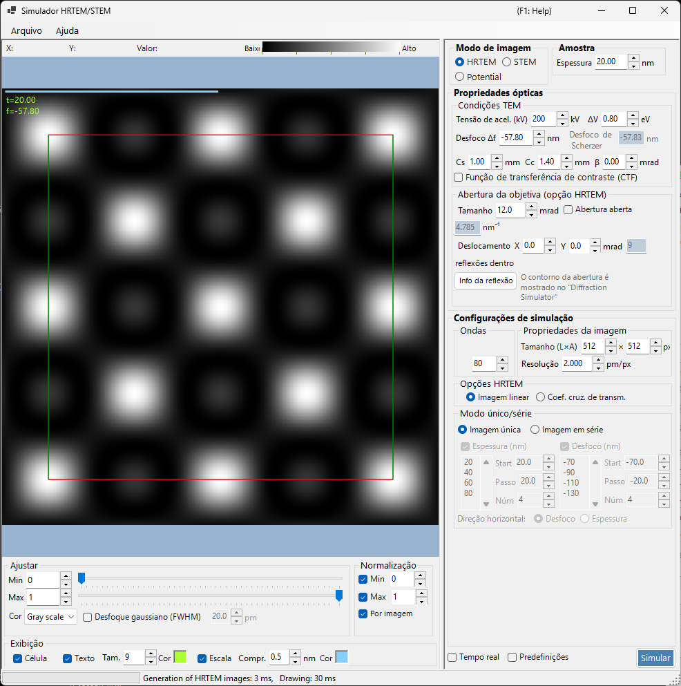
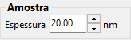
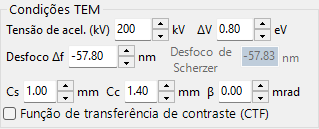
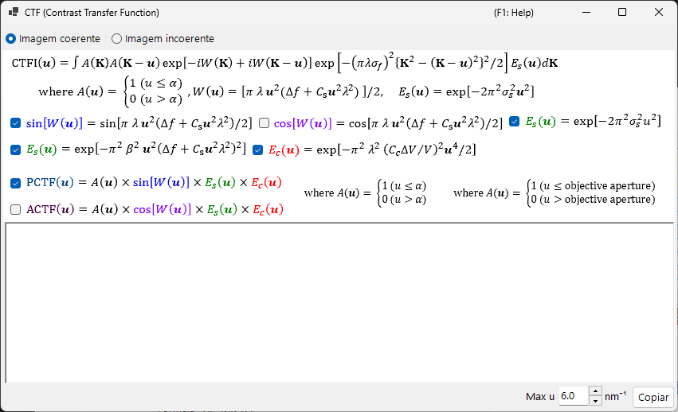
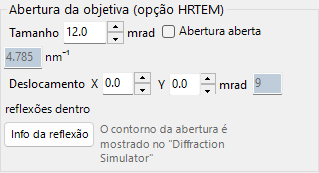
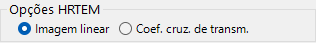
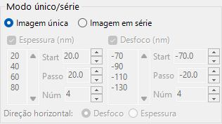
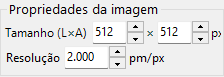

# Simulação HRTEM

A simulação **HRTEM (High-Resolution Transmission Electron Microscopy)** calcula imagens de franjas de rede de TEM de alta resolução. É o modo principal do [Simulador HRTEM/STEM](index.md).

> Esta página aborda todas as configurações que aparecem no lado direito quando **Modo de imagem = HRTEM**. Para os controles do lado esquerdo — exibição do resultado e ajuste do brilho — consulte a [página de visão geral](index.md#display-settings).

---

## Visão geral

Uma imagem HRTEM se forma quando a onda eletrônica transmitida pela amostra é projetada sob a influência das aberrações da lente objetiva. O ReciPro calcula a propagação da onda eletrônica dentro da amostra pelo método de ondas de Bloch (cálculo dinâmico) e gera a imagem HRTEM por meio da função de transferência de contraste de fase (PCTF).

### Fluxo de cálculo

1. **Método de ondas de Bloch**: calcula a propagação da onda eletrônica no potencial do cristal e obtém a amplitude e a fase da onda de saída
2. **Função da lente**: aplica as aberrações da lente objetiva (aberração esférica $C_s$, desfoco $\Delta f$)
3. **Coerência parcial**: leva em conta o tamanho finito da fonte (coerência espacial) e a flutuação de energia (coerência temporal)
4. **Formação da imagem**: calcula a distribuição de intensidade $|\psi(\mathbf{r})|^2$

Para a teoria, consulte o [Apêndice A3.2 — Formação da imagem HRTEM](../appendix/a3-bloch-wave/hrtem.md).

---

## Amostra

- **Espessura** : espessura da amostra (nm). As imagens HRTEM dependem fortemente da espessura. No modo **Imagem em série** este valor é ignorado e, em seu lugar, é usada a lista de espessuras descrita abaixo.

---

## Condições TEM

Define as condições de imagem da lente objetiva.

| Parâmetro | Descrição | Padrão / típico |
|-----------|-------------|-------------------|
| **Tensão de acel. (kV)** | Tensão de aceleração. O comprimento de onda do elétron corrigido relativisticamente é exibido à direita | 200 kV |
| **Desfoco Δf** | Desfoco da lente objetiva (nm). O valor de referência do **Desfoco de Scherzer** é exibido abaixo | −57.8 nm |
| **Cs** | Coeficiente de aberração esférica (mm). Afeta a CTF e o desfoco de Scherzer | 0.5–1.0 (convencional), < 0.01 (corrigido por Cs) |
| **Cc** | Coeficiente de aberração cromática (mm). Determina o borramento da imagem causado pela dispersão de energia | 1.0–2.0 mm |
| **β** | Semiângulo de iluminação (mrad). Representa o efeito do tamanho finito da fonte (coerência espacial) | 0.1–1.0 mrad |
| **ΔV** | Largura a meia altura da dispersão de energia dos elétrons (eV). Junto com Cc, determina a dispersão de foco devida à aberração cromática | 0.5–2.0 eV |

> **Menu de clique direito**: no painel Condições TEM é possível aplicar com um único clique **Definir todas as aberrações como zero** / **Definir desfoco com o valor de Scherzer** / **Definir desfoco como 0 nm**. Predefinições de condições (300kV ARM300F, 200kV 2100F etc.) estão disponíveis em **Predefinições**, no canto inferior esquerdo.

### Desfoco de Scherzer

O valor de desfoco próximo do qual o contraste de fase é ótimo, calculado a partir do comprimento de onda atual e da aberração esférica $C_s$ (exibido como referência).

$$\Delta f_{\text{Scherzer}} = -\sqrt{\tfrac{4}{3}\,C_s \lambda}\quad\left(\approx -1.155\,\sqrt{C_s \lambda}\right)$$

Nessa condição a PCTF é negativa em uma ampla faixa de frequências espaciais, de modo que as posições atômicas aparecem com contraste escuro. O ReciPro adota este valor original de Scherzer (derivado ao fixar o mínimo da fase de aberração $\chi$ em $-2\pi/3$), e o valor exibido na GUI segue esta fórmula. Observe que algumas referências usam, em vez disso, o valor de *Scherzer estendido* $-1.2\sqrt{C_s\lambda}$, que alarga ainda mais a banda de transferência.

---

## Função da lente / Função de transferência de contraste (CTF)

Marcar **Função de transferência de contraste (CTF)** abre uma janela que traça como as aberrações da lente e o desfoco transferem o contraste da imagem em cada frequência espacial.

- $\sin\chi(u)$ : função de transferência de contraste de fase ($\chi(u)$ é a função de aberração da lente)
- $E_\text{s}(u)$ : função envelope de coerência espacial; o amortecimento devido ao tamanho finito da fonte ($\beta$)
- $E_\text{c}(u)$ : função envelope de coerência temporal; o amortecimento devido à flutuação de energia ($C_c$, $\Delta V$)

Alterar o limite superior do eixo horizontal $u$ (frequência espacial) altera a faixa traçada.

---

## Abertura da objetiva (opção HRTEM)

Restringe as ondas difratadas que passam pela abertura da objetiva. O número de ondas difratadas cortadas pela abertura também altera o número de pontos incluídos no cálculo de ondas de Bloch (o limite superior é o número máximo de ondas de Bloch definido em **Ondas**).

- **Tamanho** : semiângulo da abertura da objetiva (mrad). Quanto menor, mais ondas difratadas de alto ângulo são cortadas e mais suaves ficam os detalhes de alta resolução. O raio equivalente no espaço recíproco $\sin\theta/\lambda$ (nm⁻¹) é exibido.
- **Deslocamento X** / **Y** : deslocamento do centro da abertura da objetiva (mrad). Usado para imagens de campo escuro e com feixe inclinado.
- **Abertura aberta** : abre a abertura da objetiva (infinita), de modo que todas as ondas difratadas sejam usadas na formação da imagem.
- **reflexões dentro** : o número de feixes difratados (pontos) que caem dentro da abertura (somente leitura).
- **Info da reflexão** : abre uma tabela que lista os feixes difratados dentro da abertura (intensidade, amplitude complexa etc.).

> O tamanho da abertura da objetiva também é exibido no **Simulador de difração**.

---

## Opções HRTEM (modelo de coerência parcial)

Seleciona o modelo de interferência usado ao integrar as contribuições de todas as direções do feixe incidente.

- **Imagem linear** : computacionalmente barato. Adequado a amostras finas em que vale a aproximação de objeto de fase fraca; multiplica a PCTF pelos envelopes de coerência espacial e temporal.
- **Coef. cruz. de transm.** (coeficiente de transmissão cruzada) : computacionalmente caro, porém mais preciso. Integra o coeficiente de transmissão cruzada completo e é o modelo a usar para espalhadores fortes que excitam muitas ondas difratadas intensas.

Para mais detalhes, consulte o [Apêndice A3.2 — Formação da imagem HRTEM](../appendix/a3-bloch-wave/hrtem.md).

---

## Modo único/série

- **Imagem única** : calcula uma imagem HRTEM na espessura e no desfoco atuais.
- **Imagem em série** : gera um conjunto de imagens variando a espessura e o desfoco passo a passo (uma série em espessura / em foco). Útil para encontrar a condição que melhor corresponde a uma imagem experimental.

Para uma imagem em série, defina o seguinte.

| Item | Descrição |
|------|-------------|
| **Espessura (nm)** / **Desfoco (nm)** | Qual grandeza varrer (ambas são permitidas) |
| **Start / Passo / Núm** | Valor inicial, largura do passo e número de imagens. São expandidos na caixa de lista abaixo, que também pode ser editada diretamente |
| **Direção horizontal:** | Quando espessura e desfoco são varridos, a grandeza disposta na direção horizontal da grade (**Desfoco** ou **Espessura**) |

Varrer espessura e desfoco produz uma matriz de imagens linhas × colunas.

---

## Propriedades da imagem

- **Tamanho (L×A)** : número de pixels da imagem simulada (512×512 por padrão).
- **Resolução** : resolução de amostragem (pm/px). Um valor menor resolve franjas de rede mais finas, mas o tempo de FFT cresce proporcionalmente.

---

## Ondas

- Número máximo de ondas de Bloch usadas no método de Bethe (cálculo dinâmico), 80 por padrão. Um número maior melhora a precisão, mas o problema de autovalores leva um tempo $O(N^3)$ para ser resolvido.

---

## Veja também

- [Simulador HRTEM/STEM (visão geral)](index.md)
- [Simulação STEM](2-stem-simulation.md)
- [Simulação de potencial](3-potential-simulation.md)
- [Apêndice A3.2 — Formação da imagem HRTEM](../appendix/a3-bloch-wave/hrtem.md)
