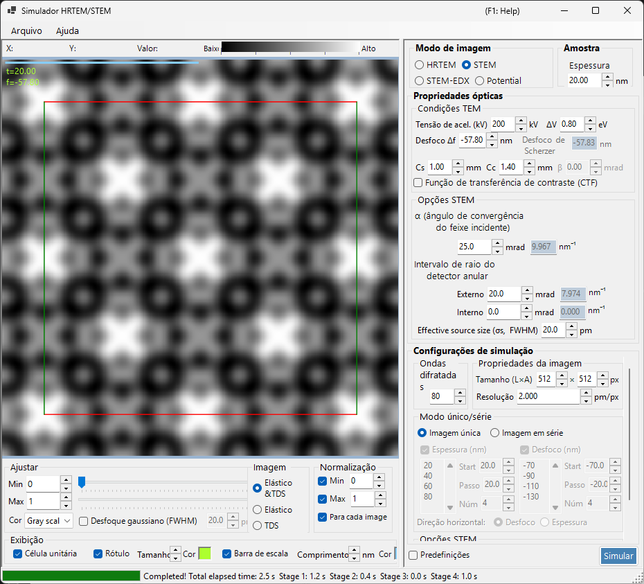

# Simulação STEM

A **simulação STEM (Scanning Transmission Electron Microscopy)** calcula imagens de microscopia eletrônica de transmissão por varredura usando o método de ondas de Bloch.

> Esta página lista todas as configurações que aparecem à direita quando **Image mode = STEM**. Para os controles de exibição do resultado, brilho e normalização à esquerda, consulte a [página de visão geral](index.md). Apenas o **alvo de exibição** específico do STEM é repetido abaixo.

---

## Visão geral

Um feixe eletrônico convergente é varrido sobre a amostra, e os elétrons transmitidos e espalhados em cada posição de varredura são coletados por detectores anulares. O ReciPro calcula a imagem STEM com o método de ondas de Bloch (cálculo dinâmico).

### Fluxo de cálculo

1. Em cada posição de varredura, calcule as intensidades difratadas com o método de ondas de Bloch para cada direção de incidência da sonda convergente.
2. Integre a intensidade espalhada sobre a faixa angular do detector.
3. Tanto as contribuições de espalhamento elástico quanto de espalhamento térmico difuso (TDS) podem ser calculadas.

Consulte o [Apêndice A3.4 — Cálculo STEM](../appendix/a3-bloch-wave/stem.md) para a teoria.

---

## Tipos de detector

| Detector | Faixa angular | Contribuição principal | Contraste |
|----------|-------------|-------------------|----------|
| **BF** (campo claro) | 0 – ângulo de convergência | Elástico | Contraste de fase |
| **ABF** (campo claro anular) | Parte interna do ângulo de convergência | Elástico | Sensível a elementos leves |
| **LAADF** (campo escuro anular de baixo ângulo) | Logo fora do ângulo de convergência | Elástico + TDS | Sensível a deformações |
| **HAADF** (campo escuro anular de alto ângulo) | Bem fora do ângulo de convergência | TDS (inelástico) | Contraste-Z ($\propto Z^2$) |

> **Configurações típicas de detector** (cada uma disponível com um clique no menu de clique direito das opções STEM, todas com ângulo de convergência α = 25 mrad):
> BF (0–5 mrad) / ABF (12–24 mrad) / LAADF (26–60 mrad) / HAADF (80–250 mrad)

---

## Parâmetros da amostra

- **Thickness** : espessura da amostra (nm). Este valor é ignorado no modo **Serial image**.

---

## Condições TEM

| Parâmetro | Descrição | Padrão / típico |
|-----------|-------------|-------------------|
| **Acc. Vol. (kV)** | Tensão de aceleração. O comprimento de onda do elétron corrigido relativisticamente é exibido ao lado | 200 kV |
| **Defocus Δf** | Desfocagem da lente objetiva (formadora da sonda) (nm) | −57.8 nm |
| **Cs** | Coeficiente de aberração esférica (mm). Afeta o tamanho da sonda | 0.5–1.0 mm |
| **Cc** | Coeficiente de aberração cromática (mm) | 1.0–2.0 mm |
| **ΔV (FWHM)** | Largura a meia altura da dispersão de energia dos elétrons (eV) | 0.5–2.0 eV |

> **β (semiângulo de iluminação) está desativado no modo STEM**, porque o ângulo de convergência α assume o seu papel.

---

## Opções STEM (óptica)

Defina a geometria da sonda convergente e do detector anular. Cada ângulo também é exibido convertido em um raio no espaço recíproco $\sin\theta/\lambda$ (nm⁻¹) à direita.

| Parâmetro | Descrição | Padrão / típico |
|-----------|-------------|-------------------|
| **α (convergence angle)** | Semiângulo da sonda convergente (mrad). Valores maiores geram uma sonda mais fina e alteram o contraste de difração | 15–25 mrad |
| **(Annular) detector inner angle** | Semiângulo interno de coleta do detector anular (mrad). O sinal dentro desse ângulo é excluído | BF: 0, HAADF: 80 |
| **(Annular) detector outer angle** | Semiângulo externo de coleta do detector anular (mrad). O sinal fora desse ângulo é excluído | BF: 5, HAADF: 250 |
| **Effective source size σs (FWHM)** | Tamanho efetivo da fonte de elétrons. Valores maiores borram a sonda e reduzem o contraste de detalhes finos | — |

---

## Opções STEM (simulação)

- **Slice thickness for inelastic** : espessura de fatia da amostra (nm) usada ao calcular a intensidade TDS (térmico-difuso, inelástico). Valores menores são mais precisos, mas mais lentos.
- **Angular resolution** : resolução de amostragem angular das direções de incidência da sonda (mrad). Valores menores amostram a sonda mais finamente, mas são mais lentos.

---

## Modo de imagem (single / serial)

- **Single image** : calcula uma imagem STEM na espessura atual.
- **Serial image** : gera uma série de imagens com a espessura / desfocagem variada em etapas (definidas por **Start / Step / Num**; a lista abaixo também pode ser editada diretamente).

---

## Propriedades da imagem

- **Size (W×H)** : número de pixels na imagem varrida (padrão 512×512). No STEM isso equivale ao número de pontos de varredura e escala o tempo de cálculo linearmente.
- **Resolution** : resolução de amostragem (pm/px).

---

## Ondas difratadas

- **Max Bloch waves** : número máximo de ondas de Bloch usadas no método de Bethe (padrão 80). O custo do problema de autovalores escala com o cubo do número de ondas.

---

## Alvo de exibição STEM (lado do resultado)

A chave de exibição no canto inferior esquerdo da janela seleciona qual componente de espalhamento da imagem STEM já calculada deve ser mostrado (alternável sem recalcular).

| Alvo de exibição | Descrição |
|----------------|-------------|
| **Elastic** | Imagem somente de espalhamento elástico |
| **TDS** | Imagem somente de espalhamento térmico difuso |
| **Elastic & TDS** | Soma de elástico + TDS |

---

## Custo computacional

A simulação STEM é computacionalmente cara, portanto defina os parâmetros a seguir adequadamente.

| Fator | Impacto |
|--------|--------|
| **Ângulo de convergência** | Maior → mais sobreposição dos discos CBED → custo maior |
| **Ondas de Bloch** | O custo do problema de autovalores escala com N³ |
| **Resolução angular** | Mais fina → mais precisa, mas o custo escala com N² |
| **Pixels da imagem (Size)** | Escala linear com o número de pontos de varredura |

---

## Importância do fator de temperatura

Para a simulação HAADF-STEM, os átomos devem ter um fator de temperatura isotrópico (fator de Debye-Waller) diferente de zero. Se o valor for desconhecido, defina $B \approx 0.5\ \text{Å}^2$. Com um fator de temperatura nulo, a intensidade TDS é zero e a imagem HAADF não é calculada corretamente.

| Detector | Faixa | Contribuição principal |
|----------|-------|-------------------|
| BF, ABF | Dentro do ângulo de convergência | Elástico |
| LAADF, HAADF | Fora do ângulo de convergência | Inelástico (TDS) |

---

## Comparação com o Dr. Probe

Confirmou-se que as simulações STEM do ReciPro concordam estreitamente com a amplamente utilizada GUI Dr. Probe (v1.10). A figura abaixo compara as duas para os detectores BF, ABF, LAADF e HAADF ao longo de uma série de espessuras (2.96–60.05 nm), tanto sem aberração (esquerda) quanto com Cs = 0.2 mm, desfocagem = −25.9 nm (direita). Os dois códigos concordam em todos os tipos de detector e espessuras.

Um relatório mais detalhado está disponível em PDF: [Comparação de simulações STEM pela GUI Dr. Probe (v1.10) e ReciPro (v4.854)](https://github.com/seto77/ReciPro/files/10976084/ComparisonSTEMsimulations.pdf).

---

## Veja também

- [Simulador HRTEM/STEM (visão geral)](index.md)
- [Simulação HRTEM](1-hrtem-simulation.md)
- [Simulação de potencial](3-potential-simulation.md)
- [Apêndice A3.4 — Cálculo STEM](../appendix/a3-bloch-wave/stem.md)
- [Apêndice A3.4 — Cálculo STEM](../appendix/a3-bloch-wave/stem.md)
