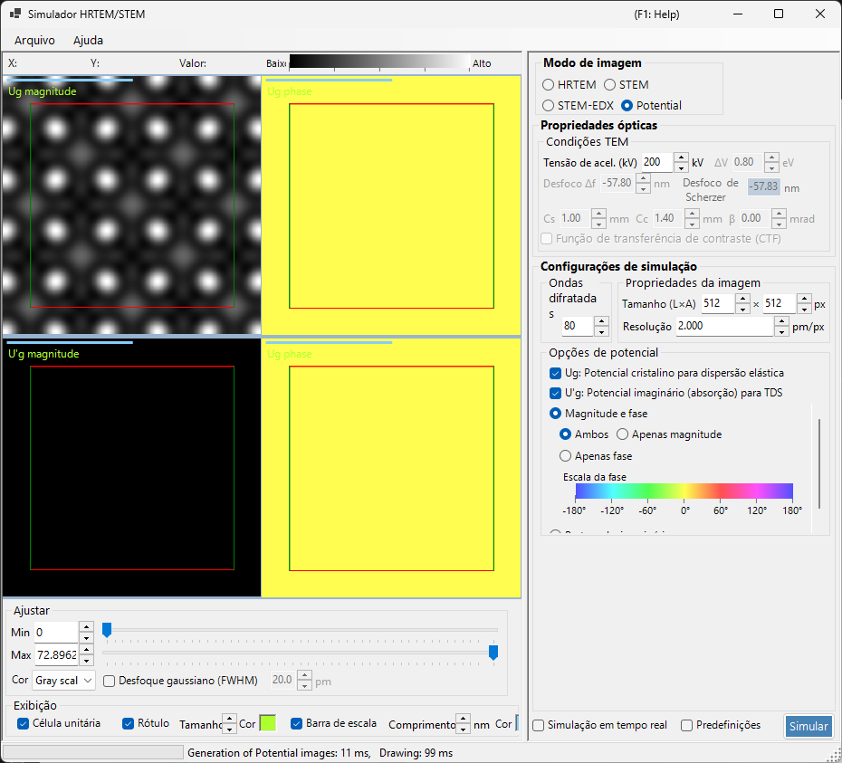
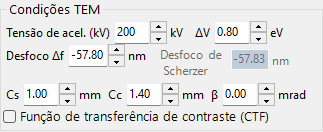
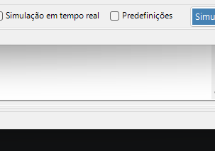
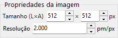
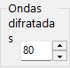

# Simulação de potencial

A **simulação de potencial** calcula e exibe a distribuição 2D do potencial do cristal. Nenhum efeito de transferência de imagem (aberrações da lente, detector) é aplicado: ela visualiza o próprio potencial projetado do cristal.

> Esta página aborda todas as configurações que aparecem no lado direito quando **Image mode = Potential**. Para a exibição do resultado, o ajuste de brilho e os demais controles do lado esquerdo, consulte a [página de visão geral](index.md#display-settings).

---

## Visão geral

Os elétrons dentro de um cristal são espalhados pelo potencial do cristal. Sua distribuição está na base de todos os fenômenos de difração e formação de imagem e é uma informação essencial para a compreensão da estrutura cristalina. Como este modo não inclui nem aberrações da lente nem efeitos dinâmicos dependentes da espessura, ele é bem adequado para inspecionar a própria estrutura.

> **No modo de potencial, os painéis de espessura da amostra, normalização de intensidade e modo de imagem (single / serial) não são exibidos.** Das condições do TEM, apenas a tensão de aceleração está ativa.

---

## Condições do TEM

- **Acc. voltage (kV)** — tensão de aceleração. Ela define o comprimento de onda do elétron e é usada para calcular os coeficientes de Fourier $U_g$ do potencial.

> **Defocus, Cs, Cc, β, ΔE e a PCTF ficam inativos no modo de potencial** (nenhuma óptica de formação de imagem é aplicada) e aparecem esmaecidos.

---

## Opções de potencial

Seleciona qual potencial exibir e como exibi-lo.

### Potencial alvo

| Tipo | Descrição |
|------|-------------|
| **$U_g$ — elastic scattering potential** | O potencial (eletrostático) do cristal responsável pelo espalhamento elástico. Representa a intensidade do espalhamento |
| **$U'_g$ — absorption potential** | O potencial imaginário (de absorção) que surge do espalhamento térmico difuso (TDS). Representa a perda do canal elástico |

$U_g$ e $U'_g$ podem ser exibidos ao mesmo tempo (um painel é adicionado para cada um que estiver marcado).

### Método de exibição

| Modo | Opções |
|------|---------|
| **Magnitude and phase** | **Both** / **Magnitude only** / **Phase only** (a fase é renderizada com uma roda de cores e uma escala de fase é mostrada abaixo) |
| **Real and imaginary part** | **Both** / **Real only** / **Imaginary only** |

---

## Propriedade da imagem

- **Size (W×H)** — dimensões em pixels da imagem gerada (padrão 512×512).
- **Resolution** — resolução de amostragem (pm/px).

---

## Ondas difratadas

- **Max Bloch waves** — número máximo de ondas de Bloch (coeficientes de Fourier) incluídas na síntese de Fourier do potencial (padrão 80). Valores maiores incluem frequências espaciais mais altas e reproduzem detalhes mais finos do potencial.

---

## Ajuste da imagem (lado esquerdo)

O brilho (Min / Max), a escala de cores e a sobreposição da grade da célula unitária são definidos no lado esquerdo em **Adjust** e **Display** (consulte a [página de visão geral](index.md#display-settings)).

---

## Veja também

- [Simulador HRTEM/STEM (visão geral)](index.md)
- [Simulação HRTEM](1-hrtem-simulation.md)
- [Simulação STEM](2-stem-simulation.md)
