# HRTEM / STEM Simulator

O **Simulador HRTEM/STEM** simula imagens de franjas de rede (HRTEM) por TEM, imagens STEM e potenciais projetados. Clique em **Simulate** para executar.

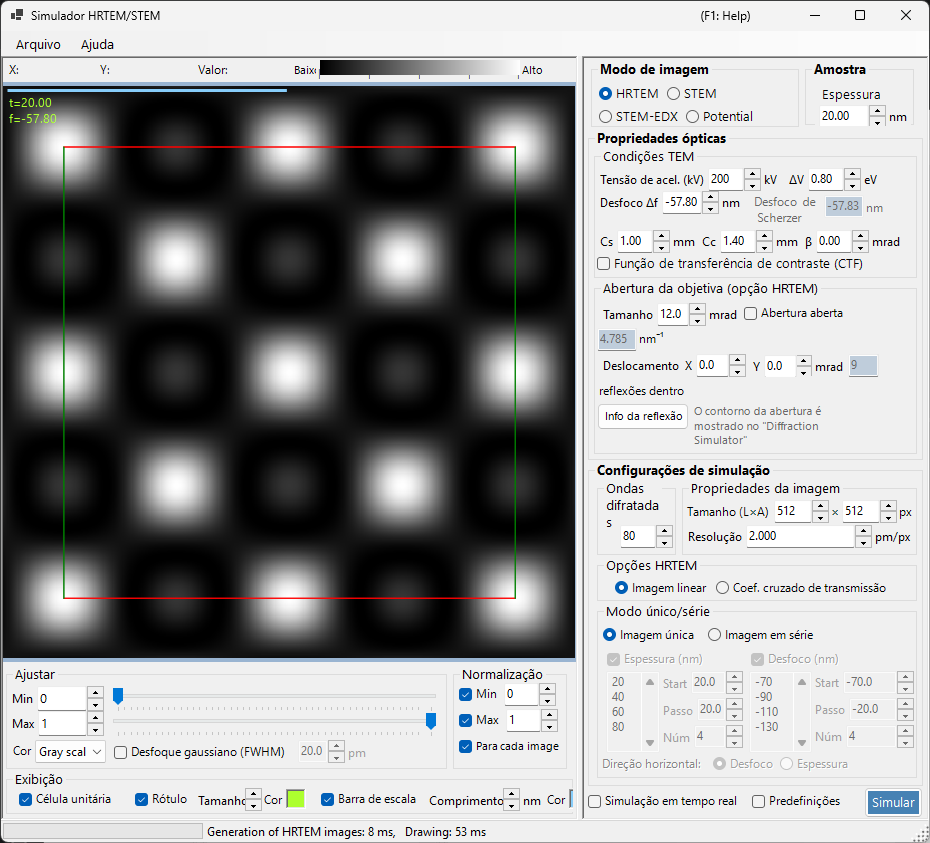

---

## Atalhos de teclado e mouse

Os resultados são exibidos como um ou mais painéis de imagem. Eles usam a [navegação de visualização de imagem](../21-shortcuts.md) padrão do ReciPro, e todos os painéis se deslocam e dão zoom em conjunto.

| Atalho | Ação |
|----------|--------|
| <kbd>F1</kbd> | Abrir esta página do manual on-line |
| <kbd>CTRL</kbd>+<kbd>C</kbd> (grade de imagens em foco) | Copiar a(s) imagem(ns) para a área de transferência como metarquivo |
| Arrastar com o botão esquerdo / arrastar com o botão do meio | Deslocar a imagem (todos os painéis se movem em conjunto) |
| Roda do mouse para cima / para baixo | Aproximar (×2) / afastar (×0.5) na posição do cursor |
| Arrastar uma caixa com o botão direito | Aproximar na região selecionada |
| Clique direito / clique duplo direito | Afastar (×0.5) |
| <kbd>CTRL</kbd> + arrastar uma caixa com o botão direito | Selecionar uma área retangular |
| Clique duplo esquerdo em um painel | Maximizar esse painel / restaurar a grade (layouts com vários painéis) |
| Mover o mouse (sem botão) | Ler a posição (pm) e o valor do pixel na posição do cursor |

→ Consulte **[21. Atalhos de teclado e mouse](../21-shortcuts.md)** para uma visão geral de cada janela.

---

## Rotas rápidas por objetivo

| Objetivo | Ponto de partida | Referência |
|------|------------|-----------|
| Calcular uma imagem HRTEM | Defina **Image mode** como **HRTEM**, depois ajuste a tensão de aceleração e a desfocagem em **TEM conditions** | [Simulação HRTEM](1-hrtem-simulation.md), [Formação da imagem HRTEM](../appendix/a3-bloch-wave/hrtem.md) |
| Calcular uma imagem STEM | Defina **Image mode** como **STEM**, depois ajuste o ângulo de convergência e o detector em **STEM options** | [Simulação STEM](2-stem-simulation.md), [Cálculo STEM](../appendix/a3-bloch-wave/stem.md) |
| Visualizar o potencial projetado | Defina **Image mode** como **Potential** | [Simulação de potencial](3-potential-simulation.md) |
| Gerar uma série de espessura / desfocagem | Configure **Single / Serial** e as condições de imagem em **HRTEM options** | [Simulação HRTEM](1-hrtem-simulation.md) |
| Usar HAADF-STEM com TDS | Defina fatores de temperatura atômica diferentes de zero e use um detector LAADF / HAADF | [Cálculo STEM](../appendix/a3-bloch-wave/stem.md) |

---

## Fluxo de trabalho básico

1. Selecione o cristal e a orientação na janela principal e, em seguida, abra este simulador.
2. Escolha HRTEM, STEM ou Potential em **Image mode**.
3. Ajuste a tensão de aceleração, a desfocagem, as aberrações, as aberturas e as configurações de convergência STEM em **Optical property**.
4. Ajuste a espessura, o tamanho da imagem, a resolução, a contagem de ondas de Bloch e o modelo de coerência parcial em **Simulation property**.
5. Clique em **Simulate** e, em seguida, ajuste o brilho, a normalização, a barra de escala e os rótulos em **Display settings**.

---

## Área da imagem

A metade esquerda da janela mostra a imagem simulada. A barra de status na parte superior informa a posição do cursor (**X:**, **Y:**) e o valor da imagem **Value:** (intensidade) sob o cursor, ao lado de uma escala de intensidade **Low → High** que reflete o mapa de cores e a faixa de brilho atuais.

---

## Menu Arquivo

### Menu Ajuda

---

## Image mode / Sample

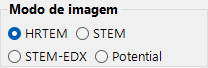{align=left}

HRTEM, Potential ou STEM.

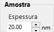{ align=left style="clear: both" }
Define a espessura da amostra.

## Optical property { style="clear: both" }

### TEM conditions

Tensão de aceleração, desfocagem (Scherzer exibido).

#### Acc. voltage

Tensão de aceleração do microscópio eletrônico. Alterá-la atualiza o comprimento de onda corrigido relativisticamente (exibido ao lado do campo) e, junto com **Cs**, o valor sugerido de **Scherzer defocus** mostrado abaixo.

#### Defocus

Valor de desfocagem da lente objetiva. A desfocagem de Scherzer (o valor que maximiza a transferência de contraste de fase na aproximação de objeto de fase fraca) é mostrada abaixo como referência.

### Inherent property (HRTEM optical aberrations)

Parâmetros de aberração específicos do microscópio usados pelo cálculo da função de lente.

- **Cs** — coeficiente de aberração esférica.
- **Cc** — coeficiente de aberração cromática.
- **β** — semiângulo de iluminação (efeito de fonte finita).
- **ΔE** — largura 1/e da flutuação de energia dos elétrons.

### Lens function

Gráficos da função de lente. Ajustar o limite superior de *u* altera a faixa de desenho.

- **sin[χ(u)]** — função de transferência de contraste de fase (PCTF).
- **E_s(u)** — função de envelope de coerência espacial.
- **E_c(u)** — função de envelope de coerência temporal.

### Objective aperture (HRTEM option)

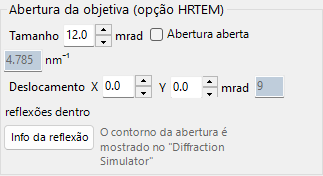

Cs, Cc, beta, delta-E, PCTF, envelopes de coerência espacial/temporal, abertura objetiva.

#### Size

Tamanho da abertura objetiva em mrad. Marque **Open aperture** para remover a abertura. O número de pontos de difração incluídos no cálculo de ondas de Bloch depende da abertura; o máximo é limitado pelo valor **Max Bloch waves** em **Simulation property**.

#### Shift

Deslocamento horizontal da abertura em mrad — usado para imitar uma abertura objetiva deslocada no HRTEM.

#### Spot info

Abre a lista detalhada de pontos (intensidade, amplitude complexa, etc.) para as reflexões que passam pela abertura. Conveniente quando o Simulador de difração também está aberto para comparação.

### STEM options (optical)

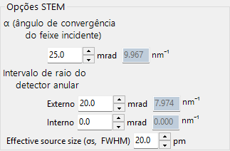

#### Convergence semi-angle

Semiângulo da sonda convergente (mrad). Controla o tamanho da sonda STEM e a resolução espacial da imagem simulada.

#### Detector geometry

Ângulos de coleta interno / externo do detector anular (mrad). Escolha entre BF (ângulo interno pequeno), ABF, LAADF, HAADF (ângulo interno grande).

#### Scan area / step

Campo de visão de varredura e tamanho do pixel para a imagem STEM.

---

## Simulation property

### HRTEM options

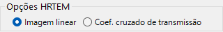

Max Bloch waves, pixels/resolução da imagem, coerência parcial (quasi-coherent / TCC), modo Single/Serial.

#### Max Bloch waves

Número máximo de ondas de Bloch usadas no cálculo dinâmico. Aumentá-lo melhora a precisão ao custo do tempo de resolução de autovalores de *O*(*N*³).

#### Image property (pixels & resolution)

Dimensões em pixels e resolução de amostragem da imagem simulada. Uma resolução maior fornece um padrão de franjas mais fino, mas um tempo de FFT proporcionalmente mais longo por fatia.

#### Partial-coherent model

Como a interferência de ondas é tratada ao combinar as contribuições de todas as direções do feixe incidente.

- **Quasi-coherent** — modelo rápido e aproximado que multiplica a função de transferência de contraste de fase pelos envelopes de coerência espacial e temporal.
- **Transmission cross coefficient (TCC)** — modelo mais preciso que integra sobre o coeficiente de transmissão cruzado completo. Mais lento, mas exato no regime de imagem linear.

Consulte [Apêndice A3.2 — Formação da imagem HRTEM](../appendix/a3-bloch-wave/hrtem.md).

#### Single / Serial mode

- **Single image** — simula uma única imagem na espessura definida em **Sample property** e na desfocagem definida em **Optical property**.
- **Serial image** — gera uma matriz espessura × desfocagem de acordo com **Start / Step / Num** para cada uma. Útil para encontrar a condição que melhor corresponde a uma imagem experimental.

### STEM options (simulation)

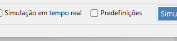

- **Bloch wave count** — mesma função que para HRTEM, aplicada por posição da sonda.
- **Angular resolution** — número de pontos de amostragem na integração da direção da sonda.
- **TDS treatment** — se inclui o espalhamento térmico difuso por meio dos fatores de temperatura *B*. Necessário para LAADF/HAADF.

### Potential options

Exibido quando **Image mode = Potential**.

- **Target potential** — escolha **U_g** (elástico) ou **U′_g** (absorção / TDS).
- **Display method** — **Magnitude and phase** ou **Real and imaginary part**.

### Image properties

### Diffracted waves

---

## Simulate

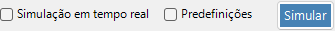

---

## Display settings

### Adjust

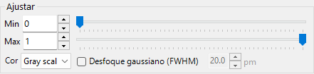

Brilho mín./máx., escala de cores, desfoque gaussiano.

### Normalization

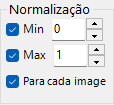

### Display

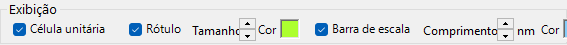

Rótulo (espessura/desfocagem), barra de escala, sobreposição da célula unitária.

### STEM image

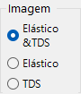

---

## Simulação STEM

O cálculo depende de: ângulo de convergência, contagem de ondas de Bloch, resolução angular.

| Detector | Contribuição |
|----------|-------------|
| BF, ABF | Elástico |
| LAADF, HAADF | Inelástico (TDS) |

> Defina os fatores de temperatura diferentes de zero para TDS (B = 0.5 Ų em caso de dúvida). Intensidade HAADF $\propto Z^2$.

Um relatório mais detalhado está disponível em PDF: [Comparação de simulações STEM pela GUI do Dr. Probe (v1.10) e ReciPro (v4.854)](https://github.com/seto77/ReciPro/files/10976084/ComparisonSTEMsimulations.pdf). Consulte [Simulação STEM](2-stem-simulation.md) para detalhes.

---

## Veja também

- [Simulação HRTEM](1-hrtem-simulation.md)
- [Simulação STEM](2-stem-simulation.md)
- [Simulação de potencial](3-potential-simulation.md)
- [Difração dinâmica (ondas de Bloch)](../appendix/a3-bloch-wave/index.md)
- [Simulador de difração](../7-diffraction-simulator/index.md)
- [Trajetórias eletrônicas](../8-electron-trajectory.md)
