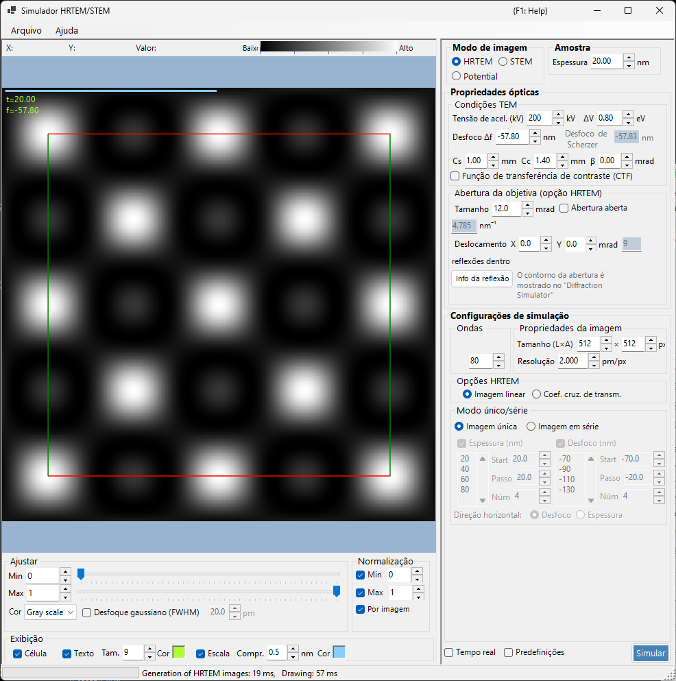
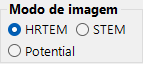
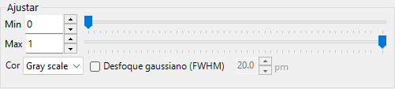
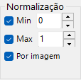
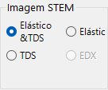
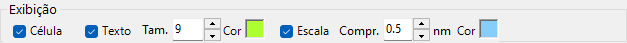
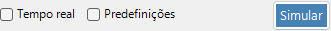
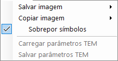
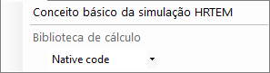

# HRTEM / STEM Simulator

O **Simulador HRTEM/STEM** simula imagens de franjas de rede de TEM (HRTEM), imagens STEM e potenciais cristalinos projetados para o cristal e a orientação selecionados. Clique em **Simular** para executar.

A janela é dividida em duas metades. O **lado esquerdo** exibe o resultado da simulação e controla sua aparência (painéis de imagem, brilho, cor, barra de escala etc.); o **lado direito** reúne as condições de cálculo (**Propriedades ópticas** e **Configurações de simulação**).

---

## Esta página e as páginas de cada modo

- **Esta página (visão geral)**: as operações comuns a todos os modos, junto com os **controles de exibição e ajuste do resultado no lado esquerdo**.
- **Páginas de cada modo**: todas as configurações que aparecem no **lado direito** naquele modo, descritas de modo que cada página seja autossuficiente (por isso algumas configurações aparecem em mais de uma página).

| Modo | Conteúdo | Página |
|------|----------|------|
| **HRTEM** | Imagens de franjas de rede de TEM de alta resolução | [Simulação HRTEM](1-hrtem-simulation.md) |
| **STEM** | Imagens de microscopia eletrônica de transmissão por varredura (BF / ABF / LAADF / HAADF) | [Simulação STEM](2-stem-simulation.md) |
| **Potential** | Potencial cristalino projetado ($U_g$ / $U'_g$) | [Simulação de potencial](3-potential-simulation.md) |

---

## Atalhos de teclado e mouse

Os resultados são exibidos como um ou mais painéis de imagem. Eles usam a [navegação de visualização de imagem](../21-shortcuts.md) padrão do ReciPro, e todos os painéis se deslocam e dão zoom em conjunto.

| Atalho | Ação |
|----------|--------|
| <kbd>F1</kbd> | Abrir esta página do manual on-line |
| <kbd>CTRL</kbd>+<kbd>C</kbd> (grade de imagens em foco) | Copiar a(s) imagem(ns) para a área de transferência como metarquivo |
| Arrastar com o botão esquerdo / arrastar com o botão do meio | Deslocar a imagem (todos os painéis se movem em conjunto) |
| Roda do mouse para cima / para baixo | Aproximar (×2) / afastar (×0.5) na posição do cursor |
| Arrastar uma caixa com o botão direito | Aproximar na região selecionada |
| Clique direito / clique duplo direito | Afastar (×0.5) |
| <kbd>CTRL</kbd> + arrastar uma caixa com o botão direito | Selecionar uma área retangular |
| Clique duplo esquerdo em um painel | Maximizar esse painel / restaurar a grade (layouts com vários painéis) |
| Mover o mouse (sem botão) | Ler a posição (pm) e o valor do pixel na posição do cursor |

→ Consulte **[21. Atalhos de teclado e mouse](../21-shortcuts.md)** para uma visão geral de cada janela.

---

## Rotas rápidas por objetivo

| Objetivo | Ponto de partida | Referência |
|------|------------|-----------|
| Calcular uma imagem HRTEM | Defina **Modo de imagem** como **HRTEM** e ajuste a tensão de aceleração e o desfoco em **Condições TEM** | [Simulação HRTEM](1-hrtem-simulation.md), [Formação da imagem HRTEM](../appendix/a3-bloch-wave/hrtem.md) |
| Calcular uma imagem STEM | Defina **Modo de imagem** como **STEM** e ajuste o ângulo de convergência e o detector em **Opções STEM** | [Simulação STEM](2-stem-simulation.md), [Cálculo STEM](../appendix/a3-bloch-wave/stem.md) |
| Visualizar o potencial projetado | Defina **Modo de imagem** como **Potential** | [Simulação de potencial](3-potential-simulation.md) |
| Gerar uma série de espessura / desfoco | No HRTEM, configure **Modo único/série** e as condições de imagem | [Simulação HRTEM](1-hrtem-simulation.md) |
| Usar HAADF-STEM com TDS | Defina fatores de temperatura atômica diferentes de zero e mova o detector STEM para LAADF / HAADF | [Cálculo STEM](../appendix/a3-bloch-wave/stem.md) |

---

## Fluxo de trabalho básico

1. Selecione o cristal e a orientação na janela principal e, em seguida, abra esta janela.
2. Escolha HRTEM, STEM ou Potential em **Modo de imagem**.
3. Ajuste a tensão de aceleração, o desfoco, as aberrações, a abertura, o ângulo de convergência STEM etc. em **Propriedades ópticas** (consulte as páginas de cada modo).
4. Ajuste a espessura, o tamanho da imagem, a resolução, o número de ondas de Bloch, o modelo de coerência parcial etc. em **Configurações de simulação** (consulte as páginas de cada modo).
5. Clique em **Simular** e, se necessário, ajuste a aparência com **Ajustar**, **Normalização** e **Exibição** no lado esquerdo.

---

## Seleção do modo de imagem

{ align=left }

O **Modo de imagem** no canto superior direito seleciona o tipo de cálculo. Os painéis à direita (**Propriedades ópticas** e **Configurações de simulação**) mudam de acordo com o modo escolhido.

- **HRTEM** — imagens de franjas de rede de TEM de alta resolução → [Simulação HRTEM](1-hrtem-simulation.md)
- **STEM** — imagens de microscopia eletrônica de transmissão por varredura → [Simulação STEM](2-stem-simulation.md)
- **Potential** — potencial cristalino projetado → [Simulação de potencial](3-potential-simulation.md)

---

## Área da imagem (lado esquerdo)

A metade esquerda da janela mostra a imagem simulada. A barra de status na parte superior informa a posição do cursor (**X:**, **Y:**) e o **Valor:** da imagem (intensidade) sob o cursor, ao lado de uma escala de intensidade **Baixo → Alto** que reflete o mapa de cores e a faixa de brilho atuais.

Quando várias imagens são produzidas (uma imagem em série, ou a magnitude/fase de um potencial), elas são dispostas em grade, e todos os painéis dão zoom e se deslocam em conjunto.

---

## Exibição e ajuste dos resultados (painel esquerdo) {#display-settings}

O painel no canto inferior esquerdo ajusta a aparência do resultado — brilho, cor, normalização e sobreposições. Essas opções valem para todos os modos e têm efeito sem recalcular.

### Ajustar

- **Min** / **Max** : extremos inferior (preto) e superior (branco) da faixa de intensidade exibida. Use as barras deslizantes para ajustar o contraste.
- **Cor** : escala de cores da imagem — **Gray scale** (tons de cinza) ou **Cold-Warm** (do azul ao vermelho).
- **Desfoque gaussiano (FWHM)** : quando marcado, aplica um desfoque gaussiano com a largura a meia altura (pm) indicada à direita, aproximando uma resolução finita (função de espalhamento pontual).

### Normalização

- **Por imagem** : quando marcado, normaliza cada imagem separadamente (quando desmarcado, toda a série compartilha uma escala comum).
- **Min** / **Max** : fixa o extremo inferior / superior da normalização no valor indicado à direita, em vez do mínimo / máximo da imagem.

### Imagem STEM

Exibido apenas no modo STEM. Seleciona qual componente de espalhamento da imagem STEM calculada é exibido (**Elástico**, **TDS** ou **Elástico & TDS**). Se a mesma execução também calculou [mapas STEM-EDX](2-stem-simulation.md#stem-edx), **EDX** fica disponível como quarta opção. Por ser específico do STEM, também é descrito na página [Simulação STEM](2-stem-simulation.md).

### Exibição

Define os elementos sobrepostos à imagem.

- **Célula** : sobrepõe o contorno da célula unitária projetada, para relacionar o contraste da imagem com a rede cristalina.
- **Texto** : sobrepõe rótulos como espessura, desfoco e índices. É possível especificar **Tam.** (tamanho da fonte) e **Cor**.
- **Escala** : sobrepõe uma barra de escala. É possível especificar **Compr.** (nm) e **Cor**.

---

## Execução da simulação

- **Simular** : executa o cálculo com o cristal, as condições do microscópio, a espessura, o desfoco e as configurações de exibição atuais.
- **Parar** : interrompe o cálculo em andamento (exibido apenas durante o cálculo).
- **Tempo real** : quando marcado, recalcula imediatamente à medida que o cristal é girado (oculto no modo STEM).
- **Predefinições** : mostra/oculta a janela de predefinições, que armazena e recupera condições de imagem TEM.

---

## Menu Arquivo

- **Salvar imagem** : salva **como imagem (formato PNG)**, **como imagem (formato TIFF)** ou **como metarquivo (EMF)**. **Salvar individualmente no modo de imagem em série** grava as imagens de uma execução em série uma a uma.
- **Copiar imagem** : copia para a área de transferência **como imagem** ou **como metarquivo (EMF)**.
- **Sobrepor símbolos** : incorpora a célula unitária, os rótulos e a barra de escala à imagem salva.
- **Carregar parâmetros TEM** / **Salvar parâmetros TEM** : salvam as condições ópticas (tensão de aceleração, aberrações etc.) em um arquivo e as restauram.

## Menu Ajuda

- **Conceito básico da simulação HRTEM** : abre a explicação da formação da imagem HRTEM ([Apêndice A3.2](../appendix/a3-bloch-wave/hrtem.md)).
- **Biblioteca de cálculo** : seleciona a biblioteca de cálculo — **Native code** (C++/Eigen, rápida) ou **Managed code** (.NET). A nativa normalmente é mais rápida.

---

## Veja também

- [Simulação HRTEM](1-hrtem-simulation.md)
- [Simulação STEM](2-stem-simulation.md)
- [Simulação de potencial](3-potential-simulation.md)
- [Difração dinâmica (ondas de Bloch)](../appendix/a3-bloch-wave/index.md)
- [Simulador de difração](../7-diffraction-simulator/index.md)
- [Trajetórias eletrônicas](../8-electron-trajectory.md)
