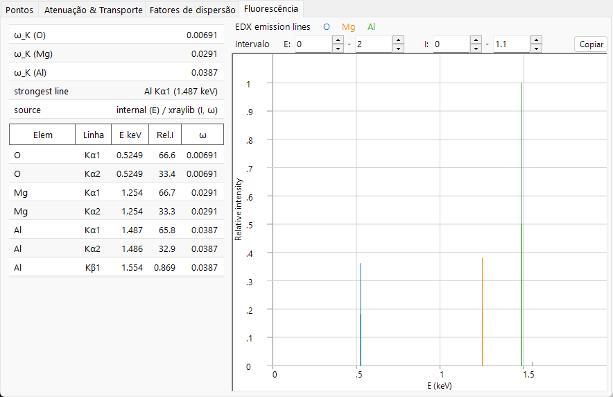

# Fluorescência

Quando a **fotoabsorção** de raios X ejeta um elétron de uma camada interna (consulte [atenuação e transporte](attenuation-transport.md)), ela deixa uma vacância em um nível profundo. O átomo relaxa fazendo um elétron externo cair no buraco, e a energia liberada sai ou como um **fóton de raios X característico** (fluorescência) ou pela ejeção de um segundo elétron (o processo **Auger**). A aba **Fluorescência** mostra uma prévia do canal de fótons característicos; ela vale apenas para raios X e fica oculta para feixes de elétrons e de nêutrons.

---

## Linhas características

Como as energias das camadas são nitidamente definidas, a energia do fóton emitido é a **diferença de duas energias de ligação**,

$$E_\gamma = E_B(\text{inner shell}) - E_B(\text{outer shell}),$$

e é, portanto, característica do elemento:

- **Linhas K** — vacância na camada $K$ preenchida a partir de $L$ ($K\alpha$) ou $M$ ($K\beta$).
- **Linhas L** — vacância na camada $L$ preenchida a partir de $M$/$N$ ($L\alpha$, $L\beta$, …).

Somente as transições permitidas pelas regras de seleção dipolar aparecem, e é por isso que o espectro é formado por algumas linhas discretas (K$\alpha_1$, K$\alpha_2$, K$\beta_1$, L$\alpha_1$, …) em vez de um contínuo. Suas energias seguem a **lei de Moseley**; na aproximação hidrogenoide blindada,

$$E_{n_2\to n_1} \approx R_\infty hc\,(Z-\sigma)^2\left(\frac{1}{n_1^2} - \frac{1}{n_2^2}\right), \qquad \text{so}\qquad \sqrt{E} \propto (Z-\sigma),$$

com $\sigma$ sendo uma constante de blindagem. Para $K\alpha$ ($n_2{=}2\to n_1{=}1$, $\sigma\approx1$), isso se reduz a $E_{K\alpha}\approx R_\infty hc\,(Z-1)^2\left(1-\tfrac14\right)$. Essa dependência monótona de $Z$, governada pela contagem de elétrons, é a base da identificação elementar (EDX/WDX).

---

## Rendimento de fluorescência

A competição entre a relaxação radiativa e a Auger é capturada pelo **rendimento de fluorescência**

$$\omega = \frac{\Gamma_r}{\Gamma_r + \Gamma_a},$$

a probabilidade de que uma dada vacância decaia emitindo um fóton em vez de um elétron Auger ($\Gamma_r$, $\Gamma_a$ são as taxas radiativa e Auger).

- Para **elementos leves**, o canal Auger domina, de modo que $\omega_K$ é pequeno (bem abaixo de 1% para C, N, O) — elementos leves fluorescem fracamente, e é por isso que são difíceis de detectar por EDX.
- Para **elementos pesados**, o canal radiativo vence e $\omega_K \to$ próximo de 1.

O **rendimento Auger** complementar $a$ fica com o restante, de modo que

$$\omega + a = 1 ,$$

e um $\omega$ pequeno significa que a maioria das vacâncias decai por emissão Auger. Dentro do canal radiativo, a fração de uma linha específica $\ell$ (por exemplo, $K\alpha_1$ frente a $K\beta_1$) é sua **razão de ramificação**

$$p_{\ell\mid X} = \frac{\Gamma_\ell}{\sum_{\ell'\in X}\Gamma_{\ell'}},$$

a taxa radiativa relativa dentro da camada $X$. O ReciPro lista $\omega_K$ para cada elemento e a linha mais forte do espectro.

---

## O que a prévia modela e o que não modela

O gráfico de **linhas de emissão EDX** desenha cada linha característica como um traço na sua energia de fóton, com altura proporcional a

$$\text{(atomic fraction)} \times \text{(radiative rate)} \times \omega.$$

Esta é uma prévia **qualitativa** de onde as linhas caem e de suas alturas relativas aproximadas. Ela deliberadamente omite os fatores que um espectro EDX/XRF real e quantitativo exige:

- se a energia incidente está de fato **acima da borda de absorção** necessária para criar a vacância — uma linha é desenhada mesmo que não possa ser excitada na energia atual;
- a **seção de choque de excitação** (com que eficiência o feixe incidente cria a vacância na energia escolhida);
- a **autoabsorção** dos fótons emitidos dentro da amostra (efeitos de matriz);
- a **eficiência** e a resolução do detector.

Portanto, a prévia serve para a identificação de linhas e o raciocínio sobre posições relativas, não para a determinação quantitativa da composição.

---

## Da prévia à quantificação

Uma análise EDX/XRF real converte intensidades de linha em concentrações por meio de uma **correção de matriz (ZAF)** — para o número atômico ($Z$), a absorção ($A$) dos fótons emitidos em seu caminho de saída da amostra e a **fluorescência** secundária ($F$) excitada por outras linhas — combinada com a seção de choque de excitação e a resposta do detector mencionadas acima. Na forma completa, a intensidade medida da linha $\ell$ do elemento $i$ é

$$I_\ell \;\propto\; C_i\,\Phi_0\,\sigma_{\text{ion},X,i}(E_0)\,\omega_{X,i}\,p_{\ell\mid X}\,\epsilon(E_\ell)\,A_\text{matrix}(E_0,E_\ell),$$

com $C_i$ sendo a concentração, $\Phi_0$ o fluxo incidente, $\sigma_\text{ion}$ a seção de choque de ionização, $\omega$ o rendimento de fluorescência, $p_{\ell\mid X}$ a razão de ramificação, $\epsilon$ a eficiência do detector e $A_\text{matrix}$ a correção de absorção / fluorescência secundária. A prévia do ReciPro mantém apenas a parte $C_i\,p_{\ell\mid X}\,\omega$ (fração atômica × taxa radiativa × rendimento) e descarta o restante, de modo que posiciona as linhas e fornece suas intensidades relativas intrínsecas para que possam ser reconhecidas em um espectro medido.

---

## Veja também

- [Atenuação e transporte](attenuation-transport.md) — fotoabsorção, a borda que cria a vacância.
- [Fatores de espalhamento atômico](scattering-factor.md) — os mesmos elétrons ligados, vistos no espalhamento.
- [3. Interação do feixe → aba Fluorescência](../../3-beam-interaction.md#fluorescence-tab)
