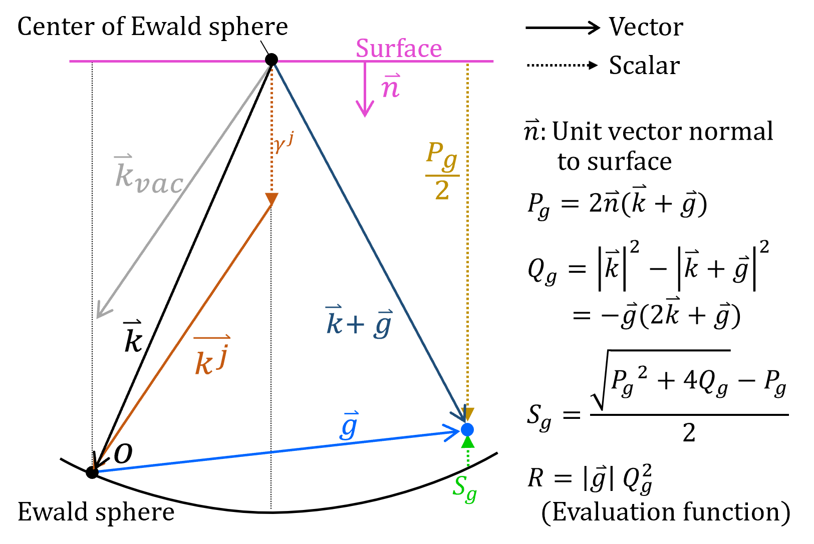

# Apêndice A3. Difração dinâmica pelo método de ondas de Bloch

Este apêndice apresenta uma visão geral da teoria da difração eletrônica dinâmica usada pelos simuladores **Simulador de difração**, **CBED** e **HRTEM/STEM** do ReciPro. O ReciPro segue a formulação **Bethe / ondas de Bloch**. O cálculo passo a passo (potencial óptico, coeficientes de transmissão, intensidades) é descrito em [Cálculo dinâmico (núcleo comum)](calculation.md).

---

## A equação de onda em um cristal

Um elétron rápido que atravessa o potencial eletrostático periódico de um cristal obedece à equação de Schrödinger (de alta energia, estacionária), que pode ser escrita como

$$\nabla^2 \Psi(\mathbf{r}) + 4\pi^2\left\{\, k_{vac}^2 + \sum_{\mathbf g} U_{\mathbf g}\, e^{2\pi i\,\mathbf g\cdot\mathbf r} \right\}\Psi(\mathbf{r}) = 0$$

- $k_{vac}$ : número de onda do elétron no vácuo.
- $U_{\mathbf g}$ : componente de Fourier do potencial do cristal para o vetor da rede recíproca $\mathbf g$. Como o potencial é periódico na rede, ele é escrito como uma série de Fourier sobre a rede recíproca.

---

## Teorema de Bloch

Como o potencial possui a periodicidade da rede cristalina, as soluções são **ondas de Bloch**:

$$\Psi(\mathbf{r}) = b\!\left(\mathbf{k}^{(j)}, \mathbf{r}\right) = u(\mathbf{r})\exp\!\left(2\pi i\,\mathbf{k}^{(j)}\cdot\mathbf{r}\right)$$

- $u(\mathbf r)$ : uma função com a mesma periodicidade da rede cristalina, de modo que ela própria pode ser expandida sobre a rede recíproca: $u(\mathbf r)=\sum_{\mathbf g} C_{\mathbf g}^{(j)}\exp(2\pi i\,\mathbf g\cdot\mathbf r)$.
- $\mathbf{k}^{(j)}$ : o $j$-ésimo vetor de onda de Bloch.
- $C_{\mathbf g}^{(j)}$ : a amplitude (componente do autovetor) do feixe $\mathbf g$ na $j$-ésima onda de Bloch.

---

## A equação dinâmica de Bethe

A substituição da expansão em ondas de Bloch na equação de onda fornece a **equação dinâmica de Bethe** — uma equação acoplada para cada feixe $\mathbf g$:

$$\left[\,k^2 - \left(\mathbf{k}^{(j)} + \mathbf{g}\right)^2 + i\,U'_{g,g}\right]C_{\mathbf g}^{(j)} + \sum_{h \neq g}\left(U^C_{g-h} + i\,U'_{g,h}\right)C_{\mathbf h}^{(j)} = 0$$

- $U^C_{\mathbf g}$ : potencial do cristal para o espalhamento **elástico**.
- $U'_{\mathbf g}$ : potencial imaginário (de **absorção**), que leva em conta o **espalhamento térmico difuso** (TDS). Como ele e o fator de Debye–Waller entram é detalhado no [núcleo de cálculo](calculation.md).

---

## Definições geométricas (esfera de Ewald)

Os vetores e escalares que aparecem acima são definidos sobre a esfera de Ewald:

{width=500px}

- $\hat{\mathbf n}$ : vetor unitário normal à superfície do cristal.
- $\mathbf k$ : vetor de onda incidente (sua ponta está sobre a esfera de Ewald); $\mathbf k_{vac}$ é o vetor de onda no vácuo.
- $\mathbf g$ : vetor da rede recíproca; $\mathbf k + \mathbf g$ aponta para o ponto da rede recíproca.
- $\mathbf k^{(j)}$ : o $j$-ésimo vetor de onda de Bloch. Todos os vetores de onda de Bloch compartilham a mesma componente tangencial (continuidade através da superfície) e diferem apenas ao longo de $\hat{\mathbf n}$: $\mathbf k^{(j)} = \mathbf k + \gamma^{(j)}\hat{\mathbf n}$.
- $\gamma^{(j)}$ : o $j$-ésimo autovalor (a componente de $\mathbf k^{(j)}$ ao longo de $\hat{\mathbf n}$, medida a partir de $\mathbf k$).

A partir da geometria,

$$P_g = 2\,\hat{\mathbf n}\cdot(\mathbf k + \mathbf g), \qquad Q_g = |\mathbf k|^2 - |\mathbf k + \mathbf g|^2 = -\,\mathbf g\cdot(2\mathbf k + \mathbf g)$$

e o **erro de excitação** $S_g$ (o desvio do ponto da rede recíproca em relação à esfera de Ewald) juntamente com a **função de avaliação** $R$ usada para ordenar as reflexões são

$$S_g = \frac{\sqrt{P_g^{\,2} + 4Q_g}\; -\; P_g}{2}, \qquad R = |\mathbf g|\,Q_g^{\,2}$$

---

## Redução a um problema de autovalores

Escrevendo $\mathbf{k}^{(j)} = \mathbf{k} + \gamma^{(j)}\hat{\mathbf n}$ e usando $k^2-(\mathbf k+\mathbf g)^2 = Q_g$ juntamente com a linearização $(\mathbf k^{(j)}+\mathbf g)^2 \approx (\mathbf k+\mathbf g)^2 + \gamma^{(j)} P_g$, a equação de Bethe torna-se (após divisão por $P_g$) um **problema de autovalores matricial** padrão:

$$\mathbf{A}\,\mathbf{C} = \mathbf{C}\,\boldsymbol{\Lambda}, \qquad
A_{gh} = \frac{U^C_{\,g-h} + i\,U'_{g,h}}{P_g}\;\;(g\neq h), \qquad
A_{gg} = \frac{Q_g + i\,U'_{g,g}}{P_g}$$

- As colunas de $\mathbf{C}$ são os autovetores $C^{(j)}_*$ (as amplitudes das ondas de Bloch).
- $\boldsymbol{\Lambda}=\mathrm{diag}\!\left(\lambda^{(1)}, \lambda^{(2)}, \dots\right)$ contém os autovalores $\lambda^{(j)} = \gamma^{(j)}$.

Escrito explicitamente — ordenando os feixes como o feixe transmitido $0$, depois $g$, $h$, $\dots$ — isto é

$$
\begin{aligned}
&\begin{pmatrix}
(Q_0 + i\,U'_{0,0})/P_0 & (U^C_{-g} + i\,U'_{0,g})/P_0 & (U^C_{-h} + i\,U'_{0,h})/P_0 & \cdots \\
(U^C_{g} + i\,U'_{g,0})/P_g & (Q_g + i\,U'_{g,g})/P_g & (U^C_{g-h} + i\,U'_{g,h})/P_g & \cdots \\
(U^C_{h} + i\,U'_{h,0})/P_h & (U^C_{h-g} + i\,U'_{h,g})/P_h & (Q_h + i\,U'_{h,h})/P_h & \cdots \\
\vdots & \vdots & \vdots & \ddots
\end{pmatrix}
\begin{pmatrix}
C^{(1)}_0 & C^{(2)}_0 & C^{(3)}_0 & \cdots \\
C^{(1)}_g & C^{(2)}_g & C^{(3)}_g & \cdots \\
C^{(1)}_h & C^{(2)}_h & C^{(3)}_h & \cdots \\
\vdots & \vdots & \vdots & \ddots
\end{pmatrix} \\[1.2ex]
&\qquad=
\begin{pmatrix}
C^{(1)}_0 & C^{(2)}_0 & C^{(3)}_0 & \cdots \\
C^{(1)}_g & C^{(2)}_g & C^{(3)}_g & \cdots \\
C^{(1)}_h & C^{(2)}_h & C^{(3)}_h & \cdots \\
\vdots & \vdots & \vdots & \ddots
\end{pmatrix}
\begin{pmatrix}
\lambda^{(1)} & 0 & 0 & \cdots \\
0 & \lambda^{(2)} & 0 & \cdots \\
0 & 0 & \lambda^{(3)} & \cdots \\
\vdots & \vdots & \vdots & \ddots
\end{pmatrix}
\end{aligned}
$$

A diagonalização de $\mathbf{A}$ fornece **todos** os vetores de onda de Bloch e as amplitudes de uma só vez. As amplitudes dos feixes difratados — e, portanto, as intensidades — seguem então das condições de contorno nas superfícies de entrada e de saída e da espessura da amostra. Essas etapas, o potencial óptico (complexo), o fator de Debye–Waller e os coeficientes de transmissão $T_{\mathbf g}$ são descritos em [Cálculo dinâmico (núcleo comum)](calculation.md).

> **Nota:** Os valores $V_{\mathbf g}$ mostrados na tabela **Details** do simulador de difração são os valores brutos *antes* da aplicação do fator de correção relativística.

---

## Veja também

- [7. Simulador de difração](../../7-diffraction-simulator/index.md) — padrões de difração dinâmica
- [9. Simulador HRTEM/STEM](../../9-hrtem-stem-simulator/index.md)
- [Apêndice A1. Sistemas de coordenadas](../a1-coordinate-system/1-orientation.md)
- [Cálculo dinâmico (núcleo comum)](calculation.md)
