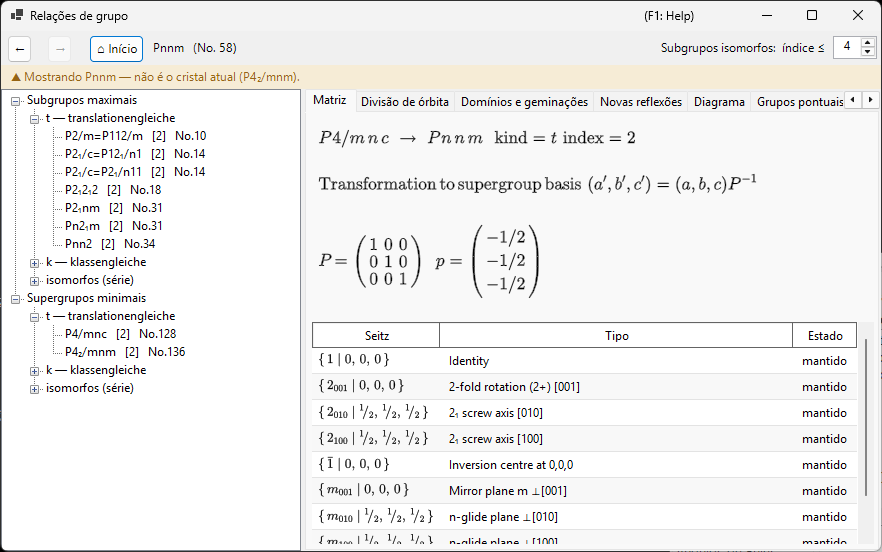
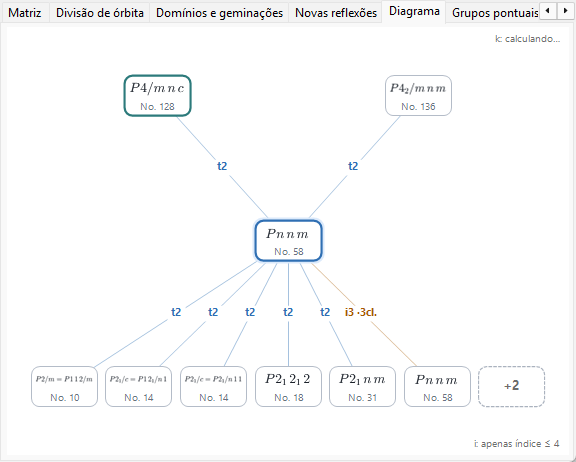
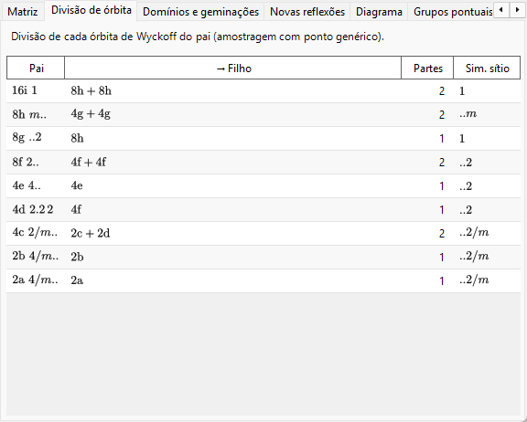
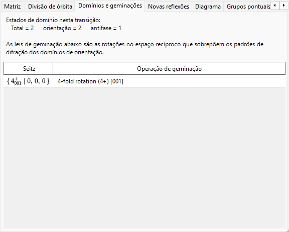
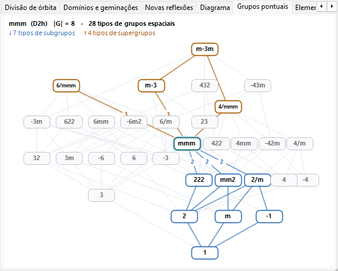
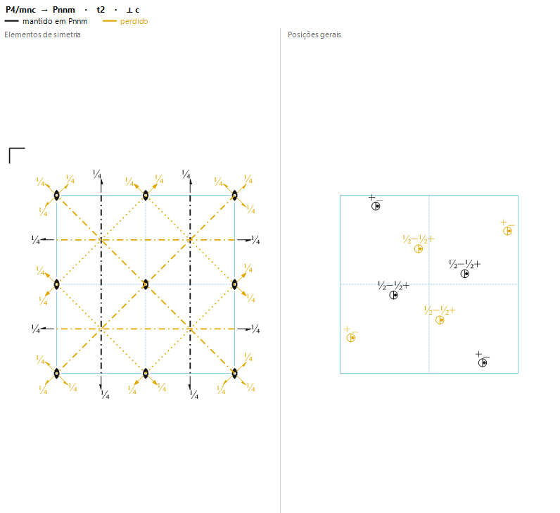

# A4.2. Relações grupo–subgrupo

**Relações de grupo...** é um navegador das relações de subgrupos maximais / supergrupos minimais dos 230 tipos de grupos espaciais, aberto a partir do painel **Opções** de [Informação de simetria](../../2-symmetry-information.md). Ao contrário de uma tabela estática, cada relação mostrada é calculada em tempo de execução diretamente a partir das operações de simetria do próprio grupo espacial atual (ver [A4.1](symbols-and-diagrams.md#operações-de-simetria-aba-operações)), de modo que pode ser conferida operação por operação, em vez de apenas aceita como uma transcrição das *International Tables*, Vol. A1.

Esta página explica o vocabulário de teoria de grupos que o navegador usa e, em seguida, percorre cada uma de suas abas.

---

## O teorema de Hermann: subgrupos *t*, *k* e isomorfos

Um subgrupo $H<G$ é **maximal** se nenhum subgrupo de $G$ está estritamente entre $H$ e $G$. Um teorema devido a Carl Hermann (1929) diz que, para os grupos espaciais tridimensionais aqui tabulados, todo subgrupo maximal de um grupo espacial $G$ é de um de dois tipos:

- **subgrupo *translationengleiche* (*t*-)** — "de translações iguais": $H$ mantém *todas* as translações de $G$ (a mesma rede, a mesma célula), mas um grupo pontual menor. O índice $[G:H]$ (o número de classes laterais de $H$ em $G$) é igual ao índice dos grupos pontuais $[P_G:P_H]$.
- **subgrupo *klassengleiche* (*k*-)** — "de classe igual": $H$ mantém a *mesma classe cristalina geométrica* (tipo de grupo pontual) de $G$, mas apenas uma sub-rede das translações de $G$ — uma célula convencional maior e/ou menos vetores de centragem. O índice é igual ao índice da rede de translações $[T_G:T_H]$.

Os **subgrupos isomorfos** são o caso especial e importante dos subgrupos *k* em que $H$ é, além disso, do *mesmo tipo de grupo espacial* que o próprio $G$ (apenas com uma célula maior — uma relação que se repete indefinidamente, de modo que os subgrupos isomorfos formam uma série infinita indexada pelo tamanho da célula, ao contrário dos subgrupos *t* e *k* não isomorfos de um dado $G$, que são em número finito). Para um subgrupo isomorfo *maximal*, o índice é sempre uma potência de primo ($p$ e, em três dimensões, ocasionalmente $p^2$ ou $p^3$); qual potência ocorre depende de como a rede quociente finita se decompõe como módulo sob o grupo pontual. Note também que a mudança de base de uma sub-rede pode envolver uma troca genuína dos vetores de base e um deslocamento de origem, e não apenas uma ampliação uniforme da célula ao longo de um eixo.

Como toda relação de subgrupo de índice finito (maximal ou não) pode ser alcançada como uma cadeia de passos maximais, listar apenas os subgrupos maximais (e, na direção oposta, os supergrupos minimais) é suficiente para descrever a rede completa de relações de subgrupo de índice finito — exatamente por isso as ITA Vol. A1, e este navegador, tabulam apenas as relações maximais/minimais.

!!! note "Apenas dois tipos — isomorfo é uma subclasse, não um terceiro tipo"
    É um atalho comum falar de "subgrupos *t*, *k* e isomorfos" como se fossem três categorias no mesmo nível, e a árvore deste navegador está, de fato, organizada em três ramos por conveniência. Formalmente, porém, o teorema de Hermann é uma divisão em **duas** vias (*t* vs. *k*); os subgrupos isomorfos são simplesmente os subgrupos *k* que por acaso reproduzem o próprio tipo de grupo espacial de $G$.

### O índice como contagem de classes laterais

Como os grupos espaciais são infinitos (eles contêm translações), "índice" aqui significa sempre **o número de classes laterais de $H$ em $G$**, e não uma razão de ordens $|G|/|H|$ (ambas as ordens são infinitas) — para grupos finitos as duas noções coincidem, mas para grupos espaciais apenas a definição por contagem de classes laterais faz sentido. A árvore e a aba Matriz exibem esse índice como, p. ex., `t, index 2` ou `k, index 3`.

### Subgrupos conjugados e classe de conjugação

Uma dada relação abstrata de subgrupo pode, com frequência, ser realizada dentro de $G$ de mais de uma maneira geometricamente distinta — relacionadas por orientação ou posição, e não por tipo — por exemplo, a imagem especular de um plano de espelho, ou um eixo de parafuso ao longo de uma direção orientada de outro modo, mas equivalente por simetria. Duas dessas realizações $H$ e $H'$ são conjugadas **dentro de $G$** se $H' = gHg^{-1}$ para algum $g\in G$; o navegador agrupa todas essas cópias $G$-conjugadas de uma relação em uma única entrada e informa quantas são como o tamanho da *classe de conjugação*. Essa é uma noção estritamente mais fina do que agrupar subgrupos pela equivalência (mais grosseira) sob o normalizador euclidiano ou afim de $G$ — uma classificação que as próprias ITA às vezes usam em seu lugar —, de modo que subgrupos com o mesmo tipo e o mesmo índice não pertencem automaticamente a uma única classe de conjugação; eles podem se dividir em várias.

---

## Navegação no navegador

- A **árvore** (painel esquerdo) tem duas raízes, **Subgrupos maximais** e **Supergrupos minimais**, cada uma dividida em um ramo **`t — translationengleiche`**, um ramo **`k — klassengleiche`** e um ramo **`isomorfos (série)`**. Classes não conjugadas que compartilham o mesmo tipo e índice do filho receberiam rótulos idênticos, por isso são distinguidas por um sufixo `· classe n`. No ramo **isomorfos** de Subgrupos maximais, as classes de conjugação que são equivalentes sob o *normalizador afim* de $G$ são adicionalmente agrupadas em uma única linha de órbita (*"… — m classes (equivalentes por normalizador)"*) — a mesma granularidade das entradas IIc das ITA Vol. A1 — e o limite de enumeração é definido pelo seletor **Subgrupos isomorfos: índice ≤** da barra de ferramentas (2–27, padrão 4; limites maiores são calculados em segundo plano).
- A aba **Diagrama** desenha um esqueleto simplificado no estilo de Bärnighausen: o grupo atual no centro (em destaque), seus supergrupos minimais acima e seus subgrupos maximais abaixo — **relações *t*, *k* e isomorfas igualmente**, já que cada uma é um "passo maximal". Cada aresta é rotulada com seu tipo e índice (`t2`, `k3`, `i3`), com código de cores: azul para *t*, verde-azulado para *k* e laranja para isomorfo. Os símbolos dos nós são compostos como símbolos cristalográficos de verdade — subscritos para eixos de parafuso, barras superiores para rotoinversões. Classes não conjugadas que compartilham o mesmo tipo de destino, o mesmo tipo de relação e o mesmo índice são fundidas em um único nó, cuja aresta carrega uma contagem de classes (p. ex. `k2 ·2 cl.`) — a árvore continua sendo o lugar para inspecionar cada classe individualmente. Quando uma fileira contém mais relações do que cabe na largura da janela, os nós encolhem um passo e o restante é reunido em um nó tracejado `+N` (não clicável — use a árvore para a lista completa); um pequeno lembrete `i: apenas índice ≤ 4` aparece no canto sempre que arestas isomorfas são mostradas, e `k: calculando…` enquanto a consulta inversa de supergrupos *k* ainda está sendo construída. Quando você desce pelos subgrupos com sucessivos duplos cliques, a cadeia de grupos pelos quais passou (o seu *ramo selecionado*) é desenhada como uma coluna vertical roxa acima do grupo atual — uma árvore de Bärnighausen de vários níveis do seu próprio caminho de transição (p. ex. $Pm\bar3m \rightarrow P4/mmm \rightarrow Pmmm \rightarrow \ldots$), com cada aresta rotulada com a relação que você seguiu; subir ou pressionar **Voltar** poda o ramo de acordo, e cadeias com mais de três ancestrais são abreviadas com um `⋮ +N` esmaecido. O que se mostra aqui é apenas o esqueleto de teoria de grupos — uma árvore de Bärnighausen completa, no sentido de relações estruturais, também carrega em cada aresta as transformações de célula, a divisão das posições de Wyckoff e as correlações de coordenadas atômicas, que vivem nas outras abas descritas abaixo, e não no próprio diagrama.
- **Um clique** (em um nó da árvore ou em um nó do Diagrama) seleciona uma relação e preenche as abas de detalhe abaixo. **Duplo clique** *navega*: ele reancora todo o navegador naquele grupo espacial, permitindo caminhar passo a passo de grupo para subgrupo para subgrupo.
- **Voltar / Avançar / Início** percorrem o seu histórico de navegação; **Início** retorna sempre ao grupo espacial do cristal a partir do qual você realmente abriu o navegador.
- A **trilha de navegação** (parte superior) mostra o grupo espacial exibido no momento (`símbolo HM (No. n)`); a **faixa de contexto** logo abaixo fica verde ("Mostrando o grupo espacial do cristal atual.") quando ele coincide com o do seu cristal, ou âmbar ("Mostrando … — não é o cristal atual (…).") quando você navegou para outro lugar — um lembrete de que navegar por um subgrupo *não* altera o seu cristal.

---

## Aba Matriz

Mostra a mudança de base e o deslocamento de origem entre a configuração do pai e a configuração do filho, usando a convenção das ITA: os novos vetores de base são $(\mathbf a',\mathbf b',\mathbf c')=(\mathbf a,\mathbf b,\mathbf c)\cdot P$, e as coordenadas de um ponto na configuração do pai são $\mathbf x_{\text{parent}} = P\,\mathbf x_{\text{child}} + \mathbf p$. A matriz $3\times3$ $P$ e o deslocamento de origem $\mathbf p$ são impressos como frações.

- Quando você chegou a esta relação a partir de **Subgrupos maximais**, $P$ e $\mathbf p$ são mostrados diretamente (direção pai → filho).
- Quando, em vez disso, você chegou a ela a partir de **Supergrupos minimais**, a aba mostra $P^{-1}$ (e o deslocamento correspondentemente invertido), com a legenda *"derivada da tabela de subgrupos do próprio supergrupo"* — o navegador sempre armazena a relação do ponto de vista do grupo maior e a inverte sob demanda, em vez de manter duas cópias independentes.
- **Subgrupos conjugados desta classe: $n$** informa o tamanho da classe de conjugação descrita acima.
- Uma tabela de geradores lista cada representante de classe lateral, marcado como **mantido** (ainda presente em $H$) ou **perdido** (presente em $G$, mas não em $H$ — estas são exatamente as operações responsáveis pela quebra de simetria), cada um com seu símbolo de Seitz e sua descrição de tipo geométrico de [A4.1](symbols-and-diagrams.md#operações-de-simetria-aba-operações).
- Se o tipo de grupo espacial de destino de uma relação candidata não pôde ser identificado no catálogo do ReciPro, a aba o declara claramente em vez de adivinhar, e mostra apenas o símbolo do grupo pontual.

---

## Aba Divisão de órbita

Mostra como cada posição de Wyckoff do grupo *pai* se divide quando a simetria é reduzida a $H$: uma linha por posição do pai, listando multiplicidade/letra/simetria de sítio do pai, as multiplicidades/letras resultantes do filho (unidas com `+` se a órbita se divide em mais de uma), em quantas partes ela se dividiu e as simetrias de sítio distintas do filho.

Isso é calculado substituindo de fato **um único ponto de amostra genérico e fixo** nas operações de ambos os grupos e comparando as órbitas resultantes — uma divisão *amostrada* numericamente, e não o formalismo totalmente simbólico de divisão de Wyckoff (como o usado por ferramentas como o WYCKSPLIT); é deliberadamente por essa razão que a aba se chama "Divisão de órbita", e não "Divisão de Wyckoff" — um tratamento totalmente simbólico poderia, em princípio, rastrear toda coincidência de parâmetros especiais, enquanto esta abordagem amostrada relata apenas a divisão vista em um ponto genérico e não sinalizaria, por si só, uma coincidência que ocorre apenas para valores especiais de $x,y,z$.

Para uma **relação *k* ou isomorfa**, a mesma abordagem amostrada é aplicada à rede de translações mais grosseira: a aba mostra como cada órbita do pai se divide à medida que translações da rede são perdidas, e as multiplicidades do filho são contadas **na célula ampliada do subgrupo** (de modo que, para uma ampliação de célula de índice $n$, as multiplicidades das partes somam $n$ vezes a multiplicidade do pai).

---

## Aba Domínios e geminações

Quando um cristal se transforma de $G$ para um subgrupo $H$, cada uma das $[G:H]$ classes laterais de $H$ em $G$ corresponde a um **estado de domínio** possível: o estado de referência é a classe lateral da identidade, e cada uma das outras classes laterais — representada por uma operação "perdida" da aba Matriz — gera mais um estado de domínio relacionado à referência por essa operação.

Para um **subgrupo *t*** especificamente, a rede de translações não muda ($T_G=T_H$); portanto, do ponto de vista da teoria de grupos, não existe aqui um **domínio de antifase (de translação)** — cada estado de domínio difere da referência por uma operação genuína de grupo pontual, nunca por um mero deslocamento. A aba, portanto, informa sempre `antifase = 1` e `orientação = total`, isto é, todos os $[G:H]$ estados de domínio são **domínios de orientação**.

Para uma transição ***k* ou isomorfa**, a situação se inverte exatamente: o grupo pontual não muda, então há apenas **um estado de orientação**, e as translações de rede perdidas geram **domínios de antifase (de translação)** — a aba informa `orientação = 1` e `antifase = total`. Cada translação perdida é listada como um símbolo de Seitz de translação pura, junto com o vetor de antifase correspondente expresso na célula do subgrupo. Como todos os domínios de antifase compartilham a mesma orientação, suas reflexões fundamentais coincidem exatamente; apenas as reflexões de superestrutura (veja a aba **Novas reflexões**) carregam uma diferença de fase através de uma fronteira de antifase.

A **lei de geminação** para um par de domínios de orientação é a parte matricial da operação perdida — uma rotação ou reflexão, expressa como agindo sobre a rede direta ou recíproca — que leva a orientação da rede de um domínio à do outro. Para uma transição a um subgrupo *t*, essa operação é, por construção, uma simetria da rede do grupo *pai* $G$; portanto, se a métrica real da estrutura de baixa simetria ainda tiver aquela simetria de rede, as redes recíprocas dos dois domínios coincidem exatamente após a operação de geminação e seus padrões de difração se sobrepõem por completo — o caso idealizado de geminação *meroédrica* que esta aba descreve. Em uma transição real, a fase de baixa simetria tipicamente desenvolve uma pequena deformação espontânea que só mantém a métrica do pai de forma aproximada; na prática, portanto, a sobreposição costuma ser apenas aproximada (geminação *pseudomeroédrica*) — esta aba informa a lei de geminação exata da teoria de grupos, de métrica exata, e não uma medida de quão perto dela chega um cristal real particular.

Um caso degenerado, com lista vazia de classes laterais, é informado como `(domínio único)` (o índice 1 nunca é mostrado como relação).

---

## Aba Novas reflexões

Para uma transição a um subgrupo *t*, lista as reflexões que se tornam permitidas por simetria em $H$ embora fossem sistematicamente ausentes em $G$ — isto é, reflexões que as condições de reflexão do pai (da aba [Condições](../../2-symmetry-information.md)) proíbem, mas as de $H$ não. A janela de busca é definida pelo seletor **Janela de busca** da aba: $|h|,|k|,|l|\le4$ por padrão, ajustável de 2 a 8 (limites maiores podem listar muitas mais reflexões).

Como um subgrupo *t* nunca amplia a célula unitária, estas **não** são reflexões de superestrutura/de índice fracionário — elas permanecem com $(h,k,l)$ inteiros da célula do pai, e apenas se tornam *permitidas* porque um plano de deslizamento ou um eixo de parafuso que as obrigava a desaparecer já não está presente. (Reflexões de superestrutura genuínas, com índices fracionários do pai, só são possíveis quando a própria célula se amplia, o que acontece para um subgrupo *k*, não para um subgrupo *t*.) Uma reflexão que aparece aqui é apenas *permitida* pela simetria; se ela é de fato observada ainda depende do fator de estrutura da estrutura real de baixa simetria.

Para uma **relação *k* ou isomorfa**, a aba lista as novas reflexões **indexadas na célula ampliada do subgrupo** (novamente dentro da janela de busca) e classifica cada uma na última coluna:

- **reflexões de superestrutura** correspondem a índices *fracionários* do pai, mostrados entre parênteses (p. ex. `(1/2 0 1)`) — elas aparecem puramente porque a célula se ampliou;
- **reflexões liberadas** são inteiras na célula do pai, mas eram proibidas por uma condição de reflexão do pai que o subgrupo levanta — em vez dos índices do pai, mostra-se a regra do pai levantada (isso inclui a perda de translações de centragem, p. ex. um pai centrado em $I$ que perde sua condição $h+k+l$ par).

Reflexões permitidas tanto no pai quanto no filho (reflexões fundamentais) não são listadas. Se o tipo de grupo espacial do filho não pôde ser identificado, as condições de reflexão do filho são desconhecidas e a aba informa que a previsão não é possível.

---

## Aba Grupos pontuais

Enquanto o restante do navegador caminha entre grupos *espaciais*, esta aba mostra o mapa mais amplo em que esses passeios se inscrevem: o **diagrama de Hasse dos 32 tipos de grupos pontuais cristalográficos** (classes cristalinas geométricas) — a ordem parcial de qual tipo ocorre como subgrupo de qual. Cada nó é um tipo de grupo pontual; o eixo vertical é a ordem do grupo (1 embaixo, 48 no topo, em escala logarítmica), com a família hexagonal/trigonal formando a torre da esquerda e a torre cúbica–tetragonal–ortorrômbica à direita. Uma aresta é uma relação de subgrupo *maximal* (de cobertura) — nenhum terceiro tipo cabe estritamente entre os dois — e existem exatamente 80 dessas arestas entre os 32 tipos. O diagrama é uma ordem parcial, mas *não* um reticulado no sentido matemático: ele tem dois elementos maximais, $m\bar3m$ e $6/mmm$, que não são comparáveis.

- O grupo pontual do grupo espacial que você está navegando carrega um halo azul-claro (como o nó atual da aba Diagrama) e é o tipo *em foco* por padrão.
- **Clique** em qualquer nó para focá-lo em seu lugar: seus **tipos de subgrupos são realçados em azul**, seus **tipos de supergrupos em laranja**, e os números nas arestas do próprio nó em foco são o **índice** (razão de ordens) daquele passo maximal. Tipos sem relação com o foco permanecem cinza. Clicar no espaço vazio devolve o foco ao grupo pontual atual. (Clicar nunca navega para lugar nenhum — um tipo de grupo pontual corresponde a muitos grupos espaciais, não a um só.)
- A legenda no topo resume o tipo em foco: os símbolos de Hermann–Mauguin e de Schoenflies, a ordem do grupo $|G|$, quantos dos 230 tipos de grupos espaciais pertencem a ele e os tamanhos de seus conjuntos de subgrupos/supergrupos.

Este diagrama é a sombra em grupos pontuais do teorema de Hermann: um passo de subgrupo *t* na árvore desce exatamente uma aresta aqui (o índice do grupo espacial de um passo *t* é igual ao índice dos grupos pontuais na aresta), enquanto os passos *k* e isomorfos permanecem no mesmo nó.

---

## Aba Elementos e posições

Enquanto a aba **Matriz** lista as operações mantidas e perdidas como uma tabela, esta aba mostra a mesma informação *geometricamente*, nas duas figuras que os cristalógrafos já leem lado a lado nas ITA Vol. A: à esquerda, o [diagrama de elementos de simetria](symbols-and-diagrams.md#symmetry-element-diagram) do pai (eixos, planos e centros de inversão); à direita, o **diagrama de posições gerais** do pai. Ambas seguem uma única regra de cores — **o que sobrevive em $H$ é preto, o que é perdido é amarelo**, com a célula unitária desenhada em azul por baixo — de modo que a aba responde de relance: quais elementos de simetria se quebram, e como a órbita da posição geral se divide, quando o cristal se transforma de $G$ para o subgrupo $H$. A direção de projeção (⟂ *a*, *b* ou *c*) é escolhida automaticamente para o sistema cristalino do pai, e o cabeçalho nomeia a relação, seu tipo e índice, e a projeção.

**Esquerda — elementos de simetria.**

- A sobreposição desenha em preto os elementos de simetria reconstruídos diretamente a partir do próprio conjunto de operações de $H$, sobre os elementos do pai que são perdidos, em amarelo — de modo que os elementos mantidos são exatamente aqueles que reaparecem em $H$, sem qualquer adivinhação símbolo a símbolo.
- Um elemento de simetria que se degrada em outro de ordem menor é mostrado apenas pelo símbolo sobrevivente: onde um eixo de ordem 4 mantém apenas o seu eixo de ordem 2, aparece somente o **símbolo preto de ordem 2**. Um elemento perdido é impresso em amarelo apenas onde nada sobrevive em seu lugar geométrico, para que a simetria sobrevivente permaneça legível.

A figura da esquerda trata três situações, conforme a célula do subgrupo se relaciona com a do pai:

- **Mesma célula convencional** — subgrupos *translationengleiche* (*t*-) e subgrupos *klassengleiche* (*k*-) que apenas removem vetores de centragem ($\det$ da base da sub-rede $= 1$). Aqui os elementos de $H$ vivem na célula do pai, de modo que a sobreposição é uma figura de uma única célula do pai. (Uma relação *k*- que remove a centragem, p. ex. centrado em $I$ ou $F$ $\to$ primitivo, mostra os eixos de parafuso e os planos de deslizamento gerados pela centragem ficando amarelos.)
- **Ampliação de célula no plano** — relações *k*- ou isomorfas cuja ampliação está no plano *a*–*b* ($a'=n_a a$, $b'=n_b b$, com *c* inalterado) em um pai ortorrômbico, tetragonal ou cúbico. A célula ampliada é desenhada (projetada ⟂ *c*) como uma grade $n_a\times n_b$ de ladrilhos da célula do pai, e **cada ladrilho é colorido de forma independente**: um elemento de simetria mantido em $H$ aparece em preto nos ladrilhos onde essa cópia sobrevive, e em amarelo onde a ampliação da célula o removeu — assim, uma duplicação de célula aparece diretamente como uma cópia a cada duas ficando amarela.
- **Caso contrário** (ampliação ao longo do eixo de visão $c$, mudanças de célula oblíquas/não ortogonais, pais hexagonais/trigonais/monoclínicos) a simetria perdida não pode ser desenhada sem ambiguidade em uma projeção 2-D, de modo que a aba mostra uma breve nota apontando para as abas **Domínios e geminações** e **Novas reflexões**, que já carregam a informação de simetria de rede perdida para esses casos.

**Direita — posições gerais.** Sob $G$, todos os pontos desenhados formam uma única órbita (uma posição geral); sob $H$, essa órbita se divide em $[G:H]$ subórbitas (compare com a aba **Divisão de órbita**). A subórbita que contém o ponto representativo — o conjunto que permanece como uma posição geral de $H$ — é desenhada em **preto**; os pontos das outras subórbitas, que deixam de ser equivalentes a ele quando a simetria é reduzida, são **amarelos**. Onde a projeção faz dois pontos equivalentes coincidirem, usa-se o *círculo dividido* padrão das ITA: um círculo dividido por uma linha vertical, com uma vírgula marcando a metade em imagem especular e um rótulo de altura (`+`, `½−`, …) ao lado de cada metade. **Se uma metade sobrevive em $H$ e a outra é perdida, a linha divisória e a vírgula e o rótulo de altura da metade perdida são desenhados em amarelo**, de modo que uma posição meio perdida pode ser lida diretamente na figura. A coloração das órbitas é mostrada para relações de mesma célula (*t*- e *k*- que removem a centragem); para relações que ampliam a célula, o painel direito mostra uma breve nota em seu lugar.

Para grupos espaciais R exibidos na configuração de eixos romboédricos (Rho), nenhuma das duas figuras pode ser desenhada nesta projeção; a aba mostra uma nota em seu lugar, e ambos os diagramas estão disponíveis na configuração de eixos hexagonais (Hex) do mesmo grupo espacial R.

---

## Limitações atuais

Os mecanismos de subgrupos *t* e *k* do navegador, as consultas inversas de supergrupos *t* e *k* e a classificação isomorfa (IIc) estão totalmente implementados e verificados de forma independente contra as tabelas de operações dos grupos espaciais, e as abas **Divisão de órbita**, **Domínios e geminações** e **Novas reflexões** funcionam para todos os tipos de relação. As limitações remanescentes são mostradas como tais, em vez de silenciosamente omitidas:

- **Os subgrupos isomorfos são enumerados até o limite do seletor (padrão índice ≤ 4, no máximo 27).** Uma série isomorfa continua indefinidamente para índices maiores, então a nota acinzentada no ramo sempre indica o limite atual, em vez de fingir que a lista está completa. O agrupamento em órbitas do normalizador depende de uma busca limitada de geradores do normalizador; ele está verificado contra as ITA A1 para os casos testados, mas uma prova formal de completude para todos os grupos é trabalho futuro — na pior das hipóteses, uma órbita poderia ser exibida dividida em várias linhas, nunca fundida incorretamente.
- **Os supergrupos *k*** são calculados em segundo plano no primeiro uso (a consulta inversa precisa das tabelas de subgrupos *k* de todos os tipos da mesma classe cristalina); a árvore mostra brevemente um nó acinzentado *"calculando…"* (e o Diagrama, uma nota de canto *"k: calculando…"*) até que esteja pronta.

---

## Glossário

| Termo | Significado |
|---|---|
| Subgrupo maximal / supergrupo minimal | Um subgrupo (supergrupo) sem nenhuma outra relação de subgrupo estritamente entre ele e $G$ |
| Índice $[G:H]$ | O número de classes laterais de $H$ em $G$ |
| *translationengleiche* (*t*-) | Mesma rede de translações, grupo pontual menor; índice = índice dos grupos pontuais |
| *klassengleiche* (*k*-) | Mesmo tipo de grupo pontual, sub-rede de translações (célula maior); índice = índice da rede |
| Subgrupo isomorfo | Um subgrupo *k* que é, além disso, do mesmo tipo de grupo espacial que $G$ |
| Classe de conjugação (dentro de $G$) | O conjunto das realizações $G$-conjugadas ($gHg^{-1}$) de uma relação de subgrupo |
| Domínio de orientação | Um estado de domínio relacionado à referência por uma operação de grupo pontual |
| Domínio de antifase (de translação) | Um estado de domínio relacionado à referência apenas por uma translação perdida (possível em transições *k*, não *t*) |
| Lei de geminação | A parte matricial de uma operação perdida, que leva a rede de um domínio de orientação à de outro |

---

## Veja também

- [2. Informação de simetria](../../2-symmetry-information.md) — o guia da GUI que este apêndice explica.
- [A4.1. Símbolos de grupos espaciais e diagramas de simetria](symbols-and-diagrams.md) — o vocabulário de símbolos de Seitz/tipos geométricos usado ao longo das abas Matriz e Domínios e geminações.
- [Apêndice A4. Simetria e grupos espaciais](index.md)
