# Главное окно

При запуске ReciPro появляется главное окно. Из этого окна вы выбираете кристалл, управляете его вращением и вызываете различные функции.

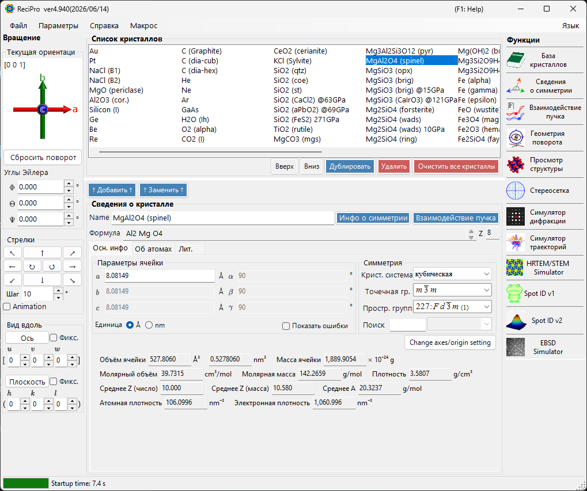

| Область | Расположение | Описание |
|------|----------|-------------|
| **Меню File** | Сверху | Операции с файлами, параметры, справка |
| **Управление вращением** | Слева | Просмотр/задание ориентации кристалла |
| **Список кристаллов** | Верхний центр | Выбор кристаллов и управление ими |
| **Сведения о кристалле** | Нижний центр | Редактирование параметров решётки, симметрии, атомов |
| **Функции** | Справа | Запуск окон моделирования/анализа |

---

## Сочетания клавиш и действия мышью {#keyboard-mouse-shortcuts}

Главное окно устанавливает несколько **общеприложенческих** сочетаний клавиш. Они продолжают работать, пока в фокусе находятся окна Просмотр структуры, Стереосеть, Симулятор дифракции, Spot ID и Калькулятор.

| Сочетание | Действие |
|----------|--------|
| <kbd>F1</kbd> | Открыть эту страницу онлайн-руководства |
| <kbd>CTRL</kbd>+<kbd>SHIFT</kbd>+<kbd>D</kbd> | Открыть / закрыть **Симулятор дифракции** |
| <kbd>CTRL</kbd>+<kbd>SHIFT</kbd>+<kbd>V</kbd> | Открыть / закрыть **Просмотр структуры** |
| <kbd>CTRL</kbd>+<kbd>SHIFT</kbd>+<kbd>S</kbd> | Открыть / закрыть **Стереосеть** |
| <kbd>CTRL</kbd>+<kbd>SHIFT</kbd>+<kbd>T</kbd> | Открыть / закрыть **Spot ID** |
| <kbd>CTRL</kbd>+<kbd>SHIFT</kbd> + клавиши со стрелками | Повернуть кристалл на один шаг в этом направлении (удерживайте две стрелки для диагонали) |
| Двойное нажатие <kbd>CTRL</kbd> | Открыть / закрыть **Калькулятор** |
| <kbd>CTRL</kbd>+<kbd>SHIFT</kbd>+<kbd>R</kbd> | Переключить флаг **Reserved** выбранного кристалла |
| Удерживать <kbd>CTRL</kbd> при запуске ReciPro | Запуск с отключённым OpenGL (восстановление при проблемах с графикой) |
| Перетаскивание виджета ориентации левой кнопкой (внизу слева, под *Current Direction*) | Повернуть кристалл |
| Двойной щелчок правой кнопкой по виджету ориентации | Скопировать изображение виджета в буфер обмена |
| Одиночный щелчок по кнопке функции | Открыть / закрыть это окно |
| Двойной щелчок по кнопке функции | Принудительно сделать окно видимым и вывести его на передний план |
| Щелчок правой кнопкой по кристаллу в списке | Контекстное меню (Переименовать / Дублировать / Удалить / Экспорт CIF…) |
| Двойной щелчок по подписи **Current Index** | Показать / скрыть поле max-UVW |
| Перетащить файл на окно | Загрузить список кристаллов (`.xml`, `.cdb2`) или кристалл (`.cif`, `.amc`) |

→ См. **[21. Сочетания клавиш и действия мышью](21-shortcuts.md)** для обзора по каждому окну.

---

## Базовый рабочий процесс

Если вы впервые работаете с ReciPro, выполните следующие шаги:

1. Выберите нужный кристалл в **Списке кристаллов**. Чтобы использовать файл CIF/AMC, перетащите его в **Сведения о кристалле**.
2. Если вы редактируете параметры решётки или положения атомов, нажмите **Add** или **Replace**, чтобы изменения были записаны обратно в список кристаллов.
3. Задайте ориентацию кристалла в **Управлении вращением**, используя ось зоны, кристаллическую плоскость, углы Эйлера или перетаскивание мышью.
4. Откройте нужный инструмент из **Функций**. Окна расчётов для дифракции, HRTEM/STEM, EBSD и других используют текущий выбранный кристалл и его ориентацию.

---

## Меню «Файл»

### Файл

| Пункт меню | Описание |
|-----------|-------------|
| Read crystal list (as new list) | Загрузить файл списка кристаллов (*.xml), заменив текущий список |
| Read crystal list (and add) | Добавить к текущему списку |
| Read initial crystal list | Перезагрузить список кристаллов по умолчанию |
| Save crystal list | Сохранить текущий список кристаллов |
| Export selected crystal to CIF | Сохранить в формате CIF |
| Clear crystal list | Удалить все кристаллы |
| Exit | Закрыть приложение |

### Параметры

| Пункт меню | Описание |
|-----------|-------------|
| Show Tooltips | Переключить отображение всплывающих подсказок |
| Use Miller-Bravais (hkil) index | Использовать 4-индексную нотацию для тригональных/гексагональных систем во всём приложении |
| Reset registry settings on exit (effective after restart) | Сбросить настройки при следующем перезапуске |
| Disable Crystallography.Native library (requires restart) | Перейти на управляемый код, если нативная (C++) библиотека не загружается |
| Disable all OpenGL rendering (requires restart) | Для старых GPU / удалённого рабочего стола |
| Disable OpenGL text rendering (requires restart) | Обходное решение для проблем отрисовки текста на некоторых GPU |
| Use MKL Library | Использовать Intel MKL для численных процедур |
| Dark mode | Переключение между светлой и тёмной цветовыми темами |
| Powder diffraction function (under development) | Включить окно поликристаллической (порошковой) дифракции |
| Capture GUI Components… | Инструмент разработчика для сохранения скриншотов GUI |

### Help

| Пункт меню | Описание |
|-----------|-------------|
| Program updates | Проверить, доступна ли новая версия ReciPro, и установить её |
| Hint | Показать подсказки по использованию (устарело) |
| Version history | Открыть диалог истории версий |
| License | Показать лицензию MIT |
| GitHub page | Открыть репозиторий ReciPro в браузере |
| Report bugs, requests, or comments | Открыть страницу GitHub Issues |
| Help (Web) | Открыть онлайн-руководство на GitHub Pages на странице, соответствующей языку интерфейса. |

Язык переключается через отдельное меню **Язык** (английский/японский, требуется перезапуск).

### Язык

Переключение языка интерфейса между английским и японским. Изменение вступает в силу после перезапуска ReciPro.

### Макрос

Открывает окно [Макрос](20-macro/index.md) для автоматизации операций ReciPro с помощью скриптов в стиле Python. Для повторяющихся рабочих процессов см. [встроенные функции](20-macro/1-built-in-functions.md) и [примеры макросов](20-macro/2-examples.md).

---

## Управление ориентацией кристалла

Состояние вращения кристалла совместно используется симулятором дифракции, Просмотром структуры, Стереосетью, симулятором HRTEM/STEM, симулятором EBSD и другими окнами. Это не просто настройка отображения — оно определяет направление падающего пучка и связь координат кристалла, используемую в моделировании. Краткий видеоурок доступен на странице [Использование](appendix/a0-how-to-use.md).

### Текущая ориентация

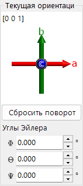

Показывает ориентацию кристалла. Перетаскивайте для вращения. Оси: красная = *a*, зелёная = *b*, синяя = *c*.

### Сбросить поворот
Сбрасывает к исходному состоянию: ось *c* перпендикулярна экрану, ось *b* направлена вверх.

### Ось зоны
Отображает ось зоны, ближайшую к нормали экрана (например, *u*+*v*+*w* < 30).

### Углы Эйлера (Z-X-Z)
Задайте ориентацию кристалла с помощью углов Эйлера **Z–X–Z**:

- \(\Phi\): поворот вокруг оси Z
- \(\Theta\): поворот вокруг оси X
- \(\Psi\): поворот вокруг оси Z

Повороты применяются в порядке \(\Psi \to \Theta \to \Phi\). Подробнее см. [Геометрия вращения](4-rotation-geometry.md) и [Приложение A1. Система координат](appendix/a1-coordinate-system/1-orientation.md).

### Стрелки

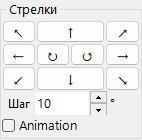

Поворачивает на угол Step. Установите Animation для непрерывного вращения.

### Вид вдоль

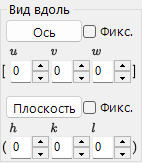

Выравнивает ось зоны [*uvw*] или кристаллическую плоскость (*hkl*) перпендикулярно экрану.

- **Fix**: если установлено, заданная ось зоны или плоскость удерживается пространственно зафиксированной во время последующих операций вращения.
- **Axis**: устанавливает введённую ось зоны \([uvw]\) перпендикулярно экрану. Если также задано **Plane**, это направление направляется вверх на экране.
- **Plane**: устанавливает нормаль введённой кристаллической плоскости \((hkl)\) перпендикулярно экрану. Если также задано **Axis**, это направление направляется вверх на экране.

### Основные способы задания ориентации

| Метод | Использовать, когда | Где |
|--------|----------|-------|
| Перетаскивание мышью | Вы хотите свободно вращать, наблюдая за осями кристалла. | Панель **Текущая ориентация** |
| Кнопки со стрелками | Вам нужны небольшие повторяемые повороты. | Панель **Стрелки** |
| Ось зоны | Вы знаете направление обзора, например \([001]\) или \([110]\). | **Вид вдоль** / ввод оси зоны |
| Нормаль плоскости | Вам нужна кристаллическая плоскость \((hkl)\) перпендикулярно экрану. | **Просмотр вдоль** / ввод плоскости |
| Углы Эйлера | Вам нужна воспроизводимая числовая ориентация. | **Углы Эйлера (Z-X-Z)** |

См. [Геометрия вращения](4-rotation-geometry.md) и [Приложение A1. Системы координат](appendix/a1-coordinate-system/1-orientation.md) для матриц вращения и соглашений о координатах.

---

## Список кристаллов

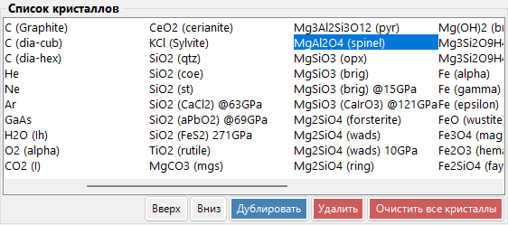

~80 кристаллов в стандартной установке. Выберите, чтобы просмотреть сведения и задать для расчётов. **Щёлкните правой кнопкой по кристаллу** в Списке кристаллов для контекстного меню: *Rename*, *Export as CIF*, *Duplicate*, *Delete*.

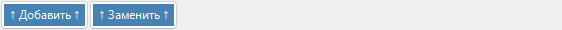

| Кнопка | Действие |
|--------|--------|
| Up / Down | Изменить порядок |
| Duplicate | Скопировать выбранный кристалл |
| Delete / All clear | Удалить кристаллы |
| Add / Replace | Добавить в список или заменить выбранную запись |

---

## Сведения о кристалле

Редактируйте параметры решётки, симметрию и атомы; перетаскивайте файлы CIF/AMC, чтобы загрузить структуру. Этот элемент управления совместно используется ReciPro, PDIndexer и CSmanager, но отображаемые вкладки и функции различаются в зависимости от приложения. ReciPro показывает вкладки Basic Info, Atom и Reference (вкладки EOS, Elasticity и другие предназначены для других приложений и в ReciPro не отображаются).

> **Важно**: нажмите **Add** или **Replace**, чтобы сохранить изменения.

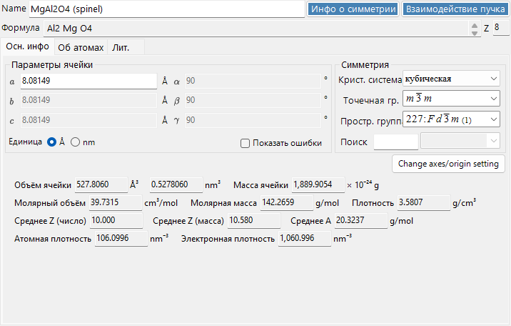

Верхняя часть панели всегда показывает **Name** (название кристалла), **Formula** (химическая формула, вычисленная из списка атомов) и **Reset** (очистить все поля).

### Вкладка Basic Info

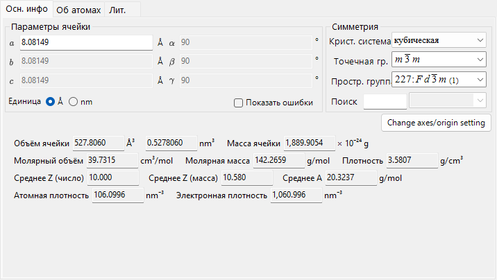

Параметры решётки, симметрия и выводимые из них величины.

| Элемент | Описание |
|------|------|
| Cell constants | Параметры решётки a, b, c (в Å = 10⁻¹⁰ м) и α, β, γ. Выбор симметрии автоматически ограничивает их (например, a=b=c, α=β=γ=90° для кубической). |
| Symmetry | Выберите кристаллическую систему, точечную группу и пространственную группу. Введите текст в поле **Search**, чтобы перечислить подходящие кандидаты (с учётом регистра). |
| Cell Volume / Cell Mass | Объём и масса элементарной ячейки. |
| Molar Volume / Molar Mass / Z / Density | Молярный объём, молярная масса, число формульных единиц на элементарную ячейку (Z) и плотность. Показывается **только при введённых атомах**. |
| Color of Profile | Цвет, используемый при построении дифракционного профиля этого кристалла. |

### Вкладка Atom

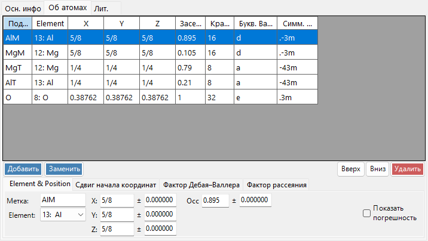

Задайте сорт, положение, температурный фактор и фактор рассеяния каждого атома. Редактируйте список атомов с помощью **Add**, **Replace** (заменить выбранную строку), **Up/Down** (изменить порядок) и **Delete**. Каждый атом имеет:

| Элемент | Описание |
|------|------|
| Label | Метка атома (любой идентификатор). |
| Element | Элемент (включая ионную валентность). |
| X, Y, Z | Дробные координаты (0–1). Можно вводить дроби, такие как 1/2 или 2/3. |
| Occ | Заселённость (0–1). |

**Origin shift**: сдвигает начало координат всех атомных координат. Используйте предустановленные кнопки (**+** / **−**) для стандартных сдвигов или **Apply custom shift** для произвольной величины.

**Фактор Дебая–Валлера (температурный фактор)**:

| Элемент | Описание |
|------|------|
| Notation | Использовать нотацию U или B. |
| Model | Изотропный или анизотропный. |
| B##, U## | Для анизотропного случая введите каждую компоненту (B11, …). |

**Scattering factor**: выберите фактор рассеяния, используемый для каждого атома.

| Излучение | Источник / настройка |
|-----------|------|
| X-ray | Факторы рассеяния, включая ионную валентность (International Tables for Crystallography, Vol. C). |
| Electron | Факторы рассеяния электронов (Peng 1998, Acta Cryst. A54, 481–485). |
| Neutron | Длины рассеяния нейтронов. Выберите **Natural isotope abundance** или **Custom isotope abundance** (произвольный изотопный состав). |

### Вкладка Reference

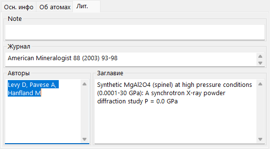

Запишите источник структуры: **Note**, **Authors**, **Journal** и **Title**.

### Контекстное меню (щелчок правой кнопкой)

Щёлкните правой кнопкой по пустой области элемента управления для этих основных действий:

| Пункт меню | Действие |
|-----------|------|
| Beam Interaction | Открывает окно [Взаимодействие пучка](3-beam-interaction.md). |
| Symmetry information | Открывает окно [Сведения о симметрии](2-symmetry-information.md). |
| Import from CIF, AMC | Загружает кристалл из файла CIF / AMC. |
| Export to CIF | Экспортирует текущий кристалл как CIF. |
| Revert cell constants | Восстанавливает константы ячейки до значений, загруженных первоначально. |
| Convert to P1 spacegroup | Разворачивает структуру до пространственной группы P1. |
| Convert to a superstructure | Преобразует в сверхструктуру с целочисленными кратными a, b, c (диалог размера). |
| Convert to an equivalent space group | Преобразует в эквивалентную пространственную группу (другая установка осей). |

---

## Панель функций {#functions}

Вертикальная полоса кнопок справа запускает окна анализа и моделирования (см. таблицу [Функции](#functions) ниже).

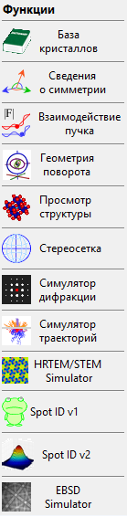

| Кнопка | Описание | Подробнее |
|--------|-------------|---------|
| Crystal Database | Поиск и импорт кристаллов из встроенных / онлайн-баз данных | [1. База данных кристаллов](1-crystal-database.md) |
| Symmetry Information | Сведения о пространственной группе и диаграммы симметрии ITC Vol. A | [2. Сведения о симметрии](2-symmetry-information.md) |
| Beam Interaction | Взаимодействие пучка с кристаллом: рефлексы, ослабление, факторы рассеяния, флуоресценция | [3. Взаимодействие пучка](3-beam-interaction.md) |
| Rotation Geometry | 3D-матрица вращения / углы гониометра | [4. Геометрия вращения](4-rotation-geometry.md) |
| Structure Viewer | 3D-структура кристалла | [5. Просмотр структуры](5-structure-viewer.md) |
| Stereonet | Стереографическая проекция | [6. Стереосеть](6-stereonet.md) |
| Diffraction Simulator | Монокристаллическая рентгеновская / электронная дифракция | [7. Симулятор дифракции](7-diffraction-simulator/index.md) |
| Trajectory Simulator | Монте-Карло-моделирование траекторий электронов | [8. Траектории электронов](8-electron-trajectory.md) |
| HRTEM/STEM Simulator | Моделирование изображений HRTEM / STEM | [9. Симулятор HRTEM/STEM](9-hrtem-stem-simulator/index.md) |
| Spot ID v1 | Индицирование картин SAED (ранее «TEM ID») | [10. Spot ID v1](10-spot-id.md) |
| Spot ID v2 | Обнаружение и индицирование рефлексов | [11. Spot ID v2](11-spot-id-v2.md) |
| EBSD Simulator | Моделирование картин EBSD | [12. Моделирование EBSD](12-ebsd-simulation.md) |
| Powder Diffraction | Поликристаллическая (порошковая) дифракция — включить через **Option ▸ Powder diffraction function** | - |

---

## См. также

- [База данных кристаллов](1-crystal-database.md)
- [Геометрия вращения](4-rotation-geometry.md)
- [Просмотр структуры](5-structure-viewer.md)
- [Симулятор дифракции](7-diffraction-simulator/index.md)
- [Сочетания клавиш и действия мышью](21-shortcuts.md)
- [Базовая система координат и ориентация кристалла](appendix/a1-coordinate-system/1-orientation.md)
