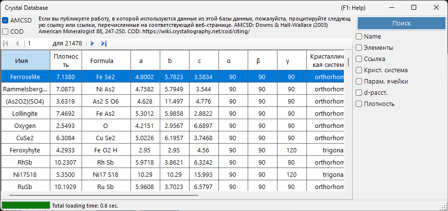
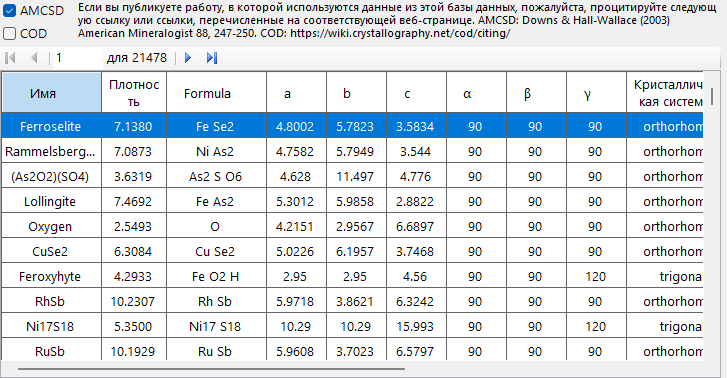
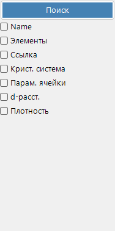

# База данных кристаллов

**База данных кристаллов** предоставляет функции для поиска и импорта кристаллических структур из двух источников, выбираемых с помощью флажков **AMCSD** и **COD**:

- **AMCSD** : встроенная [American Mineralogist Crystal Structure Database](https://www.rruff.net/) (более 20 000 структур).
- **COD** : [Crystallography Open Database](https://www.crystallography.net/cod/). Поскольку файл большой, он не входит в комплект установщика; файл базы данных автоматически загружается при первом использовании. Когда файл обновляется на сервере, вам предлагается загрузить его снова.

При использовании этих баз данных, пожалуйста, цитируйте следующие источники.

При использовании **AMCSD**:

> Downs, R.T. and Hall-Wallace, M. (2003) The American Mineralogist Crystal Structure Database. *American Mineralogist* **88**, 247-250.

При использовании **COD**:

> Gražulis, S. et al. (2009) Crystallography Open Database – an open-access collection of crystal structures. *Journal of Applied Crystallography* **42**, 726-729.
>
> Gražulis, S. et al. (2012) Crystallography Open Database (COD): an open-access collection of crystal structures and platform for world-wide collaboration. *Nucleic Acids Research* **40**, D420-D427.

---

## Сочетания клавиш и мыши

В этом окне нет комбинаций с клавишами-модификаторами; оно управляется обычными щелчками. Единственные неочевидные действия:

| Сочетание | Действие |
|----------|--------|
| <kbd>F1</kbd> | Открыть эту страницу онлайн-руководства |
| <kbd>ENTER</kbd> в любом поле поиска | Выполнить поиск по базе данных (то же, что кнопка **Search**) |
| Щелчок по строке в таблице результатов | Загрузить этот кристалл в главное окно |
| Щелчок по элементу во всплывающем окне **Periodic table** | Переключить его фильтр: *ignore* → *must include* → *must exclude* |

→ См. **[21. Сочетания клавиш и мыши](21-shortcuts.md)** для обзора каждого окна.

---

## Таблица

Отображает кристаллы, соответствующие критериям поиска. Выберите кристалл, чтобы передать его в Сведения о кристалле главного окна. Нажмите **Add** или **Replace**, чтобы добавить его в Список кристаллов.

---

## Параметры поиска

Введите критерии поиска ниже и нажмите кнопку **Search** или клавишу **Enter**.

| Критерий | Описание |
|-----------|-------------|
| **Name** | Название кристалла |
| **Element** | Выбор по периодической таблице (может/должен/не должен содержать) |
| **Reference** | Заголовок, журнал, автор |
| **Crystal system** | Выбор кристаллической системы |
| **Cell Param** | Постоянные решётки и погрешность |
| **d-spacing** | Значения d сильнейшего рефлекса и погрешность |
| **Density** | Плотность и погрешность |

### Name

Поиск свободного текста по названию кристалла. Допускаются частичные совпадения.

### Element

Нажмите кнопку **Periodic Table**, чтобы открыть выбор элементов. Каждая кнопка элемента переключается между тремя состояниями:

- **May or may not include** (по умолчанию — серый)
- **Must include** (зелёный)
- **Must exclude** (красный)

Три кнопки вверху окна сбрасывают каждый элемент в одно из трёх состояний одним щелчком.

### Reference

Поиск свободного текста по метаданным публикации: заголовок статьи, название журнала и список авторов.

### Crystal system

Ограничивает поиск конкретной кристаллической системой (Cubic, Tetragonal, Orthorhombic, Hexagonal, Trigonal, Monoclinic, Triclinic).

### Поиск по параметрам ячейки

Введите целевые постоянные решётки *a*, *b*, *c*, *α*, *β*, *γ* и допустимые погрешности. Пустые поля рассматриваются как подстановочные знаки.

### d-spacing

Введите *d*-расстояние (d-spacing) сильнейшего рефлекса (или нескольких сильных рефлексов) и допустимую погрешность. Полезно, когда из эксперимента известны только положения дифракционных пиков.

### Density

Фильтрация по массовой плотности (g/cm³) в пределах допустимого диапазона погрешности.

---

## См. также

- [Главное окно](0-main-window.md)
- [Сведения о симметрии](2-symmetry-information.md)
- [Взаимодействие пучка](3-beam-interaction.md)
- [Просмотр структуры](5-structure-viewer.md)
