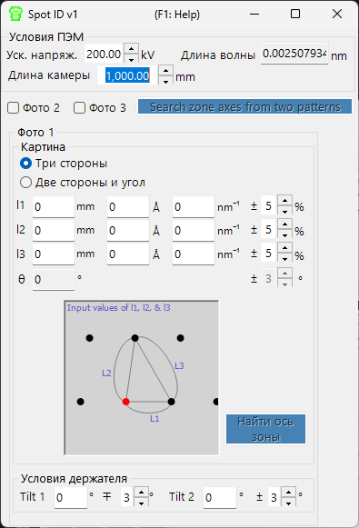

# Spot ID v1

**Spot ID v1** обнаруживает, аппроксимирует и индицирует дифракционные рефлексы из экспериментальных изображений электронной дифракции. Кроме того, поддерживается ручной поиск оси зоны по численно введённой геометрии рефлексов (прежний **TEM ID**).

---

## Сочетания клавиш и мыши

Spot ID v1 принимает геометрию рефлексов как **числовой ввод** (прежний рабочий процесс *TEM ID*), а обнаружение/аппроксимация рефлексов выполняются с помощью кнопок; дифракционное изображение отображается лишь для справки и не реагирует на щелчки (масштабирование мышью и ручной выбор рефлексов относятся к [Spot ID v2](11-spot-id-v2.md)). Единственное сочетание находится в окне результатов:

| Сочетание | Действие |
|----------|--------|
| <kbd>F1</kbd> | Открыть эту страницу онлайн-руководства |
| Двойной щелчок по строке в списке результатов | Выбрать этот кристалл и повернуть его к соответствующей оси зоны |

→ См. **[21. Сочетания клавиш и мыши](21-shortcuts.md)** для обзора всех окон.

---

## Главная область

Отображает дифракционное изображение для справки. Изображения загружаются перетаскиванием или через меню **File**.

### Настройки изображения

| Настройка | Описание |
|---------|-------------|
| Min / Max | Диапазон яркости (также регулируется ползунком) |
| Gradient | Positive или Negative |
| Scale | Linear или Log |
| Colour | Grey scale или Cold-Warm |
| Dust & Scratch | Удаление аномально ярких/тёмных пикселей (задайте диапазон и порог) |
| Gaussian blur | Применить размытие (диапазон в пикселях) |

---

## Optics

Введите источник падающего пучка, энергию/длину волны, камерную длину и размер пикселя детектора.

> Если загружается файл dm3/dm4 (Gatan Digital Micrograph), эти значения задаются автоматически.

---

## Обнаружение и аппроксимация рефлексов

Нажмите **Detect & fit spots**, чтобы автоматически обнаружить дифракционные рефлексы и аппроксимировать их двумерной функцией Псевдо-Фойгта. Результаты появляются в таблице.

### Параметры обнаружения

| Параметр | Описание |
|-----------|-------------|
| Number | Максимальное число обнаруживаемых рефлексов |
| Nearest neighbour | Минимальное расстояние между обнаруженными рефлексами |
| Fitting range | Радиус (в пикселях) вокруг каждого рефлекса для аппроксимации |

### Управление таблицей

| Кнопка | Действие |
|--------|--------|
| Reset range | Сбросить диапазон аппроксимации для всех рефлексов |
| Show label/symbol | Наложить подписи/символы на изображение |
| Clear all spots | Удалить все рефлексы |
| Save / Copy | Экспортировать таблицу в формате с разделением табуляцией (Excel) |
| Re-fit all | Заново аппроксимировать все рефлексы |

### Окно сведений о рефлексе

Установите флажок, чтобы открыть окно сведений, показывающее выбранный рефлекс (слева) и профили в четырёх направлениях (справа). Синий = измеренные данные, красный = аппроксимация.

---

## Index

Нажмите **Identify spots**, чтобы индицировать обнаруженные рефлексы по кристаллу, выбранному в Главном окне.

| Настройка | Описание |
|---------|-------------|
| Acceptable error | Допуск для индицирования |
| Single grain / Multi grains | Индицировать как монокристалл или как несколько зёрен (задайте максимальное число зёрен) |
| Show label/symbol | Наложить индицированные подписи на изображение |
| Refine thickness and direction | Применить динамическую теорию (метод Бете), чтобы уточнить толщину образца и ориентацию кристалла, наилучшим образом соответствующие обнаруженным интенсивностям |

---

## Поиск оси зоны по геометрии рефлексов (прежний TEM ID)

Если у вас нет изображения для загрузки, вы всё равно можете искать кандидатные оси зоны, вручную вводя геометрию картины электронной дифракции с выделенной области (SAED). Введите условия наблюдения TEM и геометрию рефлексов, затем нажмите **Найти ось зоны**, чтобы найти кандидатные ориентации кристалла.

### Условия ПЭМ

Введите условия наблюдения ПЭМ (ускоряющее напряжение, камерную длину и т. д.).

### Фото 1, 2, 3

Введите геометрию дифракционных рефлексов.

- Чтобы ввести расстояние между двумя рефлексами на детекторе, используйте поле **mm**.
- Если вам известно значение *d*, введите его в единицах **Å** или **nm⁻¹**.

**Три стороны** : Введите длины трёх сторон треугольника, одной из вершин которого является direct spot.

**Две стороны и угол** : Введите длины двух сторон (включая direct spot) и угол между ними.

---

## См. также

- [Spot ID v2](11-spot-id-v2.md)
- [Симулятор дифракции](7-diffraction-simulator/index.md)
- [Главное окно](0-main-window.md)
- [База данных кристаллов](1-crystal-database.md)
- [Моделирование EBSD](12-ebsd-simulation.md)
