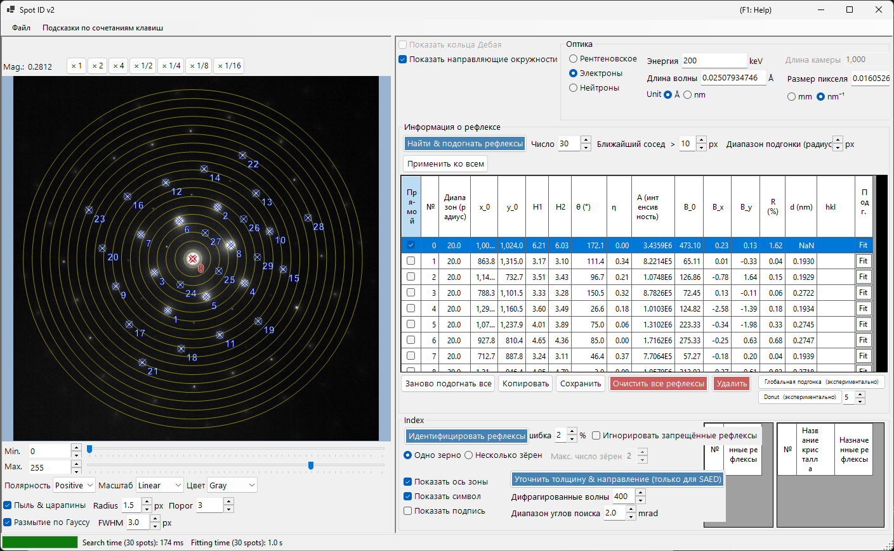
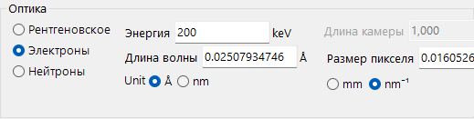
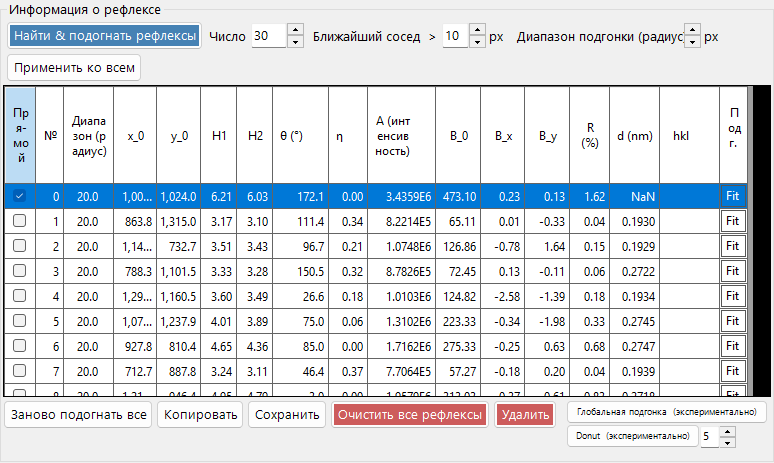
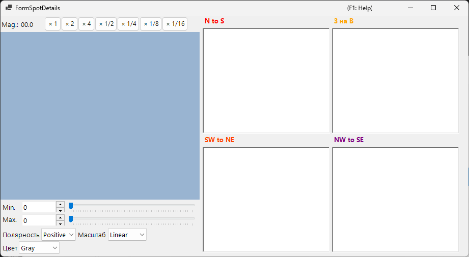
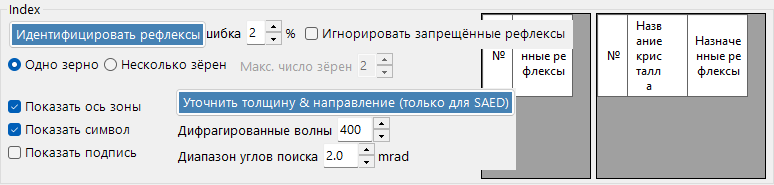

# Spot ID v2

**Spot ID v2** — это улучшенная версия [Spot ID](10-spot-id.md) с усовершенствованным обнаружением рефлексов, алгоритмами подгонки и более мощным механизмом индицирования.

---

## Сочетания клавиш и мыши

Список рефлексов вы создаёте непосредственно на загруженном изображении. Область изображения использует стандартную [навигацию по изображению](21-shortcuts.md) ReciPro для панорамирования/масштабирования; для редактирования рефлексов добавляются приведённые ниже комбинации.

| Сочетание | Действие |
|----------|--------|
| <kbd>F1</kbd> | Открыть эту страницу онлайн-руководства |
| Двойной щелчок левой кнопкой по изображению | Добавить рефлекс в этой точке (с подгонкой пика) |
| <kbd>CTRL</kbd> + двойной щелчок левой кнопкой | Добавить рефлекс и отметить его как прямой (000) пучок |
| Щелчок левой кнопкой по рефлексу | Выбрать ближайший рефлекс |
| <kbd>CTRL</kbd> + щелчок правой кнопкой по рефлексу | Удалить ближайший рефлекс |
| <kbd>CTRL</kbd> + клавиши со стрелками | Сместить выбранный рефлекс на один пиксель |
| Перетаскивание левой / средней кнопкой (пустая область) | Панорамировать изображение |
| Колесо мыши | Приблизить / отдалить у курсора |
| Перетаскивание правой кнопкой рамки | Приблизить выбранную область |
| Двойной щелчок правой кнопкой | Отдалить |
| Двойной щелчок по заголовку строки рефлекса (таблица) | Приблизить к этому рефлексу (×2) |

Сочетание <kbd>CTRL</kbd>+<kbd>SHIFT</kbd>+<kbd>T</kbd> в главном окне открывает/закрывает это окно.

→ См. **[21. Сочетания клавиш и мыши](21-shortcuts.md)** для обзора всех окон.

---

## Меню «Файл»

Открытие / сохранение дифракционного изображения. Поддерживается такая же загрузка перетаскиванием, как в [Spot ID v1](10-spot-id.md), а метаданные Gatan DM3/DM4 (длина камеры, длина волны, размер пикселя) учитываются автоматически.

---

## Оптика

### Источник излучения

Выберите тип излучения (рентгеновское / электронное / нейтронное) и задайте энергию или длину волны.

### Длина камеры / Размер пикселя

Длина камеры (мм) и размер пикселя детектора (мм или нм⁻¹). При загрузке файла Gatan DM эти значения берутся из заголовка файла.

---

## Сведения о рефлексе

- **Detect & Fit Spots**: Автоматическое обнаружение рефлексов с использованием локальных максимумов и вычитания фона.
- **Number**: Максимальное число обнаруживаемых рефлексов.
- **Nearest neighbour**: Минимальное расстояние (px), допустимое между обнаруженными рефлексами. Пики, расположенные ближе этого расстояния, объединяются, что предотвращает двойное обнаружение одного и того же рефлекса.
- **Fitting range (radius)**: Радиус (px) круговой области, используемой для подгонки пика каждого рефлекса. Пиксели внутри этого круга подгоняются псевдо-фойгтовской функцией.
- **Apply to All**: Устанавливает радиус подгонки каждого рефлекса равным текущему значению **Fitting range (radius)**.
- **Delete spot / Clear spots**: Удалить отдельные или все обнаруженные рефлексы.
- **Copy to clipboard**: Скопировать положения и интенсивности рефлексов в буфер обмена.
- **Details of the spot**: Если флажок установлен, открывается окно с подробными сведениями о текущем выбранном рефлексе.

---

## Index

- **Identify Spots**: Запускает алгоритм индицирования для поиска наиболее подходящего кристалла и оси зоны.
- **Acceptable error**: Задаёт допустимое отклонение по межплоскостному расстоянию и углу для совпадения.
- **Ignore prohibited reflections**: Если флажок установлен, рефлексы, запрещённые винтовыми осями и плоскостями скользящего отражения, при поиске оси зоны рассматриваются как не обязательно выполняющиеся.
- **Single Grain / Multiple Grains**: Поиск одной ориентации (монокристалл) или нескольких ориентаций (поликристаллическая / многозёренная область). Для нескольких зёрен параметр **Max. num. of grains** задаёт верхний предел числа искомых зёрен.
- **Results**: Наилучшие совпадения отображаются с именем кристалла, осью зоны [uvw] и индексами отдельных рефлексов (hkl).

---

## Улучшения по сравнению с v1

- Лучшая обработка шума при обнаружении рефлексов.
- Более устойчивые алгоритмы подгонки с несколькими формами профиля.
- Более быстрое индицирование с оптимизированными алгоритмами поиска.
- Поддержка перекрывающихся рефлексов и сателлитных рефлексов.

---

## См. также

- [Spot ID v1](10-spot-id.md)
- [Симулятор дифракции](7-diffraction-simulator/index.md)
- [Главное окно](0-main-window.md)
- [Сочетания клавиш и мыши](21-shortcuts.md)
