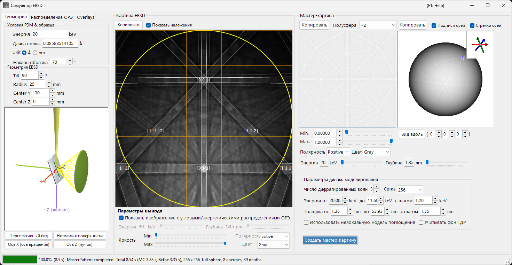
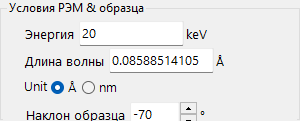
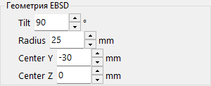
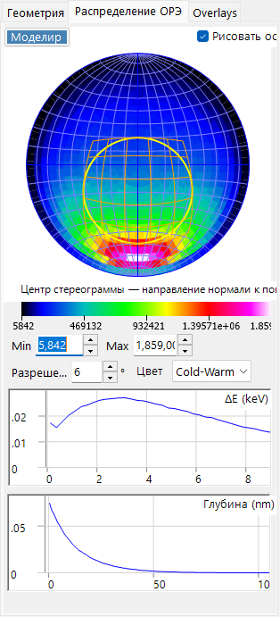
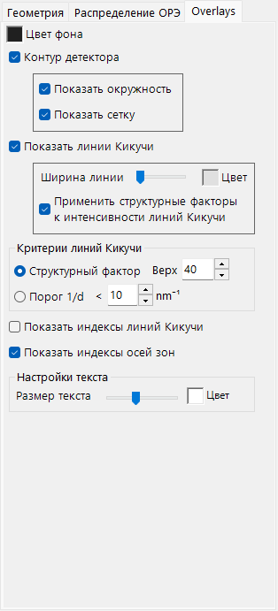
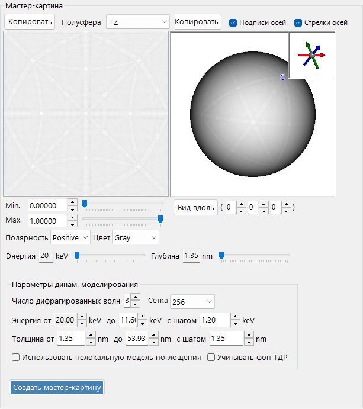
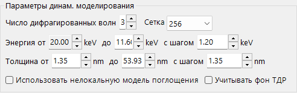
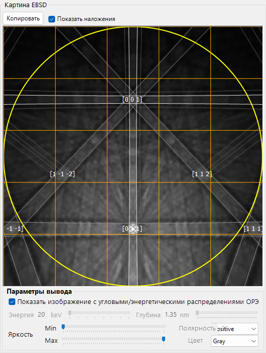

# Моделирование EBSD

**Симулятор EBSD** моделирует картины электронной обратнорассеянной дифракции (EBSD) — картины Кикучи, — получаемые в растровом электронном микроскопе (РЭМ), на основе расчётов по динамической теории. Он вычисляет угловое/энергетическое/глубинное распределение обратно рассеянных электронов (BSE) методом Монте-Карло, строит динамическую (блоховских волн) **master pattern** кристалла и проецирует её на детектор для текущей ориентации кристалла.

Окно состоит из трёх столбцов.

- **Слева** : условия моделирования. Вкладки выбирают **Geometry** (геометрия образца/детектора и 3D-вид), **BSE Distribution** (распределения обратно рассеянных электронов) и **Overlays** (линии Кикучи и другие подписи).
- **По центру** : картина EBSD (Кикучи) для текущей ориентации кристалла.
- **Справа** : независимая от ориентации master pattern (2D-проекция и 3D-сфера).

---

## Сочетания клавиш и мыши

Центральный вид картины EBSD (Кикучи) и расположенные справа виды master pattern реагируют на разные действия мыши.

| Сочетание | Действие |
|----------|--------|
| <kbd>F1</kbd> | Открыть эту страницу онлайн-руководства |
| Перетаскивание картины левой кнопкой вблизи центра | Наклонить кристалл |
| Перетаскивание левой кнопкой во внешней области картины | Вращать кристалл |
| Двойной щелчок по картине | Выбрать подъячейку детектора под курсором и показать её статистику |
| Перетаскивание левой кнопкой в 3D-виде (геометрия / master-сфера) | Повернуть его |
| Перетаскивание правой кнопкой или колесо мыши в 3D-виде | Масштабирование |
| <kbd>CTRL</kbd> + двойной щелчок правой кнопкой в 3D-виде | Переключить ортографическую / перспективную проекцию |
| Перетаскивание / колесо на 2D master pattern | Панорамирование / масштабирование изображения |

3D-виды используют стандартную [навигацию по виду](21-shortcuts.md) ReciPro (панорамирование отключено).

→ См. **[21. Сочетания клавиш и мыши](21-shortcuts.md)** для обзора всех окон сразу.

---

## Рабочий процесс

Нажатие **Build Master Pattern** последовательно выполняет следующие шаги.

1. **Монте-Карло-моделирование BSE** : с использованием текущего состава кристалла, плотности, ускоряющего напряжения и наклона образца внутри образца отслеживается около 2,5 миллиона электронов (упругое рассеяние: сечения Мотта/NIST; неупругое рассеяние: модель диэлектрического отклика). Это даёт совместное распределение *глубины проникновения × направления выхода × энергии выхода* обратно рассеянных электронов.
2. **Автоматический выбор диапазона** : из этого распределения автоматически устанавливаются энергетический диапазон (от энергии падения примерно до 80-го процентиля потери энергии) и глубинный диапазон (примерно до 99-го процентиля глубины проникновения), используемые в динамическом расчёте.
3. **Построение master pattern** : для каждой энергии и глубины решается задача динамической дифракции (блоховских волн) и интегрируется по сфере направлений с весами из распределения Монте-Карло, чтобы получить интенсивность обратнорассеянной дифракции по каждому направлению. Результат сохраняется на равновеликой (Rosca–Lambert) сетке.
4. **Проекция на детектор с весами** : для текущей ориентации кристалла интенсивность для направления, охватываемого каждым пикселем детектора, находится в master pattern и отрисовывается как картина Кикучи, при необходимости взвешенная угловым/энергетическим распределением BSE.

Энергетический и глубинный диапазоны устанавливаются автоматически на шагах 1–2, но перед построением их можно скорректировать вручную.

---

## Настройки РЭМ-EBSD

### Условия РЭМ и образца

- **Energy** : ускоряющее напряжение падающего пучка (keV).
- **Wavelength** : длина волны электрона (Å), связана с Energy.
- **Sample tilt** : угол наклона образца (обычно 70°). Большой наклон в EBSD увеличивает выход обратно рассеянных электронов.

### Геометрия EBSD

- **Detector tilt** : наклон детектора (люминофорный экран).
- **Detector radius** : радиус детектора (mm); задаёт угловое поле зрения отрисовываемой картины.
- **Detector center** : положение (Y, Z) центра детектора относительно точки попадания пучка (mm).

Геометрию можно осмотреть в 3D-виде на вкладке **Geometry**.

Серая пластина — образец, зелёный цилиндр/конус — детектор, а фиолетовый **+Z (=beam)** — падающий пучок. Также показаны кристаллографические оси **a / b / c** (жёстко связанные с образцом). Кнопки **Bird's-Eye View**, **Surface Normal**, **X Axis (Rotation Axis)** и **Z Axis (Beam Direction)** привязывают вид к стандартным направлениям. См. [Приложение A1. Системы координат](appendix/a1-coordinate-system/2-diffraction.md) для определений систем координат.

---

## Распределение BSE

Вкладка **BSE Distribution** показывает Монте-Карло-распределения обратно рассеянных электронов. Используйте **Simulate** для их пересчёта.

- **Stereonet** : угловое распределение (гистограмма направлений выхода) обратно рассеянных электронов. Центр — направление нормали к поверхности, а жёлто-оранжевый контур отмечает область, охватываемую детектором. **Draw axes** накладывает кристаллографические оси, а цветовая шкала (Min/Max, разрешение, цвет) настраивается.
- **ΔE (keV)** : распределение потери энергии обратно рассеянных электронов.
- **Depth (nm)** : распределение конечной глубины выхода обратно рассеянных электронов.

Эти распределения вычисляются тем же Монте-Карло-движком, что и в разделе [Траектории электронов](8-electron-trajectory.md), и используются для взвешивания master pattern.

---

## Overlays

Вкладка **Overlays** настраивает подписи, отрисовываемые на картине EBSD.

- **Background color** : цвет фона.
- **Detector outline** : контур детектора. **Show circle** (периметр) / **Show mesh** (сетка).
- **Show Kikuchi lines** : отрисовка линий Кикучи. **Line Width** / **Color**, а также **Apply structure factors to Kikuchi line intensity**.
- **Show Kikuchi line indices** : показать индексы линий Кикучи (полос).
- **Show zone axis indices** : показать индексы осей зон.
- **Kikuchi line criteria** : какие линии Кикучи отрисовывать: **Structure factor** (верхние *N* по структурному фактору) или **1/d Cutoff** (те, у которых 1/d ниже порога).
- **Text settings** : **Text Size** / **Color** подписей индексов.

---

## Master pattern

Master pattern — это интенсивность обратнорассеянной дифракции по всем направлениям, рассчитанная заранее по динамической теории с помощью **Build Master Pattern**.

- **2D-вид** (слева) : равновеликая проекция полусферы. **Hemisphere** выбирает проецируемую полусферу (+Z / −Z).
- **3D-вид** (справа) : сфера с отображённой на ней интенсивностью. Её можно вращать мышью, а вставка в правом верхнем углу показывает синхронизированные кристаллографические оси (a/b/c). **Axis Labels** / **Axis Arrows** переключают подписи/стрелки, а **View Along** смотрит вдоль выбранной оси зоны [u v w].
- **Min / Max, Polarity, Color** : отображаемый диапазон интенсивности, полярность и цветовая шкала.
- Ползунки **Energy / Depth** : выбор отображаемого энергетического/глубинного среза.
- Любой вид можно отправить в буфер обмена с помощью **Copy**.

### Параметры динамического моделирования

- **Number of diffracted waves** : число дифрагированных пучков (волн), включённых в расчёт блоховских волн. Больше волн — точнее, но медленнее.
- **Grid** : разрешение сетки master pattern (по умолчанию 256).
- **Energy from … to … with step of …** : интегрируемый энергетический диапазон и шаг (keV); устанавливается автоматически из результата Монте-Карло.
- **Thickness from … to … with step of …** : интегрируемый глубинный диапазон и шаг (nm); также устанавливается автоматически.
- **Use non-local absorption model** : использовать нелокальную форму поглощения.
- **Include TDS background intensities** : включить фон теплового диффузного рассеяния (TDS).

---

## Картина EBSD

Центральная панель показывает картину EBSD (полос Кикучи) для текущей ориентации кристалла.

- **Show Dynamical EBSD Pattern (Master Pattern Required)** : проецирует построенную master pattern на детектор.
- **Show overlays** : отрисовывает оверлеи (ниже), такие как линии Кикучи и индексы.
- **Output parameters**
  - **Show image with BSE angular/energy distributions** : если флажок установлен, картина составляется путём взвешивания распределением BSE (энергия, глубина, направление), а не одним срезом.
  - **Energy / Depth** : если предыдущая опция выключена, выбирает отображаемый энергетический/глубинный срез.
  - **Brightness (Min/Max), Polarity, Color** : диапазон яркости, полярность и цветовая шкала.
- **Copy** : копирует картину в буфер обмена.

---

## См. также

- [Траектории электронов](8-electron-trajectory.md) — Монте-Карло-моделирование траекторий электронов / BSE, используемое для углового/энергетического/глубинного взвешивания.
- [Симулятор дифракции](7-diffraction-simulator/index.md) — динамическая (блоховских волн) электронная дифракция.
- [Приложение A1. Системы координат](appendix/a1-coordinate-system/2-diffraction.md) — определения систем координат образца/детектора.
