# Моделирование EBSD

**Симулятор EBSD** моделирует картины электронной обратнорассеянной дифракции (EBSD) — картины Кикучи, — получаемые в растровом электронном микроскопе (РЭМ), на основе расчётов по динамической теории. Он вычисляет угловое/энергетическое/глубинное распределение обратно рассеянных электронов (BSE) методом Монте-Карло, строит динамическую (блоховских волн) **master pattern** кристалла и проецирует её на детектор для текущей ориентации кристалла. Можно также загрузить экспериментальное изображение EBSD и **проиндицировать** его: ориентация, которая лучше всего его объясняет, ищется автоматически ([Экспериментальное изображение](#экспериментальное-изображение)).

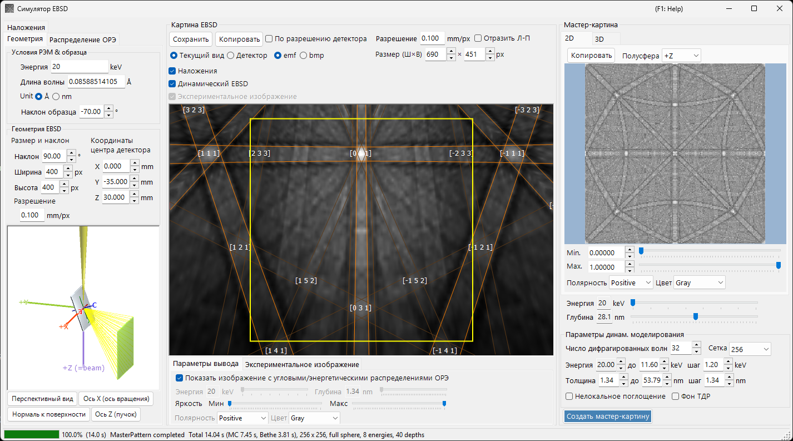

Окно состоит из трёх столбцов.

- **Слева** : условия моделирования. Вкладки выбирают **Геометрия** (геометрия образца/детектора и 3D-вид), **Распределение ОРЭ** (распределения обратно рассеянных электронов) и **Наложения** (линии Кикучи и другие подписи).
- **По центру** : картина EBSD (Кикучи) для текущей ориентации кристалла. Ниже вкладки выбирают **Параметры вывода** и **Экспериментальное изображение**.
- **Справа** : независимая от ориентации master pattern — на вкладках **2D** и **3D**.

Строка состояния внизу показывает ход текущего расчёта и краткую сводку его результата.

---

## Сочетания клавиш и мыши

Центральный вид картины EBSD (Кикучи) и расположенные справа виды master pattern реагируют на разные действия мыши.

| Сочетание | Действие |
|----------|--------|
| <kbd>F1</kbd> | Открыть эту страницу онлайн-руководства |
| Перетаскивание картины левой кнопкой вблизи центра | Наклонить кристалл |
| Перетаскивание левой кнопкой во внешней области картины | Вращать кристалл |
| Двойной щелчок по картине | Выбрать подъячейку детектора под курсором и показать её статистику |
| Перетаскивание файла изображения в окно | Загрузить его как экспериментальное изображение EBSD |
| Перетаскивание левой кнопкой в 3D-виде (геометрия / master-сфера) | Повернуть его |
| Перетаскивание правой кнопкой или колесо мыши в 3D-виде | Масштабирование |
| <kbd>CTRL</kbd> + двойной щелчок правой кнопкой в 3D-виде | Переключить ортографическую / перспективную проекцию |
| Перетаскивание / колесо на 2D master pattern | Панорамирование / масштабирование изображения |

3D-виды используют стандартную [навигацию по виду](21-shortcuts.md) ReciPro (панорамирование отключено).

→ См. **[21. Сочетания клавиш и мыши](21-shortcuts.md)** для обзора всех окон сразу.

---

## Рабочий процесс

Нажатие **Создать мастер-картину** последовательно выполняет следующие шаги.

1. **Монте-Карло-моделирование BSE** : с использованием текущего состава кристалла, плотности, ускоряющего напряжения и наклона образца внутри образца отслеживается около 2,5 миллиона электронов (упругое рассеяние: сечения Мотта/NIST; неупругое рассеяние: модель диэлектрического отклика). Это даёт совместное распределение *глубины проникновения × направления выхода × энергии выхода* обратно рассеянных электронов.
2. **Автоматический выбор диапазона** : из этого распределения автоматически устанавливаются энергетический диапазон (от энергии падения примерно до 80-го процентиля потери энергии) и глубинный диапазон (примерно до 99-го процентиля глубины проникновения), используемые в динамическом расчёте.
3. **Построение master pattern** : для каждой энергии и глубины решается задача динамической дифракции (блоховских волн) и интегрируется по сфере направлений с весами из распределения Монте-Карло, чтобы получить интенсивность обратнорассеянной дифракции по каждому направлению. Результат сохраняется на равновеликой (Roşca–Lambert) сетке.
4. **Проекция на детектор с весами** : для текущей ориентации кристалла интенсивность для направления, охватываемого каждым пикселем детектора, находится в master pattern и отрисовывается как картина Кикучи, при необходимости взвешенная угловым/энергетическим распределением BSE.

Энергетический и глубинный диапазоны устанавливаются автоматически на шагах 1–2, но перед построением их можно скорректировать вручную.

---

## Геометрия

### Условия РЭМ & образца

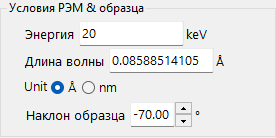

- **Energy** : ускоряющее напряжение падающего пучка (keV).
- **Wavelength** : длина волны электрона, связана с Energy. **Unit** выбирает Å или nm.
- **Наклон образца** : угол наклона образца (обычно −70°). Большой наклон в EBSD увеличивает выход обратно рассеянных электронов.

### Геометрия EBSD

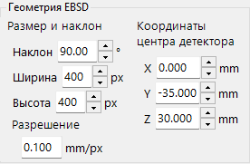

Детектор (люминофорный экран) — прямоугольник, задаваемый числом пикселей и размером пикселя.

- **Размер и наклон** : **Tilt** — наклон плоскости детектора (°); **Width** и **Height** — число пикселей детектора.
- **Разрешение** : физический размер одного пикселя детектора (mm/px). Физический размер детектора, таким образом, равен Width × Разрешение на Height × Разрешение.
- **Координаты центра детектора** : положение **X**, **Y**, **Z** центра детектора относительно точки попадания пучка (mm). Y и Z вместе с наклоном определяют длину камеры; X — смещение влево-вправо.

При загрузке экспериментального изображения **Width** и **Height** устанавливаются равными размеру изображения, так что один пиксель детектора соответствует одному пикселю изображения (**Разрешение** не меняется).

Геометрию можно осмотреть в 3D-виде на вкладке **Геометрия**.

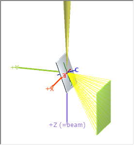

Серая пластина — образец, зелёная прямоугольная пластина — детектор, а фиолетовый **+Z (=beam)** — падающий пучок. Также показаны кристаллографические оси **a / b / c** (жёстко связанные с образцом). Кнопки **Перспективный вид**, **Нормаль к поверхности**, **Ось X (ось вращения)** и **Ось Z (пучок)** привязывают вид к стандартным направлениям. См. [Приложение A1. Системы координат](appendix/a1-coordinate-system/2-diffraction.md) для определений систем координат.

---

## Распределение BSE

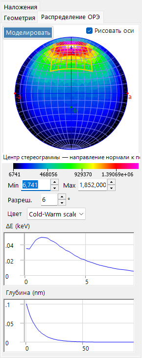

Вкладка **Распределение ОРЭ** показывает Монте-Карло-распределения обратно рассеянных электронов. Используйте **Моделировать** для их пересчёта.

- **Stereonet** : угловое распределение (гистограмма направлений выхода) обратно рассеянных электронов. Центр — направление нормали к поверхности, а жёлтый контур отмечает прямоугольную область, охватываемую детектором. **Рисовать оси** накладывает кристаллографические оси, а цветовая шкала (**Min** / **Max**, **Resolution**, **Цвет**) настраивается.
- **ΔE (keV)** : распределение потери энергии обратно рассеянных электронов.
- **Глубина (nm)** : распределение глубины, на которой зарегистрированные обратно рассеянные электроны испытали последнее неупругое рассеяние, — то же определение глубины, что и при взвешивании master pattern.

Эти распределения вычисляются тем же Монте-Карло-движком, что и в разделе [Траектории электронов](8-electron-trajectory.md), и используются для взвешивания master pattern.

---

## Наложения

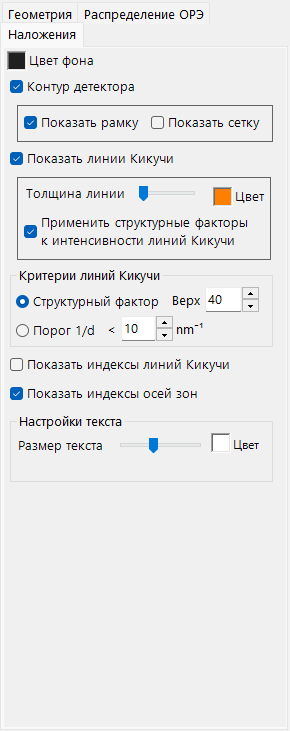

Вкладка **Наложения** настраивает подписи, отрисовываемые на картине EBSD.

- **Цвет фона** : цвет фона.
- **Контур детектора** : контур детектора. **Показать рамку** (жёлтый прямоугольник по краю детектора) / **Показать сетку** (сетка разбиения).
- **Показать линии Кикучи** : отрисовка линий Кикучи. **Толщина линии** / **Цвет**, а также **Применить структурные факторы к интенсивности линий Кикучи** (каждая линия сливается с фоном пропорционально своему структурному фактору).
- **Критерии линий Кикучи** : какие линии Кикучи отрисовывать: **Структурный фактор** (**Top** *N* по структурному фактору) или **Порог 1/d** (те, у которых 1/d ниже порога, nm⁻¹).
- **Показать индексы линий Кикучи** : показать индексы линий Кикучи (полос).
- **Показать индексы осей зон** : показать индексы осей зон.
- **Настройки текста** : **Размер текста** / **Цвет** подписей индексов.

---

## Мастер-картина

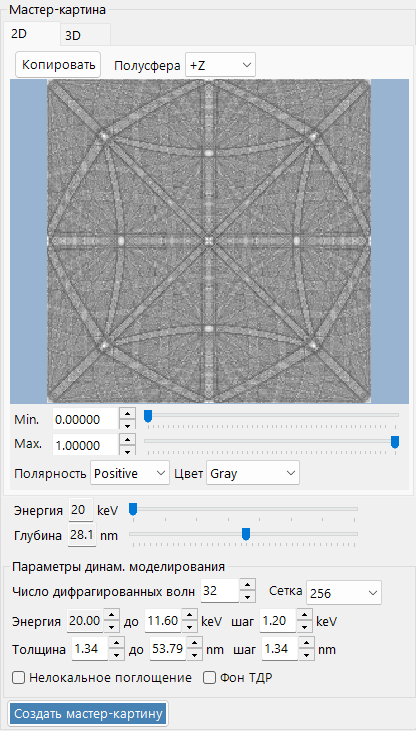

Master pattern — это интенсивность обратнорассеянной дифракции по всем направлениям, рассчитанная заранее по динамической теории с помощью **Создать мастер-картину** (**Стоп** прерывает текущий расчёт).

- Вкладка **2D** : равновеликая (Ламберта) проекция полусферы. **Полусфера** выбирает проецируемую полусферу (+Z / −Z).
- Вкладка **3D** : сфера с отображённой на ней интенсивностью. Её можно вращать мышью, а вставка в левом верхнем углу показывает синхронизированные кристаллографические оси (a/b/c). **Подписи осей** / **Стрелки осей** переключают подписи/стрелки, а **Вид вдоль** смотрит вдоль оси зоны [u v w], введённой рядом.
- Ползунки **Energy / Depth** : выбор энергетического/глубинного среза для предпросмотра.
- Любой вид можно отправить в буфер обмена с помощью **Копировать**.
- **Сохранить видео** (вкладка **3D**) : сохраняет видео (MP4) вращающегося сферического master pattern. Направление вращения, скорость, длительность, fps и качество задаются в том же диалоге «Movie setting», что и в окне [Просмотр структуры](5-structure-viewer.md). Вращается только этот 3D-вид; ориентация кристалла (углы Эйлера в главном окне) не изменяется.

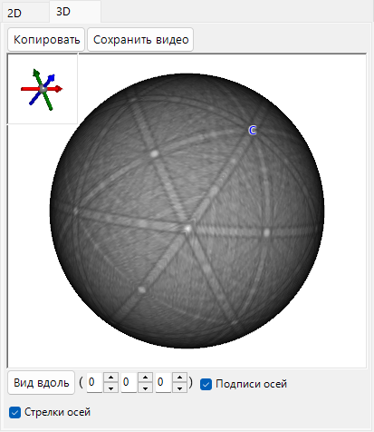

### Параметры динам. моделирования

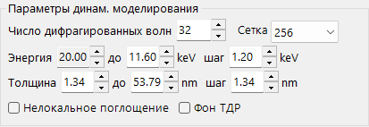

- **Число дифрагированных волн** : число дифрагированных пучков (волн), включённых в расчёт блоховских волн. Больше волн — точнее, но медленнее.
- **Сетка** : разрешение сетки master pattern (пикселей на сторону, 64–8192; по умолчанию 256). Значения 4096 и 8192 требуют огромного объёма памяти для промежуточных данных (при заданных по умолчанию 16 энергиях × 40 глубинах — около 344 ГБ для 4096 и 1374 ГБ для 8192; уже около 86 ГБ для 2048), поэтому число шагов по энергии и глубине необходимо резко уменьшить, чтобы ими можно было пользоваться. Если памяти не хватает, расчёт завершается сообщением «MasterPattern failed» (сам ReciPro продолжает работать).
- **Energy from … to … with step of …** : интегрируемый энергетический диапазон и шаг (keV); устанавливается автоматически из результата Монте-Карло.
- **Thickness from … to … with step of …** : интегрируемый глубинный диапазон и шаг (nm); также устанавливается автоматически.
- **Нелокальное поглощение** : использовать нелокальную форму поглощения.
- **Нелокальный источник** : заменяет источник обратного рассеяния, локализованный на атомных позициях, нелокальной формой поглощающего потенциала (U'_back, проинтегрированный по задней полусфере). Обе формы используют одно и то же физическое сечение: это смена модели, а не аддитивный фон.
- **Глубина источника (MC)** : какое событие Монте-Карло задаёт глубину когерентного источника обратного рассеяния для взвешивания по (энергия × глубина): последнее неупругое событие (по умолчанию), последнее транспортное событие любого типа или последняя потеря когерентности. В последнем случае событие сбрасывает источник, только если оно локализовано настолько, что оставляет в образце информацию о том, какой атом рассеял: упругие — с вероятностью теплового диффузного рассеяния 1 − exp(−2B s²) из фактора Дебая–Валлера (когерентное брэгговское рассеяние — нет), неупругие — всегда для остовных и высокопотерьных возбуждений, а для валентных только в той доле, где передача импульса превышает плазмонное отсечение q_c = ω_p/v_F (плазмоны и делокализованные электрон-дырочные пары сохраняют блоховское состояние). Более мелкий источник несёт более слабую модуляцию Кикучи, поэтому последний вариант задаёт диффузный фон одним переносом, без свободного параметра. Переключение лишь заново группирует сохранённые электроны, не повторяя расчёт Монте-Карло.
- **Аморфный поверхностный слой** : толщина (нм) некристаллического поверхностного слоя (естественный оксид, загрязнение, повреждения от полировки или ионного травления). Электроны, чей когерентный источник обратного рассеяния лежит внутри слоя, не несут модуляции Кикучи и добавляются как усреднённый по направлениям однородный вклад с той же интенсивностью на электрон; источники ниже слоя отсчитываются от поверхности кристалла. Перенос рассчитывается с составом и плотностью кристалла, чего достаточно для нескольких нм. 0 отключает; изменение лишь заново группирует сохранённые электроны, не повторяя расчёт Монте-Карло.
- **Возвращать поглощённый поток в фон** (по умолчанию выключено) : в расчёте блоховских волн электроны, выбывшие из когерентного канала из-за поглощения (теплового диффузного рассеяния), исчезают, хотя физически они достигают детектора без модуляции Кикучи. Эта опция возвращает их как диффузный фон D(t) = Σσ_n ∫(1 − N(z))dz (N(z) — усреднённая по ячейке плотность когерентной волны), сохраняя поток. Абсолютные интенсивности растут (при 20 кВ примерно на 10 % для Si и 25 % для Fe₃O₄); относительная яркость осей зон меняется мало и зависит от кристалла, поскольку возвращённый поток по-прежнему относится к тому же направлению выхода. Не действует при нулевых параметрах атомных смещений (без поглощения); задайте B таким кристаллам.

---

## Картина EBSD

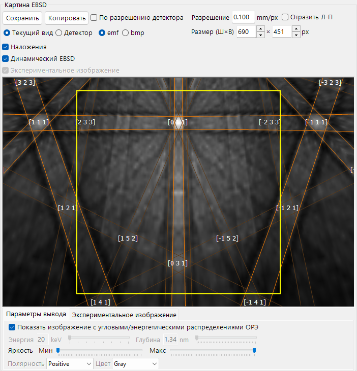

Центральная панель показывает картину EBSD (полос Кикучи) для текущей ориентации кристалла. Панель над картиной управляет тем, что отрисовывается и как выполняется копирование.

- **Динамический EBSD** : проецирует построенную мастер-картину на детектор; при снятом флажке остаётся только фон.
- **Наложения** : отрисовывает линии Кикучи, индексы и контур детектора, настроенные на вкладке **Наложения**.
- **Экспериментальное изображение** : накладывает загруженное экспериментальное изображение (см. ниже).
- **Отразить Л-П** : зеркально отражает картину и все наложения слева направо. При снятом флажке (по умолчанию) это вид со стороны детектора на образец, то есть картина такая, какой её записывает камера EBSD; устанавливайте флажок только если ваше экспериментальное изображение имеет противоположную хиральность.
- **Resolution** (mm/px) и **Size (W×H)** (px) : разрешение и размер отображаемого вида.
- **Сохранить** : сохраняет картину в файл в соответствии с выбранными рядом областью и разрешением. Формат (PNG / TIFF / EMF) выбирается в диалоге сохранения.
  - **Pattern values (\*.csv)** записывает вместо изображения исходные интенсивности на пиксельной сетке детектора.
  - TIFF записывается в 16-битных оттенках серого (без квантования до 256 уровней), когда выбрана область **Детектор**, **Динамический EBSD** отображается, а **Экспериментальное изображение** — нет. В этом случае **Наложения** не включаются независимо от их флажка, а значения пикселей — это картина, линейно отображённая из собственного диапазона минимум–максимум в 0–65535 (использованные минимум и максимум показываются в строке состояния; если нужны абсолютные значения, используйте экспорт csv).
- **Копировать** : копирует картину в буфер обмена в соответствии с выбранными рядом областью и форматом.
  - **Текущий вид** копирует область, отображаемую в данный момент (с текущими панорамированием и масштабом); **Детектор** копирует только область детектора, при этом жёлтая рамка не рисуется, так что изображение заканчивается точно на краю детектора.
  - **emf** копирует Enhanced Metafile, сохраняя линии Кикучи и подписи индексов векторными; **bmp** растеризует всё.
  - **По разрешению детектора** копирует из расчёта один пиксель изображения на пиксель детектора (длинная сторона ограничивается 4096 px). При снятом флажке используется экранное разрешение.

### Параметры вывода

- **Показать изображение с угловыми/энергетическими распределениями ОРЭ** : если флажок установлен, картина составляется путём взвешивания распределением BSE (энергия, глубина, направление), а не одним срезом.
- **Energy / Depth** : если предыдущая опция выключена, выбирает отображаемый энергетический/глубинный срез.
- **Яркость** (**Мин** / **Макс**), **Полярность**, **Цвет** : диапазон яркости, полярность и цветовая шкала.

### Экспериментальное изображение

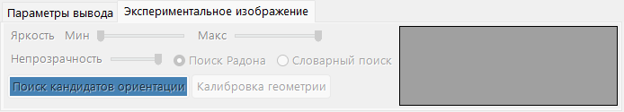

Перетащите файл изображения EBSD (TIFF, PNG, BMP или JPEG; 16-битные TIFF читаются с полной глубиной) в любое место окна, чтобы загрузить его как экспериментальную картину. Оно отрисовывается поверх области детектора — над смоделированной картиной и под наложениями линий Кикучи, — так что моделирование можно напрямую сравнивать с измерением. При загрузке **Width** и **Height** детектора также устанавливаются равными размеру изображения.

- **Яркость** (**Мин** / **Макс**) : точки чёрного и белого наложенного изображения, в долях его собственного диапазона интенсивности (логарифмические ползунки). Действуют только на экспериментальное изображение, но не на смоделированную картину.
- **Непрозрачность** : непрозрачность наложенного изображения, от 0 (невидимо) до 100 % (непрозрачно). Уменьшите её, чтобы увидеть смоделированную картину под ним.

Затем ориентация, объясняющая изображение, ищется одним из двух методов.

- **Поиск Радона** : сопоставляет кинематические шаблоны полос Кикучи с картой Радона (детектирование прямых) экспериментального изображения. Работает без master pattern; если она есть, кандидаты переранжируются по робастной ZNCC (нормированной взаимной корреляции с нулевым средним) относительно смоделированной картины.
- **Словарный поиск** : генерирует из динамической master pattern словарные картины для всех ориентаций и сравнивает их все по робастной ZNCC. Требует master pattern и занимает несколько секунд, но надёжнее поиска Радона.

**Поиск кандидатов ориентации** запускает выбранный метод и выводит до 10 кандидатов, начиная с лучшего; при наличии master pattern лучший кандидат уточняется до ±0,25°. Столбцы:

| Столбец | Значение |
|---------|----------|
| **#** | Ранг (0 — лучший) |
| **Score** | *z*-значение доказательности полос по Радону |
| **Bands** | Совпавшие полосы / предсказанные полосы в поле зрения |
| **ZNCC** | Корреляция со смоделированной картиной |
| **Strong bands (hkl)** | Индексы совпавших полос (только поиск Радона) |

**Щелчок по строке применяет эту ориентацию ко всей программе**: смоделированная картина перерисовывается поверх экспериментальной, а ориентация кристалла во всех остальных окнах следует за ней.

**Калибровка геометрии** уточняет геометрию детектора — центр картины (PC) и расстояние до детектора (DD) — попеременно с ориентацией, максимизируя ZNCC между смоделированной и экспериментальной картинами. Требует master pattern, сохраняет наклон детектора неизменным и записывает результат обратно в поля **Координаты центра детектора** X/Y/Z. Поскольку сканирование пучка в РЭМ смещает центр картины лишь на доли миллиметра, обычно достаточно одной калибровки в начале эксперимента на всю серию изображений.

---

## См. также

- [Траектории электронов](8-electron-trajectory.md) — Монте-Карло-моделирование траекторий электронов / BSE, используемое для углового/энергетического/глубинного взвешивания.
- [Симулятор дифракции](7-diffraction-simulator/index.md) — динамическая (блоховских волн) электронная дифракция.
- [Приложение A1. Системы координат](appendix/a1-coordinate-system/2-diffraction.md) — определения систем координат образца/детектора.
