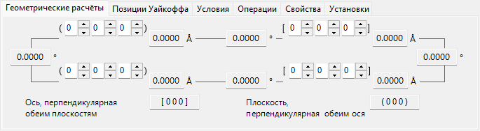
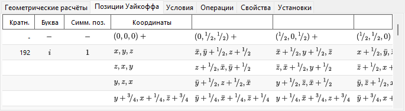
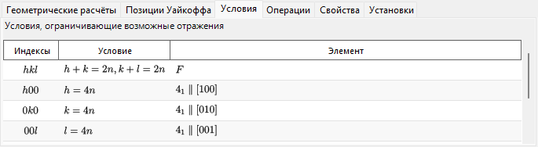
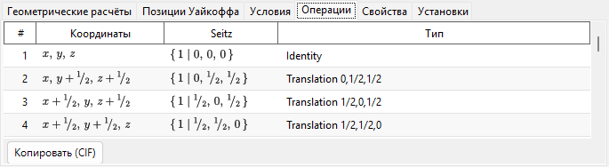
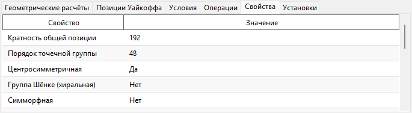
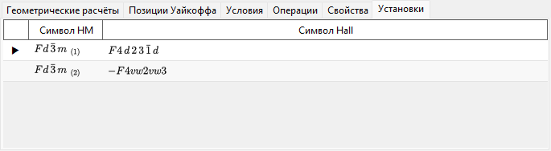

# Сведения о симметрии

**Сведения о симметрии** отображают подробную информацию о симметрии пространственной группы выбранного кристалла и, кроме того, строят схематические диаграммы элементов симметрии и общих положений в стиле *International Tables for Crystallography* Vol. A.

Окно разделено на область идентификации пространственной группы (вверху слева), область вычислений и таблиц с вкладками (вверху справа) и две схематические диаграммы (внизу).

!!! tip "Теория симметрии (Приложение A4)"
    Что на самом деле кодирует символ Германа–Могена/Hall/Шёнфлиса, теоретико-групповые классификации на вкладке **Свойства** (центросимметричность, группа Шёнке, симморфность, полярность, …), смысл расположенных внизу диаграмм элементов симметрии и общих положений, а также отношения группа–подгруппа, открываемые кнопкой **Групповые отношения…**, — всё это объясняется в **[Приложении A4. Симметрия и пространственные группы](appendix/a4-symmetry-space-groups/index.md)**.

---

## Сочетания клавиш и мыши

В этом окне нет особых сочетаний клавиш или мыши. <kbd>F1</kbd> открывает эту страницу руководства, а две кнопки **Копировать** помещают диаграмму элементов симметрии и диаграмму общих положений в буфер обмена (как векторный **emf** или растровый **bmp** — выбирается параметром **Формат копирования**).

→ Обзор всех окон см. в **[21. Сочетания клавиш и мыши](21-shortcuts.md)**.

---

## Идентификация пространственной группы

Панель вверху слева перечисляет для текущей пространственной группы:

- **Номер** (1–230) и индекс установки
- **Кристаллическая система**
- **Точечная группа** : символы Германа–Могена (HM) и Шёнфлиса (SF)
- **Пространственная группа** : краткий символ HM, полный символ HM, символ SF и **символ Hall**

---

## Геометрические расчёты

Введите две кристаллические плоскости \((h_1, k_1, l_1)\), \((h_2, k_2, l_2)\) или два индекса направления \([u_1, v_1, w_1]\), \([u_2, v_2, w_2]\), чтобы получить:

- межплоскостное расстояние каждой плоскости / длину каждой оси,
- угол между двумя плоскостями (или двумя осями),
- **индекс направления, нормального к обеим плоскостям** и **индекс плоскости, нормальной к обеим осям**.

Эти вычисления учитывают метрику текущей элементарной ячейки.

---

## Позиции Уайкоффа

Перечисляет каждую позицию Уайкоффа с её кратностью, буквой Уайкоффа, симметрией позиции и указанием, общее это положение или специальное. Для центрированных решёток векторы трансляций решётки показаны в строке заголовка.

---

## Условия

Условия отражения, возникающие из-за центрирования решётки и из-за операторов симметрии скользящего отражения и винтовых осей.

---

## Операции

Перечисляет каждую операцию симметрии общей позиции (трансляции центрирования решётки уже развёрнуты) в виде координатного триплета, символа Зейтца и словесного геометрического типа (например *«3-fold rotation»*, *«c-glide plane»*, *«screw axis»*). Кнопка **Копировать (CIF)** копирует весь список в буфер обмена как CIF-цикл `_space_group_symop_operation_xyz`.

→ О том, как читать эти три нотации, см. **[Приложение A4.1](appendix/a4-symmetry-space-groups/symbols-and-diagrams.md#операции-симметрии-вкладка-операции)**.

---

## Свойства

Сообщает теоретико-групповые классификации текущей пространственной группы (кратность общей позиции, порядок точечной группы, центросимметричность, группа Шёнке, симморфность, полярное направление, энантиоморфная пара, кристаллическое семейство / решёточная система / тип Браве, арифметический класс, симметрия Патерсона), а также какие макроскопические физические свойства (пиро-/сегнетоэлектричество, пьезоэлектричество, генерация второй гармоники, оптическая активность) разрешены этой симметрией.

→ Значение каждого термина см. в **[Приложении A4.1](appendix/a4-symmetry-space-groups/symbols-and-diagrams.md#теоретико-групповая-классификация-вкладка-свойства)**.

---

## Установки

Перечисляет для справки все табулированные варианты выбора начала координат и осей, разделяющие номер IT текущей пространственной группы, каждый со своим символом HM и символом Hall; текущая отображаемая установка отмечена. Выбор строки не изменяет кристалл.

---

## Диаграммы элементов симметрии и общих положений

Две панели внизу воспроизводят схематические диаграммы симметрии пространственной группы в обозначениях *International Tables for Crystallography* Vol. A.

- **Элементы симметрии (слева)**: поворотные/винтовые оси, зеркальные плоскости и плоскости скользящего отражения, а также центры инверсии/точки инверсионных поворотов изображаются общепринятыми графическими символами.
  - Для решётки \(F\) кубической системы показана только одна восьмая элементарной ячейки (только левый верхний квадрант).
  - Эти элементы симметрии можно также нанести непосредственно на 3D-модель в окне [Просмотр структуры](5-structure-viewer.md).
- **Общие положения (справа)**: общие эквивалентные положения изображаются кружками (запятая обозначает зеркальную копию) и подписываются их дробными координатами.
  - Только для кубической системы вспомогательные линии соединяют три кружка, связанных поворотной осью третьего порядка.

Элементы управления под диаграммами:

- **Направление** (`a` / `b` / `c`) : выбор кристаллической оси, вдоль которой выполняется проекция.
- **Копировать** : копирует каждую диаграмму в буфер обмена в формате, выбранном параметром **Формат копирования** (векторный **emf** / растровый **bmp**); emf можно разгруппировать и редактировать в PowerPoint.
- **Групповые отношения…** открывает браузер отношений максимальных подгрупп / минимальных надгрупп текущей пространственной группы. О том, как его читать, см. [Приложение A4.2](appendix/a4-symmetry-space-groups/group-subgroup-relations.md).

---

## См. также

- [База данных кристаллов](1-crystal-database.md)
- [Просмотр структуры](5-structure-viewer.md)
- [Стереосеть](6-stereonet.md)
- [Геометрия вращения](4-rotation-geometry.md)
- [Главное окно](0-main-window.md)
- [Приложение A4. Симметрия и пространственные группы](appendix/a4-symmetry-space-groups/index.md) — кристаллографические и теоретико-групповые основы каждой вкладки и каждой диаграммы этой страницы.
