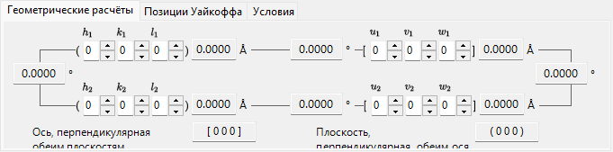
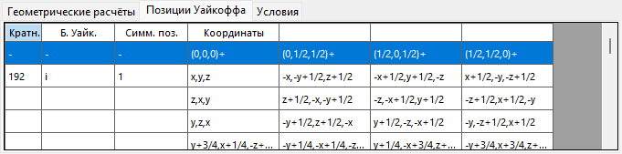
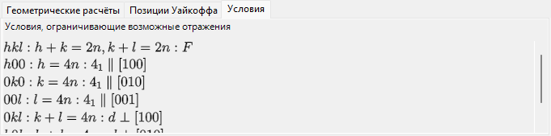
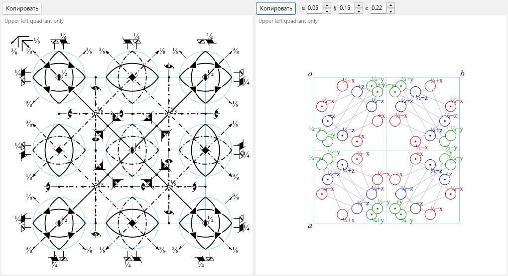

# Сведения о симметрии

**Сведения о симметрии** отображают подробную информацию о симметрии пространственной группы выбранного кристалла, а также строят схематические диаграммы элементов симметрии и общих положений в стиле *International Tables for Crystallography* Vol. A.

Окно разделено на область идентификации пространственной группы (вверху слева), область вычислений/таблиц с вкладками (вверху справа) и две схематические диаграммы (внизу).

---

## Сочетания клавиш и мыши

В этом окне нет особых сочетаний клавиш или мыши. <kbd>F1</kbd> открывает эту страницу руководства, а две кнопки **Copy** помещают диаграмму элементов симметрии и диаграмму общих положений в буфер обмена (как растровое изображение или как векторный EMF, если установлен флажок **EMF**).

→ См. **[21. Сочетания клавиш и мыши](21-shortcuts.md)** для обзора всех окон.

---

## Идентификация пространственной группы

Панель вверху слева перечисляет для текущей пространственной группы:

- **Number** (1–230) и индекс установки
- **Crystal System**
- **Point Group** : символы Германа–Могена (HM) и Шёнфлиса (SF)
- **Space Group** : краткий символ HM, полный символ HM, символ SF и **Hall symbol**

---

## Геометрические вычисления

Введите две кристаллические плоскости \((h_1, k_1, l_1)\), \((h_2, k_2, l_2)\) или два индекса направления \([u_1, v_1, w_1]\), \([u_2, v_2, w_2]\), чтобы получить:

- межплоскостное расстояние для каждой плоскости / длину каждой оси,
- угол между двумя плоскостями (или двумя осями),
- **индекс направления, нормального к обеим плоскостям** и **индекс плоскости, нормальной к обеим осям**.

Эти вычисления учитывают метрику текущей элементарной ячейки.

---

## Позиции Уайкоффа

Перечисляет каждую позицию Уайкоффа с её кратностью, буквой Уайкоффа, симметрией позиции и указанием, является ли она общим или специальным положением. Для центрированных решёток векторы трансляции решётки показаны в строке заголовка.

---

## Условия

Условия отражения, возникающие из-за центрирования решётки и из-за операторов симметрии плоскостей скользящего отражения и винтовых осей.

---

## Диаграммы элементов симметрии и общих положений

Две панели внизу воспроизводят схематические диаграммы симметрии пространственной группы в обозначениях *International Tables for Crystallography* Vol. A.

- **Элементы симметрии (слева)**: поворотные/винтовые оси, плоскости зеркального/скользящего отражения, а также центры инверсии/точки инверсионного поворота изображаются с помощью общепринятых графических символов.
  - Для решётки \(F\) кубической системы показана только одна восьмая часть элементарной ячейки (только верхний левый квадрант).
  - Эти элементы симметрии можно также нанести непосредственно на 3D-модель в окне [Просмотр структуры](5-structure-viewer.md).
- **Общие положения (справа)**: общие эквивалентные положения изображаются в виде кружков (запятая обозначает зеркальное отражение) и подписаны их дробными координатами.
  - Только для кубической системы вспомогательные линии соединяют три кружка, связанные осью поворота третьего порядка.

Элементы управления под диаграммами:

- **Direction** (`a` / `b` / `c`) : выберите кристаллическую ось, вдоль которой выполняется проекция.
- **Copy** каждую диаграмму в буфер обмена как векторное изображение (**EMF**) или растровое изображение (**BMP**); EMF можно разгруппировать и редактировать в PowerPoint.

---

## См. также

- [База данных кристаллов](1-crystal-database.md)
- [Просмотр структуры](5-structure-viewer.md)
- [Стереосеть](6-stereonet.md)
- [Геометрия вращения](4-rotation-geometry.md)
- [Главное окно](0-main-window.md)
