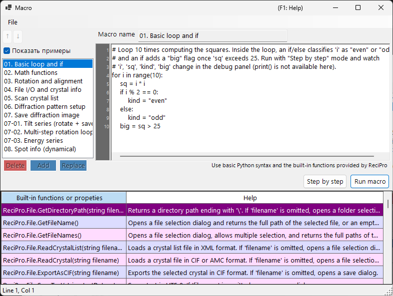

# Макрос

ReciPro включает систему макросов на основе **IronPython** для автоматизации операций с кристаллами, симуляций дифракции и симуляций изображений посредством сценариев.



На приведённом выше снимке экрана включён режим **Show samples**, отображающий встроенные образцы макросов. Список макросов находится слева, редактор кода — справа, а таблица справки по встроенным функциям — внизу.

---

## Сочетания клавиш и мыши

| Сочетание | Действие |
|----------|--------|
| <kbd>F1</kbd> | Открыть эту страницу онлайн-руководства |
| <kbd>CTRL</kbd>+<kbd>S</kbd> | Сохранить текст редактора обратно в выбранную запись списка макросов |
| <kbd>F10</kbd> | Перейти на один шаг вперёд (при пошаговом выполнении) |
| Двойной щелчок по строке в списке справки по функциям | Вставить сигнатуру этой функции в позиции каретки |
| Перетащить файл `.mcr` на окно | Загрузить его в редактор |

**Run**, **Step** и **Stop** — это кнопки (без клавиш-акселераторов).

→ См. **[21. Сочетания клавиш и мыши](../21-shortcuts.md)** для обзора всех окон сразу.

---

## Обзор

Макросы пишутся в синтаксисе Python. Используя встроенные классы и функции ReciPro, вы можете программно выполнять те же операции, которые доступны через графический интерфейс.

- **Язык**: Python 3 (IronPython 3.4)
- **Хранение**: Сжатый двоичный формат в реестре Windows (сохраняется между сеансами)
- **Доступ**: Нажмите кнопку Макрос в главном окне, чтобы открыть редактор макросов

---

## Окно редактора

Редактор макросов имеет четыре основные области:

| Область | Назначение |
|------|---------|
| **Список макросов** (слева) | Сохранённые макросы. `Add` добавляет новый макрос, `Replace` перезаписывает выбранный, `Delete` удаляет его. Up/Down изменяют порядок. |
| **Поле имени** (вверху) | Идентификатор редактируемого макроса. |
| **Область кода** (справа) | Редактор кода Python с полосой номеров строк, автоматическим отступом и всплывающей подсказкой по синтаксису. |
| **Таблица встроенных функций** (внизу) | Список встроенных функций/свойств, предоставляемых ReciPro, каждое с описанием справки. Справочник при написании кода. |
| **Строка состояния** (в самом низу) | Показывает текущую позицию каретки в виде `Line N, Col M`. |
| **Панель отладки** (видна при пошаговом выполнении) | Перечисляет локальные переменные в текущей строке. |

В строке заголовка отображается **`Macro*`** (со звёздочкой), пока есть несохранённые изменения, и она возвращается к **`Macro`** после Add / Replace / <kbd>CTRL</kbd>+<kbd>S</kbd>.

### Образцы макросов

При включении **Show samples** (вверху слева) ваш список макросов временно заменяется встроенными образцами макросов (простые циклы и условия, математические функции, поворот/выравнивание, обход списка кристаллов, симуляция дифракции/изображений, серии по наклону/энергии, сведения о рефлексах и многое другое). Образцы доступны только для чтения и отображаются на текущем языке интерфейса; используйте их для обучения или как отправную точку для копирования. При отключении восстанавливаются ваши собственные макросы.

---

## Возможности редактирования

- **Автоматический отступ**: При нажатии <kbd>ENTER</kbd> следующая строка наследует ведущие пробелы текущей строки. Если строка заканчивается на `:` (после `def`/`if`/`for`/и т. д.), автоматически добавляется один дополнительный уровень отступа (4 пробела).
- **Умный Backspace**: Внутри ведущих пробелов <kbd>BACKSPACE</kbd> удаляет целый уровень отступа (4 пробела) вместо одного символа.
- **<kbd>TAB</kbd> / <kbd>SHIFT</kbd>+<kbd>TAB</kbd>**:
  - Без выделения: вставить / удалить один уровень отступа в позиции каретки.
  - Многострочное выделение: увеличить / уменьшить отступ всех выделенных строк сразу.
- **Автодополнение**: По мере ввода всплывающее окно перечисляет подходящие имена функций и ключевые слова языка. Клавиши со стрелками для навигации, <kbd>ENTER</kbd> или <kbd>TAB</kbd> принимает, <kbd>ESC</kbd> отменяет.
- **Справка во всплывающей подсказке**: При наведении на выбранную запись автодополнения отображается её документация.

### Сочетания клавиш

| Сочетание | Действие |
|----------|--------|
| <kbd>CTRL</kbd>+<kbd>S</kbd> | Сохранить текущий код в выбранную запись макроса (на месте) |
| <kbd>F10</kbd> | Перейти к следующей строке (при пошаговом выполнении) |
| <kbd>ENTER</kbd> | Вставить новую строку с автоматическим отступом |
| <kbd>TAB</kbd> / <kbd>SHIFT</kbd>+<kbd>TAB</kbd> | Увеличить / уменьшить отступ |
| <kbd>BACKSPACE</kbd> | Удалить один уровень отступа, если внутри ведущих пробелов |
| <kbd>CTRL</kbd>+<kbd>↑</kbd> / <kbd>CTRL</kbd>+<kbd>↓</kbd> | Не применяется — используйте кнопки Up/Down для изменения порядка макросов |

---

## Выполнение макросов

Два режима выполнения:

- **Run macro**: Выполнить код до конца. При ошибках появляется диалог с трассировкой стека Python и подсвечивается проблемная строка в редакторе.
- **Step by step**: Приостановка перед каждой строкой. Панель отладки показывает локальные переменные. Используйте <kbd>F10</kbd> (или кнопку **Next step (F10)**) для продолжения либо **Stop** для прерывания.

**Stop** работает только в режиме пошагового выполнения (обычное выполнение Run macro нельзя прервать, поскольку IronPython не учитывает `CancellationToken` и всё выполняется в потоке пользовательского интерфейса).

---

## Поддержка языка Python

Эта среда макросов — **IronPython 3.4**. Не все возможности Python здесь имеют смысл.

### Предварительно импортировано

- **`math`** импортируется при запуске. Используйте `math.sqrt(x)`, `math.sin(x)`, `math.pi`, `math.radians(deg)` и т. д. напрямую.

### Доступно

- Управление потоком: `if`/`elif`/`else`, `for`, `while`, `def`, `class`, `return`, `try`/`except`/`finally`, `pass`, `break`, `continue`, `lambda`
- Литералы: `True`, `False`, `None`
- Встроенные функции: `len`, `range`, `abs`, `min`, `max`, `sum`, `sorted`, `enumerate`, `zip`, `int`, `float`, `str`, `list`, `dict`, `tuple`, `type`, `isinstance`
- Модули стандартной библиотеки на чистом Python: `random`, `datetime`, `time`, `re`, `json`, `itertools`, `functools`, `collections`

Эти основы предварительно зарегистрированы во всплывающем окне автодополнения, так что вы можете обнаружить их, введя первые несколько букв.

### НЕ доступно

- **`print()`** : нет окна консоли; вывод никуда не направляется. Используйте **Step by step** и смотрите панель отладки, чтобы проверить значения.
- **`input()`** : нет stdin.
- **Файловый ввод-вывод** (`open`, `with open`) : не предназначен для макросов. Используйте вместо него вспомогательные функции `ReciPro.File.*`.
- **Пакеты на C-расширениях**: `numpy`, `scipy`, `pandas`, `matplotlib` — не совместимы с IronPython.

---

## Доступ к API

API макросов ReciPro предоставляется под именем верхнего уровня **`ReciPro`**. Каждый встроенный класс является полем `ReciPro`:

```python
ReciPro.File.*         # File I/O helpers
ReciPro.Crystal.*      # Currently selected crystal
ReciPro.CrystalList.*  # Manage the crystal list
ReciPro.Dir.*          # Crystal orientation (Euler, zone-axis, rotation)
ReciPro.DifSim.*       # Diffraction simulator
ReciPro.HRTEM.*        # HRTEM simulation
ReciPro.STEM.*         # STEM simulation
ReciPro.Potential.*    # Potential simulation
ReciPro.Sleep(ms)      # Pause execution (milliseconds)
```

Всплывающее окно автодополнения всегда показывает полную форму `ReciPro.Class.Member` и вставляет её дословно, поэтому вам редко нужно набирать префикс вручную.

См. [20.1. Встроенные функции](1-built-in-functions.md) для полного справочника по API.

---

## Сообщения об ошибках

При сбое макроса диалог показывает трассировку стека Python в стандартном формате:

```
Traceback (most recent call last):
  File "<string>", line 5, in <module>
NameError: name 'abc' is not defined
```

Редактор автоматически выделяет строку, указанную в трассировке стека (самый внутренний кадр), так что вы можете сразу исправить проблему. Синтаксические ошибки также сообщаются с номерами строк до начала выполнения.

---

## См. также

- [20.1. Встроенные функции](1-built-in-functions.md)
- [20.2. Примеры](2-examples.md)
