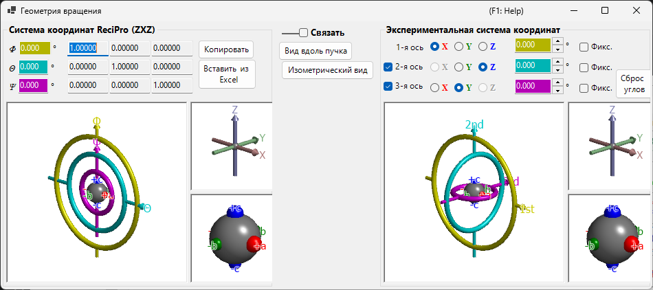

# Геометрия вращения

Это окно представляет состояние вращения кристалла в виде матрицы 3×3 и преобразует данные между различными эйлеровыми системами координат.

ReciPro использует три эйлеровых угла — **Ψ**, **θ** и **Φ**, — применяемых в порядке **Z–X–Z**. Однако это соглашение не обязательно совпадает с осями гониометра вашего реального прибора. Окно **Геометрия вращения** позволяет преобразовать эйлеровы углы ReciPro в произвольно заданную систему координат, помогая настраивать гониометр в лаборатории.

---

## Сочетания клавиш и мыши

Все шесть трёхмерных видов (панели ReciPro и экспериментального гониометра / осей / объектов) **связаны** — поворот любого из них поворачивает все шесть вместе. Они используют стандартную [навигацию по виду OpenGL](21-shortcuts.md) ReciPro.

| Сочетание | Действие |
|----------|--------|
| <kbd>F1</kbd> | Открыть эту страницу онлайн-руководства |
| Перетаскивание левой кнопкой в виде | Повернуть модель (все шесть видов поворачиваются вместе) |
| Колесо мыши или перетаскивание правой кнопкой вверх/вниз | Масштабирование (большие виды гониометра) |
| Перетаскивание средней кнопкой | Панорамирование (большие виды гониометра) |
| <kbd>CTRL</kbd> + перетаскивание правой кнопкой вверх/вниз | Изменить расстояние до камеры (только в перспективном режиме) |
| <kbd>CTRL</kbd> + двойной щелчок правой кнопкой | Переключить ортографическую / перспективную проекцию |

В малых видах *Axes* и *Objects* масштабирование и панорамирование отключены. Сочетаний клавиш, кроме <kbd>F1</kbd>, нет.

---

## Система координат ReciPro (ZXZ)

Верхняя половина окна показывает состояние вращения в «системе координат ReciPro».

- Значения **Φ, θ, Ψ** синхронизированы с эйлеровыми углами, заданными в Главном окне.
- **Rotation matrix** отображает матрицу 3×3, соответствующую текущему состоянию вращения.

### Φ, θ, Ψ (эйлеровы углы Z–X–Z)

Ориентация кристалла параметризуется тремя поворотами, применяемыми в следующем порядке:

1. **Φ** — первый поворот вокруг оси **Z**.
2. **θ** — поворот вокруг оси **X** однажды повёрнутой системы отсчёта.
3. **Ψ** — второй поворот вокруг оси **Z** дважды повёрнутой системы отсчёта.

Каждое числовое поле доступно для редактирования; изменение значения здесь обновляет Главное окно и все связанные симуляторы.

### Rotation matrix

Матрица 3 × 3, формируемая из текущих (Φ, θ, Ψ). Используйте **Copy to Excel** / **Paste from Excel**, чтобы передать матрицу в электронную таблицу и обратно.

### Окна OpenGL

Трёхмерный вид показывает текущее вращение с помощью трёх цветных торов (бубликов):

| Цвет | Эйлеров угол | Уровень гониометра |
|--------|------------|-----------------|
| **Жёлтый** | Φ | 1-я (верхняя) ось |
| **Голубой** | θ | 2-я (средняя) ось |
| **Розовый** | Ψ | 3-я (нижняя) ось |

Стрелки **красная**, **зелёная** и **синяя** представляют оси X, Y, Z в декартовых координатах реального пространства. Они *не* совпадают с осями кристалла, показанными в Главном окне.

Серая сфера в центре представляет образец; красная/зелёная/синяя сферы показывают, как объект повернулся из своей исходной ориентации (при Φ = θ = Ψ = 0 они совмещены с +X, +Y, +Z соответственно).

> **Примечание**: Перетаскивание в окне OpenGL изменяет только *направление проецирования* этого вида, но не саму ориентацию кристалла. Чтобы повернуть кристалл, используйте Главное окно.

### Кнопки

| Кнопка | Действие |
|--------|--------|
| Copy to Excel | Скопировать матрицу вращения 3×3 в формате с разделением табуляцией |
| Paste from Excel | Задать матрицу вращения из буфера обмена (3×3 с разделением табуляцией) |
| View along beam | Сопоставить с проекцией Главного окна (ось Z перпендикулярна экрану) |
| Isometric | Переключиться на изометрическую проекцию |

---

## Экспериментальная система координат

Нижняя половина задаёт эйлеровы углы на произвольном наборе осей вращения и считывает/устанавливает состояние гониометра. Это называется **Экспериментальной системой координат**.

### 1-я, 2-я, 3-я оси

Выберите оси вращения гониометра из **±X**, **±Y** и **±Z** для каждого уровня (верхнего, среднего, нижнего). Графика обновляется соответствующим образом.

Эйлеровы углы для каждой оси отображаются в соответствующих цветных текстовых полях (жёлтом, голубом, розовом). Значения также можно вводить напрямую.

---

## Link

Когда установлен флажок **Link**, система координат ReciPro и Экспериментальная система координат связаны: их эйлеровы углы корректируются так, чтобы ориентация объекта была согласована между двумя системами.

### Пример рабочего процесса

1. В лаборатории настройте гониометр так, чтобы ось *a* кристалла была совмещена с направлением падения рентгеновского излучения, а ось *b* располагалась горизонтально.
2. Введите эйлеровы углы лабораторного гониометра в Экспериментальной системе координат.
3. В Главном окне поверните кристалл так, чтобы ось *a* была направлена по нормали к экрану, а ось *b* — горизонтально.
4. Установите флажок **Link** — теперь всякий раз, когда вы направляете кристалл в другую ориентацию в Главном окне, автоматически отображаются необходимые углы гониометра.

---

## См. также

- [Главное окно](0-main-window.md)
- [Стереосеть](6-stereonet.md)
- [Базовая система координат и ориентация кристалла](appendix/a1-coordinate-system/1-orientation.md)
- [Сочетания клавиш и мыши](21-shortcuts.md)
