# Просмотр структуры

**Просмотр структуры** отображает структуру выбранного кристалла в виде трёхмерного изображения с помощью OpenGL.

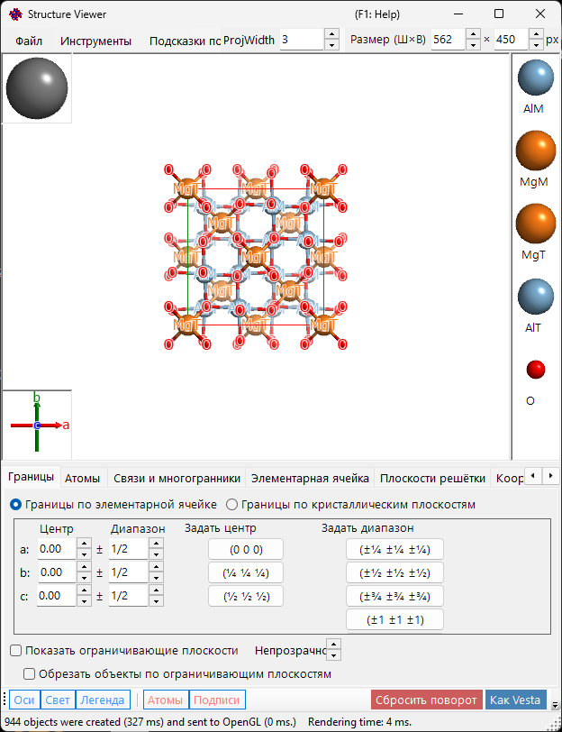

---

## Клавиатурные и мышиные сочетания

Окно содержит основную 3-D-область просмотра и два небольших гизмо — блок **осей кристалла** (внизу слева) и блок **направления света** (вверху слева), — и каждый из них по-своему реагирует на перетаскивание левой кнопкой. Основная область использует стандартную для ReciPro [навигацию по OpenGL-виду](21-shortcuts.md).

| Сочетание | Действие |
|----------|--------|
| <kbd>F1</kbd> | Открыть эту страницу онлайн-руководства |
| <kbd>CTRL</kbd>+<kbd>SHIFT</kbd>+<kbd>C</kbd> | Скопировать отрисованное изображение в буфер обмена |
| Перетаскивание левой кнопкой в основной области | Повернуть модель |
| Двойной щелчок левой кнопкой по атому | Показать его координаты, расстояния до ближайших соседей и валентные углы |
| Перетаскивание правой кнопкой вверх/вниз или колесо мыши | Масштабирование |
| Перетаскивание средней кнопкой | Панорамирование |
| <kbd>CTRL</kbd> + перетаскивание правой кнопкой вверх/вниз | Изменить расстояние до камеры (только в режиме перспективы) |
| <kbd>CTRL</kbd> + двойной щелчок правой кнопкой | Переключить ортографическую / перспективную проекцию |
| Перетаскивание левой кнопкой за гизмо **осей кристалла** | Повернуть модель (без поворота в плоскости) |
| Перетаскивание левой кнопкой за гизмо **света** | Изменить направление освещения |

Общеприложенческие сочетания <kbd>CTRL</kbd>+<kbd>SHIFT</kbd> из [главного окна](0-main-window.md#keyboard-mouse-shortcuts) также работают, пока это окно находится в фокусе.

→ См. **[21. Клавиатурные и мышиные сочетания](21-shortcuts.md)** для обзора всех окон сразу.

---

## Основная область

3D-структура кристалла с источником света, осями кристалла и легендой атомов.
> Поле **Size (W×H)** в правом верхнем углу окна задаёт размер в пикселях, используемый при сохранении или копировании отрисованного изображения.
> Соседнее поле **ProjWidth** показывает ширину проецируемого вида в nm. Изменяя это значение, можно задавать масштаб численно — поле синхронизировано с масштабированием вида (перетаскивание правой кнопкой / колесо мыши).

---

## Строка меню

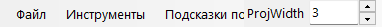

### Меню «Файл»

Сохранить изображение, скопировать в буфер обмена (Ctrl+Shift+C), сохранить видео (MP4).

**Save movie** открывает показанный ниже диалог настройки видео. Видео может вращать вид, перемещать центр проекции или делать и то и другое одновременно — установите флажки **Rotation** и/или **Translation**:

- **Rotation**: вращает вид со скоростью **Speed** (°/s; отрицательные значения обращают направление) вокруг оси, выбранной ниже — **Текущая проекция** (направление наклона задаётся кнопками со стрелками), **Индекс направления** [uvw] или нормаль к плоскости **Плоскость решётки** (hkl).
- **Translation**: перемещает центр проекции вдоль индекса направления [uvw] со скоростью **Speed** (периодов решётки в секунду). Этот параметр появляется, только когда диалог открыт из окна «Просмотр структуры», и, пока он включён, единственным доступным режимом направления остаётся **Индекс направления**.

Задайте длительность видео (**Duration**), частоту кадров (**FPS**, 1–120) и качество кодирования (**Quality**, 1–100; чем выше значение, тем выше битрейт и тем больше файл), выберите кодек (**H264** / **H265**) и нажмите **OK**, чтобы создать файл MP4. **Include final frame** добавляет в конец один дополнительный кадр при t = Duration, чтобы видео заканчивалось точно в конечной ориентации/позиции. (Список скорости кодирования теперь лишь подписывает индикатор прогресса и больше не влияет на само кодирование.)

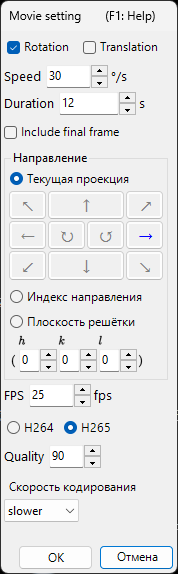

### Меню «Инструменты»

---

## Меню вкладок

### Границы, заданные ячейкой

Задаёт область отрисовки кристалла. Имеется два режима, переключаемых переключателями в верхней части.

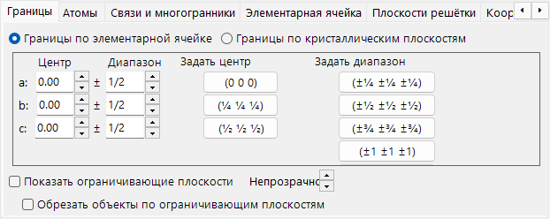

В этом режиме единицей области отрисовки служат оси *a*, *b*, *c* элементарной ячейки.

- **Center**: центральная дробная координата объёма отрисовки.
- **Range**: верхний/нижний предел для каждой из осей *a*, *b*, *c*.
- **Кнопки предустановок** справа задают часто используемые значения (например, ячейка 1×1×1, ячейка 2×2×2).

### Границы, заданные кристаллографическими плоскостями

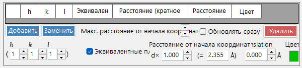

В этом режиме область отрисовки ограничивается набором кристаллографических плоскостей. Если плоскости не задают пространственно замкнутую область, ReciPro автоматически возвращается к границе из одной элементарной ячейки.

#### Список границ

Все ограничивающие плоскости, зарегистрированные для текущего кристалла. Используйте **Add / Replace / Delete** для работы со списком; крайний левый флажок временно отключает плоскость, не удаляя её.

> Чтобы сохранить изменения навсегда, нужно также нажать **Add** или **Replace** в **главном окне**. Иначе изменения будут потеряны при следующей смене выбора в основном списке кристаллов.

#### Индексы H k l

Задаёт ограничивающую плоскость по её индексу Миллера. Флажок включает кристаллографически эквивалентные плоскости, порождённые из выбранного (*hkl*).

#### Расстояние от начала координат

Расстояние от центра кристалла до ограничивающей плоскости. Единица выбирается между **d** и **Å**. При **d** расстояние — это введённое значение, умноженное на межплоскостное расстояние *d* выбранного (*hkl*). При **Å** значение — абсолютное расстояние. Изменение одного автоматически обновляет другое.

#### Показать ограничивающие плоскости / Непрозрачность

Показывает или скрывает сами ограничивающие плоскости. Когда они показаны, **Opacity** задаёт прозрачность (0 = прозрачно, 1 = непрозрачно).

#### Обрезать объекты ограничивающими плоскостями

Если флажок установлен, отрисовывается только внутренняя область, заданная границами; атомы, связи и многогранники, пересекающие границы, обрезаются.

#### Скрыть атомы

Если флажок установлен, все атомы, связи и многогранники скрываются — удобно, когда нужно показать только ячейку или плоскости решётки.

### Атомы

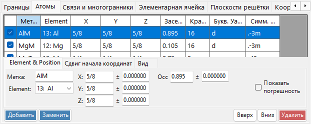

Координаты, элемент, заселённость, радиус, цвет, материал. **Apply to same elements**.

#### Список атомов

Список атомов в кристалле. Используйте **Add / Replace / Delete** для работы со списком; крайний левый флажок временно скрывает атом.

> Чтобы сохранить изменения навсегда, нажмите также **Add** или **Replace** в **главном окне**.

#### Элемент и положение

- **Label**: произвольная текстовая подпись атома (используется в легендах и подсказках).
- **Element**: химический элемент / степень ионизации.
- **X, Y, Z**: дробные координаты. Вещественные числа в диапазоне 0–1 либо дроби, такие как `1/2` или `2/3`.
- **Occ**: заселённость, вещественное число 0–1.

#### Сдвиг начала координат

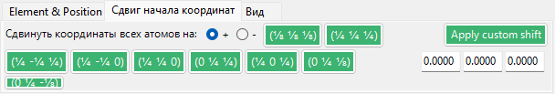

Сдвигает каждый атом на одинаковое дробное смещение. Нажмите кнопку предустановки (например, чтобы переключиться между выбором начала координат 1 / 2 для одной и той же пространственной группы) или введите пользовательский (Δx, Δy, Δz) и нажмите **Apply custom shift**.

#### Вид

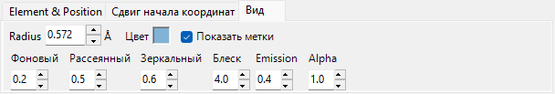

Радиус, цвет и материал каждого атома.

- **Radius**: отрисовываемый атомный радиус.
- **Atom color**: цвет поверхности.
- **Material**: свойства текстуры / материала, используемые OpenGL-шейдером.
- **Apply to same elements**: применяет текущий радиус и цвет ко всем атомам того же химического элемента.

### Связи и многогранники

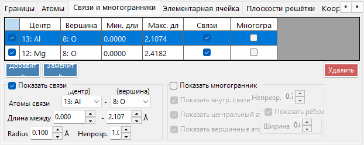

Пороги длины связей, отображение многогранников, рёбра.

#### Список связей

Все правила связей/многогранников, зарегистрированные для кристалла. Используйте **Add / Replace / Delete**; крайний левый флажок временно отключает запись. Как и для атомов и границ, для постоянного сохранения изменения требуется **Add** / **Replace** в **главном окне**.

#### Свойства связи

- **Bonding Atom (center)**: химический элемент, используемый как центральный атом связи / многогранника.
- **Bonding Atom (vertex)**: химический элемент, используемый как вершина (другой конец).
- **Length between … and …**: нижний и верхний пороги расстояния. Пары атомов вне этого диапазона не отрисовываются.
- **Bond Radius**: отрисовываемая толщина связи (радиус цилиндра).
- **Alpha**: прозрачность связи (0 = прозрачно, 1 = непрозрачно).

#### Свойства многогранника

- **Show Polyhedron**: если флажок установлен, отрисовывается многогранник, заданный текущей связью (только если набор центр/вершины геометрически допустим).
- **Inner Bonds**: показать/скрыть связи внутри многогранника.
- **Center Atom**: показать/скрыть центральный атом.
- **Vertex Atoms**: показать/скрыть вершинные атомы.
- **Color** / **Alpha**: цвет грани и прозрачность.
- **Show Edge**: отрисовывать рёбра, соединяющие вершины.
- **Edge Color** / **Width**: цвет и толщина линии рёбер.

### Элементарная ячейка

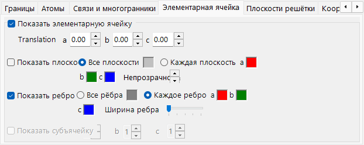

Трансляция, плоскости ячейки, рёбра.

#### Трансляция

Каждая пространственная группа имеет начало координат по умолчанию. Чтобы сместить центр отрисованной элементарной ячейки от этого начала координат, задайте трансляцию вдоль *a*, *b*, *c*.

#### Показать плоскость ячейки

Отрисовывать ли шесть граней, ограничивающих элементарную ячейку. Когда включено, можно задать цвет грани и прозрачность.

#### Показать рёбра

Отрисовывать ли рёбра элементарной ячейки. Цвет рёбер настраивается.

### Плоскости решётки

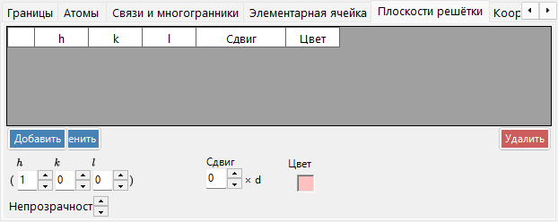

Задание индекса Миллера с кристаллографическими эквивалентами.

#### Индексы H k l

Задаёт плоскость решётки по её индексу Миллера. Флажок при необходимости включает кристаллографически эквивалентные плоскости, порождённые из (*hkl*).

#### Трансляция

Сдвигает отрисованную плоскость решётки на целое число межплоскостных расстояний *d* — полезно для визуализации последовательных плоскостей одного семейства.

### Координация

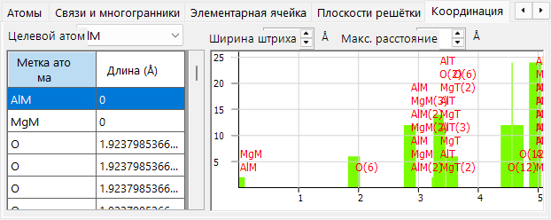

Таблица координации и график вокруг целевого атома.

#### Таблица (слева)

Перечисляет, какие атомы окружают выбранный целевой атом и на каком расстоянии. Целевой атом выбирается из выпадающего списка над таблицей.

#### График (справа)

Гистограмма числа соседей в зависимости от расстояния, построенная по тем же данным, что и таблица. Подберите **Bar width** так, чтобы столбцы чётко разделяли координационные сферы — это даёт визуальную оценку координационного числа.

### Информация

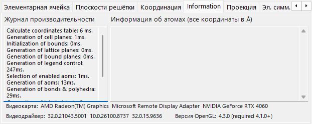

Журнал отрисовки (время кадра, сведения о GPU) и базовая информация о выбранном атоме. В разработке — со временем поля могут расширяться.

### Проекция

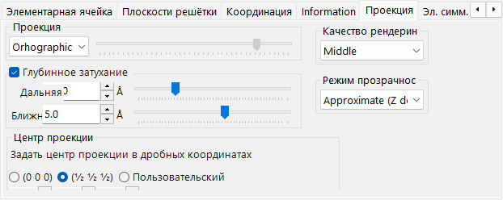

Режим проекции (ортографическая/перспективная), затухание по глубине, качество отрисовки, режим прозрачности.

#### Проекция

- **Orthographic**: идеальная параллельная проекция (точка наблюдения в бесконечности).
- **Perspective**: перспективная проекция с расстояния наблюдения, заданного ползунком.

#### Затухание по глубине

Постепенно скрывает удалённые объекты в направлении глубины. Объекты дальше **Far** полностью прозрачны; объекты ближе **Near** полностью непрозрачны; промежуточные объекты интерполируются линейно.

#### Центр проекции

Устанавливает центр проекции в указанные координаты. Включите **Пользовательский**, чтобы ввести произвольные координаты. Каждая координата приводится к диапазону от −0.5 до +0.5 (один период решётки). Видео с **Translation** (см. [меню «Файл»](#меню-файл)) автоматически управляет этими значениями.

#### Качество отрисовки

Качество отрисовки (разбиение сетки, сглаживание). Более высокое качество медленнее — выберите настройку, соответствующую вашему GPU.

#### Режим прозрачности

Алгоритм, используемый для полупрозрачных атомов и многогранников.

- **Approximate**: быстрый, но может быть неточным, когда перекрывается много полупрозрачных объектов.
- **Perfect**: независимая от порядка прозрачность — точная, но очень медленная, фактически требует дискретного GPU.

### Элементы симметрии

Вкладка **Symmetry Elements** отрисовывает операторы симметрии пространственной группы прямо на 3D-модели (переключается кнопкой панели инструментов **Symmetry Elements**). Каждый класс элементов можно показывать/скрывать независимо:

- **Оси вращения** и **винтовые оси**
- **Плоскости зеркального отражения** и **плоскости скользящего отражения**
- **Центры инверсии** и **инверсионные оси**

Для каждого класса можно настроить размер символа, толщину линии и цвет.

### Прочее

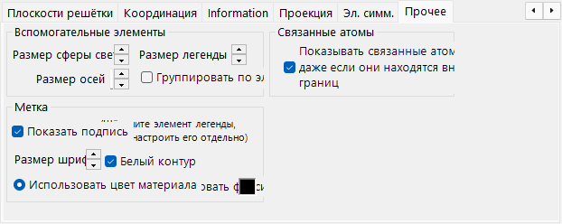

- **Accessory controls**: задаёт размеры отображения (шар света, оси, легенда). **Group by element** переключает отображение легенды.
- **Bonded atoms**: **Show bonded atoms even if they are outside the boundaries** продолжает отрисовывать атомы, связанные с атомами внутри области отрисовки, даже когда они оказываются за её пределами.
- **Label**: задаёт размер шрифта, цвет и другие свойства подписей атомов.

---

## Панель инструментов

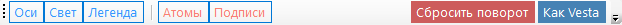

| Кнопка | Описание |
|--------|-------------|
| Axes | Показать ориентацию осей (размер = постоянная решётки) |
| Light | Задать направление света |
| Legend | Легенда атомов |
| Atoms | Переключить объекты-атомы |
| Labels | Переключить подписи атомов |
| Unit Cell | Переключить рёбра элементарной ячейки |
| Sym. Elems. | Переключить наложение элементов симметрии (см. выше) |
| Reset Rotation | Вернуться к исходной ориентации |
| Like Vesta | Внешний вид в стиле Vesta |

---

## См. также

- [Главное окно](0-main-window.md)
- [База данных кристаллов](1-crystal-database.md)
- [Сведения о симметрии](2-symmetry-information.md)
- [Симулятор дифракции](7-diffraction-simulator/index.md)
- [Клавиатурные и мышиные сочетания](21-shortcuts.md)
