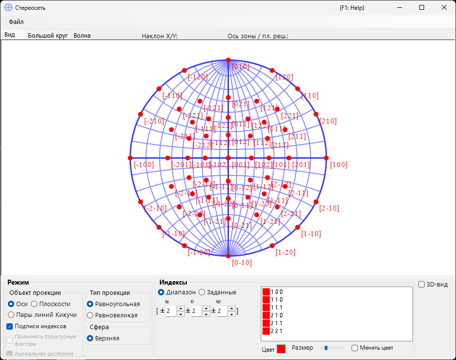
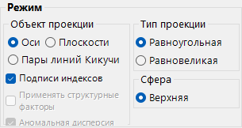
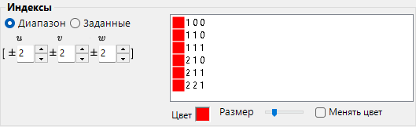
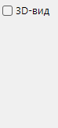
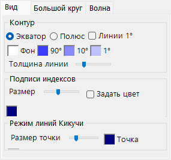
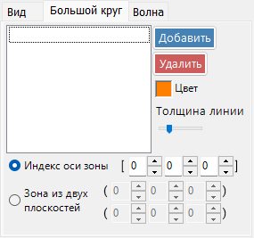
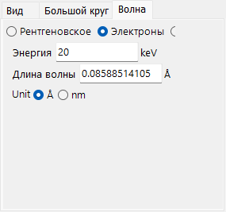

# Стереосеть

**Стереосеть** отображает направления кристаллических плоскостей и осей с помощью стереографической проекции.

---

## Сочетания клавиш и мыши

Сама стереосеть представляет собой 2-D-проекцию; при необходимости можно отобразить 3-D-сферу с помощью **3D display**.

| Сочетание | Действие |
|----------|--------|
| <kbd>F1</kbd> | Открыть эту страницу онлайн-руководства |
| Перетаскивание левой кнопкой вблизи центра | Наклонить кристалл |
| Перетаскивание левой кнопкой во внешней области | Вращать кристалл вокруг оси обзора |
| Двойной щелчок левой кнопкой | Переключение между проекцией **Plane** и **Axis** |
| Щелчок правой кнопкой | Уменьшить масштаб |
| Перетаскивание рамки правой кнопкой | Увеличить масштаб выбранной области |
| Перетаскивание средней кнопкой | Панорамирование |
| Перемещение мыши (без нажатой кнопки) | Считать (hkl)/[uvw] под курсором — удобно для индицирования измеренного рефлекса |

Перетаскивание по сети вращает **кристалл**; состояние поворота является общим для всех окон.

3-D-визуализация использует стандартную [навигацию по виду OpenGL](21-shortcuts.md) ReciPro (перетаскивание левой кнопкой — поворот, перетаскивание правой кнопкой / колесо — масштабирование, <kbd>CTRL</kbd> + двойной щелчок правой кнопкой переключает проекцию) и вращает только 3-D-вид, а не сам кристалл.

Общеприложенческие сочетания <kbd>CTRL</kbd>+<kbd>SHIFT</kbd> из [главного окна](0-main-window.md#keyboard-mouse-shortcuts) также работают, когда это окно находится в фокусе.

→ См. **[21. Сочетания клавиш и мыши](21-shortcuts.md)** для обзора всех окон сразу.

---

## Главная область

Здесь отображается стереосетевая проекция кристаллических плоскостей, индексов направления и линий Кикучи выбранного кристалла.

---

## Меню «Файл»

Сохранение или копирование в растровом или векторном формате. Векторный формат позволяет редактировать шрифт/толщину линий в PowerPoint или других векторных редакторах.

---

## Mode

### Цель проекции

Выберите, что проецировать на сеть.

- **Axes** — проецирует индексы направления \([uvw]\).
- **Planes** — проецирует нормали кристаллических плоскостей \((hkl)\).
- **Kikuchi line pairs** — проецирует пары линий Кикучи.

### Метод проекции

| Метод | Описание |
|--------|-------------|
| **Wulff** (равноугольная / стереографическая) | Сохраняет угловое соотношение между проецируемыми элементами, но не телесный угол. Используется классическими кристаллографами при считывании углов между осями или плоскостями. |
| **Schmidt** (равновеликая / Ламберта) | Сохраняет телесный угол (площадь) каждой области, но искажает углы. Предпочтительна для статистических полюсных фигур, где важна относительная плотность. |

### Полусфера

Выберите **Upper** или **Lower** полусферу в качестве источника проекции — это переключает, является ли видимая сторона сферы той, что ближе к наблюдателю, или той, что дальше от него.

### Параметры отображения

- Показать подписи индексов.
- Когда выбрано **Planes** или **Kikuchi line pairs**, каждая точка или линия взвешивается по структурному фактору \(|F_{hkl}|\) (задайте источник волны и длину волны на [вкладке Wave](#wave)).

> Для тригональных/гексагональных кристаллов нотацию Миллера–Браве (4-индексную) можно включить через **Option ▸ Use Miller-Bravais (hkil) index** в главном окне.

---

## Indices

Задаёт, какие кристаллические плоскости / оси отображаются.

### Режим диапазона

Укажите диапазон индексов \([uvw]\) или \((hkl)\). ReciPro перебирает каждый индекс в пределах заданных границ и проецирует каждый из них.

### Заданный режим

Задаёт отдельные оси или плоскости по отдельности. Введите индекс, нажмите **Add**, чтобы зарегистрировать его, или **Remove**, чтобы удалить. Когда установлен флажок **include equivalent indices**, отображаются также все кристаллографически эквивалентные индексы.

### Colour / Size

Задайте **colour** и **size** наносимых точек. Установите флажок **Change colour automatically**, чтобы кодировать цветом каждый набор эквивалентных осей/плоскостей по-разному — удобно для различения семейств на многоиндексной диаграмме.

---

## 3D Options

Управляет наложением 3D-сети (сферы) — непрозрачностью сферы, индикаторами осей и т. д.

---

## Меню вкладок

### Appearance

#### Outline

Как отрисовывается контур стереосети — ограничивающая окружность и необязательная сетка больших кругов по широте/долготе. Выберите **Equator** или **Pole**, переключите **1° Lines** и заливку **Background**, задайте цвета сетки **90° / 10° / 1°** и настройте **Line width** с помощью ползунка.

#### Index labels

- **Size** — размер подписей индексов.
- **Specify color** — использовать единый фиксированный цвет для всех подписей индексов вместо цвета каждой точки; удобно, когда точки закодированы цветом, но вы хотите, чтобы все подписи были одного цвета для удобочитаемости.
- **Delimiter** — символ, помещаемый между индексами в каждой подписи: **None** (например, 100), **Space** (1 0 0) или **Comma** (1,0,0).

#### Kikuchi line mode

- **Point size** — размер наносимых точек.
- **Point** / **Label** — цвета точек и их подписей.

### Great and Small Circle

Рисование больших и малых кругов. Задайте их либо по **zone-axis index** \([uvw]\) (большой круг, образованный зоной этой оси), либо по **two crystal-plane indices**, которые имеют общую ось зоны. Толщина линий кругов также настраивается с помощью ползунка.

### Wave {#wave}

Доступно только когда в качестве цели проекции выбрано **Planes** или **Kikuchi line pairs**. Задаёт источник волны (X-ray / electron / neutron), а также длину волны или энергию, необходимые для вычисления структурных факторов кристалла, используемых для параметра **structure-factor weighting** в разделе [Mode](#mode).

---

## См. также

- [Главное окно](0-main-window.md)
- [Геометрия вращения](4-rotation-geometry.md)
- [Просмотр структуры](5-structure-viewer.md)
- [Симулятор дифракции](7-diffraction-simulator/index.md)
- [Базовая система координат и ориентация кристалла](appendix/a1-coordinate-system/1-orientation.md)
