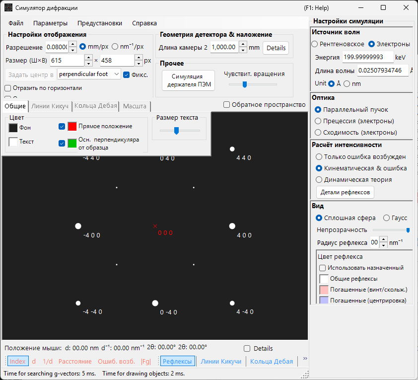
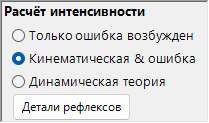

# Моделирование SAED (Selected Area Electron Diffraction)

**Моделирование SAED (Selected Area Electron Diffraction)** рассчитывает картины электронной дифракции монокристалла, создаваемые параллельным электронным пучком. Это режим по умолчанию [симулятора дифракции](index.md).

> На этой странице перечислены все настройки, появляющиеся в панели **Spot property** справа, когда вы выбираете **Wave Length = Electron** и **Incident beam mode = Parallel**. Операции в масштабе всего окна, такие как рисование и сохранение, описаны на [обзорной странице](index.md).

Условия GUI: Wave Length = Electron, Incident beam mode = Parallel, Intensity calculation = Only excitation error / Kinematical / Dynamical.

---

## Обзор

Моделирует картину дифракции, возникающую при прохождении параллельного электронного пучка через тонкий образец. Положения рефлексов задаются геометрическим соотношением между сферой Эвальда и узлами обратной решётки, а яркость каждого рефлекса вычисляется в соответствии с выбранным режимом расчёта интенсивности.

---

## Wave Length

Установите источник излучения на **Electron**. Введите энергию (keV) или длину волны (nm), и будет вычислена релятивистски скорректированная длина волны. Для рентгеновских и нейтронных источников см. [Моделирование рентгеновской дифракции](4-x-ray-neutron-diffraction.md).

---

## Incident beam mode

Установите геометрию падающего пучка на **Parallel**. Это стандартная геометрия плоской волны, используемая для SAED и рентгеновской дифракции.

> **Примечание**: Для электронов можно выбрать **Parallel / Precession (electron = PED) / Convergence (CBED)**. Выбор **Precession** даёт [моделирование PED](2-ped-simulation.md), а выбор **Convergence** даёт [моделирование CBED](3-cbed-simulation.md); в обоих случаях расчёт интенсивности автоматически переключается на Dynamical.

---

## Intensity calculation

Определяет, как вычисляются интенсивности рефлексов.

### Только ошибка возбуждения

Интенсивность определяется исключительно по геометрическому расстоянию между сферой Эвальда и узлом обратной решётки (ошибке возбуждения $s_g$). Чем меньше $\lvert s_g \rvert$, тем выше интенсивность; она достигает максимума при значении, заданном через **Radius**, и падает до нуля, когда $\lvert s_g \rvert$ превышает Radius. Поскольку структурный фактор кристалла игнорируется, это самый быстрый режим, подходящий для проверки положений дифракционных рефлексов.

### Кинематическая

В дополнение к ошибке возбуждения в интенсивность включается кинематический структурный фактор $\lvert F_{hkl} \rvert^2$. Правила погасания воспроизводятся корректно, что делает этот режим подходящим для тонких образцов или слабой дифракции.

### Динамическая (метод блоховских волн, только электрон)

Строгий динамический расчёт методом блоховских волн (метод Бете). Он воспроизводит многократное рассеяние и зависящее от толщины изменение интенсивности и необходим для толстых образцов или сильной дифракции. Доступен только при выборе Electron. По теории см. [Приложение A3. Метод блоховских волн](../appendix/a3-bloch-wave/calculation.md).

> **Примечание**: При выборе **Dynamical** ниже появляется панель **Bloch wave settings**.

---

## Bloch wave settings (динамическая теория)

Активна только при **Intensity calculation = Dynamical**.

| Параметр | Описание |
|-----------|-------------|
| **Number of diffracted waves** | Число блоховских волн, учитываемых в задаче на собственные значения. Бо́льшие значения дают более точные интенсивности, но увеличивают время вычислений как $O(N^3)$ |
| **Thickness** | Толщина образца (nm), используемая в динамическом расчёте |

---

## Spot appearance

Управляет тем, как отображается каждый дифракционный рефлекс.

- **Solid sphere / Gaussian** : геометрическая модель узла обратной решётки. **Solid sphere** рисует сечение (окружность) между сферой радиуса $R$ и сферой Эвальда, при этом площадь окружности соответствует интенсивности дифракции; **Gaussian** рисует сечение (2-мерную гауссиану) 3-мерной гауссианы с $\sigma = R$, интеграл которой соответствует интенсивности дифракции.
- **Opacity** : прозрачность рефлекса (0 = прозрачный, 1 = непрозрачный).
- **Radius (R)** : виртуальный радиус узла обратной решётки. Размер рефлекса задаётся сочетанием режима **Appearance** и **Intensity calculation** (например, Solid sphere + Dynamical даёт радиус, пропорциональный $I_\text{dyn}^{1/2}$).
- **Brightness** : активна только в режиме **Gaussian**. Интегральная интенсивность отрисованной гауссианы.
- **Color scale** : **Gray scale** или **Cold-warm**.
- **Log scale** : отображать интенсивности в логарифмической шкале. Полезно для картин с большим контрастом интенсивностей.
- **Spot color** : цвет рефлекса, используемый, когда цветовая шкала не задействована.
- **Use crystal color** : если флажок установлен, рефлексы рисуются цветом, назначенным каждому кристаллу.

---

## Spot labels

Подписи, накладываемые на рефлексы, выбираются в [панели инструментов](index.md#toolbar).

| Подпись | Содержание |
|-------|---------|
| **Index** | индексы Миллера $(hkl)$ |
| **d** | межплоскостное расстояние $d$ |
| **Distance** | расстояние между рефлексами на детекторе |
| **Excit. Err.** | ошибка возбуждения $s_g$ |
| **\|Fg\|** | абсолютное значение структурного фактора $\lvert F_{hkl} \rvert$ |

---

## Общие операции

Сведения о детекторе, отражение, отображение обратного пространства, линии Кикучи, кольца Дебая, масштабные линии, настройки цвета, сохранение и тому подобное являются общими для всех режимов. См. [обзорную страницу](index.md). Детали по каждому рефлексу, полученные из динамического расчёта, можно просмотреть в [сведениях о дифракционном рефлексе](index.md#diffraction-spot-information).

---

## См. также

- [Симулятор дифракции (обзор)](index.md)
- [Расчёт SAED с параллельным пучком](../appendix/a3-bloch-wave/calculation.md#parallel-beam-saed)
- [Моделирование рентгеновской дифракции](4-x-ray-neutron-diffraction.md)
- [Моделирование прецессионной электронной дифракции (PED)](2-ped-simulation.md)
- [Определение системы координат](../appendix/a1-coordinate-system/1-orientation.md)
