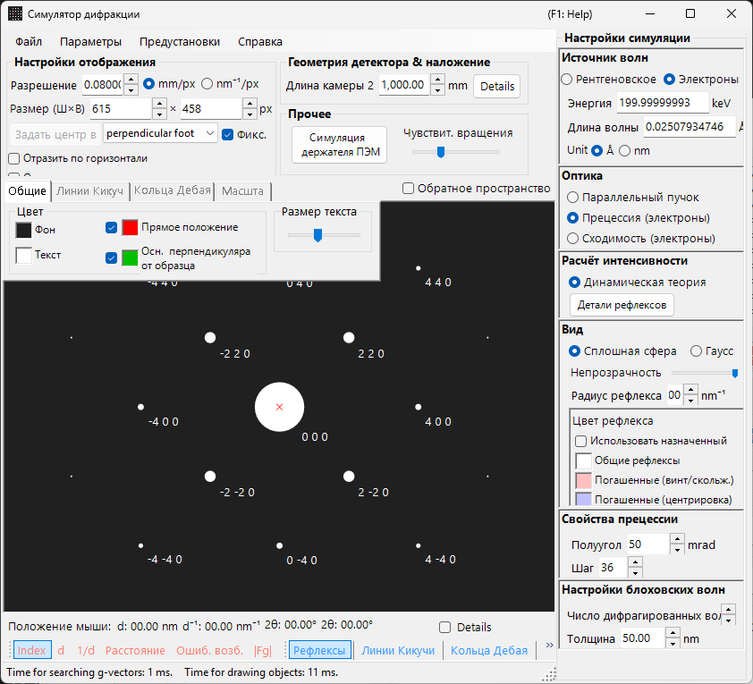
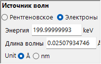
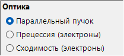
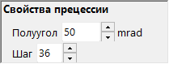
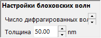
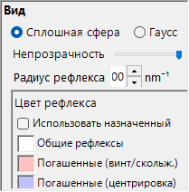

# Моделирование прецессионной электронной дифракции (PED)

Моделирование **PED (Precession Electron Diffraction)** вычисляет картины электронной дифракции, получаемые при прецессии падающего пучка по конусу вокруг оптической оси.

> На этой странице перечислены все настройки, которые появляются в правой части окна при выборе **Wave = Electron beam, Incident beam = Precession (electron), Intensity = Dynamical (automatic)**. Обратите внимание, что **выбор Precession (electron) для падающего пучка автоматически переключает расчёт интенсивности на Dynamical**. Об операциях на уровне всего окна, таких как рисование и сохранение, см. [обзорную страницу](index.md).

Условия GUI: **Wave = Electron beam, Incident beam = Precession (electron), Intensity = Dynamical (automatic)**

---

## Обзор

При PED электронный пучок прецессирует по конусу вокруг оптической оси, а картины дифракции, полученные для каждого направления пучка на конусе прецессии, интегрируются. По сравнению с обычной SAED это даёт следующие преимущества:

- Динамические эффекты усредняются, что даёт данные об интенсивности, близкие к кинематическим соотношениям интенсивностей
- Рефлексы зон Лауэ высшего порядка (HOLZ) наблюдаются более отчётливо
- Можно получить данные об интенсивности, пригодные для структурного анализа

---

## Настройка длины волны

Поскольку PED — это электронная дифракция, выберите в качестве источника **Electron beam**. Ввод энергии электронов (keV) или длины волны (nm) вычисляет релятивистски скорректированную длину волны.

---

## Падающий пучок

Для геометрии падающего пучка выберите **Precession (electron)** (доступно только при выбранном электронном пучке).

> **Примечание** : Выбор **Precession (electron)** **автоматически переключает расчёт интенсивности на Dynamical**, и появляются панель настроек метода блоховских волн и панель настроек прецессии. **Only excitation error** / **Kinematical** больше нельзя выбрать.

---

## Настройки прецессии

Задайте форму и дискретизацию конуса прецессии.

| Параметр | Описание | Рекомендуется |
|-----------|-------------|-------------|
| **Semi-angle** | Половинный угол раствора конуса прецессии (mrad) | 10–40 mrad |
| **Step** | Число направлений параллельного пучка, дискретизируемых на конусе прецессии. Большие значения дают более гладкое интегрирование, но линейно увеличивают время вычислений | 36–72 |

---

## Расчёт интенсивности и настройки метода блоховских волн

В момент выбора **Precession (electron)** значение **Intensity = Dynamical (automatic)** фиксируется. Для параллельного пучка в каждом направлении прецессии интенсивность дифракции вычисляется методом блоховских волн (динамический расчёт), и интегрирование по всем направлениям даёт картину PED.

| Параметр | Описание | Рекомендуется |
|-----------|-------------|-------------|
| **No. of diffracted waves** | Число блоховских волн, учитываемых в задаче на собственные значения. Большие значения дают более точные интенсивности, но время вычислений растёт как $O(N^3)$ | 50–200 |
| **Thickness** | Толщина образца, используемая в динамическом расчёте (nm) | — |

Вычислительная стоимость примерно равна «число шагов × расчёт блоховских волн на одно направление». Подробности динамического расчёта см. в разделе [Динамический расчёт (метод блоховских волн)](../appendix/a3-bloch-wave/calculation.md).

---

## Отображение рефлексов

Управляет тем, как рисуется каждый дифракционный рефлекс.

- **Solid sphere / Gaussian** : Геометрическая модель узлов обратной решётки. **Solid sphere** рисует сечение сферы радиуса $R$ со сферой Эвальда, а **Gaussian** рисует сечение (2D-гауссиану) 3D-гауссианы с $\sigma = R$ со сферой Эвальда.
- **Opacity** : Прозрачность рефлекса (0 = прозрачный, 1 = непрозрачный).
- **Radius (R)** : Радиус узлов обратной решётки. Для динамических интенсивностей интеграл гауссианы $=$ Brightness $\times I_\text{dyn}$, а Solid sphere использует радиус $R \times I_\text{dyn}^{1/2}$ (так что площадь пропорциональна динамической интенсивности).
- **Brightness** : Доступно только в режиме **Gaussian**. Интегральная интенсивность рисуемой гауссианы.
- **Colour scale** : Цветовая шкала **Gray scale** или **Cold-warm**.
- **Log scale** : Отображение интенсивности в логарифмическом масштабе.
- **Spot colour** : Цвет рефлекса, когда цветовая шкала не применяется.
- **Use crystal colour** : Рисует рефлексы цветом, назначенным каждому кристаллу.

---

## Сравнение с SAED

| Свойство | SAED | PED |
|---------|------|-----|
| Пучок | Параллельный, фиксированный | Прецессирующий (сканирование по конусу) |
| Динамические эффекты | Большие | Усреднённые, меньше |
| Рефлексы HOLZ | Слабые | Проявляются сильно |
| Надёжность интенсивности | Может быть недостаточной для структурного анализа | Пригодна для структурного анализа |
| Время вычислений | Короткое | Длинное |

---

## См. также

- [Симулятор дифракции (обзор)](index.md)
- [Моделирование рентгеновской дифракции](4-x-ray-neutron-diffraction.md)
- [Моделирование SAED](1-saed-simulation.md)
- [Динамический расчёт (метод блоховских волн)](../appendix/a3-bloch-wave/calculation.md)
