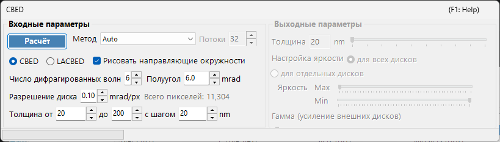
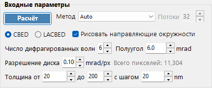
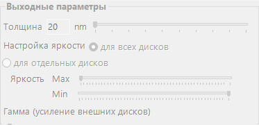

# Моделирование CBED

**Моделирование CBED (Convergent-Beam Electron Diffraction)** рассчитывает и отображает картины дифракции сходящегося пучка с помощью метода блоховских волн (Бете). Картины CBED показывают дифракционные диски вместо рефлексов-точек и содержат богатую информацию о симметрии кристалла, толщине и структуре.

> На этой странице перечислены все настройки специального окна, которое открывается, когда в [Симуляторе дифракции](index.md) вы выбираете **Wavelength = Electron** и **Incident beam = Convergence (CBED, electron only)**. При переключении падающего пучка на сходящийся параметр **Intensity calculation** автоматически устанавливается в **Dynamical**, и это окно настроек CBED открывается. О рисовании и сохранении картин дифракции, а также о других операциях, общих для симулятора дифракции, см. [обзорную страницу](index.md).

Условия GUI: Wave Length = Electron · Incident beam = Convergence (CBED, electron only) · Intensity calculation = Dynamical (автоматически)

---

## Входные параметры

| Параметр | Описание | По умолчанию / Типично |
|-----------|-------------|-------------------|
| **Mode** | **CBED**: стандартная картина со сходящимся пучком, в которой каждый диск соответствует одному рефлексу, с проходящим диском (000) в центре. **LACBED** (Large-Angle CBED): картина со сходящимся пучком и большим углом, в которой диски разных рефлексов перекрываются. Полезна для наблюдения линий HOLZ (higher-order Laue zone) и симметрии | CBED |
| **Convergence semi-angle (mrad)** | Полуугол конуса сходящегося пучка. Определяет размер каждого дифракционного диска (диаметр диска в обратном пространстве соответствует $2\alpha$) | 5–30 mrad |
| **Disk resolution (mrad/px)** | Угловое разрешение внутри каждого диска. Меньшие значения дают более высокое разрешение, но число рассчитываемых направлений пучка (пикселей) растёт квадратично, поэтому и время расчёта возрастает квадратично. Результирующее общее число пикселей (= общее число направлений пучка) показано справа | — |
| **No. of Bloch waves** | Максимальное число пучков, включаемых в расчёт методом блоховских волн при каждом направлении падающего пучка. Большее число пучков даёт более высокую точность, но затраты на решение задачи на собственные значения растут как $O(N^3)$ | 100–500 |
| **Thickness range** | Начальное, конечное значения и шаг толщины образца (nm). Несколько толщин рассчитываются вместе и переключаются ползунком толщины на стороне вывода | — |
| **Solver** | Расчётный движок для задачи на собственные значения. **Auto**: автоматически выбирает наилучший решатель. **Eigenproblem (MKL)**: на основе Intel MKL (самый быстрый). **Eigenproblem (Eigen)**: библиотека Eigen C++. **Managed**: чисто управляемый .NET (самый медленный, но всегда доступен) | Auto |
| **Thread count** | Число параллельных потоков для расчёта | — |
| **Draw disk outlines** | Если флажок установлен, рисуется окружность, обозначающая границу каждого дифракционного диска | — |

---

## Run / Stop

- **Start** : запускает моделирование CBED с текущими входными параметрами.
- **Stop** : отменяет выполняющийся расчёт.

---

## Выходные параметры

После завершения расчёта выходные параметры становятся доступными. Все они изменяют только отображение без повторного расчёта.

| Параметр | Описание |
|-----------|-------------|
| **Sample thickness** | Выбирает ползунком отображаемую толщину образца в пределах диапазона толщин входных параметров |
| **Brightness adjustment** | **Common to all disks**: использует общую шкалу яркости для всех дисков, чтобы отобразить полную картину CBED. **Per disk**: отображает один выбранный диск в полном разрешении, нормированный внутри этого диска |
| **Brightness (Max / Min)** | Верхний и нижний пределы отображаемой интенсивности. Настраивайте, когда нужно выделить слабые особенности |
| **γ (emphasis of outer disks)** | Гамма-коррекция. Используется, чтобы сделать тёмные внешние диски при больших углах более заметными по сравнению с центральным проходящим диском |
| **Scale** | Выбирает градацию интенсивности из **Positive** / **Negative** (чёрно-белое инвертирование) |
| **Color** | Цветовая карта, используемая для отображения. Выберите из **Gray** и других |

---

## Физическая основа

В CBED падающий пучок рассматривается как конус плоских волн с разными направлениями. Для каждого направления (каждой точки внутри апертуры сходимости = парциальной падающей плоской волны) метод блоховских волн решает уравнение Шрёдингера для электрона внутри кристалла, и результаты компонуются как дифракционные диски. Линии HOLZ (higher-order Laue zone) появляются как тонкие тёмные/светлые линии внутри дисков и возникают из-за рефлексов в высших зонах Лауэ. Они чувствительны к параметру решётки вдоль оси $c$ и полезны для трёхмерного структурного анализа.

Подробности теории см. в разделе [Расчёт CBED](../appendix/a3-bloch-wave/cbed.md).

---

## См. также

- [Симулятор дифракции (обзор)](index.md)
- [Моделирование SAED](1-saed-simulation.md)
- [Моделирование PED](2-ped-simulation.md)
- [Расчёт CBED](../appendix/a3-bloch-wave/cbed.md)
