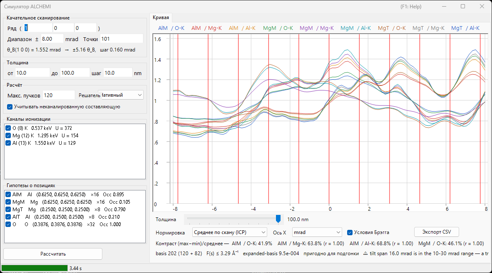

# Моделирование ALCHEMI

**ALCHEMI (Atom Location by CHannelling-Enhanced MIcroanalysis)** определяет, **какую позицию занимает примесный атом**, измеряя выход характеристического рентгеновского излучения при наклоне кристалла вдоль систематического ряда и анализируя зависимость от ориентации. Симулятор ALCHEMI в ReciPro рассчитывает в прямом направлении **качательную кривую (выход ионизации в зависимости от ориентации)** по кристаллической структуре и набору гипотез о позициях.

> **Это функция Preview.** В v1 выполняется **только одномерный прямой расчёт**; подгонка к экспериментальным данным и 2D-карта (2D-HARECXS) не реализованы (соответствующие вкладки скрыты). **Насколько известно авторам, других общедоступных прямых симуляторов ALCHEMI не существует.** Поскольку сверить результат не с чем, прочитайте раздел [Область применимости и известные ограничения](#область-применимости-и-известные-ограничения), прежде чем использовать результаты количественно.

Открывается из меню **Параметры** [Симулятора дифракции](index.md) → **Симулятор ALCHEMI...**

Условия GUI: Wave Length = Electron (кристалл, ускоряющее напряжение и ориентация берутся из родительского симулятора дифракции)



Слева в окне находятся **настройки** (сканирование, толщина, расчёт, каналы ионизации, гипотезы о позициях), справа — **результат** (вкладка Кривая).

---

## Что вычисляется

Для каждой ориентации падающего пучка волновое поле внутри кристалла решается методом блоховских волн, и для каждой пары «позиция $s$ — канал ионизации $c$» выход ионизации аналитически интегрируется до толщины $t$.

$$
Y_\text{dyn} = \mathrm{Re} \sum_{jj'} \alpha_j^{*}\,\bigl(C^{\dagger} \mu_{s,c} C\bigr)_{jj'}\, \alpha_{j'}\, F_{jj'}(t),
\qquad F_{jj'}(t) = \frac{e^{\lambda t} - 1}{\lambda}
$$

Матрица ионизации $\mu$ зависит только от разности двух рефлексов, $G = \mathbf{g}_h - \mathbf{g}_g$.

$$
\mu_{hg} = \sum_a \mathrm{Occ}_a\, e^{-M_a(G)}\, \sigma_c\, F_c(|G|/2)\, e^{-2\pi i\,G \cdot \mathbf{r}_a}
$$

- $\sigma_c$ : полное сечение ионизации, модель **Bote–Salvat**
- $F_c(s)$ : нормированный форм-фактор ионизации, собственные таблицы **DHFS** (та же база данных, что у [Взаимодействия пучка](../3-beam-interaction.md) и [STEM-EDX](../9-hrtem-stem-simulator/2-stem-simulation.md))
- $e^{-M_a(G)}$ : фактор Дебая—Валлера (анизотропные ADP поддерживаются)

Это соответствует **приближению локального форм-фактора** ICSC (Oxley & Allen 2003). Двухимпульсная MDFF не используется.

### Неканалированная составляющая

Электроны, выбывшие из когерентного блоховского поля из-за теплового диффузного поглощения, проходят оставшуюся толщину как электроны со случайным направлением и ионизируют атомы и там.

$$
Y_\text{dech} = \frac{\mu_{00}}{V_c}\,\bigl(t - L_\text{coh}(t)\bigr),
\qquad L_\text{coh}(t) = \int_0^t \sum_g |\psi_g(z)|^2\,dz
$$

Снятие флажка **Учитывать неканалированную составляющую** в блоке **Расчёт** убирает это слагаемое. При типичных толщинах оно даёт десятки процентов полного выхода, поэтому без него контраст позиций выглядит сильнее, чем он есть.

### Выходная величина

Первичная величина — **число вакансий во внутренней оболочке, создаваемых на один падающий электрон**. **Преобразование в рентгеновские фотоны (выход флуоресценции и ветвление линий), самопоглощение рентгеновского излучения в образце, а также эффективность и телесный угол детектора НЕ учитываются.**

---

## Левая панель: настройки

### Качательное сканирование

| Параметр | Описание | По умолчанию |
|----------|----------|--------------|
| **Ряд ( h k l )** | Систематический ряд для сканирования, заданный индексами рефлекса. Ось наклона берётся перпендикулярной и пучку, и этому $\mathbf{g}$, поэтому сканирование проводит ряд через его брэгговские условия | (1 0 0) |
| **Диапазон ±** | Полуширина наклонного сканирования (мрад). Свыше примерно 10 мрад фиксированный объединённый базис уже не гарантируется, а свыше 30 мрад это за пределами гарантии v1 | 8 мрад |
| **Точки** | Число точек сканирования (3–1001) | 101 |

Строкой ниже показаны брэгговский угол $\theta_B$ выбранного ряда, скольким $\theta_B$ соответствует ширина сканирования, и шаг наклона — так что ещё до запуска видно, насколько далеко действительно уходит сканирование.

### Толщина

Задайте начало, конец и шаг (нм). **Все толщины рассчитываются вместе за один запуск**, а результат переключается ползунком под кривой.

Контраст позиций сильно меняется — вплоть до смены знака — между тонкими и толстыми образцами, поэтому проверьте несколько толщин, прежде чем делать выводы. Именно поэтому переключатель толщины расположен прямо под кривой.

### Расчёт

| Параметр | Описание | По умолчанию |
|----------|----------|--------------|
| **Макс. пучков** | Верхняя граница числа блоховских волн на одну ориентацию (1–1600). Объединение по всему сканированию больше | 120 |
| **Решатель** | Вычислительное ядро задачи на собственные значения: **Нативный** (Eigen C++) или **Управляемый** (.NET). Там, где нативный решатель недоступен, выбор фиксируется на Управляемом | Нативный |
| **Учитывать неканалированную составляющую** | Добавлять ли $Y_\text{dech}$ (см. выше) | вкл. |

**Предел в 1600 пучков — это пара к табулированному диапазону $s \le 16\ \text{Å}^{-1}$ форм-фактора ионизации.** На практике даже 1600 пучков требуют лишь около 10,5 Å⁻¹, поэтому при соблюдении предела табулированный диапазон никогда не исчерпывается. Фактически достигнутое значение выводится в строке [диагностики базиса](#диагностика-базиса) под графиком.

### Каналы ионизации

Список элементов и оболочек для ионизации. Каждая строка читается как `элемент (Z) оболочка   энергия края   U = перенапряжение`, а там, где нужна осторожность, добавляется пометка в скобках.

- Каналы, которые **невозможно возбудить** (энергия пучка ниже края поглощения), или выходящие **за пределы табулированного диапазона**, перечисляются с указанием причины и не могут быть отмечены
- Каналы с перенапряжением $U = E_0/E_\text{края}$ ниже 1,2 получают предупреждение, поскольку там сечение менее надёжно

### Гипотезы о позициях

Список атомных позиций, выход для которых рассчитывается отдельно; отображается как `метка элемент (x, y, z) ×кратность Occ заселённость`.

⚠ **В трассерном приближении канал можно сочетать с любой позицией.** Сочетание канала ионизации примеси с геометрией позиции матрицы (координаты, ADP, заселённость) — это и есть предусмотренное использование; ограничивать сочетания совпадающими элементами было бы ошибкой. Рассчитываются **все комбинации** отмеченных каналов и позиций.

### Рассчитать / Стоп

**Рассчитать** запускает сканирование. Ход выполнения показывается в строке состояния в пять этапов (разрешение данных ионизации → построение объединённого базиса → построение матриц ионизации → расчёт ориентаций → проверка расширенного базиса), а **Стоп** прерывает в любой момент.

---

## Правая панель: вкладка Кривая

По завершении расчёта для каждой пары «позиция × канал» строится одна кривая. Легенда читается как `метка позиции / канал`.

| Параметр | Описание |
|----------|----------|
| **Толщина** | Выбор отображаемой толщины ползунком (ничего не пересчитывается) |
| **Нормировка** | **Среднее по скану (ICP)** = делить на среднее по всему сканированию (величина, обычно используемая в ALCHEMI) / **Максимум = 1** / **Сырое (на электрон)** |
| **Ось X** | Переключение между **мрад** и **θ_B** (в единицах брэгговского угла сканируемого ряда) |
| **Условия Брэгга** | Проводит вертикальные линии при $\theta = n\,\theta_B$ |
| **Экспорт CSV** | Записывает сырые кривые для всех ориентаций, толщин, позиций и каналов в файл CSV ([ниже](#экспорт-csv)) |

⚠ **Нормировка — это только преобразование отображения.** Сохраняется всегда число вакансий на один падающий электрон, а **Максимум = 1 предназначен только для отображения** — его нельзя использовать как опорную величину ICP.

### Контраст и корреляция

В первой строке под кривой для каждой серии приводятся **контраст** $(\max-\min)/\text{среднее}$ и **коэффициент корреляции** $r$ относительно первой серии. Это сводка, позволяющая с одного взгляда понять, какая позиция работает: две серии с $r$ близким к $+1$ имеют одинаковую зависимость от ориентации, то есть по этим данным разделить такие позиции нельзя.

### Диагностика базиса

Вторая строка сообщает состояние базиса.

```text
basis 347 (184 + 163)   F(s) ≤ 6.20 Å⁻¹   expanded-basis 6.7e-3   ⚠ НЕ пригодно для подгонки
```

- **basis N (только центр + добавлено объединением)** : размер истинного объединения рефлексов по всем ориентациям сканирования
- **F(s) ≤ … Å⁻¹** : наибольший аргумент форм-фактора, фактически потребовавшийся базису
- **expanded-basis** : максимальная относительная разность при повторном решении центра и обоих краёв сканирования с базисом в 1,25 раза больше. Это **косвенная мера погрешности сходимости**
- **пригодно для подгонки / НЕ пригодно для подгонки** : результат становится **непригодным**, если значение expanded-basis превышает порог $3\times10^{-3}$

⚠ **Не используйте результат с пометкой «не пригодно для подгонки» для количественной подгонки заселённостей.** Это условие публикации v1. Учтите также, что диагностика определена по **абсолютному выходу**, поэтому при рассмотрении только ICP (который делится на среднее по скану) она оказывается консервативной.

В следующих ситуациях добавляются дополнительные предупреждения.

- **Ускоряющее напряжение ниже 80 кВ** : при таком напряжении таблица форм-факторов не гарантирует $s$ до $16\ \text{Å}^{-1}$. Сам расчёт остаётся корректным, пока требуемое базисом $s$ остаётся в гарантированном диапазоне, поэтому это **уведомление, а не отказ**
- **Обрезание форм-фактора** : там, где $F(s)$ за пределами гарантированного диапазона был обнулён, **соответствующая граница погрешности $|F| \le \varepsilon$ выводится численно**. Ничего не экстраполируется молча

---

## Экспорт CSV {#экспорт-csv}

**Экспорт CSV** записывает таблицу в длинном формате, предваряемую двумя строками заголовка. Заголовок составлен так, чтобы уже сам файл сообщал условия, необходимые для воспроизведения.

```text
# ReciPro ALCHEMI, 250.0 kV, row (1 0 0), theta_B 3.8424 mrad, model LocalFormFactor,
#   quantity ..., normalization PerIncidentElectron (self-absorption and detector efficiency are NOT applied)
# basis 347 beams, hash ..., expanded-basis 6.658e-003, fit-eligible False
tilt_mrad,thickness_nm,site,channel,dynamic,dechannelled,total
```

`dynamic` / `dechannelled` / `total` сохраняются раздельно, поэтому **вклад неканалированной составляющей можно оценить постфактум**. Значения сырые (на один падающий электрон) и не проходят через нормировку отображения; десятичный разделитель — всегда точка.

---

## Область применимости и известные ограничения

«Может быть рассчитано» и «проверено количественно» — разные вещи. В этом разделе указано второе.

### Количественно проверенная область

**β-AlCo [001] при 250 кэВ, каналы Al-K / Co-K / Co-L** — и ничего больше. Сравнение с расчётом методом многослойного приближения с замороженными фононами (py_multislice), динамическая формулировка которого полностью независима:

- **Позиция Al (лёгкая колонка)** : СКО остатка относительно модуляции ICP ≤3,2 % при всех толщинах, ≤0,6 % при $t \ge 10$ нм
- **Позиция Co (тяжёлая колонка)** : ≤3 % при $t \le 4$ нм, но **6–17 % при $t \gtrsim 10$ нм**

Любая другая система, элемент, оболочка или напряжение «поддаются расчёту», но не «проверены количественно».

### Известная систематическая погрешность — у неканалированного слагаемого нет корреляции с позициями

Неканалированное слагаемое v1 — константа, не зависящая от ориентации, поэтому его единственное действие на ICP — притягивать его к 1. В действительности часть термически рассеянных электронов вновь каналируется в колонки и, будучи сильными рассеивателями, возвращается **преимущественно в тяжёлые колонки**. В приведённом сравнении эффективная величина этого вклада была **занижена на 10–19 пунктов для тяжёлых колонок**.

→ **Для лёгких или слабо рассеивающих позиций, а также при $t \lesssim 5$ нм согласие с независимой реализацией составляет 1–3 %. Для тяжёлых колонок при $t \gtrsim 10$ нм имеется систематическая погрешность 6–17 % от модуляции ICP.** Модель повторного вброса с корреляцией по позициям отложена до v1.1 или позже.

### Не входит в прямую модель

**Одной свёртки с угловым размытием недостаточно, чтобы воспроизвести эксперимент.** Ничего из перечисленного не учитывается.

- **Распределение толщины** и **изгиб** образца
- **Самопоглощение** рентгеновского излучения
- **Эффективность и телесный угол детектора**
- **Фон** (тормозное излучение, наложение линий)
- Свёртка с **угловым размытием падающего пучка** (полуугол сходимости, дрейф) — в v1 не реализована

### Допущения модели

- **Только трассерное приближение** : линейная суперпозиция откликов позиций справедлива только в разбавленном пределе, когда примесь не искажает упругое волновое поле. VCA при конечной концентрации в v1 не рассматривается
- **Приближение локального форм-фактора** : $\mu$ — функция только от $G = \mathbf{g}_h - \mathbf{g}_g$, а не двухимпульсная MDFF (Модель A из OAR 1999). Приближение нарушается для K-оболочек лёгких элементов и низкоэнергетических краёв
- **Вакансии, а не рентгеновские фотоны** : выход флуоресценции и ветвление линий не применяются
- **Нижняя граница ускоряющего напряжения — 80 кВ** : это наименьшее напряжение, при котором можно гарантировать $s = 16\ \text{Å}^{-1}$, а не порог отказа

---

## См. также

- [Симулятор дифракции (обзор)](index.md)
- [Моделирование CBED](3-cbed-simulation.md)
- [Динамический расчёт (общее ядро)](../appendix/a3-bloch-wave/calculation.md)
- [Моделирование STEM](../9-hrtem-stem-simulator/2-stem-simulation.md) — STEM-EDX, использующий ту же базу данных ионизации
- [Взаимодействие пучка](../3-beam-interaction.md) — данные о сечениях и краях поглощения
