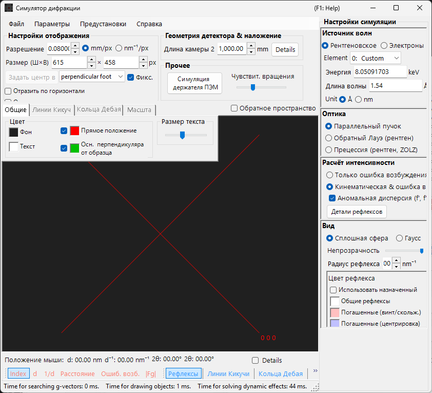
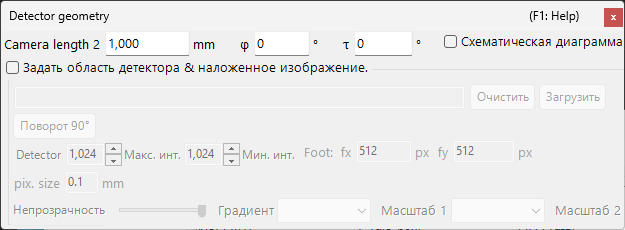

# Моделирование рентгеновской / нейтронной дифракции

**Моделирование рентгеновской / нейтронной дифракции** вычисляет монокристаллические рентгеновские и нейтронные дифракционные картины. Это один из основных режимов [симулятора дифракции](index.md).

> На этой странице перечислены все настройки, которые появляются в правой части окна при выборе **Wave Length = X-ray** (или нейтрон). Для операций уровня всего окна, таких как рисование и сохранение, см. [страницу обзора](index.md).

Условия GUI: Wave Length = X-ray / Neutron · Incident beam = Parallel / Precession (X-ray) / Back-Laue · Intensity calculation = Only excitation error / Kinematical

---

## Обзор

Рентгеновские лучи имеют большую длину волны, чем электроны (Cu Kα: 0.15406 nm = 1.5406 Å), поэтому сфера Эвальда искривлена сильнее. В результате одновременно удовлетворяют условию дифракции меньше точек обратной решётки, чем для электронов. Поскольку атомная рассеивающая способность мала, а многократное рассеяние слабое, кинематическая теория дифракции обеспечивает достаточную точность для интенсивностей (динамический расчёт поддерживается только для электронов).

---

## Wave Length

Выберите **X-ray** в качестве источника излучения. Рентгеновское излучение можно задать двумя способами: характеристическое рентгеновское излучение и синхротронное излучение.

### Характеристическое рентгеновское излучение

Выбор **элемента** и **перехода** фиксирует длину волны характеристического рентгеновского излучения. Переход задаётся в обозначениях Зигбана (Kα₁ / Kα₂ / Kβ и т. д.). Длины волн Kα₁ для типичных элементов:

| Элемент | Линия | Длина волны (Å) | Энергия (keV) |
|---------|------|-----------------|--------------|
| Cu | Kα₁ | 1.5406 | 8.048 |
| Mo | Kα₁ | 0.7107 | 17.479 |
| Co | Kα₁ | 1.7890 | 6.930 |
| Cr | Kα₁ | 2.2910 | 5.415 |

### Синхротронное излучение

Установите **Element** в **0: Custom** и введите энергию (keV) или длину волны (Å) напрямую. Можно использовать любую длину волны.

---

## Режим падающего пучка

Выбирает геометрию падающего пучка. Для рентгеновского излучения доступны три режима.

### Parallel

Стандартная плоская волна. Параллельный падающий пучок, используемый для SAED и монокристаллической рентгеновской дифракции.

### Precession (X-ray) — прецессионная камера

Моделирует рентгеновскую прецессионную камеру. Это прецессионная съёмка, фиксирующая один слой обратной решётки.

### Back-Laue (обратная лауэграмма)

Моделирует обратную лауэграмму с белым (полихроматическим) рентгеновским излучением. В этой геометрии обратного отражения детектор располагается со стороны источника, а **Monochrome** отключается. Геометрия отражения задаётся параметрами **Tau / Phi** в **Detector geometry** (см. [Detector geometry](index.md#detector-geometry)).

> **Примечание**: Параметры падающего пучка зависят от длины волны. **Precession (electron)** и **Convergence (CBED)** появляются только при выборе электронного излучения, тогда как приведённые выше параметры **Precession (X-ray)** и **Back-Laue** появляются только при выборе рентгеновского излучения. Для нейтронов доступен только **Parallel**. В зависимости от состояния на момент захвата снимок экрана может не отображать специфичные для рентгеновского излучения параметры.

---

## Расчёт интенсивности

Выбирает метод вычисления интенсивностей рефлексов. Для рентгеновского излучения доступны два режима.

### Only excitation error

Интенсивность определяется исключительно геометрическим расстоянием между сферой Эвальда и точкой обратной решётки (ошибкой возбуждения $s_g$). Меньшее $\lvert s_g \rvert$ даёт более высокую интенсивность с максимумом при значении, заданном параметром **Radius**, и падает до нуля, когда $\lvert s_g \rvert$ превышает Radius. Структурный фактор игнорируется.

### Kinematical & excitation error

В дополнение к ошибке возбуждения в интенсивность включается кинематический структурный фактор $\lvert F_{hkl} \rvert^2$. Правила погасания строго соблюдаются. Факторы Лоренца и поляризации не учитываются (это моделирование геометрической картины).

> **Примечание**: **Динамическая теория** отключена для рентгеновского излучения (доступна только при выборе электронного излучения).

---

## Внешний вид рефлексов

Управляет тем, как отрисовывается каждый дифракционный рефлекс.

- **Solid sphere / Gaussian** : геометрическая модель точки обратной решётки. **Solid sphere** использует сечение между сферой радиуса *R* и сферой Эвальда (площадь круга соответствует интенсивности дифракции); **Gaussian** использует сечение между трёхмерной гауссовой функцией с σ = *R* и сферой Эвальда (интеграл двумерной гауссовой функции соответствует интенсивности дифракции).
- **Opacity** : прозрачность рефлекса (0 = прозрачный, 1 = непрозрачный).
- **Radius (R)** : радиус точки обратной решётки. Отрисованный размер рефлекса определяется сочетанием **Appearance** и **Intensity calculation**.
- **Brightness** : активна только в режиме **Gaussian**. Задаёт интегральную интенсивность отрисованной гауссовой функции.
- **Color scale** : выбор между цветовыми картами **Gray scale** и **Cold-warm**.
- **Log scale** : отображение интенсивностей в логарифмическом масштабе.
- **Spot color** : цвет рефлекса по умолчанию, когда цветовая шкала не применяется.
- **Use crystal color** : при включении отрисовывает рефлексы цветом, назначенным каждому кристаллу.

---

## Кольца Дебая (поликристалл)

Можно отобразить кольца Дебая поликристаллического образца. Включите **Debye rings** на панели инструментов (см. [Панель инструментов](index.md#toolbar)).

- **Ignore diffraction intensity** : отрисовывает все кольца одним цветом и интенсивностью (используется для чисто геометрического сравнения, игнорирующего структурный фактор).
- **Show index label** : отображает индекс (*hkl*) рядом с каждым кольцом.

Подробные настройки находятся на вкладке Debye rings [меню вкладок](index.md#drawing-overlay-tabs).

---

## Нейтронная дифракция

Выбор **Neutron** в элементе управления Wave Length вычисляет нейтронную дифракционную картину. Введите энергию (meV) или длину волны (nm). Падающий пучок может быть только **Parallel**. Расчёт интенсивности может быть **Only excitation error** или **Kinematical** (Dynamical недоступен). Кинематическая интенсивность использует длину рассеяния нейтронов вместо атомного фактора рассеяния.

---

## Различия между рентгеновской и электронной дифракцией

| Характеристика | Рентгеновская дифракция | Электронная дифракция |
|---------|-------------------|----------------------|
| Длина волны | Большая (0.5–2.5 Å) | Малая (0.02–0.04 Å) |
| Кривизна сферы Эвальда | Большая | Малая (почти плоская) |
| Одновременные рефлексы | Мало | Много |
| Фактор рассеяния | Атомный фактор рассеяния $f(s)$ | Электронный фактор рассеяния $f_e(s)$ |
| Динамические эффекты | Обычно малы | Велики |
| Правила погасания | Строго соблюдаются | Могут нарушаться из-за многократного рассеяния |

---

## Общие операции

Для операций уровня всего окна, таких как длина камеры, геометрия детектора, сохранение картин и настройки цвета, см. [страницу обзора](index.md). Подробная геометрия детектора настраивается в окне геометрии ниже.

---

## См. также

- [Симулятор дифракции (обзор)](index.md)
- [Моделирование SAED](1-saed-simulation.md)
- [Моделирование прецессионной электронной дифракции (PED)](2-ped-simulation.md)
- [Моделирование дифракции сходящегося пучка электронов (CBED)](3-cbed-simulation.md)
- [Система координат — ориентация кристалла](../appendix/a1-coordinate-system/1-orientation.md)
