# Crystal Diffraction (Симулятор дифракции)

**Crystal Diffraction (Симулятор дифракции)** моделирует монокристальные картины рентгеновской, нейтронной и электронной дифракции.

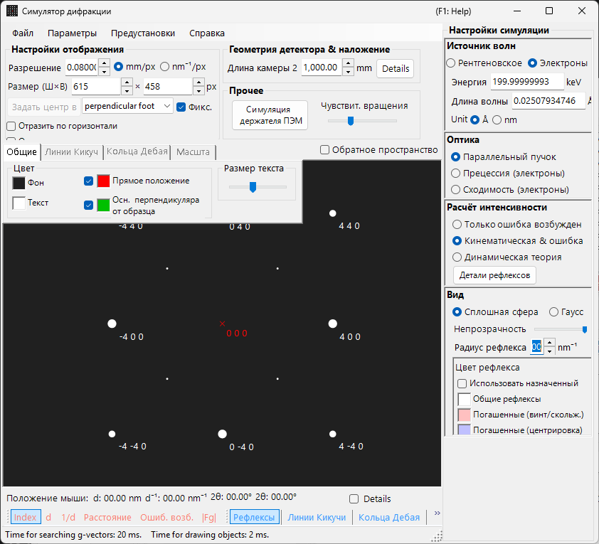

Окно содержит область построения дифракционной картины **слева** и **справа** — панели настройки свойств рефлексов (длина волны, падающий пучок, расчёт интенсивности, отображение и т. д.). Сочетание длины волны и падающего пучка определяет режим съёмки (рентгеновская дифракция, SAED, PED, CBED), и правые панели перенастраиваются соответствующим образом.

---

## Как эта страница и страницы режимов распределяют работу

- **Эта страница (концентратор)**: собирает операции, общие для всех режимов (сочетания клавиш, меню, панель инструментов, сведения об экране/детекторе, вкладки наложений, сведения о рефлексах, геометрия детектора, динамическое сжатие).
- **Каждая страница режима**: охватывает **все настройки, появляющиеся справа** при выборе данного режима (длина волны, падающий пучок, расчёт интенсивности, отображение, настройки блоховских волн, настройки прецессии и т. д.), так что каждая страница самодостаточна (между режимами есть некоторые пересечения).

| Режим | Содержание | Страница |
|------|----------|------|
| **Рентгеновская (и нейтронная) дифракция** | Монокристальная картина рентгеновской / нейтронной дифракции (параллельная, прецессионная рентгеновская, Back Laue) | [Моделирование рентгеновской дифракции](4-x-ray-neutron-diffraction.md) |
| **SAED** | Электронная дифракция в параллельном пучке (selected-area electron diffraction) | [Моделирование SAED](1-saed-simulation.md) |
| **PED** | Прецессионная электронная дифракция | [Моделирование PED](2-ped-simulation.md) |
| **CBED** | Электронная дифракция сходящегося пучка | [Моделирование CBED](3-cbed-simulation.md) |

---

## Быстрый справочник по режимам

Найдите нужную страницу по сочетанию **длины волны (источника)** и **падающего пучка**.

| Длина волны | Падающий пучок | Режим | Страница |
|------------|--------------------|------|------|
| Электрон | Параллельный | SAED | [Моделирование SAED](1-saed-simulation.md) |
| Электрон | Прецессия (электрон = PED) | PED | [Моделирование PED](2-ped-simulation.md) |
| Электрон | Сходимость (CBED) | CBED | [Моделирование CBED](3-cbed-simulation.md) |
| Рентген | Параллельный | Рентгеновская дифракция | [Моделирование рентгеновской дифракции](4-x-ray-neutron-diffraction.md) |
| Рентген | Прецессия (рентген) | Прецессионная рентгеновская (прецессионная камера) | [Моделирование рентгеновской дифракции](4-x-ray-neutron-diffraction.md) |
| Рентген | Back Laue | Лауэ на отражение | [Моделирование рентгеновской дифракции](4-x-ray-neutron-diffraction.md) |
| Нейтрон | Параллельный | Нейтронная дифракция | [раздел о нейтронах в моделировании рентгеновской дифракции](4-x-ray-neutron-diffraction.md) |

> **Note**: Варианты выбора падающего пучка меняются вместе с длиной волны. Для электронов: **Parallel, Precession (electron = PED), Convergence (CBED)**; для рентгеновских лучей: **Parallel, Precession (X-ray), Back Laue**; для нейтронов: только **Parallel**. Выбор **Precession (electron = PED)** или **Convergence (CBED)** автоматически переключает расчёт интенсивности на **Dynamical**.

---

## Сочетания клавиш и мыши

Они применимы к окну дифракционной картины, общему для моделирований рентгеновской дифракции, SAED и PED. Перетаскивание по картине вращает **кристалл**. Здесь **нет масштабирования колёсиком мыши** — масштабируйте щелчком правой кнопки / перетаскиванием правой кнопкой.

| Сочетание | Действие |
|----------|--------|
| <kbd>F1</kbd> | Открыть эту страницу онлайн-руководства |
| Перетаскивание левой кнопкой вблизи центра | Наклонить кристалл |
| Перетаскивание левой кнопкой во внешней области | Вращать кристалл вокруг оси пучка |
| Двойной щелчок левой кнопкой по рефлексу | Показать сведения о рефлексе (индекс, *d*, структурный фактор, ошибка возбуждения) |
| Перетаскивание средней кнопкой | Панорамировать картину |
| <kbd>CTRL</kbd> + Перетаскивание средней кнопкой | Переместить центр детектора (когда показана область детектора) |
| Щелчок правой кнопкой | Уменьшить масштаб |
| Перетаскивание правой кнопкой рамки | Увеличить масштаб до выбранной области |
| Двойной щелчок правой кнопкой по строке состояния | Скопировать текстовую сводку текущих настроек |
| Двойной щелчок правой кнопкой по активной кнопке слоя (Spots / Kikuchi / Debye / Scale) | Включить и выключить мигание этого слоя |

Вспомогательные окна, открываемые отсюда, добавляют ещё несколько:

| Сочетание | Действие |
|----------|--------|
| Двойной щелчок левой кнопкой по стереосети — **TEM holder** | Установить наклон держателя в эту точку |
| Клавиши-стрелки — **TEM holder** | Пошагово изменять наклон держателя (сначала отметьте **Arrow keys**) |
| Перетаскивание файла `.prm` или изображения — **Detector geometry** | Загрузить геометрию детектора / накладываемое изображение |
| Перетаскивание профиля `.txt` — **Dynamic compression** | Загрузить профиль давление/время (перетаскивайте красную линию на графике для прокрутки) |

Общеприложенческие сочетания <kbd>CTRL</kbd>+<kbd>SHIFT</kbd> главного окна также работают, пока это окно в фокусе (см. [главное окно](../0-main-window.md)).

→ См. **[21. Сочетания клавиш и мыши](../21-shortcuts.md)** для обзора всех окон.

---

## Быстрые маршруты по цели

| Цель | Начать с | Справка |
|------|------------|-----------|
| Получить электронную дифракцию в параллельном пучке (SAED) | Установите **Incident beam** на **Parallel** и **Wavelength** на электрон | [Моделирование SAED](1-saed-simulation.md), [расчёт SAED в параллельном пучке](../appendix/a3-bloch-wave/calculation.md) |
| Получить монокристальную рентгеновскую дифракцию | Переключите **Wavelength** на рентген / синхротрон | [Моделирование рентгеновской дифракции](4-x-ray-neutron-diffraction.md) |
| Получить прецессионную электронную дифракцию (PED) | Установите **Incident beam** на **Precession (electron)**, затем задайте полуугол и шаг | [Моделирование PED](2-ped-simulation.md) |
| Получить электронную дифракцию сходящегося пучка (CBED) | Установите **Incident beam** на **Convergence (CBED, electron only)** и задайте условия в окне CBED | [Моделирование CBED](3-cbed-simulation.md), [расчёт CBED](../appendix/a3-bloch-wave/cbed.md) |
| Просмотреть список рефлексов из динамического расчёта | Выберите **Dynamical** и откройте **Spot Details** или **Details** | [Динамический расчёт (общее ядро)](../appendix/a3-bloch-wave/calculation.md) |
| Сопоставить геометрию детектора с экспериментальным изображением | Откройте настройки геометрии детектора через **Details** и используйте накладываемое изображение | [Система координат детектора](../appendix/a1-coordinate-system/2-diffraction.md) |

---

## Основная область

Дифракционная картина моделируется в центре экрана.

### Управление мышью

См. «Сочетания клавиш и мыши» в начале этой страницы.

### Положение мыши

Сведения, соответствующие положению курсора (курсорные *q*, *d*, 2θ, азимут и т. д.), отображаются в строке состояния над картиной. Отметка **Details** добавляет более подробные сведения ((*hkl*) ближайшего рефлекса, ошибка возбуждения, структурный фактор и т. д.).

---

## Меню File

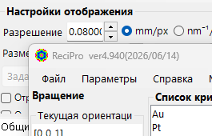

| Пункт меню | Описание |
|-----------|-------------|
| **Save** | Сохранить отображаемую дифракционную картину в файл. |
| **Save detector area** | Сохранить только обрезок области детектора. |
| **Copy** | Скопировать отображаемое изображение в буфер обмена. |
| **Copy detector area** | Скопировать только обрезок области детектора. |

### Preset {#toolbar}

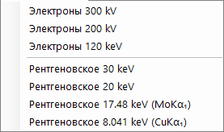

Сохранение и вызов полной конфигурации симулятора — длины волны, геометрии детектора, настроек вкладок, свойств рефлексов и т. д. — в виде предустановки. Удобно для быстрого переключения между приборами / режимами съёмки.

---

## Панель инструментов

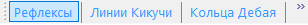

| Кнопка | Описание |
|--------|-------------|
| Spots | Показать / скрыть слой дифракционных рефлексов |
| Kikuchi | Показать / скрыть слой линий Кикучи |
| Debye | Показать / скрыть слой колец Дебая |
| Scale | Показать / скрыть слой линий шкалы |
| Index / d / Distance / Excitation error / Structure factor | Выбор подписи, прикрепляемой к каждому рефлексу |

---

## Сведения об экране и детекторе

### Экран

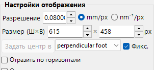

| Элемент | Описание |
|------|-------------|
| **Resolution** | Размер одного пикселя (мм). Он не обязан совпадать с фактическим размером пикселя детектора; он трактуется как масштаб отображения и автоматически обновляется при масштабировании мышью. |
| **Size (W×H)** | Ширина и высота области построения в пикселях. В зависимости от разрешения вашего дисплея очень большие значения могут оказаться недоступными для установки. |
| **Set centre / Fix centre** | Установить центр картины на любой пиксель области построения и при необходимости зафиксировать его. При фиксации центр нельзя переместить панорамированием мышью. |
| **Horizontal flip / Vertical flip / Negative image** | Геометрические отражения (по горизонтали / по вертикали) и инверсия контраста отображаемой картины. Используйте их для согласования ориентации или контраста с экспериментальным изображением. |
| **Reciprocal space** | Накладывает сферу Эвальда и векторы обратной решётки на картину, визуализируя, какие рефлексы возбуждены. |

### Детектор (длина камеры)

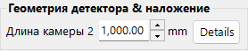

- **Camera length** : Расстояние от образца до детектора (мм).
- **Details** : Открывает окно настроек геометрии детектора (см. [Геометрия детектора](#detector-geometry) ниже).

### Misc

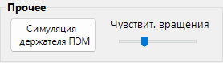

- **Rotation sensitivity** : Величина поворота кристалла на пиксель перетаскивания мышью.
- **TEM holder simulation** : Открывает окно моделирования, связанное с держателем (см. ниже).

---

## Моделирование держателя ПЭМ {#drawing-overlay-tabs}

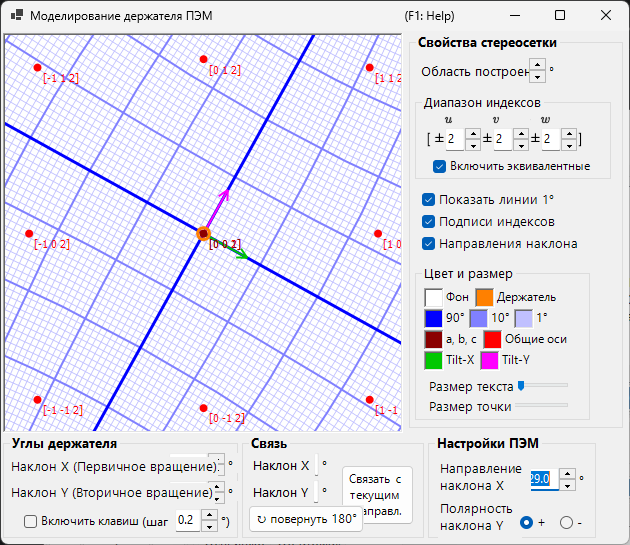

Открывает окно, которое связывает дифракционную картину с двухосевым (или вращательным) **TEM holder**. Задание углов наклона держателя обновляет картину и ориентацию кристалла, а достижимые ориентации можно показать на стереосети (добавлено в v4.914). Двойной щелчок левой кнопкой по стереосети устанавливает наклон держателя в эту точку, а отметка **Arrow keys** позволяет клавишам-стрелкам пошагово изменять наклон.

---

## Вкладки наложений рисования

### General

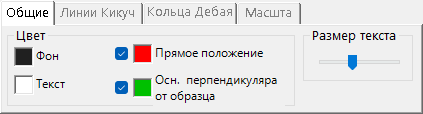

Задаёт цвета рефлексов, подписей, линий Кикучи, колец Дебая и других наложений. Заданные здесь настройки применяются ко всем режимам отображения.

### Линии Кикучи

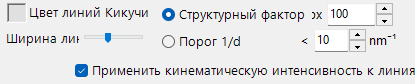

Активна, когда линии Кикучи включены на панели инструментов.

- **Reflection selection** : Выбор того, какие рефлексы порождают линии Кикучи. Либо **structure factor** (верхние *N* рефлексов по $\lvert F_{hkl}\rvert$), либо **1/d cutoff** (все рефлексы, у которых 1/d ниже порога (nm⁻¹)).
- **Line appearance** : Задаёт ширину линии, цвет линий Кикучи и **Draw with kinematical intensity** (масштабирует яркость линии по кинематической интенсивности рефлекса).
- **Threshold** : Устаревший параметр. Выполняет расчёт линий Кикучи только для рефлексов с *d* больше указанного значения (сохранён для совместимости).

### Кольца Дебая

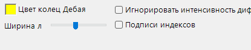

Активна, когда кольца Дебая включены на панели инструментов.

- **Ignore diffraction intensity** : Если отмечено, все кольца Дебая рисуются с одинаковым цветом и интенсивностью (игнорируя структурный фактор кристалла). Используйте это для чисто геометрического сравнения.
- **Show index label** : Если отмечено, (*hkl*) появляется около каждого кольца.

### Scale

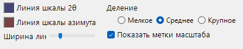

Активна, когда линии шкалы включены на панели инструментов.

- **2θ / Azimuth scale lines** : **2θ** представляет постоянный угол рассеяния (концентрические окружности), **Azimuth** представляет постоянный азимутальный угол (радиальные линии из центра). Цвета настраиваются независимо.
- **Line width** : Толщина линий шкалы.
- **Division** : Угловой интервал между соседними линиями шкалы.
- **Show scale labels** : Рисовать ли числовые подписи на линиях шкалы.

### Misc {#diffraction-spot-information}

Прочие настройки, такие как чувствительность поворота мышью.

- **Mouse sensitivity** : Величина поворота кристалла на пиксель перетаскивания мышью.

---

## Сведения о дифракционных рефлексах

Перечисляет рассчитанные для каждого рефлекса сведения, полученные методом блоховских волн (Dynamical-расчёт). Откройте их кнопкой **Spot Details** (панель расчёта интенсивности) или флажком **Details**.

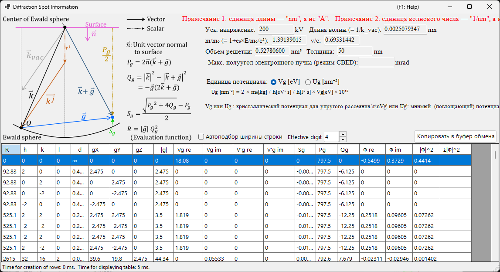

### Схема и определения

Схема (вверху слева) показывает векторы на сфере Эвальда и определяет величины, используемые в таблице ($\hat{\mathbf{n}}$ — единичный вектор нормали к поверхности образца, $\mathbf{k}$ — волновой вектор падающего пучка, $\mathbf{g}$ — вектор обратной решётки).

- $P_g = 2\,\hat{\mathbf{n}} \cdot (\mathbf{k} + \mathbf{g})$
- $Q_g = |\mathbf{k}|^2 - |\mathbf{k} + \mathbf{g}|^2 = -\mathbf{g} \cdot (2\mathbf{k} + \mathbf{g})$
- **Ошибка возбуждения:** $S_g = \dfrac{\sqrt{P_g^2 + 4 Q_g} - P_g}{2}$
- **Функция оценки:** $R = |\mathbf{g}|\, Q_g^2$ — упорядочивает рефлексы по тому, насколько сильно они возбуждены (меньше = ближе к сфере Эвальда = сильнее возбуждён; прошедший пучок $g=0$ имеет $R=0$ и идёт первым). Таблица отсортирована по возрастанию $R$.

### Столбцы таблицы

| Столбец | Значение |
|--------|---------|
| **R** | функция оценки $R = \lvert\mathbf{g}\rvert\, Q_g^2$ (выше; используется для отбора / упорядочивания рефлексов) |
| **h, k, (i,) l** | индексы Миллера (*i* — избыточный гексагональный индекс, показывается только для гексагональных кристаллов) |
| **d** | межплоскостное расстояние (нм) |
| **gX, gY, gZ** | компоненты вектора обратной решётки *g* (1/нм) |
| **\|g\|** | модуль *g* (1/нм) |
| **Vg re / Vg im** | коэффициент Фурье кристаллического потенциала для упругого рассеяния, $V_g$ (действительная / мнимая часть) |
| **V'g re / V'g im** | мнимый (поглощающий) потенциал для теплового диффузного рассеяния (TDS), $V'_g$ (действительная / мнимая часть) |
| **Sg** | ошибка возбуждения $S_g$ (выше; 1/нм) |
| **Pg** | вспомогательная величина $P_g = 2\,\hat{\mathbf{n}}\cdot(\mathbf{k}+\mathbf{g})$ (выше) |
| **Qg** | вспомогательная величина $Q_g = -\mathbf{g}\cdot(2\mathbf{k}+\mathbf{g})$ (выше) |
| **Φ re / Φ im** | комплексная амплитуда $\Phi$ динамической дифрагированной волны на выходной поверхности (действительная / мнимая часть) |
| **\|Φ\|^2** | дифрагированная интенсивность $\lvert\Phi\rvert^2$ этого рефлекса |
| **Σ\|Φ\|^2** | накопленная сумма $\lvert\Phi\rvert^2$ (суммарно по рефлексам; полезна как проверка сохранения интенсивности) |

### Единицы потенциала и другие элементы управления

- **Unit of potential** : Переключает отображаемый потенциал между **Vg [eV]** (электростатический потенциал, эВ) и **Ug [nm⁻²]** (масштабированная величина $U_g = (2 m_0/h^2)\, V_g$, входящая в уравнения блоховских волн). Заголовки столбцов меняются соответственно между *Vg / V'g* и *Ug / U'g*.
- Над таблицей показаны ускоряющее напряжение, длина волны ($\lambda = 1/k_\text{vac}$), релятивистское отношение масс $m/m_0$, отношение скоростей $v/c$, объём решётки, толщина образца и (в режиме CBED) максимальный полуугол электронного пучка.
- **Note 1:** единица длины — **nm**, не Å. **Note 2:** единица волнового числа — **1/nm**, не 2π/nm.
- **Effective digit** : число значащих цифр, показываемых в таблице. **Auto resize row width** : автоподбор ширины столбцов. **Copy to clipboard** : экспортирует таблицу как текст, который можно вставить в электронную таблицу. (Эта форма отображается на английском даже при японском интерфейсе.)

---

## Геометрия детектора {#detector-geometry}

Окно для детальной настройки геометрии детектора (длина камеры, наклон, поворот) и наложения экспериментального изображения. Откройте его через **Details** на панели **Detector geometry**.

### Настройки геометрии детектора

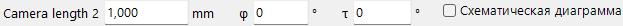

Задайте геометрию отражения, такую как длина камеры и наклон детектора (**Tau / Phi**). Для Back Laue (Лауэ на отражение) задайте здесь геометрию, размещающую детектор со стороны источника.

### Область детектора и наложенное изображение

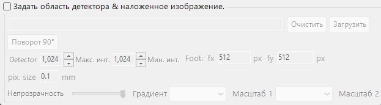

Задайте активную область детектора и перетащите экспериментальное изображение, чтобы наложить его. Используйте это, чтобы наложить смоделированную картину и экспериментальное изображение и точно настроить геометрию детектора.

См. также [Система координат детектора](../appendix/a1-coordinate-system/2-diffraction.md) для определений системы координат.

---

## Динамическое сжатие

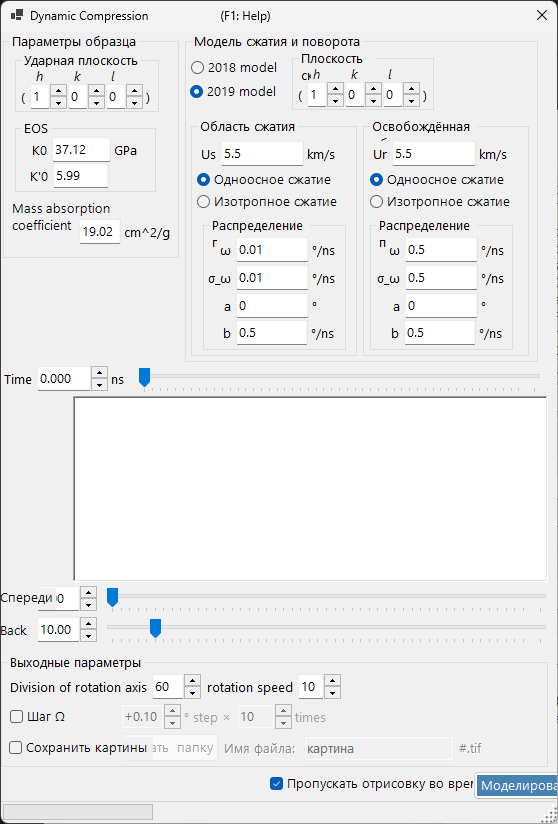

Окно для прокрутки профиля давление/время эксперимента под высоким давлением (динамическое сжатие). Перетащите профиль давление/время `.txt` на это окно, чтобы загрузить его, затем перетаскивайте красную линию на графике, чтобы непрерывно проходить по времени (давлению), отражая соответствующее состояние в дифракционной картине.

---

## Связанные темы

- [Моделирование рентгеновской дифракции](4-x-ray-neutron-diffraction.md)
- [Моделирование SAED](1-saed-simulation.md)
- [Моделирование PED](2-ped-simulation.md)
- [Моделирование CBED](3-cbed-simulation.md)
- [Динамический расчёт (общее ядро)](../appendix/a3-bloch-wave/calculation.md)
- [Система координат детектора](../appendix/a1-coordinate-system/2-diffraction.md)
