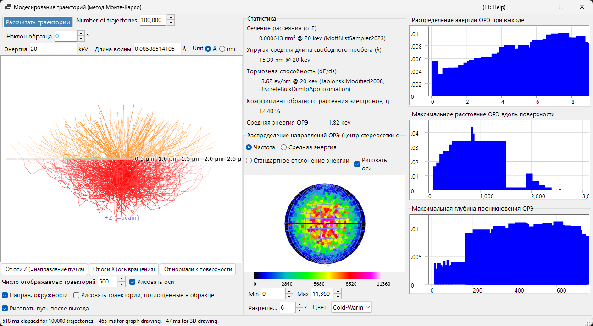
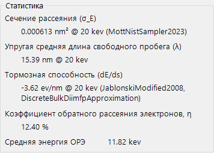
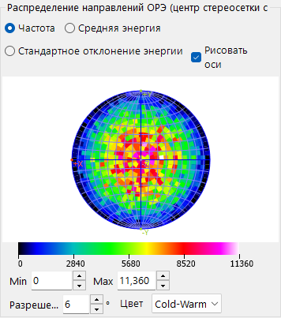
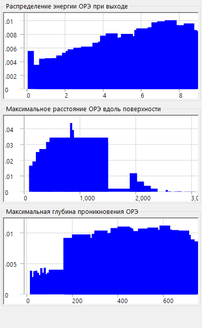

# Траектории электронов

**Симулятор траекторий** вычисляет траектории электронов внутри образца методом **Монте-Карло**: падающие электроны испытывают упругое и неупругое рассеяние, и накапливаются результирующие распределения обратно рассеянных электронов (направление, энергия, глубина проникновения). Эти распределения также служат основой для угловых/энергетических/глубинных весов, используемых в [12. Моделирование EBSD](12-ebsd-simulation.md).

---

## Сочетания клавиш и мыши

Траектории отображаются в трёхмерном виде OpenGL. Используется стандартная [навигация по виду](21-shortcuts.md) ReciPro, но **панорамирование отключено** — для перехода к стандартным ориентациям используйте кнопки предустановленных видов.

| Сочетание | Действие |
|----------|--------|
| <kbd>F1</kbd> | Открыть эту страницу онлайн-руководства |
| Перетаскивание левой кнопкой | Повернуть модель |
| Перетаскивание правой кнопкой вверх/вниз или колесо мыши | Масштабирование |
| <kbd>CTRL</kbd> + двойной щелчок правой кнопкой | Переключение ортографической / перспективной проекции |

→ См. **[21. Сочетания клавиш и мыши](21-shortcuts.md)** для обзора всех окон.

---

## Условия расчёта

Энергия пучка, число падающих электронов, образец/материал и другие параметры Монте-Карло (см. обзорный снимок экрана выше).

### Энергия пучка

Ускоряющее напряжение падающего электронного пучка (keV). Задаёт кинетическую энергию, используемую как для упругой (Mott), так и для неупругой (диэлектрический отклик) моделей рассеяния.

### Число падающих электронов

Сколько электронов моделировать. Большее число электронов снижает статистический шум, но линейно увеличивает время расчёта.

### Образец / материал

Состав и плотность образца. По умолчанию используется кристалл, выбранный в данный момент в главном окне, но это значение можно переопределить для исследований только по траекториям.

### Наклон образца

Угол наклона образца. Используется, когда данные траекторий передаются в [симулятор EBSD](12-ebsd-simulation.md) (обычно 70° для EBSD).

### Модель сечения

Модель сечения упругого рассеяния (Mott / Bethe / NIST). Разные модели по-разному соотносят скорость и точность при больших углах наклона или вблизи краёв поглощения.

---

## Параметры стереосети

Параметры отображения углового распределения, наносимого на стереографическую проекцию (см. обзорный снимок экрана выше).

### Метод проекции

Проекция **Вульфа** (равноугольная) или **Шмидта** (равноплощадная). Шмидт обычно предпочтительнее при считывании статистической плотности.

### Полусфера

Отображает верхнюю (обратно рассеянную) или нижнюю (прошедшую) полусферу.

### Разрешение / Цветовая шкала

Размер ячейки углового гистограммы и цветовая карта, используемая для отображения плотности.

---

## Статистика

Сводка по запуску.

- **Выход обратного рассеяния** — доля падающих электронов, выходящих через входную поверхность.
- **Длина свободного пробега** — среднее расстояние между событиями рассеяния.
- **Средняя глубина проникновения** — средняя максимальная глубина, достигаемая электроном до выхода или поглощения.
- **Затраченное время / Производительность** — реальные затраты времени на запуск.

---

## Распределение направлений BSE

Угловое распределение обратно рассеянных электронов (центр стереосети соответствует направлению нормали к поверхности). Жёлтая/оранжевая обводка (если присутствует) отмечает область, охватываемую детектором EBSD.

---

## Профили

Профили глубины и энергии моделируемых электронов.

### Профиль глубины

Гистограмма конечной глубины выхода (nm) обратно рассеянных электронов. Используется симулятором EBSD для взвешивания интегрирования по глубине master pattern.

### Профиль энергии

Гистограмма потерь энергии ΔE (keV) обратно рассеянных электронов. Используется симулятором EBSD для взвешивания интегрирования по энергии.

---

## См. также

- [Моделирование EBSD](12-ebsd-simulation.md)
- [Расчёт EBSD](appendix/a3-bloch-wave/ebsd.md)
- [Динамическая дифракция (блоховские волны)](appendix/a3-bloch-wave/index.md)
- [Симулятор HRTEM/STEM](9-hrtem-stem-simulator/index.md)
- [Симулятор дифракции](7-diffraction-simulator/index.md)
