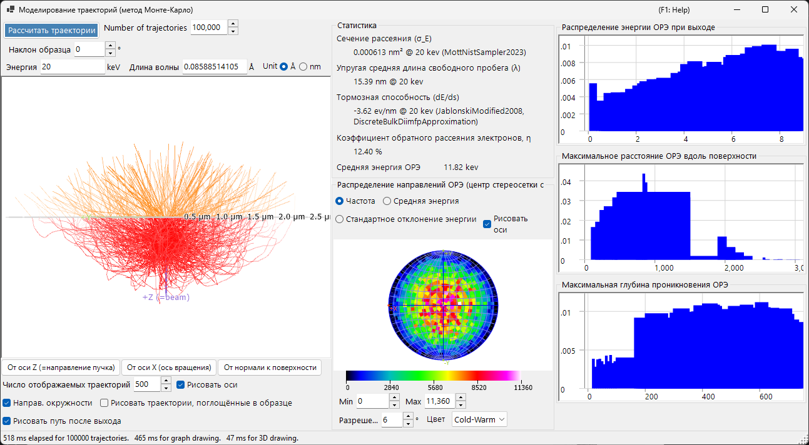
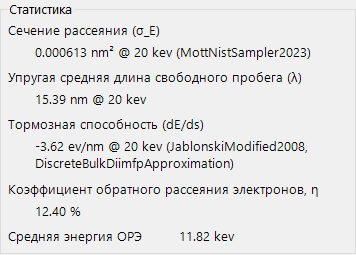
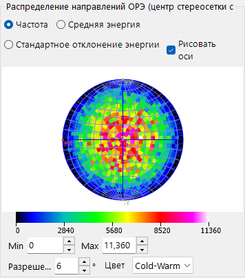
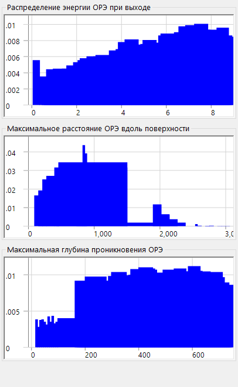

# Траектории электронов

**Симулятор траекторий (метод Монте-Карло)** вычисляет траектории электронов внутри образца **методом Монте-Карло**: падающие электроны испытывают упругое и неупругое рассеяние, и накапливаются получающиеся распределения обратно рассеянных электронов (ОРЭ, BSE) — направление, энергия в момент выхода, глубина проникновения и боковое распространение. Эти распределения также служат основой для угловых/энергетических/глубинных весов, используемых в [12. Моделирование EBSD](12-ebsd-simulation.md).

Окно состоит из трёх столбцов: слева — **трёхмерное изображение траекторий**, в середине — **Статистика** и стереосеть **Распределение направлений ОРЭ**, справа — три **гистограммы**. Состав и плотность образца берутся из кристалла, выбранного в главном окне; здесь задаются только энергия пучка, наклон образца и число траекторий.

---

## Сочетания клавиш и мыши

Траектории отображаются в трёхмерном виде OpenGL. Используется стандартная [навигация по виду](21-shortcuts.md) ReciPro, но **панорамирование отключено** — для перехода к стандартным ориентациям используйте кнопки предустановленных видов.

| Сочетание | Действие |
|----------|--------|
| <kbd>F1</kbd> | Открыть эту страницу онлайн-руководства |
| Перетаскивание левой кнопкой | Повернуть модель |
| Перетаскивание правой кнопкой вверх/вниз или колесо мыши | Масштабирование |
| <kbd>CTRL</kbd> + двойной щелчок правой кнопкой | Переключение ортографической / перспективной проекции |

→ См. **[21. Сочетания клавиш и мыши](21-shortcuts.md)** для обзора всех окон.

---

## Условия расчёта

Элементы управления в верхней части окна задают параметры запуска:

- **Рассчитать траектории** : запускает расчёт методом Монте-Карло. Строка состояния внизу окна отдельно показывает затраченное время на расчёт траекторий, отрисовку графиков и трёхмерную визуализацию.
- **Number of trajectories** : сколько падающих электронов прослеживать. Большее число электронов снижает статистический шум всех приведённых ниже распределений, а время расчёта растёт линейно.
- **Наклон образца** (°) : наклон поверхности образца вокруг оси *X*. Для нормального падения оставьте 0; используйте **−70°**, чтобы воспроизвести геометрию [симулятора EBSD](12-ebsd-simulation.md), где большой наклон увеличивает выход обратного рассеяния.
- **Energy** (keV) / **Wavelength** / **Unit** : ускоряющее напряжение падающего пучка и связанная с ним длина волны электрона с релятивистской поправкой. Энергия задаёт кинетическую энергию, используемую как упругой (NIST Mott), так и неупругой (тормозная способность / IMFP) моделями.

Сами модели рассеяния пользователь не выбирает: сечения упругого рассеяния берутся из встроенной таблицы NIST Mott (вне её диапазона используется экранированное резерфордовское рассеяние), а тормозная способность — из модифицированной формы Яблонского (Jablonski, 2008). Фактически использованная модель указывается рядом с каждым значением в разделе **Статистика**. Что представляют собой эти модели, см. в [Ослабление и перенос](appendix/a2-beam-interaction/attenuation-transport.md).

### Трёхмерное изображение траекторий

Красные траектории — электроны, поглощённые в образце, оранжевые — электроны, вышедшие как обратно рассеянные. Концентрические направляющие окружности подписаны в nm (или µm), а **+X**, **+Y**, **+Z (=beam)** обозначают оси.

- **От оси Z (=направление пучка)** / **От оси X (ось вращения)** / **От нормали к поверхности** : устанавливают вид вдоль стандартных направлений.
- **Число отображаемых траекторий** : сколько из рассчитанных траекторий отрисовывать (отрисовка всех 100 000 была бы нечитаемой и медленной).
- **Рисовать оси** / **Направ. окружности** : стрелки осей и шкала расстояний.
- **Рисовать траектории, поглощённые в образце** : включать электроны, которые так и не вышли из образца.
- **Рисовать путь после выхода** : продолжать отрисовку пути обратно рассеянного электрона после того, как он покинул поверхность.

---

## Статистика

Значения для текущей энергии пучка; в скобках указана модель, по которой получено каждое из них.

- **Сечение рассеяния (σ_E)** (nm²) — полное сечение упругого рассеяния на один атом.
- **Упругая средняя длина свободного пробега (λ)** (nm) — среднее расстояние между событиями упругого рассеяния.
- **Тормозная способность (dE/ds)** (eV/nm, отрицательная) — энергия, теряемая на единицу длины пути.
- **Коэффициент обратного рассеяния электронов, η** (%) — доля падающих электронов, снова покидающих образец через входную поверхность. Именно на этой величине основан контраст изображений в ОРЭ.
- **Средняя энергия ОРЭ** (keV) — средняя энергия обратно рассеянных электронов в момент выхода.

---

## Распределение направлений ОРЭ

Угловое распределение обратно рассеянных электронов, нанесённое на стереосеть, центр которой соответствует направлению нормали к поверхности.

- **Частота** / **Средняя энергия** / **Стандартное отклонение энергии** : величина, отображаемая цветом, — сколько электронов выходит в каждом направлении, их средняя энергия или разброс этой энергии.
- **Рисовать оси** : наложить направления +X / ±Y / ±Z.
- **Min** / **Max**, **Resolution**, **Цвет** : пределы цветовой шкалы, угловой размер ячейки гистограммы и цветовая карта.

---

## Гистограммы

Три распределения обратно рассеянных электронов, все нормированы на единичную площадь.

### Распределение энергии ОРЭ при выходе

Гистограмма **энергии, которую обратно рассеянные электроны ещё несут в момент выхода из образца** (keV), — а не потерь энергии. Симулятор EBSD использует её для взвешивания интегрирования master pattern по энергии.

### Максимальное расстояние ОРЭ вдоль поверхности

Гистограмма того, насколько далеко каждый обратно рассеянный электрон сместился **в боковом направлении** (параллельно поверхности, nm) до выхода. Это боковой размер области взаимодействия и, следовательно, собственный предел пространственного разрешения измерений ОРЭ или EBSD.

### Максимальная глубина проникновения ОРЭ

Гистограмма наибольшей глубины **по нормали к поверхности** (nm), которой достиг каждый обратно рассеянный электрон до выхода. Симулятор EBSD использует её для взвешивания интегрирования master pattern по глубине.

---

## См. также

- [Моделирование EBSD](12-ebsd-simulation.md)
- [Расчёт EBSD](appendix/a3-bloch-wave/ebsd.md)
- [Ослабление и перенос](appendix/a2-beam-interaction/attenuation-transport.md) — используемые здесь сечения упругого рассеяния, тормозная способность и пробеги.
- [Динамическая дифракция (блоховские волны)](appendix/a3-bloch-wave/index.md)
- [Симулятор HRTEM/STEM](9-hrtem-stem-simulator/index.md)
- [Симулятор дифракции](7-diffraction-simulator/index.md)
