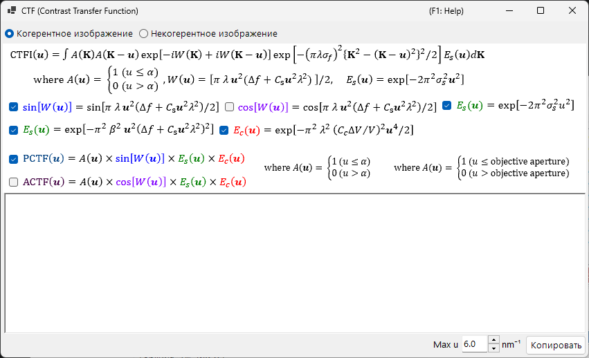
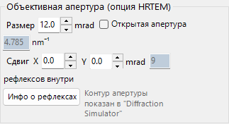
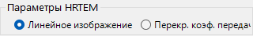
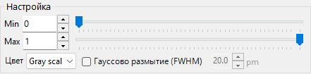

# Моделирование HRTEM

Моделирует изображения с разрешением кристаллической решётки в высокоразрешающем ПЭМ. Основной режим [симулятора HRTEM/STEM](index.md).

---

## Ход вычислений

1. **Метод блоховских волн**: вычисляет распространение электронной волны через потенциал кристалла; даёт амплитуду и фазу выходящей волны
2. **Линзовая функция**: применяет аберрации объективной линзы (сферическая аберрация $C_s$, дефокусировка $\Delta f$)
3. **Частичная когерентность**: учитывает конечный размер источника (пространственная когерентность) и энергетический разброс (временная когерентность)
4. **Формирование изображения**: вычисляет интенсивность $|\psi(\mathbf{r})|^2$

---

## Параметры образца

| Параметр | Описание |
|-----------|-------------|
| **Thickness** | Толщина образца (nm). HRTEM-изображения сильно зависят от толщины |

---

## Оптические параметры

### Условия TEM

| Параметр | Описание |
|-----------|-------------|
| **Acc. Vol.** | Ускоряющее напряжение (kV). Релятивистски скорректированная длина волны показана рядом |
| **Defocus** | Значение дефокусировки (nm). Дефокусировка Шерцера показана для справки |

### Внутренние параметры

| Параметр | Описание | Типично |
|-----------|-------------|---------|
| **Cs** | Сферическая аберрация (mm) | 0.5–1.0 (обычная); < 0.01 (с коррекцией Cs) |
| **Cc** | Хроматическая аберрация (mm) | 1.0–2.0 |
| **β** | Полуугол освещения (mrad) | 0.1–1.0 |
| **ΔE** | Энергетический разброс, ширина 1/*e* (eV) | 0.5–2.0 |

---

## Функция передачи фазового контраста (PCTF)

Отображается на вкладке линзовой функции:

- $\sin\chi(u)$: функция передачи фазового контраста ($\chi(u)$ — функция аберраций линзы)
- $E_\text{s}(u)$: огибающая пространственной когерентности
- $E_\text{c}(u)$: огибающая временной когерентности

Дефокусировка Шерцера: $\Delta f = -\sqrt{\tfrac{4}{3}\,C_s \lambda}\ (\approx -1.155\,\sqrt{C_s \lambda})$ — условие, дающее широкую отрицательную полосу PCTF (тёмный контраст = положения атомов). ReciPro использует это исходное значение Шерцера — выведенное путём приравнивания минимума фазы аберраций $\chi$ к $-2\pi/3$ — и значение, показанное в GUI, соответствует этой формуле; в некоторых источниках вместо этого используется *расширенное значение Шерцера* $-1.2\sqrt{C_s\lambda}$.

---

## Апертура объектива

Задайте размер апертуры (mrad) и положение. **Open aperture** убирает её. Число учитываемых блоховских волн зависит от условий апертуры.

---

## Модели частичной когерентности

| Модель | Описание |
|-------|-------------|
| **Quasi-coherent (linear image)** | Быстро. Справедливо в приближении слабой фазы |
| **TCC (Transmission Cross Coefficient)** | Точнее; больше время вычислений |

---

## Режимы моделирования

| Режим | Описание |
|------|-------------|
| **Single image** | Одно изображение при текущих толщине и дефокусировке |
| **Serial image** | Матрица изображений по диапазонам толщина × дефокусировка (Start / Step / Num) |

---

## Настройка изображения

| Параметр | Описание |
|---------|-------------|
| **Min / Max** | Диапазон отображения (ползунки настройки изображения) |
| **Colour** | Оттенки серого или Cold-Warm |
| **Gaussian blur (FWHM)** | Применяет фильтр Гаусса |
| **Unit cell** | Накладывает сетку элементарной ячейки |
| **Scale** | Показывает масштабную линейку |

---

## См. также

- [Симулятор HRTEM/STEM (обзор)](index.md)
- [Моделирование STEM](2-stem-simulation.md)
- [Моделирование потенциала](3-potential-simulation.md)
- [Приложение A3.2 — Формирование HRTEM-изображения](../appendix/a3-bloch-wave/hrtem.md)
