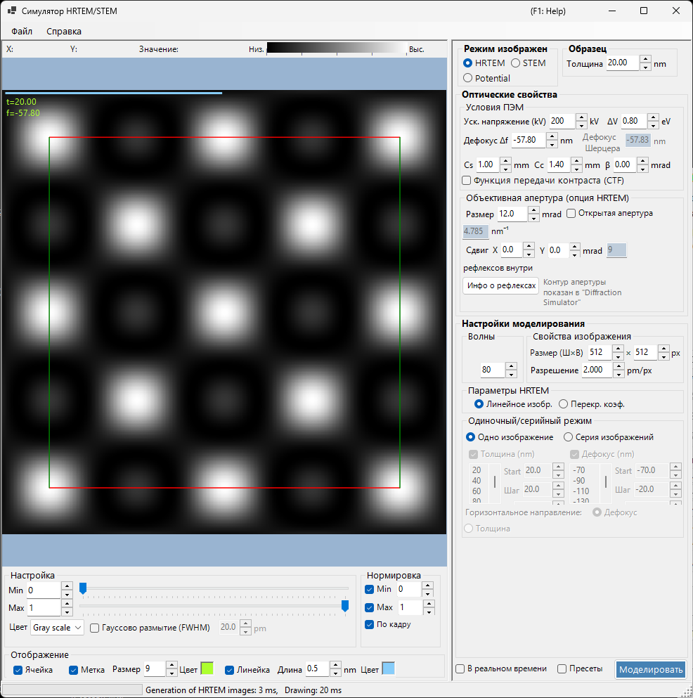
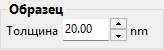
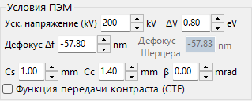
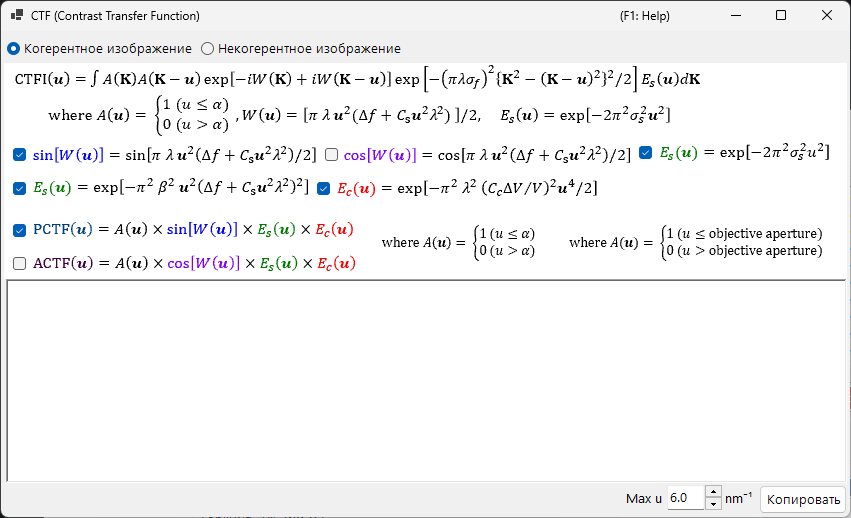
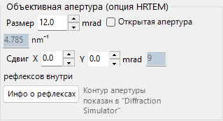
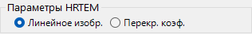
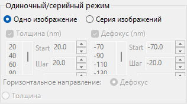
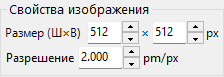
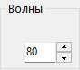

# Моделирование HRTEM

Моделирование **HRTEM (High-Resolution Transmission Electron Microscopy)** вычисляет изображения решёточных полос высокоразрешающей ПЭМ. Это основной режим [симулятора HRTEM/STEM](index.md).

> На этой странице описаны все настройки, которые появляются справа, когда выбрано **Режим изображения = HRTEM**. Об элементах управления на левой стороне — отображении результата и настройке его яркости — см. [страницу обзора](index.md#display-settings).

---

## Обзор

HRTEM-изображение формируется, когда электронная волна, прошедшая через образец, отображается под влиянием аберраций объективной линзы. ReciPro вычисляет распространение электронной волны внутри образца методом блоховских волн (динамический расчёт) и формирует HRTEM-изображение через функцию передачи фазового контраста (PCTF).

### Ход расчёта

1. **Метод блоховских волн**: вычисляет распространение электронной волны в потенциале кристалла и даёт амплитуду и фазу выходящей волны
2. **Функция линзы**: применяет аберрации объективной линзы (сферическая аберрация $C_s$, дефокусировка $\Delta f$)
3. **Частичная когерентность**: учитывает конечный размер источника (пространственная когерентность) и флуктуацию энергии (временная когерентность)
4. **Формирование изображения**: вычисляет распределение интенсивности $|\psi(\mathbf{r})|^2$

Теорию см. в [Приложении A3.2 — Формирование HRTEM-изображения](../appendix/a3-bloch-wave/hrtem.md).

---

## Образец

- **Толщина** : толщина образца (nm). HRTEM-изображения сильно зависят от толщины. В режиме **Серия изображений** это значение игнорируется и вместо него используется описанный ниже список толщин.

---

## Условия ПЭМ

Задаёт условия формирования изображения объективной линзой.

| Параметр | Описание | По умолчанию / типично |
|-----------|-------------|-------------------|
| **Уск. напряжение (kV)** | Ускоряющее напряжение. Справа показана релятивистски скорректированная длина волны электрона | 200 kV |
| **Дефокус Δf** | Дефокусировка объективной линзы (nm). Под ним для справки показано значение **Дефокус Шерцера** | −57.8 nm |
| **Cs** | Коэффициент сферической аберрации (mm). Влияет на CTF и дефокусировку Шерцера | 0.5–1.0 (обычная), < 0.01 (с коррекцией Cs) |
| **Cc** | Коэффициент хроматической аберрации (mm). Определяет размытие изображения, вызванное энергетическим разбросом | 1.0–2.0 mm |
| **β** | Полуугол освещения (mrad). Описывает влияние конечного размера источника (пространственная когерентность) | 0.1–1.0 mrad |
| **ΔV** | Полная ширина на половине высоты энергетического разброса электронов (eV). Вместе с Cc определяет разброс фокуса из-за хроматической аберрации | 0.5–2.0 eV |

> **Контекстное меню**: на панели условий ПЭМ одним щелчком можно применить **Обнулить все аберрации** / **Установить дефокус по Шерцеру** / **Установить дефокус 0 nm**. Пресеты условий (300kV ARM300F, 200kV 2100F и т. д.) доступны через **Пресеты** в левой нижней части окна.

### Дефокусировка Шерцера

Значение дефокусировки, вблизи которого фазовый контраст оптимален; вычисляется из текущей длины волны и сферической аберрации $C_s$ (показывается для справки).

$$\Delta f_{\text{Scherzer}} = -\sqrt{\tfrac{4}{3}\,C_s \lambda}\quad\left(\approx -1.155\,\sqrt{C_s \lambda}\right)$$

При этом условии PCTF отрицательна в широком диапазоне пространственных частот, поэтому положения атомов выглядят как тёмный контраст. ReciPro использует это исходное значение Шерцера (выведенное приравниванием минимума фазы аберраций $\chi$ к $-2\pi/3$), и значение, показанное в GUI, следует этой формуле. Заметим, что в некоторых источниках вместо этого используется *расширенное значение Шерцера* $-1.2\sqrt{C_s\lambda}$, которое ещё больше расширяет полосу передачи.

---

## Функция линзы / функция передачи контраста (CTF)

Если отметить **Функция передачи контраста (CTF)**, открывается окно с графиками того, как аберрации линзы и дефокусировка передают контраст изображения на каждой пространственной частоте.

- $\sin\chi(u)$ : функция передачи фазового контраста ($\chi(u)$ — функция аберраций линзы)
- $E_\text{s}(u)$ : огибающая функция пространственной когерентности; затухание из-за конечного размера источника ($\beta$)
- $E_\text{c}(u)$ : огибающая функция временной когерентности; затухание из-за флуктуации энергии ($C_c$, $\Delta V$)

Изменение верхней границы горизонтальной оси $u$ (пространственной частоты) меняет диапазон построения.

---

## Объективная апертура (опция HRTEM)

Ограничивает дифрагированные волны, проходящие через объективную апертуру. Число дифрагированных волн, отсекаемых апертурой, также меняет число рефлексов, учитываемых в расчёте блоховских волн (верхняя граница — максимальное число блоховских волн, заданное в **Волны**).

- **Размер** : полуугол объективной апертуры (mrad). Чем он меньше, тем больше дифрагированных волн под большими углами отсекается и тем более сглаженными становятся высокоразрешающие детали. Отображается соответствующий радиус в обратном пространстве $\sin\theta/\lambda$ (nm⁻¹).
- **Сдвиг X** / **Y** : смещение центра объективной апертуры (mrad). Используется для темнопольной съёмки и съёмки с наклоном.
- **Открытая апертура** : открывает объективную апертуру (бесконечную), так что для формирования изображения используются все дифрагированные волны.
- **рефлексов внутри** : число дифрагированных пучков (рефлексов), попадающих внутрь апертуры (только для чтения).
- **Инфо о рефлексах** : открывает таблицу дифрагированных пучков внутри апертуры (интенсивность, комплексная амплитуда и т. д.).

> Размер объективной апертуры также показывается в **Симуляторе дифракции**.

---

## Параметры HRTEM (модель частичной когерентности)

Выбирает модель интерференции, используемую при интегрировании вкладов от всех направлений падающего пучка.

- **Линейное изобр.** (Linear image) : вычислительно дешёвая модель. Подходит для тонких образцов, где справедливо приближение слабого фазового объекта; умножает PCTF на огибающие пространственной и временной когерентности.
- **Перекр. коэф.** (Transmission cross coefficient) : вычислительно затратная, но более точная модель. Интегрирует полный перекрёстный коэффициент пропускания; это модель для сильных рассеивателей, возбуждающих много сильных дифрагированных волн.

Подробнее см. [Приложение A3.2 — Формирование HRTEM-изображения](../appendix/a3-bloch-wave/hrtem.md).

---

## Одиночный/серийный режим

- **Одно изображение** : вычисляет одно HRTEM-изображение при текущих толщине и дефокусировке.
- **Серия изображений** : создаёт набор изображений с пошаговым изменением толщины и дефокусировки (серия по толщине / по фокусу). Полезно для поиска условия, наилучшим образом совпадающего с экспериментальным изображением.

Для серии изображений задайте следующее.

| Элемент | Описание |
|------|-------------|
| **Толщина (nm)** / **Дефокус (nm)** | Какую величину варьировать (допускаются обе) |
| **Start / Шаг / N** | Начальное значение, шаг и число изображений. Они разворачиваются в список ниже, который также можно редактировать напрямую |
| **Горизонтальное направление:** | Когда варьируются и толщина, и дефокусировка, — величина, откладываемая по горизонтали сетки (**Дефокус** или **Толщина**) |

При варьировании и толщины, и дефокусировки получается матрица изображений «строки × столбцы».

---

## Свойства изображения

- **Размер (Ш×В)** : число пикселей смоделированного изображения (по умолчанию 512×512).
- **Разрешение** : разрешение дискретизации (pm/px). Меньшее значение разрешает более тонкие решёточные полосы, но время FFT растёт пропорционально.

---

## Волны

- Максимальное число блоховских волн, используемых в методе Бете (динамический расчёт), по умолчанию 80. Большее число повышает точность, но решение задачи на собственные значения требует времени $O(N^3)$.

---

## См. также

- [Симулятор HRTEM/STEM (обзор)](index.md)
- [Моделирование STEM](2-stem-simulation.md)
- [Моделирование потенциала](3-potential-simulation.md)
- [Приложение A3.2 — Формирование HRTEM-изображения](../appendix/a3-bloch-wave/hrtem.md)
