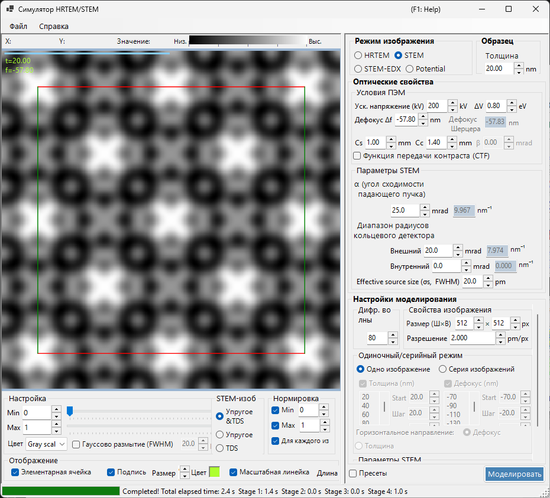
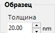
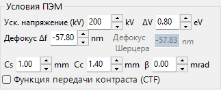
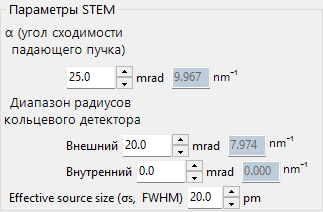
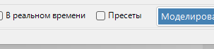
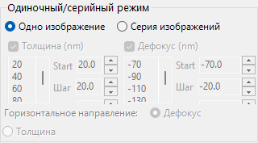
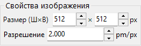
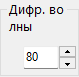
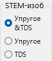

# Моделирование STEM

**Моделирование STEM (Scanning Transmission Electron Microscopy)** вычисляет изображения растровой просвечивающей электронной микроскопии методом блоховских волн.

> На этой странице перечислены все настройки, которые появляются справа, когда выбрано **Image mode = STEM**. Об элементах управления отображением результата, яркостью и нормировкой слева см. [страницу обзора](index.md). Ниже повторяется только специфичная для STEM **цель отображения**.

---

## Обзор

Сходящийся электронный пучок сканируется по образцу, а прошедшие и рассеянные электроны в каждой точке сканирования регистрируются кольцевыми детекторами. ReciPro вычисляет STEM-изображение методом блоховских волн (динамический расчёт).

### Ход расчёта

1. В каждой точке сканирования вычислите дифрагированные интенсивности методом блоховских волн для каждого направления падения сходящегося зонда.
2. Проинтегрируйте рассеянную интенсивность по угловому диапазону детектора.
3. Могут быть вычислены вклады как упругого, так и теплового диффузного рассеяния (TDS).

Теорию см. в [Приложении A3.4 — Расчёт STEM](../appendix/a3-bloch-wave/stem.md).

---

## Типы детекторов

| Детектор | Угловой диапазон | Основной вклад | Контраст |
|----------|-------------|-------------------|----------|
| **BF** (светлое поле) | 0 – угол сходимости | Упругий | Фазовый контраст |
| **ABF** (кольцевое светлое поле) | Внутренняя часть угла сходимости | Упругий | Чувствительность к лёгким элементам |
| **LAADF** (кольцевое тёмное поле при малом угле) | Сразу за углом сходимости | Упругий + TDS | Чувствительность к деформациям |
| **HAADF** (кольцевое тёмное поле при большом угле) | Значительно за углом сходимости | TDS (неупругий) | Z-контраст ($\propto Z^2$) |

> **Типичные настройки детекторов** (каждая доступна одним щелчком из контекстного меню параметров STEM, все с углом сходимости α = 25 mrad):
> BF (0–5 mrad) / ABF (12–24 mrad) / LAADF (26–60 mrad) / HAADF (80–250 mrad)

---

## Параметры образца

- **Thickness** : толщина образца (nm). Это значение игнорируется в режиме **Serial image**.

---

## Условия ПЭМ

| Параметр | Описание | По умолчанию / типично |
|-----------|-------------|-------------------|
| **Acc. Vol. (kV)** | Ускоряющее напряжение. Рядом отображается релятивистски скорректированная длина волны электрона | 200 kV |
| **Defocus Δf** | Дефокусировка объективной (формирующей зонд) линзы (nm) | −57.8 nm |
| **Cs** | Коэффициент сферической аберрации (mm). Влияет на размер зонда | 0.5–1.0 mm |
| **Cc** | Коэффициент хроматической аберрации (mm) | 1.0–2.0 mm |
| **ΔV (FWHM)** | Полная ширина на половине высоты разброса энергии электронов (eV) | 0.5–2.0 eV |

> **β (полуугол освещения) отключён в режиме STEM**, поскольку его роль выполняет угол сходимости α.

---

## Параметры STEM (оптические)

Задайте геометрию сходящегося зонда и кольцевого детектора. Справа каждый угол также показан в пересчёте на радиус в обратном пространстве $\sin\theta/\lambda$ (nm⁻¹).

| Параметр | Описание | По умолчанию / типично |
|-----------|-------------|-------------------|
| **α (convergence angle)** | Полуугол сходящегося зонда (mrad). Бо́льшие значения дают более тонкий зонд и изменяют дифракционный контраст | 15–25 mrad |
| **(Annular) detector inner angle** | Внутренний полуугол сбора кольцевого детектора (mrad). Сигнал внутри этого угла исключается | BF: 0, HAADF: 80 |
| **(Annular) detector outer angle** | Внешний полуугол сбора кольцевого детектора (mrad). Сигнал за пределами этого угла исключается | BF: 5, HAADF: 250 |
| **Effective source size σs (FWHM)** | Эффективный размер источника электронов. Бо́льшие значения размывают зонд и снижают контраст мелких деталей | — |

---

## Параметры STEM (моделирование)

- **Slice thickness for inelastic** : толщина слоя образца (nm), используемая при вычислении интенсивности TDS (тепловое диффузное, неупругое). Меньшие значения точнее, но медленнее.
- **Angular resolution** : угловое разрешение выборки направлений падения зонда (mrad). Меньшие значения дискретизируют зонд более мелко, но медленнее.

---

## Режим изображения (single / serial)

- **Single image** : вычислить одно STEM-изображение при текущей толщине.
- **Serial image** : сформировать серию изображений с пошаговым изменением толщины / дефокусировки (задаётся через **Start / Step / Num**; список ниже также можно редактировать напрямую).

---

## Свойства изображения

- **Size (W×H)** : число пикселей сканированного изображения (по умолчанию 512×512). В STEM это равно числу точек сканирования и линейно масштабирует время вычисления.
- **Resolution** : разрешение выборки (pm/px).

---

## Дифрагированные волны

- **Max Bloch waves** : максимальное число блоховских волн, используемых в методе Бете (по умолчанию 80). Стоимость задачи на собственные значения масштабируется как куб числа волн.

---

## Цель отображения STEM (со стороны результата)

Переключатель отображения внизу слева в окне выбирает, какую компоненту рассеяния уже вычисленного STEM-изображения показать (переключается без пересчёта).

| Цель отображения | Описание |
|----------------|-------------|
| **Elastic** | Изображение только из упругого рассеяния |
| **TDS** | Изображение только из теплового диффузного рассеяния |
| **Elastic & TDS** | Сумма упругого + TDS |

---

## Вычислительная стоимость

Моделирование STEM требует больших вычислительных затрат, поэтому следующие параметры следует выбирать соответствующим образом.

| Фактор | Влияние |
|--------|--------|
| **Угол сходимости** | Больше → больше перекрытие дисков CBED → выше стоимость |
| **Блоховские волны** | Стоимость задачи на собственные значения масштабируется как N³ |
| **Угловое разрешение** | Тоньше → точнее, но стоимость масштабируется как N² |
| **Пиксели изображения (Size)** | Линейное масштабирование с числом точек сканирования |

---

## Важность температурного фактора

Для моделирования HAADF-STEM атомы должны иметь ненулевой изотропный температурный фактор (фактор Дебая–Валлера). Если значение неизвестно, задайте $B \approx 0.5\ \text{Å}^2$. При нулевом температурном факторе интенсивность TDS равна нулю, и HAADF-изображение вычисляется неверно.

| Детектор | Диапазон | Основной вклад |
|----------|-------|-------------------|
| BF, ABF | Внутри угла сходимости | Упругий |
| LAADF, HAADF | За пределами угла сходимости | Неупругий (TDS) |

---

## Сравнение с Dr. Probe

Подтверждено, что STEM-моделирования ReciPro близко согласуются с широко используемым графическим интерфейсом Dr. Probe (v1.10). На рисунке ниже сравниваются оба для детекторов BF, ABF, LAADF и HAADF по серии толщин (2.96–60.05 nm), как без аберраций (слева), так и с Cs = 0.2 mm, дефокусировка = −25.9 nm (справа). Обе программы согласуются по всем типам детекторов и толщинам.

Более подробный отчёт доступен в виде PDF: [Сравнение STEM-моделирований графическим интерфейсом Dr. Probe (v1.10) и ReciPro (v4.854)](https://github.com/seto77/ReciPro/files/10976084/ComparisonSTEMsimulations.pdf).

---

## См. также

- [Симулятор HRTEM/STEM (обзор)](index.md)
- [Моделирование HRTEM](1-hrtem-simulation.md)
- [Моделирование потенциала](3-potential-simulation.md)
- [Приложение A3.4 — Расчёт STEM](../appendix/a3-bloch-wave/stem.md)
- [Приложение A3.4 — Расчёт STEM](../appendix/a3-bloch-wave/stem.md)
