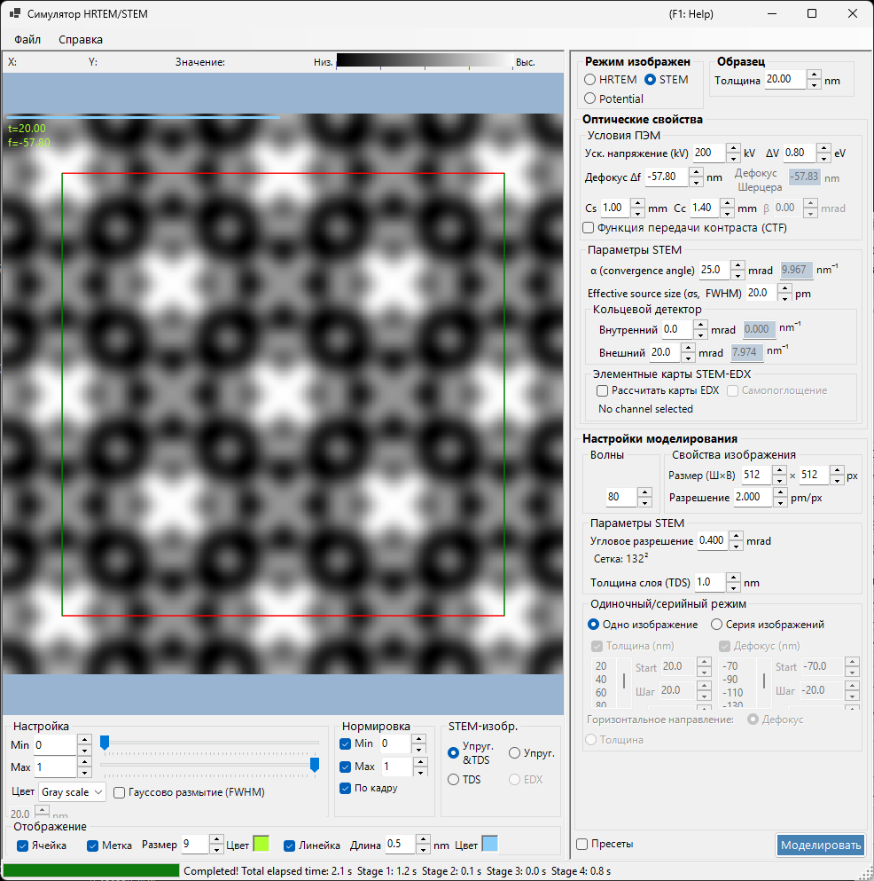
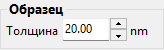
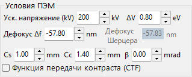
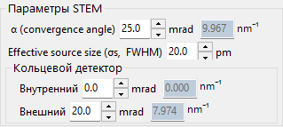
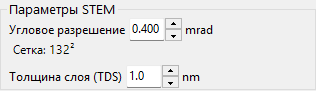
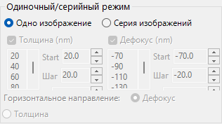
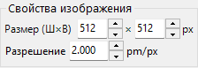
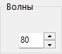
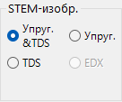
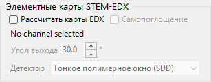

# Моделирование STEM

**Моделирование STEM (Scanning Transmission Electron Microscopy)** вычисляет изображения растровой просвечивающей электронной микроскопии методом блоховских волн.

> На этой странице перечислены все настройки, которые появляются справа, когда выбрано **Image mode = STEM**. Об элементах управления отображением результата, яркостью и нормировкой слева см. [страницу обзора](index.md). Ниже повторяется только специфичная для STEM **цель отображения**.

---

## Обзор

Сходящийся электронный пучок сканируется по образцу, а прошедшие и рассеянные электроны в каждой точке сканирования регистрируются кольцевыми детекторами. ReciPro вычисляет STEM-изображение методом блоховских волн (динамический расчёт).

### Ход расчёта

1. В каждой точке сканирования вычислите дифрагированные интенсивности методом блоховских волн для каждого направления падения сходящегося зонда.
2. Проинтегрируйте рассеянную интенсивность по угловому диапазону детектора.
3. Могут быть вычислены вклады как упругого, так и теплового диффузного рассеяния (TDS).

Теорию см. в [Приложении A3.4 — Расчёт STEM](../appendix/a3-bloch-wave/stem.md).

---

## Типы детекторов

| Детектор | Угловой диапазон | Основной вклад | Контраст |
|----------|-------------|-------------------|----------|
| **BF** (светлое поле) | 0 – угол сходимости | Упругий | Фазовый контраст |
| **ABF** (кольцевое светлое поле) | Внутренняя часть угла сходимости | Упругий | Чувствительность к лёгким элементам |
| **LAADF** (кольцевое тёмное поле при малом угле) | Сразу за углом сходимости | Упругий + TDS | Чувствительность к деформациям |
| **HAADF** (кольцевое тёмное поле при большом угле) | Значительно за углом сходимости | TDS (неупругий) | Z-контраст ($\propto Z^2$) |

> **Типичные настройки детекторов** (каждая доступна одним щелчком из контекстного меню параметров STEM, все с углом сходимости α = 25 mrad):
> BF (0–5 mrad) / ABF (12–24 mrad) / LAADF (26–60 mrad) / HAADF (80–250 mrad)

---

## Параметры образца

- **Thickness** : толщина образца (nm). Это значение игнорируется в режиме **Serial image**.

---

## Условия ПЭМ

| Параметр | Описание | По умолчанию / типично |
|-----------|-------------|-------------------|
| **Acc. Vol. (kV)** | Ускоряющее напряжение. Рядом отображается релятивистски скорректированная длина волны электрона | 200 kV |
| **Defocus Δf** | Дефокусировка объективной (формирующей зонд) линзы (nm) | −57.8 nm |
| **Cs** | Коэффициент сферической аберрации (mm). Влияет на размер зонда | 0.5–1.0 mm |
| **Cc** | Коэффициент хроматической аберрации (mm) | 1.0–2.0 mm |
| **ΔV (FWHM)** | Полная ширина на половине высоты разброса энергии электронов (eV) | 0.5–2.0 eV |

> **β (полуугол освещения) отключён в режиме STEM**, поскольку его роль выполняет угол сходимости α.

---

## Параметры STEM (оптические)

Задайте геометрию сходящегося зонда и кольцевого детектора. Справа каждый угол также показан в пересчёте на радиус в обратном пространстве $\sin\theta/\lambda$ (nm⁻¹).

| Параметр | Описание | По умолчанию / типично |
|-----------|-------------|-------------------|
| **α (convergence angle)** | Полуугол сходящегося зонда (mrad). Бо́льшие значения дают более тонкий зонд и изменяют дифракционный контраст | 15–25 mrad |
| **(Annular) detector inner angle** | Внутренний полуугол сбора кольцевого детектора (mrad). Сигнал внутри этого угла исключается | BF: 0, HAADF: 80 |
| **(Annular) detector outer angle** | Внешний полуугол сбора кольцевого детектора (mrad). Сигнал за пределами этого угла исключается | BF: 5, HAADF: 250 |
| **Effective source size σs (FWHM)** | Эффективный размер источника электронов. Бо́льшие значения размывают зонд и снижают контраст мелких деталей | — |

---

## Параметры STEM (моделирование)

- **Slice thickness for inelastic** : толщина слоя образца (nm), используемая при вычислении интенсивности TDS (тепловое диффузное, неупругое). Меньшие значения точнее, но медленнее.
- **Angular resolution** : угловое разрешение выборки направлений падения зонда (mrad). Меньшие значения дискретизируют зонд более мелко, но медленнее. Число направлений растёт как квадрат этого отношения, поэтому это главный рычаг управления временем расчёта; измеренные данные о сходимости см. в разделе [Угловая дискретизация зонда](../appendix/a3-bloch-wave/stem.md#angular-sampling).

---

## Режим изображения (single / serial)

- **Single image** : вычислить одно STEM-изображение при текущей толщине.
- **Serial image** : сформировать серию изображений с пошаговым изменением толщины / дефокусировки (задаётся через **Start / Step / Num**; список ниже также можно редактировать напрямую).

---

## Свойства изображения

- **Size (W×H)** : число пикселей сканированного изображения (по умолчанию 512×512). В STEM это равно числу точек сканирования и линейно масштабирует время вычисления.
- **Resolution** : разрешение выборки (pm/px).

---

## Дифрагированные волны

- **Max Bloch waves** : максимальное число блоховских волн, используемых в методе Бете (по умолчанию 80). Стоимость задачи на собственные значения масштабируется как куб числа волн.

---

## Цель отображения STEM (со стороны результата) {#stem-display-target}

Переключатель отображения внизу слева в окне выбирает, какую компоненту рассеяния уже вычисленного STEM-изображения показать (переключается без пересчёта).

| Цель отображения | Описание |
|----------------|-------------|
| **Elastic** | Изображение только из упругого рассеяния |
| **TDS** | Изображение только из теплового диффузного рассеяния |
| **Elastic & TDS** | Сумма упругого + TDS |
| **EDX** | Карта характеристического рентгеновского излучения. Отображаемая линия (например `O-K`) выбирается в выпадающем списке ниже, а флажок **Общая EDX** в группе *Нормировка* задаёт всем каналам единый диапазон отображения, поэтому переключение канала не меняет масштаб изображения |

!!! note
    Все три изображения восстанавливаются из вещественной части суммы Фурье, поэтому **Elastic & TDS** в точности равно сумме двух остальных. До версии 4.944 брался модуль, что нарушало это тождество и слегка высветляло тёмные пиксели. См. [Восстановление вещественного изображения](../appendix/a3-bloch-wave/stem.md#real-image-reconstruction).

---

## Элементные карты STEM-EDX {#stem-edx}

Установите флажок **Рассчитать карты EDX**, чтобы вместе с изображением ADF-типа вычислялись карты характеристического рентгеновского излучения. Это не отдельный режим: упругий, TDS- и EDX-сигналы получаются в одном и том же STEM-расчёте, а между ними затем можно переключаться в разделе [Цель отображения STEM](#stem-display-target) без пересчёта.

Выбора элементов нет. Когда флажок установлен, вычисляются **все каналы «элемент/оболочка», которые могут быть рассчитаны для данного кристалла при данном ускоряющем напряжении**, а строка под флажком перечисляет их (например `3 карт: O-K, Mg-K, Al-K`). Канал доступен, когда край ионизации лежит ниже ускоряющего напряжения, а оболочка покрыта поставляемыми данными — K: C–Sn (Z = 6–50), L-total: Ca–Rn (Z = 20–86). Поставляемая таблица хранит полностью релятивистские ионизационные формфакторы вплоть до вектора рассеяния 8 Å⁻¹ для каждого канала, поэтому L-линии тяжёлых элементов вплоть до радона моделируются без экстраполяции. Если недоступен ни один канал, расчёт отклоняется с пояснительным сообщением, а не выдаёт пустую карту.

Следующая строка сообщает сетку направлений зонда, например `Сетка: 132² (рекомендуется: ≥48²)`. Эта сетка задаётся параметром **Угловое разрешение** и углом сходимости; см. [Угловая дискретизация зонда](../appendix/a3-bloch-wave/stem.md#angular-sampling). При делении ниже рекомендуемого невязка эрмитовости для ±q может превысить допуск и прервать расчёт, поэтому значение подсвечивается оранжевым, а перед началом вычисления появляется диалог подтверждения.

!!! warning "Что означают значения"
    Карта — это **число вакансий на внутренних оболочках, создаваемых на один падающий электрон**: модельная величина, а не предсказанное число рентгеновских квантов. Выход флуоресценции, самопоглощение в образце, телесный угол детектора и эффективность детектора **не** учитываются. Используйте карты для анализа пространственного распределения и для сравнения толщин или ориентаций, а не для абсолютной количественной оценки.

### Параметры детектора (зарезервировано)

Элементы **Самопоглощение**, **Угол выхода** и **Детектор** размещены на панели, но отключены: они относятся к модели детектора, которая пока не реализована. Они показаны для того, чтобы панель не смещалась, когда модель будет добавлена. Их будущее влияние различается по своей природе:

| Фактор | Контраст между пикселями в одной карте | Отношение между картами элементов |
|---|---|---|
| Самопоглощение (угол выхода) | **изменяет** | **изменяет** |
| Окно детектора / мёртвый слой / эффективность | не влияет | **изменяет сильно** |
| Телесный угол детектора, ток пучка, время накопления в точке | не влияет | не влияет |

Последняя строка объясняет, почему ReciPro вообще не выводит ток пучка и время накопления в настройки: они умножают каждый пиксель каждой карты на одно и то же число, сокращаются в любом отношении и незаметны после нормировки отображения.

### Точность и стоимость

STEM-EDX не накладывает дополнительных ограничений на число волн или толщину слоя: расчёт идёт по тем же путям, что и изображение ADF-типа, поэтому любые настройки, подходящие для STEM, подходят и для EDX.

Точность остаётся на ваше усмотрение — так же, как для числа волн или углового разрешения. Для ориентира: ошибка интегрирования по глубине растёт примерно пропорционально параметру **Толщина слоя (TDS)** — около 2–3 % при 1 nm, 4–8 % при 2 nm и 12–23 % при 4 nm (относительно пика, SrTiO₃ при 39 nm). Уменьшение толщины слоя вдвое примерно вдвое уменьшает ошибку и примерно вдвое увеличивает объём работы по интегрированию по глубине.

Если заданы аберрации (например, Cs = 1 мм с дефокусировкой Шерцера при α = 25 мрад), фаза аберраций быстро осциллирует по сетке направлений зонда, и STEM-EDX может отказаться от расчёта с ошибкой *non-Hermitian residual* даже на мелкой сетке — этот отказ защищает карту от сеточных артефактов в несколько процентов. Уменьшите Cs и дефокусировку (среднее по сканированию карты EDX вовсе не зависит от аберраций) или сделайте **Угловое разрешение** заметно мельче, приняв более долгий расчёт.

---

## Вычислительная стоимость

Моделирование STEM требует больших вычислительных затрат, поэтому следующие параметры следует выбирать соответствующим образом.

| Фактор | Влияние |
|--------|--------|
| **Угол сходимости** | Больше → больше перекрытие дисков CBED → выше стоимость |
| **Блоховские волны** | Стоимость задачи на собственные значения масштабируется как N³ |
| **Угловое разрешение** | Тоньше → точнее, но стоимость масштабируется как N² |
| **Пиксели изображения (Size)** | Линейное масштабирование с числом точек сканирования |

---

## Важность температурного фактора

Для моделирования HAADF-STEM атомы должны иметь ненулевой изотропный температурный фактор (фактор Дебая–Валлера). Если значение неизвестно, задайте $B \approx 0.5\ \text{Å}^2$. При нулевом температурном факторе интенсивность TDS равна нулю, и HAADF-изображение вычисляется неверно.

| Детектор | Диапазон | Основной вклад |
|----------|-------|-------------------|
| BF, ABF | Внутри угла сходимости | Упругий |
| LAADF, HAADF | За пределами угла сходимости | Неупругий (TDS) |

---

## Сравнение с Dr. Probe

Подтверждено, что STEM-моделирования ReciPro близко согласуются с широко используемым графическим интерфейсом Dr. Probe (v1.10). На рисунке ниже сравниваются оба для детекторов BF, ABF, LAADF и HAADF по серии толщин (2.96–60.05 nm), как без аберраций (слева), так и с Cs = 0.2 mm, дефокусировка = −25.9 nm (справа). Обе программы согласуются по всем типам детекторов и толщинам.

Более подробный отчёт доступен в виде PDF: [Сравнение STEM-моделирований графическим интерфейсом Dr. Probe (v1.10) и ReciPro (v4.854)](https://github.com/seto77/ReciPro/files/10976084/ComparisonSTEMsimulations.pdf).

---

## Сравнение с py_multislice

Карты STEM-EDX в ReciPro также проверены против [py_multislice](https://github.com/HamishGBrown/py_multislice) — независимого кода мультислайс / замороженных фононов. На рисунке сравниваются карты O-K, Ti-K и Sr-L для SrTiO₃ [001] при 200 кВ по серии толщин (3,91–62,48 нм), без аберраций (слева) и при Cs = 0,2 мм, дефокусе −25,9 нм (справа).

Нормированные формы карт совпадают с точностью 1–2 % для Ti-K и Sr-L в тонком пределе. **Суммарные** значения расходятся на ±10–17 %, поскольку коды берут сечения ионизации из разных источников (Bote–Salvat в ReciPro, таблицы группы Аллена в py_multislice). Отношение ReciPro / py_multislice также падает с толщиной, так как поглощающая модель ReciPro убирает термически рассеянные электроны, тогда как в замороженных фононах они продолжают ионизировать — это даёт количественную оценку практической погрешности поглощающего приближения для EDX.

Полный отчёт с количественными кривыми и анализом пространственных частот доступен в PDF: [Сравнение расчётов STEM-EDX в py_multislice и ReciPro (v4.945, набор данных ионизации v3.0.0)](../../assets/references/STEM_EDX_pyms_comparison.pdf).

---

## См. также

- [Симулятор HRTEM/STEM (обзор)](index.md)
- [Моделирование HRTEM](1-hrtem-simulation.md)
- [Моделирование потенциала](3-potential-simulation.md)
- [Приложение A3.4 — Расчёт STEM](../appendix/a3-bloch-wave/stem.md)
