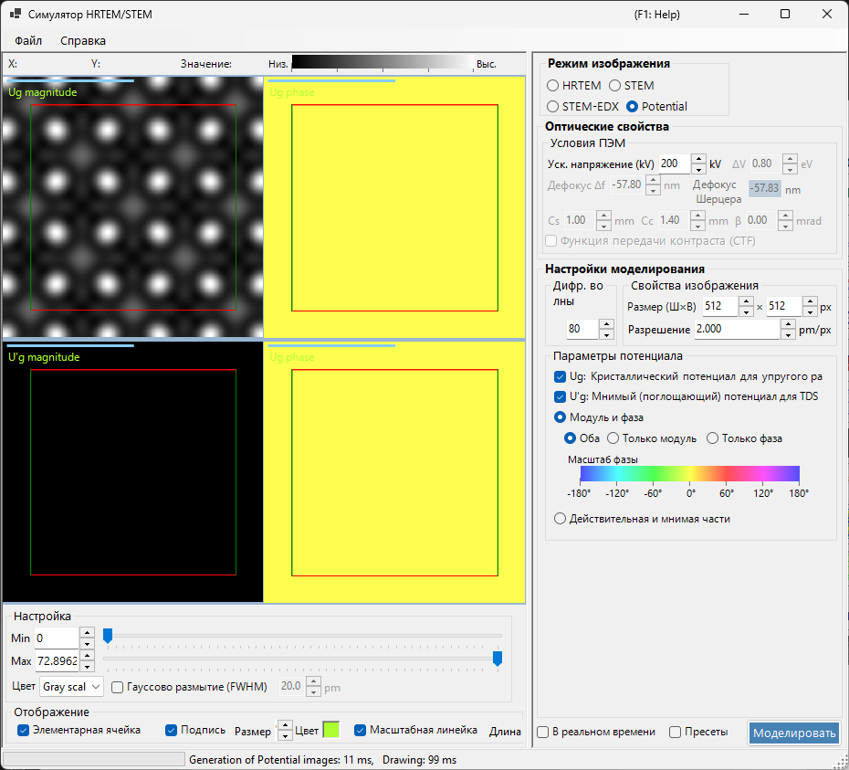
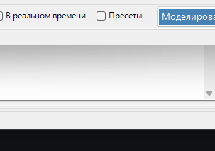

# Моделирование потенциала

**Моделирование потенциала** вычисляет и отображает двумерное распределение кристаллического потенциала. Эффекты передачи изображения (аберрации линз, детектор) не применяются: визуализируется сам проецированный кристаллический потенциал.

> На этой странице описаны все настройки, появляющиеся справа, когда **Image mode = Potential**. Об отображении результата, регулировке яркости и остальных элементах управления слева см. [обзорную страницу](index.md#display-settings).

---

## Обзор

Электроны внутри кристалла рассеиваются на кристаллическом потенциале. Его распределение лежит в основе всех дифракционных и изображающих явлений и является ключевой информацией для понимания структуры кристалла. Поскольку этот режим не учитывает ни аберраций линз, ни зависящих от толщины динамических эффектов, он хорошо подходит для исследования самой структуры.

> **В режиме потенциала панели толщины образца, нормировки интенсивности и режима изображения (single / serial) не отображаются.** Из условий ПЭМ активно только ускоряющее напряжение.

---

## Условия ПЭМ

- **Acc. voltage (kV)** — ускоряющее напряжение. Оно задаёт длину волны электрона и используется для вычисления коэффициентов Фурье $U_g$ потенциала.

> **Defocus, Cs, Cc, β, ΔE и PCTF в режиме потенциала неактивны** (изображающая оптика не применяется) и отображаются серым.

---

## Параметры потенциала

Выбирает, какой потенциал отображается и как он представляется.

### Целевой потенциал

| Тип | Описание |
|------|-------------|
| **$U_g$ — elastic scattering potential** | (Электростатический) кристаллический потенциал, ответственный за упругое рассеяние. Представляет силу рассеяния |
| **$U'_g$ — absorption potential** | Мнимый (поглощающий) потенциал, возникающий из теплового диффузного рассеяния (TDS). Представляет потери из упругого канала |

$U_g$ и $U'_g$ можно отображать одновременно (для каждого отмеченного добавляется отдельная область).

### Способ отображения

| Режим | Параметры |
|------|---------|
| **Magnitude and phase** | **Both** / **Magnitude only** / **Phase only** (фаза отображается цветовым кругом, а под ним показана шкала фазы) |
| **Real and imaginary part** | **Both** / **Real only** / **Imaginary only** |

---

## Свойства изображения

- **Size (W×H)** — размеры генерируемого изображения в пикселях (по умолчанию 512×512).
- **Resolution** — разрешение дискретизации (pm/px).

---

## Дифрагированные волны

- **Max Bloch waves** — максимальное число блоховских волн (коэффициентов Фурье), включаемых в фурье-синтез потенциала (по умолчанию 80). Большие значения включают более высокие пространственные частоты и воспроизводят более тонкие детали потенциала.

---

## Регулировка изображения (слева)

Яркость (Min / Max), цветовая шкала и наложение сетки элементарной ячейки задаются слева в разделах **Adjust** и **Display** (см. [обзорную страницу](index.md#display-settings)).

---

## См. также

- [Симулятор HRTEM/STEM (обзор)](index.md)
- [Моделирование HRTEM](1-hrtem-simulation.md)
- [Моделирование STEM](2-stem-simulation.md)
