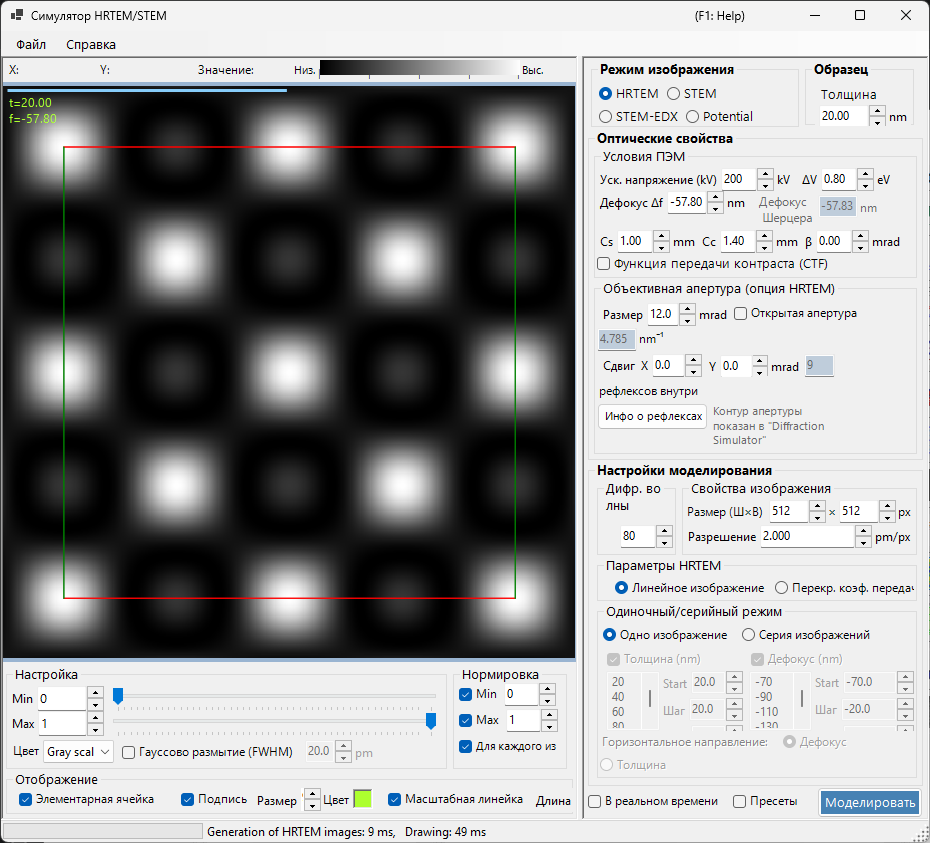
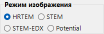
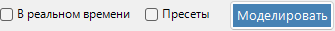
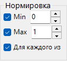
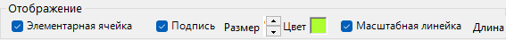

# HRTEM / STEM Simulator

**Симулятор HRTEM/STEM** моделирует изображения решёточных полос ПЭМ (HRTEM), STEM-изображения и проецированные потенциалы. Нажмите **Simulate**, чтобы запустить расчёт.

---

## Сочетания клавиш и мыши

Результаты отображаются в виде одной или нескольких областей изображения. Они используют стандартную [навигацию по просмотру изображения](../21-shortcuts.md) ReciPro, и все области панорамируются и масштабируются совместно.

| Сочетание | Действие |
|----------|--------|
| <kbd>F1</kbd> | Открыть эту страницу онлайн-руководства |
| <kbd>CTRL</kbd>+<kbd>C</kbd> (фокус на сетке изображений) | Скопировать изображение(я) в буфер обмена как метафайл |
| Перетаскивание левой / средней кнопкой | Панорамировать изображение (все области двигаются вместе) |
| Колесо мыши вверх / вниз | Приблизить (×2) / отдалить (×0.5) у курсора |
| Перетаскивание прямоугольника правой кнопкой | Приблизить к выбранной области |
| Щелчок правой кнопкой / двойной щелчок правой кнопкой | Отдалить (×0.5) |
| <kbd>CTRL</kbd> + перетаскивание прямоугольника правой кнопкой | Выбрать прямоугольную область |
| Двойной щелчок левой кнопкой по области | Развернуть эту область / восстановить сетку (многооконные раскладки) |
| Движение мыши (без кнопки) | Прочитать положение (pm) и значение пикселя у курсора |

→ См. **[21. Сочетания клавиш и мыши](../21-shortcuts.md)** для обзора всех окон сразу.

---

## Быстрые маршруты по цели

| Цель | Начать с | Справка |
|------|------------|-----------|
| Рассчитать одно HRTEM-изображение | Установите **Image mode** в **HRTEM**, затем задайте ускоряющее напряжение и дефокусировку в **TEM conditions** | [Моделирование HRTEM](1-hrtem-simulation.md), [Формирование HRTEM-изображения](../appendix/a3-bloch-wave/hrtem.md) |
| Рассчитать STEM-изображение | Установите **Image mode** в **STEM**, затем задайте угол сходимости и детектор в **STEM options** | [Моделирование STEM](2-stem-simulation.md), [Расчёт STEM](../appendix/a3-bloch-wave/stem.md) |
| Просмотреть проецированный потенциал | Установите **Image mode** в **Potential** | [Моделирование потенциала](3-potential-simulation.md) |
| Создать серию по толщине / дефокусировке | Настройте **Single / Serial** и условия изображения в **HRTEM options** | [Моделирование HRTEM](1-hrtem-simulation.md) |
| Использовать HAADF-STEM с TDS | Задайте ненулевые атомные температурные факторы и используйте детектор LAADF / HAADF | [Расчёт STEM](../appendix/a3-bloch-wave/stem.md) |

---

## Базовый рабочий процесс

1. Выберите кристалл и ориентацию в главном окне, затем откройте этот симулятор.
2. Выберите HRTEM, STEM или Potential в **Image mode**.
3. Задайте ускоряющее напряжение, дефокусировку, аберрации, апертуры и настройки сходимости STEM в **Optical property**.
4. Задайте толщину, размер изображения, разрешение, число блоховских волн и модель частичной когерентности в **Simulation property**.
5. Нажмите **Simulate**, затем настройте яркость, нормировку, шкалу масштаба и подписи в **Display settings**.

---

## Область изображения

Левая половина окна показывает смоделированное изображение. Строка состояния вдоль верхнего края сообщает положение курсора (**X:**, **Y:**) и значение изображения **Value:** (интенсивность) под курсором, рядом со шкалой интенсивности **Low → High**, отражающей текущую цветовую карту и диапазон яркости.

---

## Меню File

### Меню Help

---

## Image mode / Sample

{align=left}

HRTEM, Potential или STEM.

{ align=left style="clear: both" }
Задаёт толщину образца.

## Optical property { style="clear: both" }

### TEM conditions

Ускоряющее напряжение, дефокусировка (показан Scherzer).

#### Acc. voltage

Ускоряющее напряжение электронного микроскопа. Его изменение обновляет релятивистски скорректированную длину волны (отображается рядом с полем) и, вместе с **Cs**, предлагаемое значение **Scherzer defocus**, показанное ниже.

#### Defocus

Значение дефокусировки объективной линзы. Дефокусировка Шерцера (значение, максимизирующее передачу фазового контраста в приближении слабого фазового объекта) показана ниже в качестве справки.

### Inherent property (HRTEM optical aberrations)

Параметры аберраций, специфичные для микроскопа, используемые при расчёте функции линзы.

- **Cs** — коэффициент сферической аберрации.
- **Cc** — коэффициент хроматической аберрации.
- **β** — полуугол освещения (эффект конечного источника).
- **ΔE** — ширина по уровню 1/e флуктуации энергии электронов.

### Lens function

Графики функции линзы. Изменение верхней границы *u* меняет диапазон построения.

- **sin[χ(u)]** — функция передачи фазового контраста (PCTF).
- **E_s(u)** — огибающая функция пространственной когерентности.
- **E_c(u)** — огибающая функция временной когерентности.

### Objective aperture (HRTEM option)

Cs, Cc, beta, delta-E, PCTF, огибающие пространственной/временной когерентности, апертура объектива.

#### Size

Размер апертуры объектива в mrad. Отметьте **Open aperture**, чтобы убрать апертуру. Число дифракционных рефлексов, учитываемых в расчёте блоховских волн, зависит от апертуры; максимум ограничен значением **Max Bloch waves** в **Simulation property**.

#### Shift

Горизонтальное смещение апертуры в mrad — используется для имитации смещённой апертуры объектива в HRTEM.

#### Spot info

Открывает подробный список рефлексов (интенсивность, комплексная амплитуда и т. д.) для рефлексов, проходящих через апертуру. Удобно, когда для сравнения также открыт Симулятор дифракции.

### STEM options (optical)

#### Convergence semi-angle

Полуугол сходящегося зонда (mrad). Управляет размером STEM-зонда и пространственным разрешением смоделированного изображения.

#### Detector geometry

Внутренний / внешний углы сбора кольцевого детектора (mrad). Выбирайте между BF (малый внутренний угол), ABF, LAADF, HAADF (большой внутренний угол).

#### Scan area / step

Поле сканирования и размер пикселя для STEM-изображения.

---

## Simulation property

### HRTEM options

Max Bloch waves, пиксели/разрешение изображения, частичная когерентность (quasi-coherent / TCC), режим Single/Serial.

#### Max Bloch waves

Максимальное число блоховских волн, используемых в динамическом расчёте. Увеличение повышает точность ценой времени решения задачи на собственные значения *O*(*N*³).

#### Image property (pixels & resolution)

Размеры в пикселях и разрешение дискретизации смоделированного изображения. Более высокое разрешение даёт более тонкий узор полос, но пропорционально большее время FFT на срез.

#### Partial-coherent model

Как обрабатывается интерференция волн при объединении вкладов от всех направлений падающего пучка.

- **Quasi-coherent** — быстрая приближённая модель, которая умножает функцию передачи фазового контраста на огибающие пространственной и временной когерентности.
- **Transmission cross coefficient (TCC)** — более точная модель, интегрирующая по полному перекрёстному коэффициенту пропускания. Медленнее, но точна в режиме линейного формирования изображения.

См. [Приложение A3.2 — Формирование HRTEM-изображения](../appendix/a3-bloch-wave/hrtem.md).

#### Single / Serial mode

- **Single image** — моделирует одно изображение при толщине, заданной в **Sample property**, и дефокусировке, заданной в **Optical property**.
- **Serial image** — создаёт матрицу толщина × дефокусировка согласно **Start / Step / Num** для каждой из них. Полезно для нахождения наилучшего совпадающего условия по сравнению с экспериментальным изображением.

### STEM options (simulation)

- **Bloch wave count** — та же роль, что и для HRTEM, применяется для каждой позиции зонда.
- **Angular resolution** — число точек выборки при интегрировании по направлению зонда.
- **TDS treatment** — включать ли тепловое диффузное рассеяние через температурные факторы *B*. Требуется для LAADF/HAADF.

### Potential options

Отображается, когда **Image mode = Potential**.

- **Target potential** — выберите **U_g** (упругий) или **U′_g** (поглощение / TDS).
- **Display method** — **Magnitude and phase** или **Real and imaginary part**.

### Image properties

### Diffracted waves

---

## Simulate

---

## Display settings

### Adjust

Мин./макс. яркость, цветовая шкала, размытие по Гауссу.

### Normalization

### Display

Подпись (толщина/дефокусировка), шкала масштаба, наложение элементарной ячейки.

### STEM image

---

## Моделирование STEM

Расчёт зависит от: угла сходимости, числа блоховских волн, углового разрешения.

| Детектор | Вклад |
|----------|-------------|
| BF, ABF | Упругий |
| LAADF, HAADF | Неупругий (TDS) |

> Задайте ненулевые температурные факторы для TDS (B = 0.5 Ų, если не уверены). Интенсивность HAADF $\propto Z^2$.

Более подробный отчёт доступен в виде PDF: [Сравнение STEM-моделирования с помощью Dr. Probe GUI (v1.10) и ReciPro (v4.854)](https://github.com/seto77/ReciPro/files/10976084/ComparisonSTEMsimulations.pdf). Подробнее см. [Моделирование STEM](2-stem-simulation.md).

---

## См. также

- [Моделирование HRTEM](1-hrtem-simulation.md)
- [Моделирование STEM](2-stem-simulation.md)
- [Моделирование потенциала](3-potential-simulation.md)
- [Динамическая дифракция (блоховские волны)](../appendix/a3-bloch-wave/index.md)
- [Симулятор дифракции](../7-diffraction-simulator/index.md)
- [Траектории электронов](../8-electron-trajectory.md)
