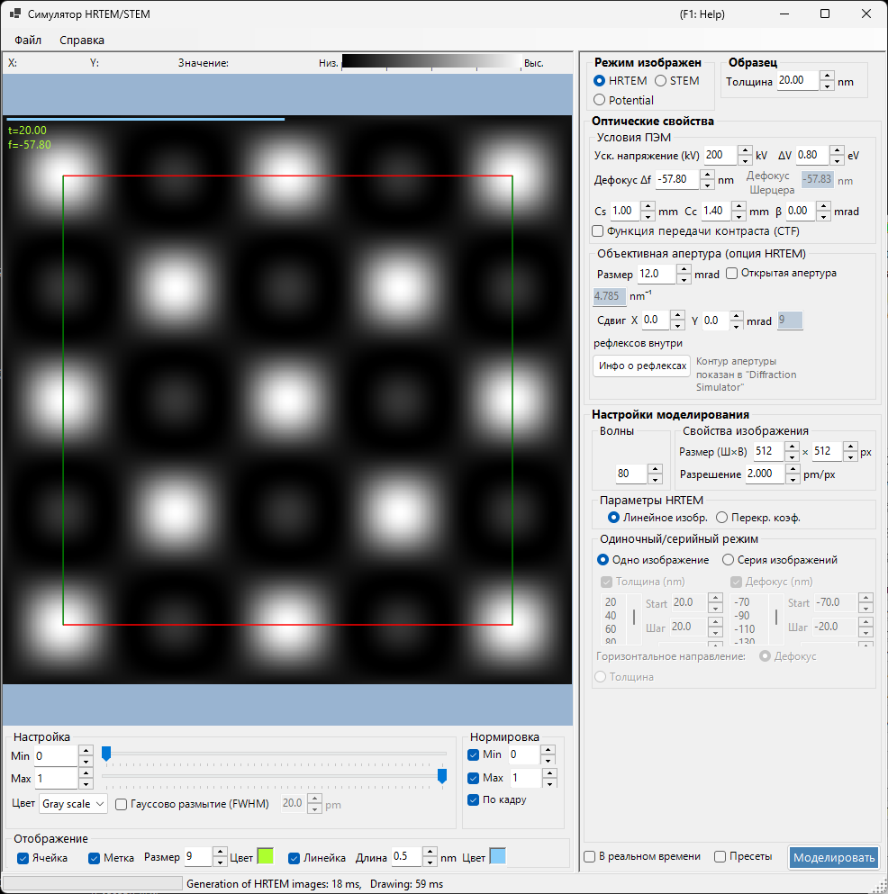
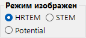
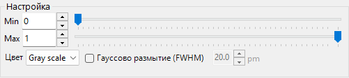
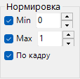
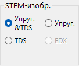
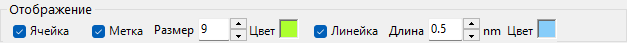
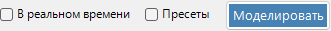
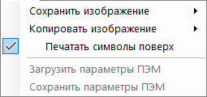
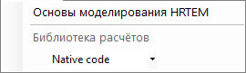

# HRTEM / STEM Simulator

**Симулятор HRTEM/STEM** моделирует изображения решёточных полос ПЭМ (HRTEM), STEM-изображения и проецированные потенциалы кристалла для выбранного кристалла и ориентации. Нажмите **Моделировать**, чтобы запустить расчёт.

Окно разделено на две половины. **Левая сторона** показывает результат моделирования и управляет его отображением (области изображения, яркость, цвет, масштабная линейка и т. д.); **правая сторона** содержит условия расчёта (**Оптические свойства** и **Настройки моделирования**).

---

## Эта страница и страницы режимов

- **Эта страница (обзор)**: операции, общие для всех режимов, а также **элементы управления отображением и настройкой результата на левой стороне**.
- **Страницы режимов**: все настройки, которые появляются на **правой стороне** в данном режиме; каждая страница самодостаточна (поэтому некоторые настройки описаны более чем на одной странице).

| Режим | Содержание | Страница |
|------|----------|------|
| **HRTEM** | Изображения решёточных полос высокоразрешающей ПЭМ | [Моделирование HRTEM](1-hrtem-simulation.md) |
| **STEM** | Изображения растровой просвечивающей электронной микроскопии (BF / ABF / LAADF / HAADF) | [Моделирование STEM](2-stem-simulation.md) |
| **Potential** | Проецированный потенциал кристалла ($U_g$ / $U'_g$) | [Моделирование потенциала](3-potential-simulation.md) |

---

## Сочетания клавиш и мыши

Результаты отображаются в виде одной или нескольких областей изображения. Они используют стандартную [навигацию по просмотру изображения](../21-shortcuts.md) ReciPro, и все области панорамируются и масштабируются совместно.

| Сочетание | Действие |
|----------|--------|
| <kbd>F1</kbd> | Открыть эту страницу онлайн-руководства |
| <kbd>CTRL</kbd>+<kbd>C</kbd> (фокус на сетке изображений) | Скопировать изображение(я) в буфер обмена как метафайл |
| Перетаскивание левой / средней кнопкой | Панорамировать изображение (все области двигаются вместе) |
| Колесо мыши вверх / вниз | Приблизить (×2) / отдалить (×0.5) у курсора |
| Перетаскивание прямоугольника правой кнопкой | Приблизить к выбранной области |
| Щелчок правой кнопкой / двойной щелчок правой кнопкой | Отдалить (×0.5) |
| <kbd>CTRL</kbd> + перетаскивание прямоугольника правой кнопкой | Выбрать прямоугольную область |
| Двойной щелчок левой кнопкой по области | Развернуть эту область / восстановить сетку (многооконные раскладки) |
| Движение мыши (без кнопки) | Прочитать положение (pm) и значение пикселя у курсора |

→ См. **[21. Сочетания клавиш и мыши](../21-shortcuts.md)** для обзора всех окон сразу.

---

## Быстрые маршруты по цели

| Цель | Начать с | Справка |
|------|------------|-----------|
| Рассчитать одно HRTEM-изображение | Установите **Режим изображения** в **HRTEM**, затем задайте ускоряющее напряжение и дефокусировку в **Условия ПЭМ** | [Моделирование HRTEM](1-hrtem-simulation.md), [Формирование HRTEM-изображения](../appendix/a3-bloch-wave/hrtem.md) |
| Рассчитать STEM-изображение | Установите **Режим изображения** в **STEM**, затем задайте угол сходимости и детектор в **Параметры STEM** | [Моделирование STEM](2-stem-simulation.md), [Расчёт STEM](../appendix/a3-bloch-wave/stem.md) |
| Просмотреть проецированный потенциал | Установите **Режим изображения** в **Potential** | [Моделирование потенциала](3-potential-simulation.md) |
| Создать серию по толщине / дефокусировке | В режиме HRTEM настройте **Одиночный/серийный режим** и условия изображения | [Моделирование HRTEM](1-hrtem-simulation.md) |
| Использовать HAADF-STEM с TDS | Задайте ненулевые атомные температурные факторы и переведите детектор STEM в LAADF / HAADF | [Расчёт STEM](../appendix/a3-bloch-wave/stem.md) |

---

## Базовый рабочий процесс

1. Выберите кристалл и ориентацию в главном окне, затем откройте это окно.
2. Выберите HRTEM, STEM или Potential в **Режим изображения**.
3. Задайте ускоряющее напряжение, дефокусировку, аберрации, апертуру, угол сходимости STEM и т. д. в **Оптические свойства** (см. страницы режимов).
4. Задайте толщину, размер изображения, разрешение, число блоховских волн, модель частичной когерентности и т. д. в **Настройки моделирования** (см. страницы режимов).
5. Нажмите **Моделировать**, затем при необходимости настройте отображение с помощью **Настройка**, **Нормировка** и **Отображение** слева.

---

## Выбор режима изображения

{ align=left }

**Режим изображения** в правом верхнем углу выбирает тип расчёта. Панели справа (**Оптические свойства** и **Настройки моделирования**) меняются в соответствии с выбранным режимом.

- **HRTEM** — изображения решёточных полос высокоразрешающей ПЭМ → [Моделирование HRTEM](1-hrtem-simulation.md)
- **STEM** — изображения растровой просвечивающей электронной микроскопии → [Моделирование STEM](2-stem-simulation.md)
- **Potential** — проецированный потенциал кристалла → [Моделирование потенциала](3-potential-simulation.md)

---

## Область изображения (левая сторона)

Левая половина окна показывает смоделированное изображение. Строка состояния вдоль верхнего края сообщает положение курсора (**X:**, **Y:**) и значение изображения **Значение:** (интенсивность) под курсором, рядом со шкалой интенсивности **Низ. → Выс.**, отражающей текущую цветовую карту и диапазон яркости.

Когда создаётся несколько изображений (серия изображений или модуль/фаза потенциала), они располагаются сеткой, и все области масштабируются и панорамируются совместно.

---

## Отображение и настройка результатов (левая панель) {#display-settings}

Панель в левой нижней части настраивает внешний вид результата — яркость, цвет, нормировку и наложения. Эти настройки действуют во всех режимах и применяются без повторного расчёта.

### Настройка

- **Min** / **Max** : нижний (чёрный) и верхний (белый) края отображаемого диапазона интенсивности. Контраст регулируется ползунками.
- **Цвет** : цветовая шкала изображения — **Gray scale** или **Cold-Warm** (от синего к красному).
- **Гауссово размытие (FWHM)** : если отмечено, применяет размытие по Гауссу с полной шириной на половине высоты (pm), заданной справа, что приближённо моделирует конечное разрешение (функцию рассеяния точки).

### Нормировка

- **По кадру** : если отмечено, каждое изображение нормируется отдельно (если снято, вся серия использует общую шкалу).
- **Min** / **Max** : фиксирует нижний / верхний край нормировки на значении, заданном справа, вместо минимума / максимума изображения.

### STEM-изображение

Отображается только в режиме STEM. Выбирает, какая компонента рассеяния рассчитанного STEM-изображения показывается (**Упруг.**, **TDS** или **Упруг. & TDS**). Если в том же расчёте были также получены [карты STEM-EDX](2-stem-simulation.md#stem-edx), доступен четвёртый вариант — **EDX**. Поскольку эта настройка специфична для STEM, она также описана на странице [Моделирование STEM](2-stem-simulation.md).

### Отображение

Задаёт элементы, накладываемые на изображение.

- **Ячейка** : накладывает контур проецированной элементарной ячейки, позволяя сопоставить контраст изображения с кристаллической решёткой.
- **Метка** : накладывает подписи, такие как толщина, дефокусировка и индексы. Можно задать **Размер** (размер шрифта) и **Цвет**.
- **Линейка** : накладывает масштабную линейку. Можно задать **Длина** (nm) и **Цвет**.

---

## Запуск моделирования

- **Моделировать** : запускает расчёт с текущими кристаллом, условиями микроскопа, толщиной, дефокусировкой и настройками отображения.
- **Стоп** : прерывает выполняющийся расчёт (отображается только во время расчёта).
- **В реальном времени** : если отмечено, пересчитывает изображение сразу при вращении кристалла (скрыто в режиме STEM).
- **Пресеты** : показывает/скрывает окно пресетов, в котором сохраняются и вызываются условия съёмки ПЭМ.

---

## Меню «Файл»

- **Сохранить изображение** : сохраняет **как изображение (формат PNG)**, **как изображение (формат TIFF)** или **как метафайл (EMF)**. **Сохранять по отдельности в серийном режиме** записывает изображения серийного расчёта по одному.
- **Копировать изображение** : копирует в буфер обмена **как изображение** или **как метафайл (EMF)**.
- **Печатать символы поверх** : впечатывает элементарную ячейку, подписи и масштабную линейку в сохраняемое изображение.
- **Загрузить параметры ПЭМ** / **Сохранить параметры ПЭМ** : сохраняет оптические условия (ускоряющее напряжение, аберрации и т. д.) в файл и восстанавливает их.

## Меню «Справка»

- **Основы моделирования HRTEM** : открывает объяснение формирования HRTEM-изображения ([Приложение A3.2](../appendix/a3-bloch-wave/hrtem.md)).
- **Библиотека расчётов** : выбирает библиотеку расчётов — **Native code** (быстрый C++/Eigen) или **Managed code** (.NET). Обычно Native быстрее.

---

## См. также

- [Моделирование HRTEM](1-hrtem-simulation.md)
- [Моделирование STEM](2-stem-simulation.md)
- [Моделирование потенциала](3-potential-simulation.md)
- [Динамическая дифракция (блоховские волны)](../appendix/a3-bloch-wave/index.md)
- [Симулятор дифракции](../7-diffraction-simulator/index.md)
- [Траектории электронов](../8-electron-trajectory.md)
