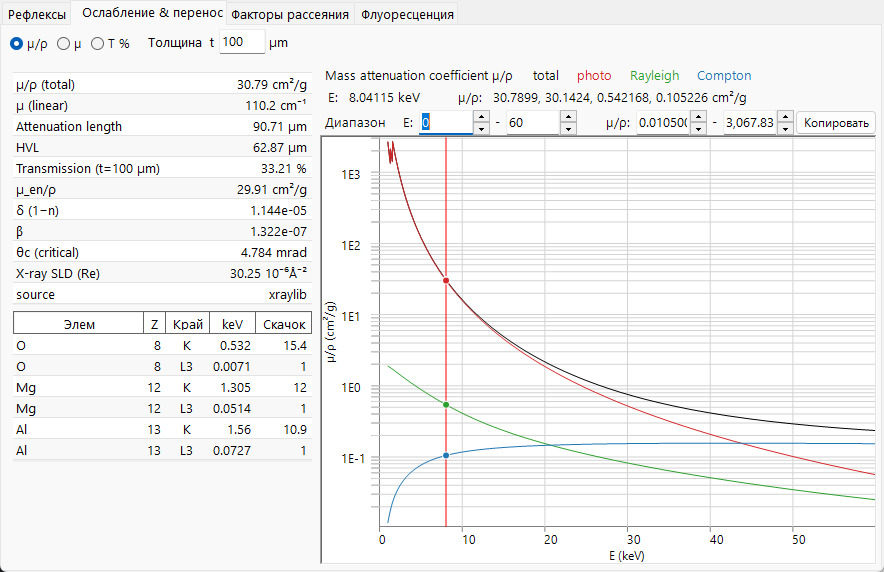
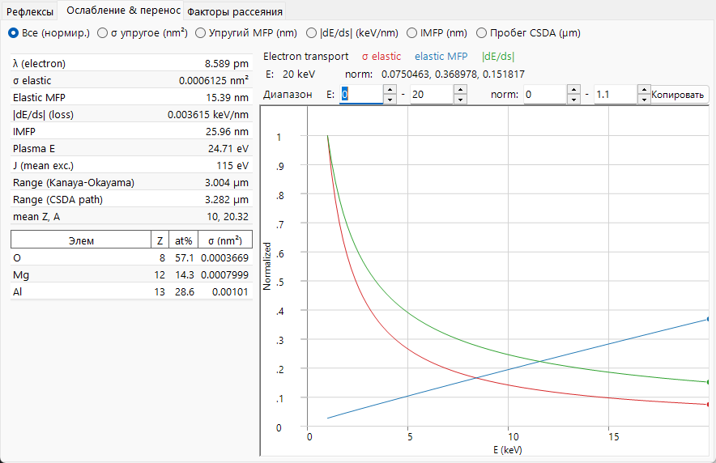
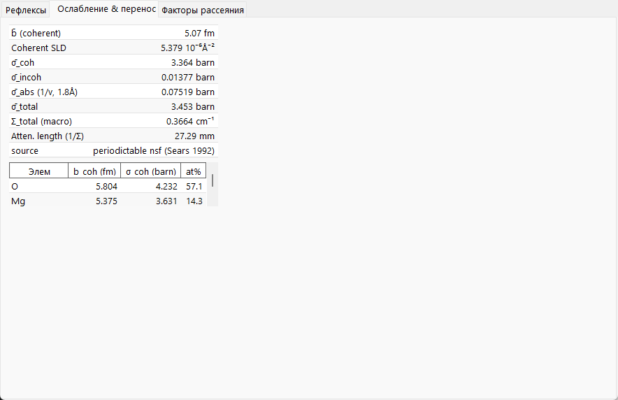

# Ослабление и перенос

Факторы рассеяния описывают одиночное событие рассеяния; на этой странице речь идёт о том, что происходит с пучком **в целом**, пока он проходит сквозь твёрдое тело — как быстро он убывает, как глубоко проникает и (для электронов) как тормозится. Соответствующая физика для трёх видов излучения совершенно различна, и именно поэтому вкладка **Attenuations & Transport** так радикально меняет свои графики и таблицы в зависимости от излучения.

=== "X-ray"
    

=== "Electron"
    

=== "Neutron"
    

---

## Рентгеновские лучи — поглощение и преломление

### Ослабление по закону Бугера–Ламберта–Бера

Монохроматический рентгеновский пучок убывает экспоненциально с длиной пути:

$$I(t) = I_0\, e^{-\mu t}, \qquad \mu = \rho\,(\mu/\rho).$$

- $\mu/\rho$ : **массовый коэффициент ослабления** (cm²/g) — табулированная, не зависящая от плотности величина.
- $\mu$ : **линейный коэффициент ослабления** (cm⁻¹) при фактической плотности материала $\rho$.
- $1/\mu$ : **длина ослабления** (интенсивность падает до $1/e$).
- $\text{HVL} = \ln 2/\mu$ : **слой половинного ослабления**.
- $T = e^{-\mu t}$ : пропускание для образца толщиной $t$.

### Из чего складывается $\mu/\rho$

Полное массовое ослабление есть сумма трёх процессов, отображаемых на вкладке по отдельности:

$$\left(\frac{\mu}{\rho}\right)_\text{total} = \left(\frac{\tau}{\rho}\right)_\text{photo} + \left(\frac{\mu}{\rho}\right)_\text{Rayleigh} + \left(\frac{\mu}{\rho}\right)_\text{Compton}.$$

Для соединения массовое ослабление есть взвешенная по массе сумма значений для элементов, тогда как линейный коэффициент напрямую складывает атомные сечения:

$$\left(\frac{\mu}{\rho}\right)_\text{mix} = \sum_i w_i\left(\frac{\mu}{\rho}\right)_i, \qquad \mu = \sum_i n_i\,\sigma_i,$$

где $w_i$ — массовые доли, а $n_i$ — числовые плотности. Три составляющие таковы:

- **Фотопоглощение** $\tau$ — фотон поглощается и выбивает связанный электрон. Оно доминирует при низкой энергии, спадая между краями примерно как $\tau/\rho \propto Z^{3\!-\!4}/E^{3}$. Это тот член, который выбивает электрон внутренней оболочки, релаксация которого порождает [флуоресценцию](fluorescence.md).
- **Рэлеевское (когерентное)** рассеяние — упругое рассеяние на связанных электронах, связанное с когерентным форм-фактором $F(q)$.
- **Комптоновское (некогерентное)** рассеяние — неупругое рассеяние на слабо связанных электронах, связанное с некогерентной функцией $S(q)$; его относительная значимость растёт при высокой энергии. Рассеянный фотон смещается по длине волны на

$$\Delta\lambda = \lambda' - \lambda = \frac{h}{m_e c}\,(1-\cos\varphi),$$

  так что комптоновское событие удаляет фотон из монохроматического пучка (неупругая потеря).

**Края поглощения** — это резкие подъёмы $\tau$, когда энергия фотона пересекает энергию связи оболочки ($K$, $L_3$, …), открывая новый канал ионизации. **Скачок** — это множитель, на который $\mu/\rho$ возрастает на краю; ReciPro приводит энергии и скачки краёв $K$ и $L_3$. **Массовый коэффициент поглощения энергии** $\mu_\text{en}/\rho$ — это та часть $\mu/\rho$, которая локально передаёт энергию (исключая энергию, уносимую рассеянными и флуоресцентными фотонами).

### Преломление, критический угол и SLD

Рентгеновский показатель преломления твёрдого тела **немного меньше 1** и записывается как

$$n = 1 - \delta + i\beta, \qquad \beta = \frac{\mu_\text{abs}\lambda}{4\pi} = \frac{r_e\lambda^2}{2\pi}\sum_i n_i\,f''_i, \qquad \delta \simeq \frac{r_e\lambda^2}{2\pi}\sum_i n_i\,(Z_i+f'_i),$$

где $n_i$ — числовая плотность элемента $i$, а $r_e$ — классический радиус электрона. Здесь $\mu_\text{abs}$ — поглощательная часть ослабления (связанная с $f''$); она не обязана равняться полному $\mu$ выше, которое содержит также рэлеевское и комптоновское рассеяние. Поскольку $n<1$, рентгеновские лучи испытывают **полное внешнее отражение** ниже малого скользящего **критического угла**

$$\theta_c \simeq \sqrt{2\delta}.$$

Это следует из геометрии преломления: при скользящем угле $\alpha$ вертикальный волновой вектор внутри твёрдого тела равен $k_z^2 \simeq k^2(\alpha^2 - 2\delta)$, который обращается в нуль при $\alpha = \alpha_c = \sqrt{2\delta}$; ниже этого волна не может распространяться в материал и полностью отражается. Действительная часть **плотности длины рассеяния**, $\text{SLD} = r_e\sum_i n_i (Z_i + f'_i)$, задаёт $\delta$ и является рентгеновским аналогом нейтронной SLD, используемой в рефлектометрии. ReciPro приводит $\delta$, $\beta$, $\theta_c$ и рентгеновскую SLD в скалярной таблице.

---

## Электроны — рассеяние, торможение и пробег

Быстрый электрон в твёрдом теле одновременно **рассеивается** (меняя направление) и непрерывно **теряет** энергию, так что для его переноса требуется более одного масштаба длины.

### Упругое рассеяние и длина свободного пробега

Упругое сечение $\sigma_\text{el}$ показывает, насколько легко отдельный атом отклоняет электрон. ReciPro использует сечения **NIST Mott** (решение методом парциальных волн релятивистского уравнения Дирака в экранированном атомном потенциале), справедливые примерно в диапазоне **50 eV – 36.4 keV**; вне этого диапазона или для элементов, отсутствующих в таблице, происходит переход к приближению **экранированного Резерфорда**. Эти два подхода не обязаны идеально гладко стыковаться на границе. Полное сечение есть угловой интеграл от дифференциального,

$$\sigma_\text{el} = 2\pi\int_0^\pi \frac{d\sigma}{d\Omega}\,\sin\Theta\,d\Theta, \qquad \frac{d\sigma}{d\Omega} \propto \frac{Z^2}{E^2}\,\frac{1}{\big[\sin^2(\Theta/2)+\eta\big]^2},$$

где параметр экранирования $\eta$ сглаживает прямую расходимость чистого резерфордовского сечения; обработка Мотта дополнительно учитывает спиновые и релятивистские эффекты, которые экранированное резерфордовское приближение опускает. Из сечения

$$\Sigma_\text{el} = \sum_i n_i\,\sigma_{\text{el},i}, \qquad \lambda_\text{el} = \frac{1}{\Sigma_\text{el}},$$

получаются макроскопический коэффициент рассеяния и **упругая длина свободного пробега** — среднее расстояние между упругими событиями.

### Тормозная способность и неупругие потери

Энергия теряется главным образом на электронные возбуждения (ионизацию, плазмоны). **Тормозная способность** определяется как положительная величина,

$$S(E) = -\frac{dE}{ds} > 0,$$

где здесь $s$ — **длина пути** вдоль траектории (переменная кривой *|dE/ds|* на вкладке), а не переменная рассеяния $\sin\theta/\lambda$, используемая в других местах этого приложения. Градиент энергии $dE/ds$ отрицателен, поэтому вкладка откладывает $S$ вверх. При энергиях порядка keV он концептуально следует **бете**вской форме

$$S(E) \;\propto\; \frac{Z\rho}{A}\,\frac{1}{E}\,\ln\!\frac{E}{J},$$

с $J$ — **средней энергией возбуждения** твёрдого тела. Этот нерелятивистский набросок показывает лишь масштабирование; ReciPro вычисляет скорректированную/эмпирическую форму (типа Joy–Luo), которая остаётся корректной при низкой энергии. **Энергия плазмона** $E_p$ в скалярной таблице — это родственная, но отдельная характеристика тех же электронных возбуждений. **Неупругая длина свободного пробега** (IMFP) — это соответствующее среднее расстояние между столкновениями с потерей энергии; ReciPro может вычислять её по предсказательной формуле **TPP-2M**,

$$\lambda_\text{in}(E) = \frac{E}{E_p^2\left[\beta_\text{T}\ln(\gamma_\text{T} E) - C/E + D/E^2\right]},$$

с $E$ в eV, $\lambda_\text{in}$ в Å и параметрами $\beta_\text{T},\gamma_\text{T},C,D$, построенными из $E_p$, плотности, ширины запрещённой зоны и числа валентных электронов.

### Два вида пробега

- **CSDA-пробег** — приближение непрерывного замедления (continuous-slowing-down approximation) интегрирует тормозную способность, давая полную длину пути, пройденную до остановки электрона:

$$R_\text{CSDA} = \int_{E_\text{cut}}^{E_0} \frac{dE}{S(E)}.$$

(На практике интеграл доводится до низкоэнергетической отсечки $E_\text{cut}$, ниже которой приведённый выше бетевский набросок более не применим.)

- **Пробег Канаи–Окаямы** — широко используемая эмпирическая оценка **глубины проникновения** (а не длины пути), учитывающая извилистую, рассеянную траекторию:

$$R_\text{KO}\,[\mu\text{m}] = 0.0276\,\frac{A\,E_0^{1.67}}{\rho\,Z^{0.89}}, \qquad (E_0\ \text{in keV}).$$

Эти две величины отвечают на разные вопросы — полное пролетённое расстояние против того, как далеко вглубь твёрдого тела достигает электрон — поэтому они различаются по значению, и ReciPro приводит обе. Эти пробеги задают объём взаимодействия, лежащий в основе моделирования [траекторий электронов](../../8-electron-trajectory.md) и EBSD.

---

## Нейтроны — макроскопическое сечение и закон 1/v

Для нейтронов не существует зависящей от энергии кривой ослабления; взаимодействие фиксируется **ядерными сечениями**. Пучок ослабляется через макроскопическое полное сечение, само являющееся суммой когерентной, некогерентной и поглощательной частей:

$$\Sigma_\text{total} = \sum_i n_i\,\sigma_{\text{total},i}, \qquad \sigma_\text{total} = \sigma_\text{coh} + \sigma_\text{inc} + \sigma_\text{abs}(\lambda), \qquad T = e^{-\Sigma_\text{total} t},$$

с длиной ослабления $1/\Sigma_\text{total}$. Поглощательная часть зависит от скорости нейтрона $v$ (а значит, от длины волны): для большинства нуклидов время, проведённое вблизи ядра, масштабируется как $1/v$, что даёт **закон 1/v**

$$\sigma_\text{abs}(\lambda) = \sigma_\text{abs}(\lambda_0)\,\frac{\lambda}{\lambda_0}, \qquad \lambda_0 = 1.798\ \text{Å}\ (\text{thermal}, 2200\ \text{m/s}).$$

Несколько сильных поглотителей (Cd, Sm, Eu, Gd) обладают низкоэнергетическими **резонансами**, нарушающими простое масштабирование 1/v; ReciPro помечает эти нуклиды. Когерентная **плотность длины рассеяния**, $\text{SLD} = \sum_i n_i\, b_{\text{coh},i}$, является нейтронным аналогом приведённой выше рентгеновской SLD.

---

## Проникновение с первого взгляда

Три вида излучения зондируют совершенно разные глубины — практическая причина, по которой они отвечают на разные вопросы:

| Пучок | Типичный образец | Проникновение (порядок величины) | Определяется |
|---|---|---|---|
| Рентген (≈8 keV) | порошок / монокристалл | 10–100 µm | $\mu = \rho(\mu/\rho)$ |
| Электрон (≈200 keV) | ПЭМ-фольга | 10–100 nm (полезная) | упругая MFP + неупругая потеря |
| Нейтрон (тепловой) | объёмный, размером в cm | 1–10 cm | $\Sigma_\text{total}$ |

Те же масштабы длины объясняют, почему электроны требуют ультратонких образцов и динамической теории, тогда как нейтроны видят весь объёмный образец в условиях кинематики однократного рассеяния.

---

## См. также

- [Атомные факторы рассеяния](scattering-factor.md) — разделение $F(q)$/$S(q)$ за рэлеевским/комптоновским рассеянием и сечения Мотта.
- [Флуоресценция](fluorescence.md) — релаксация, следующая за рентгеновским фотопоглощением.
- [3. Взаимодействие пучка](../../3-beam-interaction.md) — вкладка *Attenuations & Transport*.
- [8. Траектории электронов](../../8-electron-trajectory.md) · [12. Моделирование EBSD](../../12-ebsd-simulation.md) — где используются пробеги электронов.
