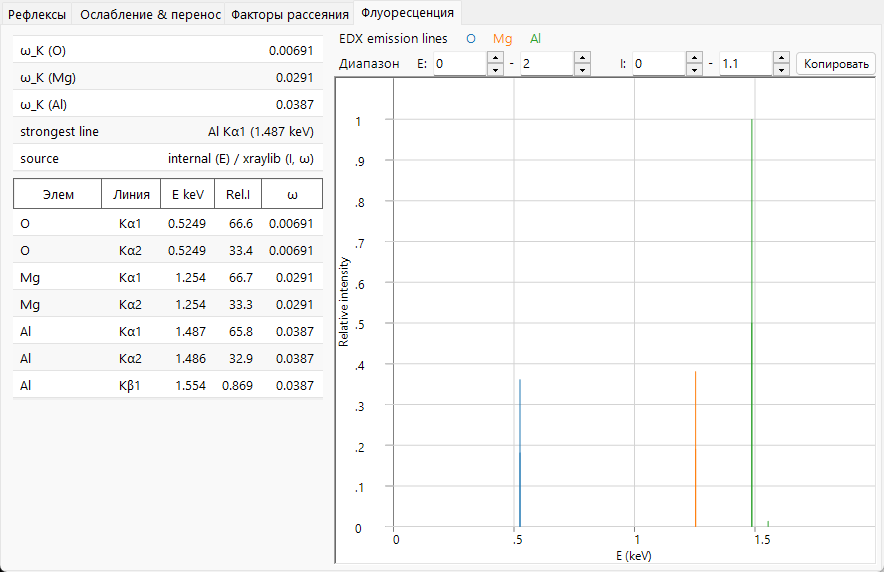

# Флуоресценция

Когда рентгеновское **фотопоглощение** выбивает электрон внутренней оболочки (см. [ослабление и перенос](attenuation-transport.md)), оно оставляет вакансию на глубоком уровне. Атом релаксирует, переводя внешний электрон в эту дырку, и высвобождённая энергия выходит либо как **характеристический рентгеновский фотон** (флуоресценция), либо за счёт выбивания второго электрона (**оже**-процесс). Вкладка **Флуоресценция** показывает предварительный просмотр канала характеристических фотонов; она применима только к рентгеновскому излучению и скрыта для электронных и нейтронных пучков.

---

## Характеристические линии

Поскольку энергии оболочек резко определены, энергия испускаемого фотона равна **разности двух энергий связи**,

$$E_\gamma = E_B(\text{inner shell}) - E_B(\text{outer shell}),$$

и поэтому характеристична для элемента:

- **K-линии** — вакансия в оболочке $K$, заполняемая из $L$ ($K\alpha$) или $M$ ($K\beta$).
- **L-линии** — вакансия в оболочке $L$, заполняемая из $M$/$N$ ($L\alpha$, $L\beta$, …).

Появляются только переходы, разрешённые дипольными правилами отбора, поэтому спектр состоит из нескольких дискретных линий (K$\alpha_1$, K$\alpha_2$, K$\beta_1$, L$\alpha_1$, …), а не из континуума. Их энергии следуют **закону Мозли**; в экранированно-водородоподобном приближении,

$$E_{n_2\to n_1} \approx R_\infty hc\,(Z-\sigma)^2\left(\frac{1}{n_1^2} - \frac{1}{n_2^2}\right), \qquad \text{so}\qquad \sqrt{E} \propto (Z-\sigma),$$

где $\sigma$ — постоянная экранирования. Для $K\alpha$ ($n_2{=}2\to n_1{=}1$, $\sigma\approx1$) это сводится к $E_{K\alpha}\approx R_\infty hc\,(Z-1)^2\left(1-\tfrac14\right)$. Эта монотонная, определяемая числом электронов зависимость от $Z$ лежит в основе идентификации элементов (EDX/WDX).

---

## Выход флуоресценции

Конкуренция между радиационной и оже-релаксацией описывается **выходом флуоресценции**

$$\omega = \frac{\Gamma_r}{\Gamma_r + \Gamma_a},$$

вероятностью того, что данная вакансия распадётся с испусканием фотона, а не оже-электрона ($\Gamma_r$, $\Gamma_a$ — радиационная и оже-скорости соответственно).

- Для **лёгких элементов** доминирует оже-канал, поэтому $\omega_K$ мал (значительно ниже 1 % для C, N, O) — лёгкие элементы флуоресцируют слабо, поэтому их трудно обнаружить методом EDX.
- Для **тяжёлых элементов** побеждает радиационный канал и $\omega_K \to$ почти 1.

Дополнительный **оже-выход** $a$ забирает остаток, так что

$$\omega + a = 1 ,$$

и малое $\omega$ означает, что большинство вакансий распадается путём оже-эмиссии. Внутри радиационного канала доля одной конкретной линии $\ell$ (например, $K\alpha_1$ по сравнению с $K\beta_1$) есть её **коэффициент ветвления**

$$p_{\ell\mid X} = \frac{\Gamma_\ell}{\sum_{\ell'\in X}\Gamma_{\ell'}},$$

относительная радиационная скорость внутри оболочки $X$. ReciPro выводит $\omega_K$ для каждого элемента и сильнейшую линию в спектре.

---

## Что предварительный просмотр моделирует, а что нет

График **линий эмиссии EDX** рисует каждую характеристическую линию в виде штриха при её энергии фотона с высотой, пропорциональной

$$\text{(atomic fraction)} \times \text{(radiative rate)} \times \omega.$$

Это **качественный** предварительный просмотр того, где располагаются линии и каковы их приблизительные относительные высоты. Он намеренно опускает факторы, которые требуются для реального количественного спектра EDX/XRF:

- находится ли падающая энергия действительно **выше края поглощения**, необходимого для создания вакансии — линия рисуется, даже если она не может быть возбуждена при текущей энергии;
- **сечение возбуждения** (насколько эффективно падающий пучок создаёт вакансию при выбранной энергии);
- **самопоглощение** испускаемых фотонов внутри образца (матричные эффекты);
- **эффективность детектора** и разрешение.

Таким образом, предварительный просмотр предназначен для идентификации линий и рассуждений об относительных положениях, а не для количественного определения состава.

---

## От предварительного просмотра к количественному анализу

Реальный анализ EDX/XRF преобразует интенсивности линий в концентрации через **матричную (ZAF) коррекцию** — для атомного номера ($Z$), поглощения ($A$) испускаемых фотонов на их пути из образца и вторичной **флуоресценции** ($F$), возбуждаемой другими линиями — в сочетании с упомянутыми выше сечением возбуждения и откликом детектора. В полной форме измеренная интенсивность линии $\ell$ от элемента $i$ равна

$$I_\ell \;\propto\; C_i\,\Phi_0\,\sigma_{\text{ion},X,i}(E_0)\,\omega_{X,i}\,p_{\ell\mid X}\,\epsilon(E_\ell)\,A_\text{matrix}(E_0,E_\ell),$$

где $C_i$ — концентрация, $\Phi_0$ — падающий поток, $\sigma_\text{ion}$ — сечение ионизации, $\omega$ — выход флуоресценции, $p_{\ell\mid X}$ — коэффициент ветвления, $\epsilon$ — эффективность детектора, а $A_\text{matrix}$ — коррекция поглощения / вторичной флуоресценции. Предварительный просмотр ReciPro сохраняет только часть $C_i\,p_{\ell\mid X}\,\omega$ (атомная доля × радиационная скорость × выход) и отбрасывает остальное, поэтому он размещает линии и даёт их собственные относительные интенсивности, чтобы их можно было распознать в измеренном спектре.

---

## См. также

- [Ослабление и перенос](attenuation-transport.md) — фотопоглощение, край, создающий вакансию.
- [Атомные факторы рассеяния](scattering-factor.md) — те же связанные электроны, наблюдаемые в рассеянии.
- [3. Взаимодействие пучка → вкладка Флуоресценция](../../3-beam-interaction.md#fluorescence-tab)
