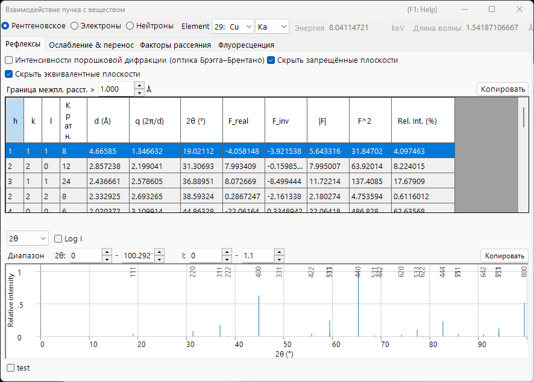

# Приложение A2. Взаимодействие пучка (физика твёрдого тела)

Глава о главном окне [3. Beam interaction](../../3-beam-interaction.md) — это руководство по GUI: она объясняет, какие кнопки нажимать и что означает каждый столбец. В этом приложении собрана **физика твёрдого тела и рассеяния**, стоящая за этими числами — почему атом так по-разному рассеивает рентгеновские лучи, электроны и нейтроны, откуда берутся структурный фактор и его мнимая часть, как пучок ослабляется и замедляется внутри твёрдого тела, и что предпросмотр флуоресценции отображает, а что нет.

Окно имеет четыре вкладки, и теорию лучше всего читать в том порядке, в котором одна величина переходит в следующую:

1. **[Atomic scattering factors](scattering-factor.md)** — как *отдельный атом* рассеивает каждый вид пучка.
2. **[Structure factor](structure-factor.md)** — как атомы в *элементарной ячейке* интерферируют, включая фактор Дебая–Валлера и правила погасания.
3. **[Attenuation & transport](attenuation-transport.md)** — как пучок *удаляется и замедляется* при прохождении через материал.
4. **[Флуоресценция](fluorescence.md)** — характеристическое рентгеновское излучение, следующее за ионизацией внутренней оболочки.

---

## Геометрия рассеяния и переменная $s$

Каждая величина рассеяния в этом окне является функцией того, насколько сильно меняется направление пучка. Обозначая $\mathbf k_i$ и $\mathbf k_s$ для падающего и рассеянного волновых векторов (упругое рассеяние, поэтому $|\mathbf k_i|=|\mathbf k_s|=1/\lambda$), **вектор рассеяния** и его модуль равны

$$\mathbf Q = 2\pi(\mathbf k_s - \mathbf k_i), \qquad Q = |\mathbf Q| = \frac{4\pi\sin\theta}{\lambda} = 4\pi s .$$

- $\theta$ : угол Брэгга — *половина* полного угла рассеяния. Таблица рефлексов приводит полный угол $2\theta$.
- $s = \dfrac{\sin\theta}{\lambda}$ (Å⁻¹) : переменная, относительно которой строится вкладка **Факторы рассеяния**. Это естественный аргумент любого атомного форм-фактора.
- $d$ : межплоскостное расстояние. При условии Брэгга $\lambda = 2d\sin\theta$ выполняется $s = \dfrac{1}{2d} = \dfrac{|\mathbf g|}{2}$, где $\mathbf g$ — вектор обратной решётки с $|\mathbf g| = 1/d$.

Эти три соглашения описывают одну и ту же геометрию; различается только масштаб. Стоит держать это соответствие ясным, поскольку окно использует более одного из них:

| В окне | Символ | Соотношение |
|---|---|---|
| Таблица рефлексов | $q = 2\pi/d$ | $q = 2\pi\lvert\mathbf g\rvert = Q = 4\pi s$ |
| Таблица рефлексов | $2\theta$ | полный угол рассеяния, $\sin\theta = \lambda s$ |
| Вкладка Факторы рассеяния | $s = \sin\theta/\lambda$ | $s = q/4\pi = 1/(2d)$ |
| Диаграмма дифракционных пиков | $Q = 4\pi\sin\theta/\lambda$ | $Q = q = 4\pi s$ |

!!! note "Единицы"
    Опубликованные параметризации форм-факторов используют $s$ в Å⁻¹ (поэтому $s^2$ в Å⁻²), тогда как ReciPro внутренне ведёт $s^2$ в нм⁻². Эти две величины различаются множителем $100$ в $s^2$; кривые и таблицы представлены в единицах, указанных в заголовке каждой таблицы. Одна модель — **Kirkland** — табулирована относительно $q = 2s = 1/d$, а не $s$; см. [Atomic scattering factors](scattering-factor.md).

### Брэгг, Лауэ и сфера Эвальда {#phase-convention}

Условие Брэгга — одна из граней единого геометрического требования. Конструктивная интерференция (**условие Лауэ**) требует, чтобы вектор рассеяния был равен вектору обратной решётки,

$$\mathbf k_s = \mathbf k_i + \mathbf g, \qquad |\mathbf k_i + \mathbf g|^2 = |\mathbf k_i|^2 ,$$

что при $|\mathbf k_i|=|\mathbf k_s|=1/\lambda$ сводится к

$$2\,\mathbf k_i\cdot\mathbf g + |\mathbf g|^2 = 0 \qquad\Longleftrightarrow\qquad |\mathbf g| = \frac{1}{d} = \frac{2\sin\theta}{\lambda},$$

то есть к **закону Брэгга** $\lambda = 2d\sin\theta$. Геометрически это построение **сферы Эвальда**: рефлекс возбуждается, когда его точка обратной решётки лежит на сфере радиуса $1/\lambda$. (Здесь $\mathbf g$ в единицах $1/d$, поэтому $\mathbf Q = 2\pi\mathbf g$.)

---

## Соглашение о фазе

ReciPro строит структурные факторы с кристаллографическим соглашением о фазе

$$F_{\mathbf g} = \sum_j \dots \exp\!\left(-2\pi i\,\mathbf g\cdot\mathbf r_j\right),$$

то есть со знаком **минус** в показателе экспоненты. Этот выбор фиксирует знак мнимой части структурного фактора (`F_inv` в таблице рефлексов) и соотношение между парами Фриделя после включения аномальной дисперсии. Оно устанавливается здесь однажды и предполагается на протяжении всего приложения; следствия разобраны в [Structure factor](structure-factor.md).

---

## Кинематическое и динамическое рассеяние

В этом приложении рассматривается **однократное (кинематическое) рассеяние**: падающий пучок рассеивается один раз, и дифрагированная амплитуда есть структурный фактор следующей страницы. Это верная картина, когда взаимодействие слабое — рентгеновские лучи и нейтроны почти во всех образцах, и электроны в *очень тонких* препаратах.

Когда взаимодействие сильное — электроны во всех, кроме самых тонких, кристаллах — пучок рассеивается многократно, прежде чем покинуть образец, интенсивность перераспределяется между рефлексами, и $\lvert F\rvert^2$ более не даёт измеряемую интенсивность. Этот режим требует **динамической** теории из [Appendix A3](../a3-bloch-wave/index.md). Факторы рассеяния и структурные факторы, выведенные здесь, являются *входными данными* для обеих картин.

Даже в кинематическом пределе дифрагированная амплитуда не является лишь структурным фактором: суммирование рассеянной волны через пластину толщиной $t$ даёт

$$A_{\mathbf g}(t) \;\propto\; F_{\mathbf g}\int_0^t e^{\,2\pi i S_{\mathbf g} z}\,dz = F_{\mathbf g}\, t\, e^{\,\pi i S_{\mathbf g} t}\,\operatorname{sinc}(\pi S_{\mathbf g} t),$$

где $S_{\mathbf g}$ — **ошибка возбуждения** — расстояние точки обратной решётки от сферы Эвальда. Интенсивность достигает резкого максимума при $S_{\mathbf g}=0$ и осциллирует с толщиной (происхождение полос толщины); динамическая теория из [Appendix A3](../a3-bloch-wave/index.md) заменяет этот одноволновой результат поведением связанных волн.

---

## Три зонда с первого взгляда

| | Рентген | Электрон | Нейтрон |
|---|---|---|---|
| Взаимодействует с | электронной плотностью $\rho_e$ | электростатическим потенциалом $V$ | ядрами (и неспаренными спинами) |
| Сила взаимодействия | слабая | сильная | очень слабая |
| Типичная глубина проникновения | мкм – мм | нм – мкм | мм – см |
| Однократное рассеяние применимо? | почти всегда | только тонкие фольги | почти всегда |
| Чувствительность к лёгким атомам | низкая ($\propto Z$) | умеренная | часто отличная |

Эти контрасты повторяются на следующих страницах, каждый из них восходит к механизму рассеяния в [Atomic scattering factors](scattering-factor.md).

---

## См. также

- [3. Beam interaction](../../3-beam-interaction.md) — GUI, который объясняет это приложение.
- [Atomic scattering factors](scattering-factor.md) · [Structure factor](structure-factor.md) · [Attenuation & transport](attenuation-transport.md) · [Флуоресценция](fluorescence.md)
- [Appendix A1. Coordinate systems](../a1-coordinate-system/1-orientation.md)
- [Appendix A3. Dynamical diffraction (Bloch-wave method)](../a3-bloch-wave/index.md) — теория многократного рассеяния, использующая эти факторы рассеяния.
