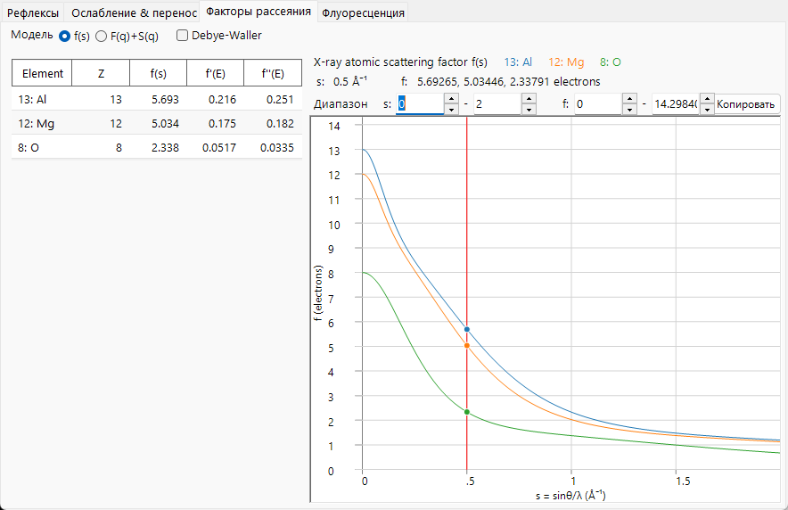
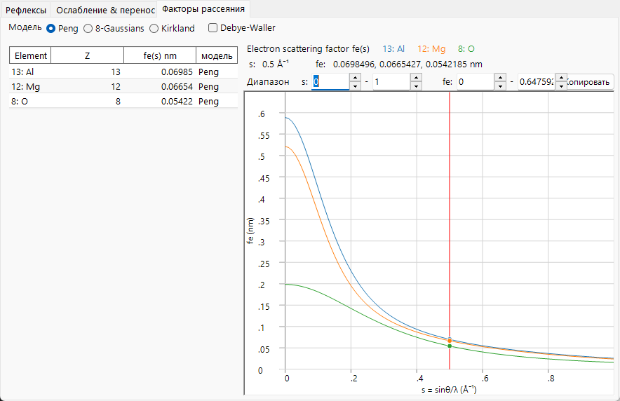
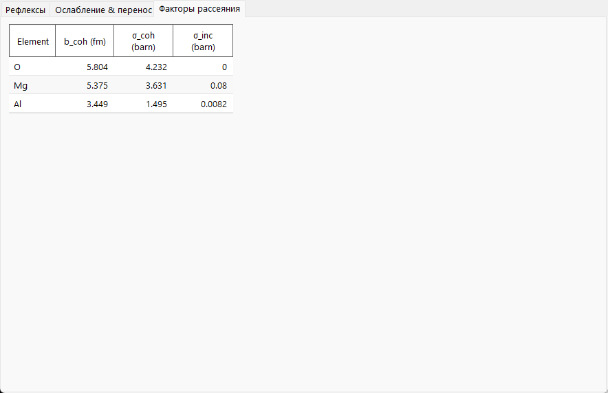

# Атомные факторы рассеяния

**Атомный фактор рассеяния** (или *форм-фактор*) измеряет, насколько сильно отдельный атом рассеивает падающий пучок как функцию переменной рассеяния $s=\sin\theta/\lambda$. Три вида излучения взаимодействуют с совершенно разными частями атома, поэтому их факторы рассеяния имеют разные порядки величины, единицы и угловую зависимость. Это главная причина, по которой вкладка **Факторы рассеяния** выглядит настолько по-разному для рентгеновского, электронного и нейтронного пучка.

=== "X-ray"
    

=== "Electron"
    

=== "Neutron"
    

---

## Рентгеновские лучи — рассеяние на электронной оболочке

Рентгеновские лучи рассеиваются на **электронах** атома. Отдельный свободный электрон рассеивает с классическим дифференциальным **томсоновским** сечением, которое задаётся классическим радиусом электрона $r_e = e^2/(4\pi\varepsilon_0 m_e c^2) \approx 2.82\times10^{-5}\ \text{Å}$:

$$\left(\frac{d\sigma}{d\Omega}\right)_e = r_e^2\,\frac{1+\cos^2 2\theta}{2}.$$

Электроны атома распределены в пространстве с числовой плотностью $\rho_e(\mathbf r)$, и атомный фактор рассеяния является **фурье-образом** этой плотности. Атомное сечение тогда равно одноэлектронному сечению, масштабированному на $|f_0|^2$:

$$f_0(\mathbf Q) = \int \rho_e(\mathbf r)\, e^{\,i\mathbf Q\cdot\mathbf r}\, d^3r ,
\qquad
\left(\frac{d\sigma}{d\Omega}\right)_\text{atom} = r_e^2\,\frac{1+\cos^2 2\theta}{2}\,|f_0(s)|^2 .$$

- В прямом направлении ($s\to 0$) каждый электрон рассеивает в фазе, так что $f_0(0) = Z$, атомный номер. Фактор выражается в **электронных единицах** (кратных томсоновской амплитуде — второе уравнение выше делает это явным).
- С ростом $s$ вклады рассеяния от разных частей оболочки выходят из фазы, и $f_0(s)$ спадает. Диффузное (внешнее, валентное) распределение электронов приводит к быстрому спаду $f_0$; прочно связанные остовные электроны продолжают вносить вклад вплоть до больших $s$.

На практике $f_0(s)$ табулируется как сумма гауссиан (аналитическая форма **Waasmaier–Kirfel**, которую использует ReciPro, расширение более старых таблиц Cromer–Mann),

$$f_0(s) = \sum_{i} a_i\, e^{-b_i s^2} + c ,$$

что ReciPro и вычисляет для построения кривой. Коэффициенты табулированы для $s$ в Å⁻¹, так что каждое $b_i$ имеет единицы Ų; ReciPro хранит $s^2$ внутренне в нм⁻² и применяет упомянутое в [индексе](index.md) преобразование с множителем 100.

### Аномальная (резонансная) дисперсия

Картина фурье-преобразования предполагает, что электроны рассеивают так, как если бы были свободными. Когда энергия фотона приближается к **краю поглощения**, связанные электроны реагируют резонансно, и появляются два энергозависимых поправочных члена:

$$f(s,E) = f_0(s) + f'(E) + i\,f''(E) \qquad \text{(textbook, } e^{+i\phi}\ \text{convention).}$$

- $f'(E)$ : действительная дисперсионная поправка (уменьшает эффективное число электронов вблизи края).
- $f''(E)$ : мнимая часть, наибольшая прямо над краем.
- Эти две величины связаны соотношениями **Крамерса–Кронига**, так что пик поглощения ($f''$) сопровождается дисперсионным размахом в $f'$.

Это не свободные параметры. Причинность (Крамерс–Крониг) связывает $f'$ с $f''$, а **оптическая теорема** связывает $f''$ напрямую с сечением фотопоглощения:

$$f'(E) = \frac{2}{\pi}\,\mathcal{P}\!\!\int_0^\infty \frac{E'\,f''(E')}{E'^2 - E^2}\,dE',
\qquad
f''(E) = \frac{\sigma_\text{abs}(E)}{2\,r_e\,\lambda}.$$

Здесь $\sigma_\text{abs}$ — это по существу **фотопоглощательная** часть ослабления (а не рэлеевские/комптоновские члены) — та же структура краёв, что видна на странице [Ослабление и перенос](attenuation-transport.md).

ReciPro вычисляет $f'$ и $f''$ при текущей энергии с помощью встроенной библиотеки **xraylib** и выводит их в таблице (с $f'' > 0$). Важны два момента, связанные со знаком. Во-первых, xraylib возвращает $F_{ii}$ с противоположным знаком относительно кристаллографического соглашения, поэтому ReciPro инвертирует его, чтобы сообщить **положительное $f''$**. Во-вторых, в фазовом соглашении ReciPro $\exp(-2\pi i\,\mathbf g\cdot\mathbf r)$ комплексный фактор, который фактически входит в структурный фактор, равен $f_0 + f' - i f''$ — записанное выше $+i f''$ относится к противоположному ($e^{+2\pi i}$) соглашению. Именно поэтому `F_inv` (мнимая часть структурного фактора) становится отличной от нуля вблизи края — см. [Структурный фактор](structure-factor.md).

---

## Электроны — рассеяние на электростатическом потенциале

Быстрый электрон заряжен, поэтому он рассеивается на **электростатическом потенциале** $V(\mathbf r)$ атома — сочетании положительного ядра и отрицательной электронной оболочки. Поэтому электронный фактор рассеяния $f_e$ является фурье-образом потенциала, что через уравнение Пуассона связывает его с рентгеновским фактором. Результат — **соотношение Мотта–Бете**:

$$f_e(s) = C_\text{MB}\,\frac{Z - f_0(s)}{s^2} \;\;\propto\; \frac{Z - f_X(Q)}{Q^2}.$$

Предмножитель $C_\text{MB}$ построен из фундаментальных постоянных и зависит от системы единиц, а также от того, используется ли $s$ или $Q$. ReciPro не вычисляет это соотношение напрямую — он использует подогнанные формы Peng / Kirkland / 8-Gaussian, приведённые ниже, — поэтому оно дано здесь скорее для физического понимания, чем для расчёта. Расписанное с постоянными (для $s$ и $f_e$ в Å),

$$f_e(s)\,[\text{Å}] = \frac{m_e e^2}{8\pi\varepsilon_0 h^2}\,\frac{Z - f_0(s)}{s^2} \simeq 0.023934\,\frac{Z - f_0(s)}{s^2}, \qquad s\ \text{in Å}^{-1},$$

с дополнительным $\times 0.1$, когда ReciPro выводит $f_e$ в нм, и дополнительным релятивистским множителем $\gamma$ (ниже) в динамическом потенциале.

Физика заключена в числителе $Z - f_0$: электрон видит **разность** между зарядом ядра $Z$ и экранирующей электронной оболочкой $f_0$, то есть результирующий атомный потенциал.

- **Величина.** Из-за множителя $1/s^2$ величина $f_e$ резко сосредоточена в области малых углов и намного больше (в своих собственных единицах) и сильнее направлена вперёд, чем $f_0$. Именно поэтому электронная дифракция определяется низкоиндексными рефлексами и поэтому существенна динамическая (многократная) дифракция — см. [Приложение A3](../a3-bloch-wave/index.md).
- **Предел малых углов.** Для *нейтрального* атома и $Z-f_0\to 0$, и $s^2\to 0$, так что $f_e(0)$ конечен (предел $0/0$, задаваемый среднеквадратичным атомным радиусом). Для **иона** оболочка более не компенсирует $Z$, и дальнодействующий кулоновский хвост приводит к расходимости $f_e$ при $s\to 0$; табулированные ионные электронные факторы следует рассматривать с осторожностью при наименьших углах.
- **Релятивистская поправка.** При энергиях ПЭМ масса и длина волны электрона релятивистские. Длина волны использует релятивистскую форму $\lambda = h/\sqrt{2 m_0 e U\,(1 + e U/2 m_0 c^2)}$, а потенциал взаимодействия несёт релятивистский множитель $\gamma = 1 + eU/m_0c^2$. ReciPro применяет эту поправку при формировании динамического потенциала.

ReciPro предлагает три параметризации $f_e(s)$:

- **Peng** : подгонка пятью гауссианами, $f_e(s)=\sum_i a_i e^{-b_i s^2}$, удобная и широко используемая для упругого рассеяния электронов.
- **Kirkland** : смешанная лоренц-гауссова подгонка, $f_e(q)=\sum_i \dfrac{a_i}{q^2+b_i} + \sum_i c_i\,e^{-d_i q^2}$. **Её независимая переменная — $q = 2s = 1/d$, а не $s$** — частый источник ошибок в два раза при сравнении моделей ($q$ в Å⁻¹, с подогнанными коэффициентами $a_i,b_i,c_i,d_i$ в соответствующих единицах).
- **8-Gaussians** : подгонка восемью членами, действительная в более широком диапазоне $s$.

**Выбор модели.** Все три подгоняют один и тот же лежащий в основе $f_e(s)$ и тесно согласуются при низких $s$; они различаются главным образом диапазоном и тем, как представлен атомный остов. **Peng** (нейтральные атомы и распространённые ионы, точна до $s\approx2\text{–}6$ Å⁻¹) — обычное значение по умолчанию для структурных факторов SAED/CBED; **Kirkland** простирается до более высоких $s$ благодаря лоренцеву остовному члену и подходит для HRTEM/STEM (помните, что $q=2s$); **8-Gaussians** предназначена для рефлексов, достигающих очень больших $s$. Для лёгкого элемента три формы практически неразличимы; различия проявляются для тяжёлых элементов при больших углах.

---

## Нейтроны — рассеяние на ядре

Тепловые нейтроны не заряжены и взаимодействуют с веществом главным образом через **сильное ядерное взаимодействие**, радиус действия которого (фемтометры) совершенно пренебрежимо мал по сравнению с длиной волны нейтрона (ангстремы). Взаимодействие представляется **псевдопотенциалом Ферми**, точечным источником, сила которого — длина рассеяния $b$:

$$V(\mathbf r) = \frac{2\pi\hbar^2}{m_n}\,b\,\delta(\mathbf r)
\qquad\Longrightarrow\qquad
\frac{d\sigma}{d\Omega} = |b|^2 .$$

Поскольку рассеиватель точечный, $b$ **не зависит от $s$** — спада форм-фактора нет, поэтому вкладка **Факторы рассеяния** не строит кривую для нейтронов, а вместо этого показывает таблицу длин рассеяния.

- $b$ — это свойство **нуклида**, а не электронной конфигурации. Оно нерегулярно изменяется от элемента к элементу (и между изотопами), может быть **отрицательным** (например, ¹H, Ti, Mn) и не имеет монотонной связи с $Z$. Это и есть основа нейтронного контраста (лёгкие атомы рядом с тяжёлыми, изотопная маркировка).
- **Когерентное и некогерентное.** Реальный элемент — это смесь изотопов и состояний ядерного спина с различным $b$. Разложение $b = \langle b\rangle + \delta b$ даёт когерентную часть (от среднего) и некогерентную часть (от разброса):

$$\sigma_\text{coh} = 4\pi\,|\langle b\rangle|^2, \qquad \sigma_\text{inc} = 4\pi\big(\langle |b|^2\rangle - |\langle b\rangle|^2\big), \qquad \sigma_s = \sigma_\text{coh} + \sigma_\text{inc}.$$

  Когерентная часть порождает брэгговскую дифракцию (именно она входит в структурный фактор); некогерентная часть — это плоский изотропный фон (большой для ¹H, причина дейтерирования).

!!! note "Табулированные значения"
    ReciPro считывает $b_\text{coh}$ и сечения из таблицы нуклидов, а не вычисляет их. Для резонансных нуклидов приведённое $\sigma_\text{coh}$ не обязано равняться наивному $4\pi b^2$, поэтому табличные значения авторитетны. Магнитное рассеяние нейтронов (на неспаренных электронных спинах, которое *действительно* имеет $s$-зависимый форм-фактор) здесь не моделируется.

---

## Сводная таблица

| | X-ray | Electron | Neutron |
|---|---|---|---|
| Рассеивается на | электронной оболочке $\rho_e(\mathbf r)$ | электростатическом потенциале $V(\mathbf r)$ | ядре (точка) |
| Зависимость от $s$ | спадает (ФП оболочки) | $\propto (Z-f_0)/s^2$, сильно вперёд | отсутствует ($b$ постоянно) |
| Значение вперёд | $f_0(0)=Z$ | конечное (нейтрал) / расходящееся (ион) | $b$ |
| Зависимость от энергии | $f',f''$ вблизи краёв | релятивистские $\lambda,\gamma$ | $\sigma_\text{abs}\propto 1/v$ (не $b$) |
| Типичный порядок величины | $\propto Z$ | сосредоточен вперёд, растёт с $Z$ | нерегулярный, может быть $<0$ |

---

## См. также

- [Индекс — геометрия и переменная $s$](index.md)
- [Структурный фактор](structure-factor.md) — как эти факторы складываются по элементарной ячейке.
- [3. Взаимодействие пучка → вкладка Факторы рассеяния](../../3-beam-interaction.md#scattering-factors-tab)
