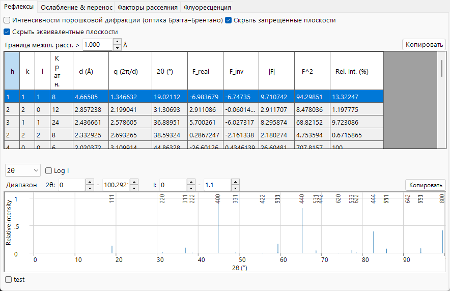
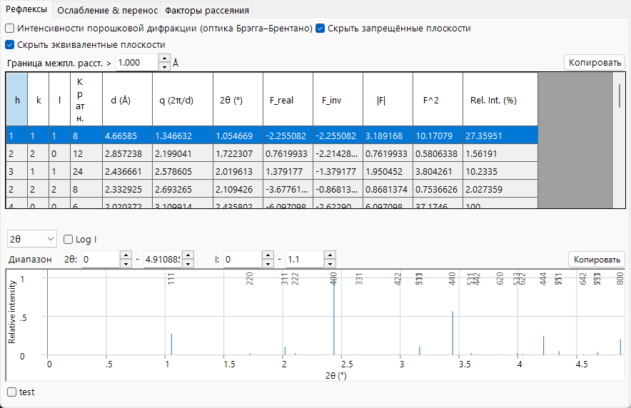
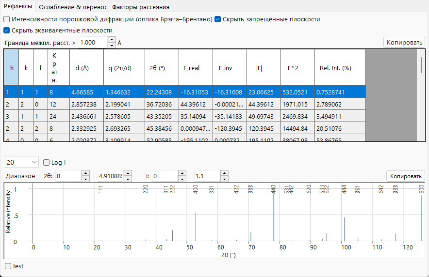

# Структурный фактор

Фактор атомного рассеяния описывает один атом; **структурный фактор** описывает, как все атомы элементарной ячейки рассеивают *совместно*. Это величина, которую сводит в таблицу вкладка **Reflections** (`F_real`, `F_inv`, $\lvert F\rvert$, $F^2$), и она является связующим звеном между атомной физикой предыдущей страницы и дифрагированными интенсивностями.

=== "X-ray"
    

=== "Electron"
    

=== "Neutron"
    

---

## Интерференция по элементарной ячейке

Структурный фактор рефлекса $\mathbf g = (hkl)$ — это когерентная сумма атомных факторов, каждый из которых взвешен фазой, определяемой дробной позицией атома $\mathbf r_j = (x_j,y_j,z_j)$:

$$F_{\mathbf g} = \sum_{j} o_j\, f_j(s,E)\, T_j(\mathbf g)\, \exp\!\left(-2\pi i\,(h x_j + k y_j + l z_j)\right).$$

- $o_j$ : **заселённость** позиции (occupancy, дробная, для частичного или смешанного заполнения).
- $f_j(s,E)$ : фактор атомного рассеяния атома $j$ для текущего пучка — $f_0+f'-if''$ для рентгеновского излучения в [фазовом соглашении](index.md#phase-convention) ReciPro, $f_e$ для электронов, $b$ для нейтронов.
- $T_j(\mathbf g)$ : фактор Дебая–Валлера (см. ниже).
- Фаза $-2\pi i$ следует [соглашению](index.md#phase-convention) ReciPro.

Интенсивность — это квадрат модуля,

$$I_{\mathbf g} \;\propto\; \lvert F_{\mathbf g}\rvert^2 = F_\text{real}^2 + F_\text{inv}^2 ,$$

что соответствует столбцу $F^2$ таблицы. `F_real` и `F_inv` — это действительная и мнимая части комплексного структурного фактора. Даже при чисто действительных атомных факторах $F_{\mathbf g}$ в общем случае комплексен для нецентросимметричной структуры (или смещённого начала отсчёта); аномальная дисперсия рентгеновского излучения (комплексный $f$) и комплексные длины рассеяния нейтронов добавляют дополнительный мнимый вклад. `F_inv` обращается в нуль для *каждого* рефлекса только тогда, когда структура центросимметрична с началом отсчёта в центре симметрии и все факторы действительны.

---

## Фактор Дебая–Валлера

Атомы колеблются вокруг своих равновесных позиций, размывая плотность рассеяния и уменьшая факторы при больших углах. Для изотропного движения

$$T_j = \exp\!\left(-B_j\, s^2\right), \qquad B_j = 8\pi^2\langle u_j^2\rangle,$$

где $\langle u_j^2\rangle$ — среднеквадратичное смещение вдоль направления рассеяния, а $B_j$ — изотропный параметр смещения (Ų). Анизотропное движение обобщает это до

$$T_j = \exp\!\left(-2\pi^2\,\mathbf g^{\mathsf T}\!\mathbf U_j\,\mathbf g\right),$$

где $\mathbf U_j$ — тензор смещения, а $\mathbf g$ — вектор обратной решётки ($|\mathbf g|=1/d$, а не $Q=2\pi\lvert\mathbf g\rvert$). Для дебаевского твёрдого тела среднеквадратичное смещение само является функцией температуры $T$, атомной массы $M$ и температуры Дебая $\Theta_D$,

$$\langle u^2\rangle = \frac{3\hbar^2}{M k_B \Theta_D}\left[\frac14 + \left(\frac{T}{\Theta_D}\right)^2\!\int_0^{\Theta_D/T}\frac{x}{e^x-1}\,dx\right],$$

так что $B$ растёт с температурой и убывает для тяжёлых атомов. ReciPro использует табличные или введённые $B_j$ напрямую, а не вычисляет их. Поскольку $T_j$ умножает фактор рассеяния, вкладка **Scattering factors** может применять то же затухание $e^{-Bs^2}$ к отображаемым кривым. Затухание растёт с температурой и с $s$, поэтому тепловое диффузное рассеяние (интенсивность, изъятая из когерентных брэгговских пучков и перераспределённая в диффузный фон) питает поглощающий потенциал в динамической теории ([Приложение A3](../a3-bloch-wave/index.md)).

---

## Погасания: систематические и случайные

Рефлекс может **отсутствовать** по двум разным причинам:

- **Систематические (определяемые пространственной группой) погасания.** Центрирование решётки и элементы симметрии с трансляционной компонентой (винтовые оси, плоскости скользящего отражения) заставляют целые классы рефлексов исчезать *точно*, для каждого кристалла этой пространственной группы, независимо от атомного содержимого. Это правила, лежащие в основе **Hide prohibited planes**.
- **Случайные почти-погасания.** Когда атомные вклады случайно компенсируют друг друга для конкретной структуры, интенсивность мала, но не запрещена симметрией, и она может вновь появиться при изменении состава или позиций. Они *не* удаляются правилами погасания.

Систематическое погасание — это фазовая компенсация между связанными симметрией копиями ячейки. Для трансляций центрирования $\mathbf t_\alpha$ структурный фактор несёт общий множитель

$$F_{\mathbf g} \propto \sum_\alpha e^{-2\pi i\,\mathbf g\cdot\mathbf t_\alpha},$$

который равен нулю для определённых $hkl$. Для объёмного центрирования ($\mathbf t = \tfrac12,\tfrac12,\tfrac12$),

$$1 + e^{-\pi i (h+k+l)} = 0 \quad\Longleftrightarrow\quad h+k+l \ \text{odd}.$$

Наиболее распространённые систематические погасания:

| Элемент симметрии | Условие погасания | Затронутые рефлексы |
|---|---|---|
| $I$ (объёмноцентрированная) | $h+k+l$ нечётно | все $hkl$ |
| $F$ (гранецентрированная) | $h,k,l$ смешанной чётности | все $hkl$ |
| $C$ (C-центрированная) | $h+k$ нечётно | все $hkl$ |
| винтовая ось $2_1$ $\parallel b$ | $k$ нечётно | $0k0$ |
| плоскость скольжения $a$ $\perp b$ | $h$ нечётно | $h0l$ |
| плоскость скольжения $c$ $\perp b$ | $l$ нечётно | $h0l$ |

Условия центрирования применяются к каждому рефлексу; условия для винтовых осей и плоскостей скольжения применяются только к соответствующему осевому ряду или зоне, что как раз и делает их диагностическими признаками пространственной группы.

---

## Закон Фриделя и его нарушение

Для структуры с действительными (нерезонансными) факторами рассеяния сопряжение суммы и смена знака $\mathbf g$ прямо показывают, что (опуская действительные веса $o_j T_j$ для ясности)

$$F_{-\mathbf g} = \sum_j f_j\, e^{+2\pi i\,\mathbf g\cdot\mathbf r_j} = \left(\sum_j f_j\, e^{-2\pi i\,\mathbf g\cdot\mathbf r_j}\right)^{*} = F_{\mathbf g}^{*}, \qquad\text{hence}\qquad \lvert F_{hkl}\rvert = \lvert F_{\bar h\bar k\bar l}\rvert \quad\text{(Friedel's law).}$$

Тогда дифракция выглядит центросимметричной, даже если кристалл таковым не является. **Аномальная дисперсия может это нарушить.** Записывая структурный фактор как нормальную часть (которая сопрягается чисто) плюс аномальную часть, $F_{\mathbf g} = A_{\mathbf g} - i B_{\mathbf g}$ и $F_{-\mathbf g} = A_{\mathbf g}^{*} - i B_{\mathbf g}^{*}$ в соглашении ReciPro $f = f_0 + f' - i f''$, **разность Бейвоета** равна

$$\lvert F_{\mathbf g}\rvert^2 - \lvert F_{-\mathbf g}\rvert^2 = -4\,\operatorname{Im}\!\left(A_{\mathbf g}\, B_{\mathbf g}^{*}\right),$$

она отлична от нуля только тогда, когда нормальная и аномальная части имеют разные фазы — то есть когда химически различные аномальные рассеиватели занимают нецентросимметричные позиции. (Разность обращается в нуль для центросимметричной структуры, для одного элемента или для любого случая, когда каждый атом несёт один и тот же комплексный фактор.) Именно это позволяет определить абсолютную структуру (хиральность) нецентросимметричного кристалла, и это физическая причина, по которой ReciPro сообщает ненулевой `F_inv` и различные $\lvert F\rvert$ для фриделевских пар, как только выбрана энергия рентгеновского излучения вблизи края поглощения.

---

## От структурного фактора к интенсивности порошка

Включение **Powder Diffraction Intensities (Bragg–Brentano)** преобразует $\lvert F\rvert^2$ в относительную интенсивность порошка, учитывая геометрию случайно ориентированного поликристалла:

$$I_{hkl} \;\propto\; m_{hkl}\, \lvert F_{hkl}\rvert^2\, L p(\theta),$$

- $m_{hkl}$ : **кратность** — число эквивалентных по симметрии плоскостей, перекрывающихся при одном и том же $2\theta$ (столбец *Multi.* таблицы).
- $Lp(\theta)$ : **фактор Лоренца–поляризации** для оптики Брэгга–Брентано, $Lp = \dfrac{1+\cos^2 2\theta}{\sin^2\theta\,\cos\theta}$, который сильно усиливает пики при малых углах.

Поскольку в этом режиме эквивалентные плоскости объединяются в одну линию, ReciPro также принудительно включает *Hide equivalent planes* и *Hide prohibited planes*.

---

## См. также

- [Факторы атомного рассеяния](scattering-factor.md) — те $f_j$, что входят в сумму.
- [Ослабление и перенос](attenuation-transport.md) — что происходит с пучком между событиями рассеяния.
- [3. Взаимодействие пучка → вкладка Reflections](../../3-beam-interaction.md#reflections-tab)
- [Приложение A3. Динамическая дифракция](../a3-bloch-wave/index.md) — когда $\lvert F\rvert^2$ (кинематического) уже недостаточно.
