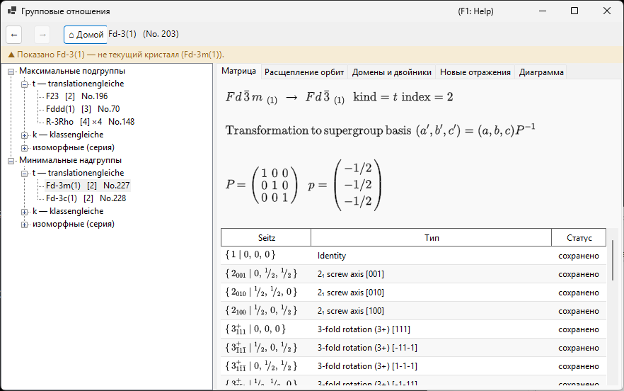
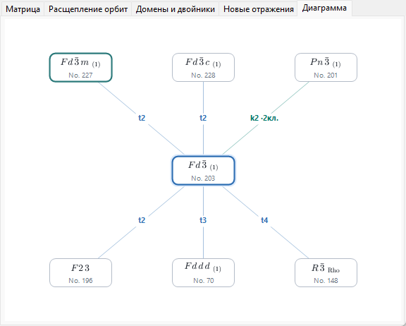
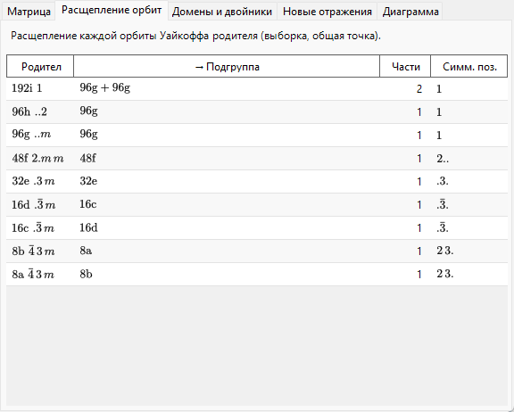
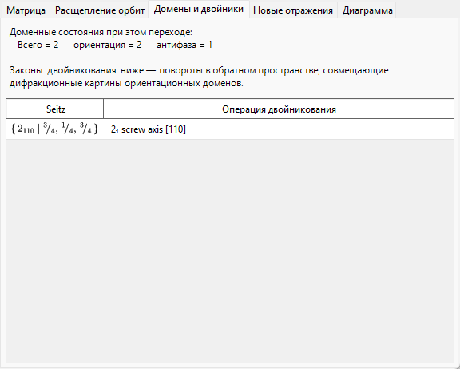
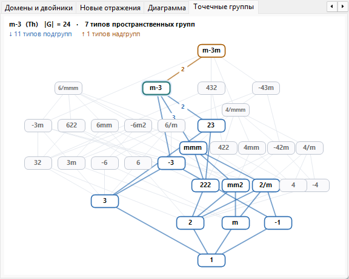
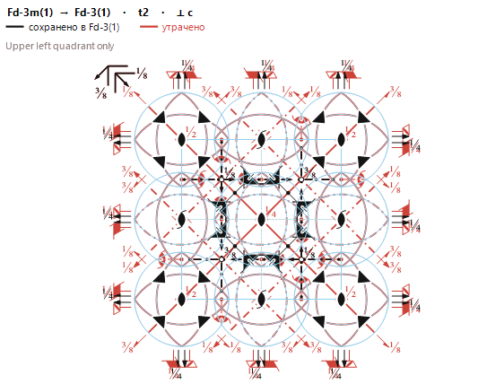

# A4.2. Отношения группа–подгруппа

**Групповые отношения…** — браузер отношений максимальных подгрупп / минимальных надгрупп 230 типов пространственных групп, открываемый с панели **Параметры** окна [Сведения о симметрии](../../2-symmetry-information.md). В отличие от статической таблицы, каждое показываемое отношение вычисляется во время выполнения непосредственно из операций симметрии текущей пространственной группы (см. [A4.1](symbols-and-diagrams.md#операции-симметрии-вкладка-операции)), поэтому его можно перепроверить операция за операцией, а не просто принимать на веру как перепись *International Tables*, Vol. A1.

Эта страница объясняет теоретико-групповую терминологию браузера, а затем последовательно разбирает каждую его вкладку.

---

## Теорема Германа: *t*-, *k*- и изоморфные подгруппы

Подгруппа $H<G$ **максимальна**, если ни одна подгруппа $G$ не лежит строго между $H$ и $G$. Теорема Карла Германа (Carl Hermann, 1929) утверждает, что для табулируемых здесь трёхмерных пространственных групп каждая максимальная подгруппа пространственной группы $G$ относится к одному из двух видов:

- **translationengleiche (*t*-) подгруппа** — «равная по трансляциям»: $H$ сохраняет *все* трансляции $G$ (ту же решётку, ту же ячейку), но имеет меньшую точечную группу. Индекс $[G:H]$ (число смежных классов $H$ в $G$) равен индексу точечных групп $[P_G:P_H]$.
- **klassengleiche (*k*-) подгруппа** — «равная по классу»: $H$ сохраняет *тот же геометрический кристаллический класс* (тип точечной группы), что и $G$, но лишь подрешётку трансляций $G$ — более крупную условную ячейку и/или меньшее число векторов центрирования. Индекс равен индексу решёток трансляций $[T_G:T_H]$.

**Изоморфные подгруппы** — особый, важный случай *k*-подгрупп, когда $H$ вдобавок принадлежит *тому же типу пространственной группы*, что и сама $G$ (лишь с большей ячейкой — отношение, которое повторяется неограниченно, поэтому изоморфные подгруппы образуют бесконечную серию, индексируемую размером ячейки, в отличие от конечного числа *t*- и неизоморфных *k*-подгрупп данной $G$). Для *максимальной* изоморфной подгруппы индекс всегда есть степень простого числа ($p$, а в трёх измерениях изредка $p^2$ или $p^3$); какая именно степень встречается, зависит от того, как конечная фактор-решётка разлагается как модуль под действием точечной группы. Заметьте также, что смена базиса подрешётки может нести настоящую замену базисных векторов и сдвиг начала координат, а не просто равномерное увеличение ячейки вдоль одной оси.

Поскольку любое отношение подгруппы конечного индекса (максимальной или нет) достижимо как цепочка максимальных шагов, перечислить одни лишь максимальные подгруппы (а в обратную сторону — минимальные надгруппы) достаточно, чтобы описать полную сеть отношений подгрупп конечного индекса, — именно поэтому ITA Vol. A1, как и этот браузер, табулирует только максимальные/минимальные отношения.

!!! note "Видов только два — изоморфные являются подклассом, а не третьим видом"
    В обиходе часто говорят о «*t*-, *k*- и изоморфных подгруппах», как будто это три равноправных вида, и дерево в этом браузере действительно для удобства организовано в три ветви. Формально же теорема Германа — это разбиение на **два** вида (*t* против *k*); изоморфные подгруппы — просто те *k*-подгруппы, которые воспроизводят тип пространственной группы самой $G$.

### Индекс как число смежных классов

Поскольку пространственные группы бесконечны (они содержат трансляции), «индекс» здесь всегда означает **число смежных классов $H$ в $G$**, а не отношение порядков $|G|/|H|$ (оба порядка бесконечны) — для конечных групп оба понятия совпадают, но для пространственных групп смысл имеет только определение через подсчёт смежных классов. Дерево и вкладка «Матрица» показывают этот индекс, например, как `t, index 2` или `k, index 3`.

### Сопряжённые подгруппы и класс сопряжённости

Данное абстрактное отношение подгруппы часто может быть реализовано внутри $G$ несколькими геометрически различными способами — различающимися ориентацией или положением, а не типом: например, зеркальное отражение зеркальной плоскости или винтовая ось вдоль иначе ориентированного, но симметрично-эквивалентного направления. Две такие реализации $H$ и $H'$ сопряжены **внутри $G$**, если $H' = gHg^{-1}$ для некоторого $g\in G$; браузер объединяет все такие $G$-сопряжённые копии одного отношения в одну запись и сообщает их число как размер *класса сопряжённости*. Это строго более тонкое понятие, чем группировка подгрупп по (более грубой) эквивалентности относительно евклидова или аффинного нормализатора $G$ — классификации, которую сама ITA иногда использует вместо этой, — поэтому подгруппы одного типа и индекса не обязаны автоматически принадлежать одному классу сопряжённости: они могут распадаться на несколько.

---

## Навигация по браузеру

- **Дерево** (левая панель) имеет два корня — **Максимальные подгруппы** и **Минимальные надгруппы**, — каждый из которых разделён на ветвь **`t — translationengleiche`**, ветвь **`k — klassengleiche`** и ветвь **`изоморфные (серия)`**. Несопряжённые классы с одинаковым типом потомка и индексом иначе получили бы одинаковые подписи, поэтому они различаются суффиксом `· класс n`. В ветви **изоморфные** максимальных подгрупп классы сопряжённости, эквивалентные относительно *аффинного нормализатора* $G$, дополнительно объединяются в одну строку-орбиту (*«… — m классов (эквивалентны по нормализатору)»*) — та же детализация, что и у записей IIc в ITA Vol. A1, — а граница перечисления задаётся счётчиком **Изоморфные подгруппы: индекс ≤** на панели инструментов (2–27, по умолчанию 4; большие границы вычисляются в фоне).
- Вкладка **Диаграмма** рисует упрощённый скелет в стиле Бэрнигхаузена (Bärnighausen): текущая группа в середине (выделена), её минимальные надгруппы сверху, максимальные подгруппы снизу — ***t*-, *k*- и изоморфные отношения наравне**, поскольку каждое из них — один «максимальный шаг». Каждое ребро подписано своим видом и индексом (`t2`, `k3`, `i3`) и раскрашено: синим для *t*, бирюзовым для *k*, оранжевым для изоморфных. Символы узлов набираются как настоящие кристаллографические символы — с нижними индексами винтовых осей и чертой над инверсионными поворотами. Несопряжённые классы с одинаковыми целевым типом, видом и индексом сливаются в один узел, ребро которого несёт счётчик классов (например `k2 ·2 кл.`); рассмотреть каждый класс по отдельности по-прежнему можно в дереве. Когда в ряд попадает больше отношений, чем умещается по ширине окна, узлы уменьшаются на один шаг, а остаток собирается в пунктирный узел `+N` (не кликается — полный список смотрите в дереве); в углу появляется маленькое напоминание `i: только индекс ≤ 4`, когда показаны изоморфные рёбра, и `k: вычисляется…`, пока обратный поиск *k*-надгрупп ещё строится. Когда вы двойными щелчками спускаетесь по подгруппам, цепочка групп, через которые вы прошли (ваша *выбранная ветвь*), рисуется фиолетовым вертикальным столбцом над текущей группой — многоуровневым деревом Бэрнигхаузена вашего собственного пути переходов (например $Pm\bar3m \rightarrow P4/mmm \rightarrow Pmmm \rightarrow \ldots$), где каждое ребро подписано отношением, по которому вы прошли; переход вверх или нажатие **Назад** соответственно подрезает ветвь, а цепочки длиннее трёх предков сокращаются приглушённой пометкой `⋮ +N`. Здесь показан только теоретико-групповой скелет: полное дерево Бэрнигхаузена в смысле структурных родств несёт на каждом ребре ещё и преобразования ячейки, расщепление позиций Уайкоффа и соответствия атомных координат — всё это живёт в других вкладках, описанных ниже, а не на самой диаграмме.
- **Одинарный щелчок** (по узлу дерева или узлу Диаграммы) выбирает отношение и заполняет вкладки деталей внизу. **Двойной щелчок** *перемещает*: он перестраивает весь браузер вокруг этой пространственной группы, так что можно шаг за шагом идти от группы к подгруппе и далее к её подгруппе.
- **Назад / Вперёд / Домой** листают историю переходов; **Домой** всегда возвращает к пространственной группе кристалла, из которого браузер был фактически открыт.
- **Строка пути** (вверху) показывает отображаемую в данный момент пространственную группу (`символ HM (No. n)`); **контекстная строка** под ней становится зелёной («Показана пространственная группа текущего кристалла.»), когда группа совпадает с вашим кристаллом, или янтарной («Показано … — не текущий кристалл (…).»), когда вы перешли в другое место, — напоминание о том, что просмотр подгруппы *не* изменяет ваш кристалл.

---

## Вкладка «Матрица»

Показывает смену базиса и сдвиг начала координат между установкой родителя и установкой потомка в соглашении ITA: новые базисные векторы — $(\mathbf a',\mathbf b',\mathbf c')=(\mathbf a,\mathbf b,\mathbf c)\cdot P$, а координаты точки в установке родителя — $\mathbf x_{\text{parent}} = P\,\mathbf x_{\text{child}} + \mathbf p$. Матрица $3\times3$ $P$ и сдвиг начала $\mathbf p$ печатаются в виде дробей.

- Если вы пришли к этому отношению из **Максимальных подгрупп**, $P$ и $\mathbf p$ показываются напрямую (в направлении родитель → потомок).
- Если же вы пришли из **Минимальных надгрупп**, вкладка показывает $P^{-1}$ (и соответственно обращённый сдвиг) с подписью *«получено из таблицы подгрупп самой надгруппы»* — браузер всегда хранит отношение с точки зрения большей группы и обращает его по требованию, а не ведёт две независимые копии.
- **Сопряжённых подгрупп в классе: $n$** сообщает размер класса сопряжённости, описанного выше.
- Таблица генераторов перечисляет каждый представитель смежного класса с пометкой **сохранено** (всё ещё присутствует в $H$) или **утрачено** (присутствует в $G$, но не в $H$ — именно эти операции и отвечают за нарушение симметрии), каждый — со своим символом Зейтца и описанием геометрического типа из [A4.1](symbols-and-diagrams.md#операции-симметрии-вкладка-операции).
- Если целевой тип пространственной группы кандидатного отношения не удалось отождествить по каталогу ReciPro, вкладка прямо сообщает об этом, не гадая, и показывает только символ точечной группы.

---

## Вкладка «Расщепление орбит»

Показывает, как каждая позиция Уайкоффа *родительской* группы расщепляется при понижении симметрии до $H$: одна строка на родительскую позицию, с кратностью/буквой/симметрией позиции родителя, результирующими кратностями/буквами потомка (соединёнными знаком `+`, если орбита распадается более чем на одну), числом частей и различными симметриями позиций потомка.

Это вычисляется фактической подстановкой **одной фиксированной общей (generic) пробной точки** в операции обеих групп и сравнением полученных орбит — численно *выборочное* расщепление, а не полностью символьный формализм расщепления позиций Уайкоффа (как в инструментах вроде WYCKSPLIT); именно поэтому вкладка сознательно называется «Расщепление орбит», а не «расщепление Уайкоффа»: полностью символьная трактовка в принципе могла бы отследить каждое совпадение при специальных значениях параметров, тогда как выборочный подход сообщает лишь расщепление, наблюдаемое в одной общей точке, и сам по себе не заметил бы совпадения, возникающего только при специальных значениях $x,y,z$.

Для ***k*- или изоморфного отношения** тот же выборочный подход применяется к огрублённой решётке трансляций: вкладка показывает, как каждая родительская орбита расщепляется по мере потери трансляций решётки, а кратности потомков считаются **в увеличенной ячейке подгруппы** (так что при увеличении ячейки с индексом $n$ кратности частей в сумме дают $n$-кратную кратность родителя).

---

## Вкладка «Домены и двойники»

Когда кристалл переходит из $G$ в подгруппу $H$, каждый из $[G:H]$ смежных классов $H$ в $G$ соответствует одному возможному **доменному состоянию**: опорное состояние — единичный смежный класс, а каждый другой смежный класс — представленный одной «утраченной» операцией с вкладки «Матрица» — порождает ещё одно доменное состояние, связанное с опорным этой операцией.

Именно для ***t*-подгруппы** решётка трансляций не меняется ($T_G=T_H$), поэтому с точки зрения теории групп **антифазных (трансляционных) доменов** здесь не бывает: каждое доменное состояние отличается от опорного настоящей операцией точечной группы и никогда — голым сдвигом. Поэтому вкладка всегда сообщает `антифаза = 1` и `ориентация = Всего`, т. е. все $[G:H]$ доменных состояний — **ориентационные домены**.

Для ***k*- или изоморфного** перехода ситуация в точности обратная: точечная группа не меняется, поэтому **ориентационное состояние всего одно**, а утраченные трансляции решётки порождают **антифазные (трансляционные) домены** — вкладка сообщает `ориентация = 1` и `антифаза = Всего`. Каждая утраченная трансляция перечисляется как чисто трансляционный символ Зейтца вместе с соответствующим антифазным вектором, выраженным в ячейке подгруппы. Поскольку все антифазные домены имеют одну и ту же ориентацию, их фундаментальные отражения совпадают точно; лишь сверхструктурные отражения (см. вкладку **Новые отражения**) несут разность фаз через антифазную границу.

**Закон двойникования** для пары ориентационных доменов — это матричная часть утраченной операции (вращение или отражение, действующее на прямую или обратную решётку), переводящая ориентацию решётки одного домена в ориентацию другого. Для перехода в *t*-подгруппу эта операция по построению является симметрией решётки *родительской* группы $G$, поэтому если фактическая метрика низкосимметричной структуры всё ещё обладает этой решёточной симметрией, обратные решётки двух доменов после операции двойникования совпадают точно, и их дифракционные картины накладываются полностью — идеализированный случай *мероэдрического* двойникования, который и описывает эта вкладка. В реальном переходе низкосимметричная фаза обычно приобретает малую спонтанную деформацию, лишь приближённо сохраняющую метрику родителя, поэтому на практике перекрытие часто оказывается лишь приблизительным (*псевдомероэдрическое* двойникование); вкладка сообщает теоретико-групповой закон двойникования при точной метрике, а не меру того, насколько близко к нему подходит конкретный реальный кристалл.

Вырожденный случай с пустым списком смежных классов сообщается как `(один домен)` (индекс 1 никогда не показывается как отношение).

---

## Вкладка «Новые отражения»

Для перехода в *t*-подгруппу перечисляет отражения, которые становятся разрешёнными симметрией в $H$, хотя были систематически погашены в $G$, — т. е. отражения, которые запрещены условиями отражения родителя (со вкладки [Условия](../../2-symmetry-information.md)), но не условиями $H$. Окно поиска задаётся счётчиком **Окно поиска** на вкладке: по умолчанию $|h|,|k|,|l|\le4$, настраивается от 2 до 8 (большие границы могут дать значительно больше строк).

Поскольку *t*-подгруппа никогда не увеличивает элементарную ячейку, это **не** сверхструктурные отражения с дробными индексами — они остаются целочисленными $(h,k,l)$ родительской ячейки и лишь становятся *разрешёнными*, потому что плоскости скользящего отражения или винтовой оси, прежде обращавшей их в нуль, больше нет. (Настоящие сверхструктурные отражения с дробными родительскими индексами возможны лишь тогда, когда увеличивается сама ячейка, — а это происходит для *k*-подгруппы, не для *t*-подгруппы.) Появившееся здесь отражение лишь *допущено* симметрией; будет ли оно действительно наблюдаться, по-прежнему зависит от структурного фактора реальной, менее симметричной структуры.

Для ***k*- или изоморфного отношения** вкладка перечисляет новые отражения, **индексированные в увеличенной ячейке подгруппы** (снова в пределах окна поиска), и классифицирует каждое из них в последнем столбце:

- **сверхструктурные отражения** отображаются в *дробные* родительские индексы, показанные в скобках (например `(1/2 0 1)`), — они появляются исключительно из-за увеличения ячейки;
- **освобождённые отражения** целочисленны и в родительской ячейке, но были запрещены условием отражения родителя, которое подгруппа снимает, — вместо этого показано снятое родительское правило (сюда входит и потеря трансляций центрирования, например когда $I$-центрированный родитель теряет условие чётности $h+k+l$).

Отражения, разрешённые и в родителе, и в потомке (фундаментальные отражения), не перечисляются. Если тип пространственной группы потомка не удалось отождествить, условия отражения потомка неизвестны, и вкладка сообщает, что предсказание невозможно.

---

## Вкладка «Точечные группы»

В то время как остальной браузер перемещается между *пространственными* группами, эта вкладка показывает более широкую карту, на которой разворачиваются эти переходы: **диаграмму Хассе 32 кристаллографических типов точечных групп** (геометрических кристаллических классов) — частичный порядок того, какой тип встречается как подгруппа какого. Каждый узел — один тип точечной группы; вертикальная ось — порядок группы (1 внизу, 48 вверху, в логарифмическом масштабе), причём гексагонально-тригональное семейство образует левую башню, а справа стоит кубическо-тетрагонально-ромбическая башня. Ребро означает отношение *максимальной* (покрывающей) подгруппы — никакой третий тип не помещается строго между ними, — и среди 32 типов таких рёбер ровно 80. Диаграмма является частичным порядком, но *не* решёткой в математическом смысле: в ней два максимальных элемента, $m\bar3m$ и $6/mmm$, которые несравнимы.

- Точечная группа просматриваемой пространственной группы несёт бледно-голубой ореол (как текущий узел вкладки «Диаграмма») и по умолчанию является типом *в фокусе*.
- **Щёлкните** любой узел, чтобы перевести фокус на него: его **типы подгрупп подсвечиваются синим**, его **типы надгрупп — оранжевым**, а числа на рёбрах самого узла в фокусе — это **индекс** (отношение порядков) соответствующего максимального шага. Типы, не связанные с фокусом, остаются серыми. Щелчок по пустому месту возвращает фокус к текущей точечной группе. (Щелчок никуда не перемещает — тип точечной группы соответствует многим пространственным группам, а не одной.)
- Подпись вверху резюмирует тип в фокусе: символы Германа–Могена и Шёнфлиса, порядок группы $|G|$, сколько из 230 типов пространственных групп ему принадлежит, а также размеры его множеств типов подгрупп/надгрупп.

Эта диаграмма — тень теоремы Германа на уровне точечных групп: один шаг в *t*-подгруппу в дереве спускается здесь ровно на одно ребро (индекс пространственных групп *t*-шага равен индексу точечных групп на ребре), тогда как *k*- и изоморфные шаги остаются на том же узле.

---

## Вкладка «Элементы»

Там, где вкладка «Матрица» перечисляет сохранённые и утраченные операции в виде таблицы, эта вкладка показывает ту же информацию *геометрически*, накладывая её на [диаграмму элементов симметрии](symbols-and-diagrams.md#symmetry-element-diagram) родителя (рисунок в стиле ITA Vol. A с осями, плоскостями и центрами инверсии). Она отвечает на вопрос «какие элементы симметрии выживают, а какие разрушаются, когда кристалл переходит из $G$ в подгруппу $H$» — с первого взгляда, на том же рисунке, который кристаллографы и так умеют читать.

- **Элементы, сохраняющиеся в $H$, рисуются чёрным; утраченные элементы рисуются красным.** Направление проекции (⟂ *a*, *b* или *c*) выбирается автоматически по кристаллической системе родителя, а заголовок называет отношение и проекцию.
- Элемент симметрии, вырождающийся в более низкий, показывается буквально: например, ось 4-го порядка, становящаяся осью 2-го порядка, выглядит как **красный символ оси 4-го порядка с нарисованным поверх него чёрным символом оси 2-го порядка** — красный говорит «оси 4-го порядка больше нет», чёрный говорит «здесь остаётся ось 2-го порядка».
- Наложение строится так: сначала рисуется полная диаграмма родителя (как *утраченная* основа), а затем поверх неё перерисовываются элементы симметрии, реконструированные напрямую из собственного набора операций $H$, — так что сохранёнными оказываются именно те элементы, которые вновь появляются в $H$, без угадывания символ за символом.

Эта вкладка предоставляется **только для *translationengleiche* (*t*-) подгрупп**, где $H$ сохраняет решётку трансляций родителя ($T_H=T_G$), так что элементы обеих групп живут в одной и той же ячейке. Для *k*- и изоморфных отношений ячейка увеличивается, и рисунок отложен до более поздней версии; вкладка показывает короткую заметку, отсылающую к вкладкам «Домены и двойники» и «Новые отражения», которые уже несут информацию об утраченной симметрии решётки для этих случаев.

---

## Текущие ограничения

Механизмы поиска *t*- и *k*-подгрупп, обратные поиски *t*- и *k*-надгрупп и классификация изоморфных (IIc) подгрупп реализованы полностью и независимо проверены по таблицам операций пространственных групп, а вкладки **Расщепление орбит**, **Домены и двойники** и **Новые отражения** работают для отношений всех видов. Оставшиеся ограничения показываются явно, а не замалчиваются:

- **Изоморфные подгруппы перечисляются до границы, заданной счётчиком (по умолчанию индекс ≤ 4, максимум 27).** Изоморфная серия продолжается неограниченно к более высоким индексам, поэтому серая заметка на ветви всегда указывает текущую границу, а не делает вид, что список полон. Объединение в орбиты по нормализатору опирается на ограниченный поиск генераторов нормализатора; для проверенных случаев оно сверено с ITA A1, но формальное доказательство полноты для каждой группы — задача на будущее: в худшем случае орбита может быть показана разбитой на несколько строк, но никогда не будет ошибочно объединена.
- ***k*-надгруппы** вычисляются в фоне при первом использовании (обратному поиску нужны таблицы *k*-подгрупп всех типов того же кристаллического класса); пока он не готов, дерево ненадолго показывает серый узел *«вычисляется…»* (а Диаграмма — угловую заметку *«k: вычисляется…»*).

---

## Глоссарий

| Термин | Значение |
|---|---|
| Максимальная подгруппа / минимальная надгруппа | Подгруппа (надгруппа), между которой и $G$ нет строго промежуточного отношения подгруппы |
| Индекс $[G:H]$ | Число смежных классов $H$ в $G$ |
| *translationengleiche* (*t*-) | Та же решётка трансляций, меньшая точечная группа; индекс = индексу точечных групп |
| *klassengleiche* (*k*-) | Тот же тип точечной группы, подрешётка трансляций (большая ячейка); индекс = индексу решёток |
| Изоморфная подгруппа | *k*-подгруппа, вдобавок принадлежащая тому же типу пространственной группы, что и $G$ |
| Класс сопряжённости (внутри $G$) | Множество $G$-сопряжённых ($gHg^{-1}$) реализаций одного отношения подгруппы |
| Ориентационный домен | Доменное состояние, связанное с опорным операцией точечной группы |
| Антифазный (трансляционный) домен | Доменное состояние, связанное с опорным только утраченной трансляцией (возможно для *k*-, но не *t*-переходов) |
| Закон двойникования | Матричная часть утраченной операции, переводящая решётку одного ориентационного домена в решётку другого |

---

## См. также

- [2. Сведения о симметрии](../../2-symmetry-information.md) — руководство по GUI, теорию которого раскрывает это приложение.
- [A4.1. Символы пространственных групп и диаграммы симметрии](symbols-and-diagrams.md) — словарь символов Зейтца и геометрических типов, используемый на вкладках «Матрица» и «Домены и двойники».
- [Приложение A4. Симметрия и пространственные группы](index.md)
