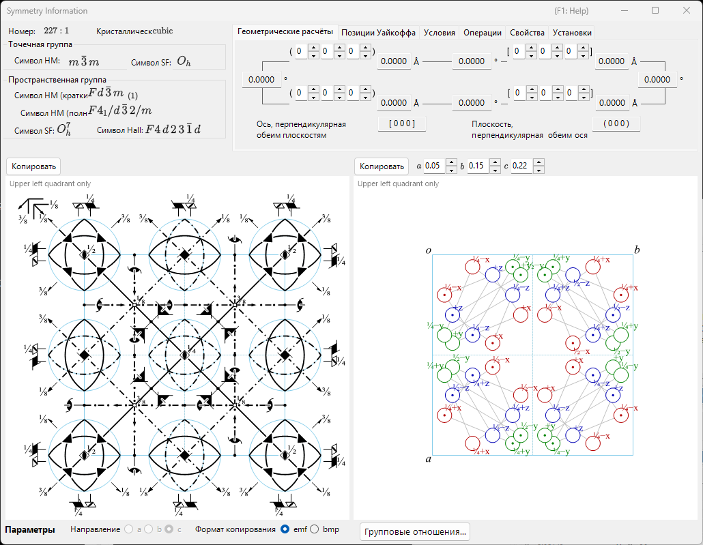

# Приложение A4. Симметрия и пространственные группы

Глава о главном окне [2. Сведения о симметрии](../../2-symmetry-information.md) — это руководство по GUI: она рассказывает, какая вкладка что показывает и какая кнопка копирует какую диаграмму. В этом приложении собраны **кристаллографические и теоретико-групповые основы**, стоящие за этими таблицами и картинками, — что на самом деле кодирует символ Германа–Могена, как читать диаграммы элементов симметрии и общих положений в стиле *International Tables for Crystallography* (ITA) Vol. A и что означают таблицы надгрупп/подгрупп окна **Групповые отношения…** и его терминология (*translationengleiche*, *klassengleiche*, класс сопряжённости, домены, законы двойникования, …).

Рассматриваются два окна, и теорию лучше всего читать в следующем порядке:

1. **[A4.1. Символы пространственных групп и диаграммы симметрии](symbols-and-diagrams.md)** — символы Германа–Могена, Шёнфлиса и Hall; теоретико-групповая классификация на вкладке **Свойства** (центросимметричность, группа Зонке, симморфность, полярность, арифметический класс, симметрия Паттерсона, …); описание каждой операции симметрии на вкладке **Операции** координатным триплетом/символом Зейтца/геометрическим типом; и графические соглашения диаграмм элементов симметрии и общих положений внизу окна [Сведения о симметрии](../../2-symmetry-information.md).
2. **[A4.2. Отношения группа–подгруппа](group-subgroup-relations.md)** — что такое *максимальная подгруппа* / *минимальная надгруппа*, различие *t*-/*k*- по Герману и как читать каждую вкладку браузера **Групповые отношения…** (Диаграмма, Матрица, Расщепление орбит, Домены и двойники, Новые отражения), открываемого с панели **Параметры** окна «Сведения о симметрии».

A4.1 идёт первым, потому что A4.2 постоянно на него ссылается: каждое отношение подгруппы/надгруппы само помечено теми же символами Германа–Могена, символами Зейтца и формулировками геометрических типов (*«3-fold rotation»*, *«c-glide plane»*, *«screw axis»*, …), которые вводятся там.

---

## Охват и источники

Встроенная база данных ReciPro охватывает 230 типов пространственных групп (с 530 табулированными установками/выборами начала координат) в точности так, как они табулированы в *International Tables for Crystallography*, **Volume A** (симметрия пространственных групп) и **Volume A1** (максимальные подгруппы пространственных групп). Это приложение объясняет то, как ReciPro *подаёт* эти данные — нотацию, диаграммы, инструмент просмотра, — и предполагает, что читатель уже знаком на уровне университетского курса с решётками, точечными группами и понятием операции симметрии. Оно не заменяет саму ITA, которая остаётся авторитетным источником табулированных данных (и которую ReciPro не может воспроизводить дословно по соображениям авторского права — собственный список альтернативных начал координат/установок для данного типа пространственной группы ReciPro показывает на вкладке **Установки**).

!!! note "Групповые отношения… — активно развиваемая функция"
    Браузер **Групповые отношения…** (A4.2) вычисляет *translationengleiche* (t-) и *klassengleiche* (k-, включая *изоморфные*) подгруппы и надгруппы непосредственно из операций симметрии самой пространственной группы (а не из заранее табулированного списка), поэтому каждое показанное отношение проверено независимо, а не переписано из таблицы. Оставшиеся ограничения — например, изоморфные серии перечисляются только до индекса ≤ 4 — явно указаны в разделе **Текущие ограничения** страницы A4.2.

---

## См. также

- [2. Сведения о симметрии](../../2-symmetry-information.md) — руководство по GUI, теорию которого раскрывает это приложение.
- [A4.1. Символы пространственных групп и диаграммы симметрии](symbols-and-diagrams.md) · [A4.2. Отношения группа–подгруппа](group-subgroup-relations.md)
- [Приложение A1. Системы координат](../a1-coordinate-system/1-orientation.md)
- [Приложение A2. Взаимодействие пучка (физика твёрдого тела)](../a2-beam-interaction/index.md) — где условия отражения пространственной группы (систематические погасания) входят в структурный фактор.
