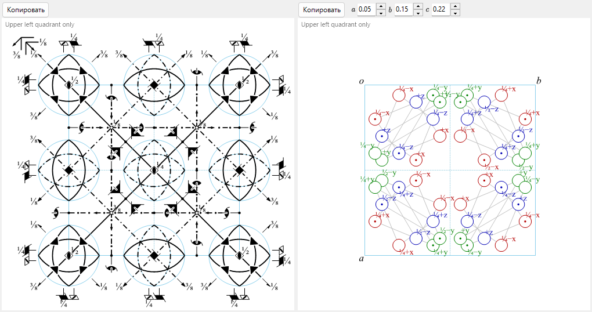

# A4.1. Символы пространственных групп и диаграммы симметрии

Эта страница объясняет всё, что показано в верхней половине окна [Сведения о симметрии](../../2-symmetry-information.md) (панель идентификации пространственной группы и вкладки **Операции**/**Свойства**/**Установки**), а также две схематические диаграммы внизу окна. Все обозначения следуют *International Tables for Crystallography* (ITA), Vol. A.

---

## Символы Германа–Могена (HM)

Символ Германа–Могена имеет два уровня: **символ точечной группы** (верхний блок, *Точечная группа*) описывает только макроскопическую симметрию кристалла, а **символ пространственной группы** (нижний блок, *Пространственная группа*) добавляет к ней центрирование решётки и винтовые/скользящие компоненты.

### Буква решётки

Символ пространственной группы начинается с одной из семи стандартных букв решётки:

| Буква | Значение |
|---|---|
| `P` | Примитивная |
| `A`, `B`, `C` | Центрированная по одной грани (центрирование грани *bc*, *ac* или *ab* соответственно) |
| `I` | Объёмноцентрированная |
| `F` | Гранецентрированная (по всем граням) |
| `R` | Ромбоэдрическая (собственная решётка тригональной системы; часто описывается в *гексагональных осях* — тогда ячейка содержит три узла решётки) |

### Направления симметрии

После буквы решётки каждая оставшаяся позиция символа обозначает одно **направление симметрии** — направление в кристалле, вдоль которого лежит поворотная/винтовая ось и/или перпендикулярно которому расположена зеркальная плоскость или плоскость скользящего отражения. Каким физическим направлениям отвечают эти позиции и в каком порядке — фиксировано кристаллической системой:

| Кристаллическая система | 1-я позиция | 2-я позиция | 3-я позиция |
|---|---|---|---|
| Триклинная | *(нет — только `1` или `-1`)* | | |
| Моноклинная | $[010]$ (уникальная ось $b$, соглашение ReciPro) | | |
| Ромбическая | $[100]$ | $[010]$ | $[001]$ |
| Тетрагональная | $[001]$ | $[100],[010]$ | $[110],[1\bar 10]$ |
| Тригональная / гексагональная | $[001]$ | $[100],[010],[\bar 1\bar 1 0]$ | $[1\bar 10],[120],[\bar 2\bar 1 0]$ |
| Кубическая | $[100],[010],[001]$ | $[111]$ *(и остальные 3 объёмные диагонали)* | $[1\bar 10],[110]$ *(и остальные 4 диагонали граней)* |

Отдельная позиция заполняется по следующим правилам:

- Простое число $n$ ($n=1,2,3,4,6$) : **поворотная** ось $n$-го порядка вдоль этого направления.
- Винтовая ось $n_p$ (например $2_1$, $4_2$, $6_3$) : поворот на $360°/n$, *совмещённый* с трансляцией на $p/n$ периода решётки вдоль оси. Например $2_1$ («двойная винтовая ось») означает поворот на $180°$ **и** сдвиг на половину ребра ячейки вдоль оси; $6_3$ — поворот на $60°$ и сдвиг на половину ребра ячейки вдоль $c$.
- Отдельная буква ($m,a,b,c,n,d$) без предшествующего числа вращения : **зеркальная плоскость или плоскость скользящего отражения**, перпендикулярная этому направлению (значение буквы то же, что и на диаграммах ниже).
- $n/m$ или $n_p/m$ : поворотная/винтовая ось **вместе с** перпендикулярным ей зеркалом (оба элемента относятся к одному направлению: один вдоль оси, другой поперёк неё).
- $-n$ (например $-1,-3,-4,-6$) : **инверсионно-поворотная** ось (поворот на $360°/n$ с последующей инверсией через точку на оси). $-1$ сам по себе обозначает чистый центр инверсии; оси «$-2$» не существует, поскольку двукратный инверсионный поворот тождествен зеркальному отражению и потому всегда записывается как $m$.

### Краткий и полный символ

**Краткий** символ HM (тот, который обычно цитируют) опускает элементы симметрии, уже подразумеваемые записанными; **полный** символ выписывает все направления. Например, пространственная группа No. 62 — это $Pnma$ в краткой форме и $P\,2_1/n\,2_1/m\,2_1/a$ в полной: три винтовые оси $2_1$ следуют из трёх плоскостей (скользящих и зеркальной) вместе с точечной группой $mmm$ пространственной группы, поэтому краткий символ их опускает. Поля ReciPro *Символ HM (краткий)* и *Символ HM (полный)* показывают оба варианта; для большинства пространственных групп они совпадают.

### Символы Шёнфлиса (SF) и Hall

**Символ Шёнфлиса** (например $D_{2h}^{16}$) называет тип точечной группы ($D_{2h}$) и добавляет верхний индекс, который просто нумерует, *какая именно* пространственная группа этого семейства точечной группы имеется в виду, — в отличие от символа HM, верхний индекс сам по себе не несёт прямого геометрического смысла; его приходится искать по таблице. ReciPro показывает символ Шёнфлиса и для точечной, и для пространственной группы.

**Символ Hall** — иная нотация, основанная на генераторах и предназначенная для однозначной компьютерной обработки: она перечисляет минимальный набор порождающих операций вместе с явным началом координат, поэтому программа может восстановить точный набор координат, не обращаясь к справочной таблице «какую установку/какой выбор начала координат подразумевает этот символ HM». Символ Hall — не *единственный* возможный способ закодировать данный набор операций (разные выборы генераторов дают разные, но одинаково корректные строки Hall для одной и той же группы), однако каждый из них сам по себе полностью явен и обратим. ReciPro показывает систематически сгенерированный символ Hall для текущей установки; вкладка **Установки** (ниже) перечисляет все табулированные варианты начала координат/установки с тем же номером пространственной группы, каждый со своим символом HM и Hall.

---

## Операции симметрии (вкладка «Операции»)

Вкладка **Операции** перечисляет каждую операцию симметрии общей позиции для текущей установки (трансляции центрирования решётки уже развёрнуты) в трёх параллельных нотациях:

| Столбец | Пример | Значение |
|---|---|---|
| Координаты | `-y, x-y, z+1/3` | Координатный триплет $(x,y,z)\mapsto(x',y',z')$, т. е. аффинное отображение $x'=Rx+t$, выписанное алгебраически (соглашение ITA/CIF). |
| Seitz | `3+ [111]` | Компактный символ: порядок и направление вращения/винта (`3+`), направление оси (`[111]`) и — при наличии — трансляция операции, например `2₁ [001] 0,0,1/2`. Чистое зеркало — `m`, тождественная операция — `1`, инверсия — `-1`. |
| Тип | `3-fold rotation (3+) [111]` | Словесная классификация операции: `Identity` (тождественная операция), `Inversion centre at …` (центр инверсии в …), `n-fold rotation` (поворотная ось $n$-го порядка), `nₚ screw axis` (винтовая ось), `Mirror plane m` (зеркальная плоскость), `a/b/c/n/d`-`glide plane` (плоскость скользящего отражения) или `n`-кратный `rotoinversion` (инверсионный поворот) — каждая со своим направлением (а для центра инверсии — с его положением). |

Кнопка **Копировать (CIF)** помещает полный список операций в буфер обмена как CIF-цикл `_space_group_symop_operation_xyz`. Этот словарь — символ Зейтца и геометрический тип — вновь появляется по всему [A4.2](group-subgroup-relations.md), где тем же способом описывается каждый сохранённый/утраченный генератор отношения подгруппы.

---

## Теоретико-групповая классификация (вкладка «Свойства»)

Вкладка **Свойства** сообщает набор стандартных классификаций текущей пространственной группы. Некоторые из них — центросимметричность, группа Шёнке и полярность (а из них — приведённые ниже допуски физических свойств) — напрямую следуют из **матричной части** $R$ каждой операции (её линейной, поворотно-отражательной части), для центросимметричности — вместе с трансляционной частью. Остальные — симморфность, энантиоморфная пара, кристаллическое семейство/решёточная система/тип Браве, арифметический класс и симметрия Патерсона — являются свойствами *типа* пространственной группы в целом (его номера IT, типа решётки и класса Лауэ), а не какой-либо отдельной операции. Ничто из этого не требует метрики (формы элементарной ячейки) — всё зависит только от абстрактного содержания симметрии и классификации типа пространственной группы.

**Центросимметричная** — набор операций содержит операцию вида $\{-I \mid t\}$ (инверсию через точку $t/2$, которая не обязана совпадать с началом координат). Свойства «группа Шёнке» и «полярная» (ниже) взаимно исключают это свойство: центр инверсии обращает каждое направление, поэтому центросимметричная группа никогда не бывает полярной, а определитель $-I$ равен $-1$, поэтому центросимметричная группа никогда не бывает группой Шёнке.

**Группа Шёнке (хиральная)** — группа, сохраняющая ориентацию: матричная часть *каждой* операции имеет $\det R=+1$; группа содержит только собственные вращения и винтовые вращения — и никогда зеркало, скользящее отражение, инверсию или инверсионный поворот. 65 из 230 типов пространственных групп — группы Шёнке. Быть группой Шёнке — это условие симметрии, при котором структура совместима с объектами определённой хиральности (хиральные молекулы, белки, кварц, …), не содержа одновременно их зеркальных отражений. Это более широкое понятие, чем принадлежность к настоящей *паре* действительно различных зеркально-эквивалентных типов пространственных групп — см. **Энантиоморфная пара** ниже.

**Энантиоморфная пара** — среди 65 типов Шёнке 11 пар (22 типа) связаны друг с другом *только* преобразованием, обращающим ориентацию, и никаким собственным (сохраняющим ориентацию): зеркальное отражение кристалла в одной из этих пространственных групп превращает его в другой член пары и никогда — обратно в самого себя, при любом переобозначении осей. Эти 11 пар построены на винтовых осях противоположной закрутки:

$$P4_1 / P4_3,\ \ P4_122 / P4_322,\ \ P4_12_12 / P4_32_12,\ \ P3_1/P3_2,\ \ P3_112/P3_212,\ \ P3_121/P3_221,$$
$$P6_1/P6_5,\ \ P6_2/P6_4,\ \ P6_122/P6_522,\ \ P6_222/P6_422,\ \ P4_332/P4_132.$$

Остальные $65-22=43$ типа Шёнке совпадают со своим зеркальным отражением (ахиральны *как типы пространственных групп*, хотя каждая отдельная структура в них по-прежнему хиральна).

**Симморфная** — один из 73 типов пространственных групп, для которых можно выбрать начало координат так, что *каждый* представитель смежного класса (по модулю трансляций решётки) имеет нулевую собственную (винтовую/скользящую) трансляционную компоненту, — эквивалентно, некоторая точка ячейки имеет группу симметрии позиции, изоморфную всей точечной группе. (Трансляции центрирования, разумеется, остаются; «симморфность» — утверждение о непримитивных трансляционных частях операций *точечной группы*, а не о решётке.) Симморфную пространственную группу всегда можно породить из одних лишь её точечной группы и решётки, без винтовых осей и плоскостей скользящего отражения, если описывать её именно при этом начале координат — а это ровно то начало, которое сама ITA табулирует для симморфного типа, поэтому его стандартный краткий/полный символ уже свободен от винтовых и скользящих букв. (Если описать операции той же группы при сдвинутом или смещённом на трансляцию центрирования начале координат, отдельная операция может выглядеть несущей винтовую/скользящую трансляцию, но симморфная классификация типа от этого не меняется — классификация спрашивает лишь, существует ли вообще начало без таких трансляций, и для этих 73 типов оно существует.)

**Полярная** — существует ли направление, которое матричная часть *каждой* операции оставляет неизменным, $Rv=v$ (не $\pm v$: истинно полярное направление должно сохраняться точно, а не просто обращаться или оставаться осью второго порядка). Возможные случаи: **нет** (такого направления нет) &nbsp;/&nbsp; одна ось $[uvw]$ &nbsp;/&nbsp; целая плоскость (любое направление в ней) &nbsp;/&nbsp; **любое** направление вообще (только для точечной группы $1$). Полярная ось — направление, вдоль которого симметрия разрешает спонтанную электрическую поляризацию (см. таблицу физических свойств ниже).

**Кристаллическое семейство, решёточная система, тип Браве** — стандартная классификационная иерархия IUCr над кристаллической системой: всего 6 **кристаллических семейств**, 7 **кристаллических систем**, 7 **решёточных систем** и 14 **типов решёток Браве**. Тонкость — **гексагональное кристаллическое семейство**: на **кристаллические системы** оно распадается на *тригональную* и *гексагональную*, но на **решёточные системы** — иначе, на *гексагональную* и *ромбоэдрическую*: тригональная пространственная группа попадает в гексагональную решёточную систему, если её решётка типа $P$, или в ромбоэдрическую, если она $R$-центрирована, — независимо от того, к какой из двух кристаллических систем она принадлежит.

**Арифметический класс** — сочетание (возможно, различающего направления) символа точечной группы с буквой решётки Браве, например `4mmP`; всего существует 73 арифметических класса. Поскольку некоторые символы точечных групп (`3m1` и `31m` — два неэквивалентных способа расположить точечную группу $3m$ относительно гексагональной решётки) уже сами кодируют свою ориентацию относительно решётки, указания ориентированного символа точечной группы вместе с буквой решётки достаточно, чтобы назвать класс однозначно.

**Симметрия Патерсона** — тип решётки вместе с *классом Лауэ* (центросимметричной точечной группой, получаемой добавлением $-1$ к собственной точечной группе пространственной группы) при полностью отброшенной винтовой/скользящей информации: например `Pmmm` для любой из 30 ромбических пространственных групп с решёткой $P$, независимо от того, какие из них содержат плоскости скользящего отражения. Это симметрия функции Патерсона, вычисляемой из дифракционных *интенсивностей* $|F|^2$ в кинематическом приближении, поскольку $|F|^2$ нечувствительна к фазовому сдвигу, вносимому скользящей/винтовой трансляцией (хотя вызываемые ею систематические погасания и пики Харкера на карте Патерсона всё же могут косвенно выдать её присутствие). Для динамической дифракции электронов эта кинематическая картина выполняется не точно; см. [Приложение A3](../a3-bloch-wave/index.md).

### Допуски физических свойств

Последние строки вкладки «Свойства» сообщают, **разрешено ли симметрией** данное макроскопическое физическое свойство для текущей точечной группы — это необходимое условие, а не гарантия того, что эффект велик или вообще присутствует в реальном кристалле (соглашение книги Ная «Physical Properties of Crystals»):

| Свойство | Условие симметрии | Точечные группы |
|---|---|---|
| Пироэлектрик / сегнетоэлектрик | Полярная (разрешён полярный вектор 1-го ранга — спонтанная поляризация) | 10 полярных точечных групп |
| Пьезоэлектрик | Нецентросимметричная **и** точечная группа $\ne 432$ | 20 из 21 нецентросимметричной точечной группы |
| Генерация второй гармоники (объёмный электродипольный $\chi^{(2)}$) | То же условие, что и для пьезоэлектричества (полярный тензор 3-го ранга) | те же 20 точечных групп |
| Оптическая активность (естественная гиротропия) | 11 точечных групп, содержащих только собственные вращения, плюс ещё 4 гиротропные, не являющиеся чисто группами Шёнке | $1,2,3,4,6,222,32,422,622,23,432$ и $m,mm2,\bar4,\bar42m$ — всего 15 точечных групп |

$432$ — единственная нецентросимметричная точечная группа *без* пьезоэлектрического/SHG-отклика: её вращательная симметрия слишком велика (все собственные вращения, кубическая), чтобы уцелела хоть одна компонента полярного тензора 3-го ранга, хотя центра инверсии в ней нет.

!!! note "Разрешено симметрией — не обязательно наблюдается"
    Эти строки констатируют лишь то, что точечная группа *допускает*. Действительно ли реальный кристалл переключает свою поляризацию (истинная сегнетоэлектричность) и показывает ли практически полезный пьезоэлектрический или SHG-отклик — зависит от химии и деталей структуры, а не только от симметрии.

### Вкладка «Установки»

Перечисляет все табулированные варианты выбора начала координат и осей с тем же номером IT, что у текущей пространственной группы (например, два выбора начала координат $Fd\bar 3m$ или разные выборы ячейки моноклинной группы), каждый со своим символом HM и Hall; строка текущей отображаемой установки отмечена. Эта вкладка предназначена только для просмотра альтернатив — выбор строки не изменяет кристалл.

---

## Диаграмма элементов симметрии

Левая диаграмма воспроизводит схематическую диаграмму симметрии ITA Vol. A для текущей установки в проекции вдоль оси, выбранной элементом **Направление** (`a`/`b`/`c`).

**Оси, перпендикулярные плоскости страницы**, изображаются закрашенными точечными символами, форма которых кодирует порядок вращения; у винтовых осей добавляются маленькие хвостики («крылышки»), число и расположение которых кодируют и шаг винта $p$, и его закрутку: например $3_1$ и $3_2$ — винты одного порядка, но противоположной закрутки — рисуются зеркально-симметричными узорами хвостиков, а не просто разным их числом:

| Символ | Элемент |
|---|---|
| Закрашенная линза (заострённый овал) | Поворотная ось 2-го порядка |
| Закрашенная линза с крылышком | Винтовая ось $2_1$ |
| Закрашенный треугольник | Поворотная ось 3-го порядка |
| Закрашенный треугольник с хвостиками | Винтовая ось $3_1$ / $3_2$ |
| Закрашенный квадрат | Поворотная ось 4-го порядка |
| Закрашенный квадрат с хвостиками | Винтовая ось $4_1$ / $4_2$ / $4_3$ |
| Закрашенный шестиугольник | Поворотная ось 6-го порядка |
| Закрашенный шестиугольник с хвостиками | Винтовая ось $6_1 \ldots 6_5$ |
| Маленькая незакрашенная окружность | Центр инверсии ($-1$) |
| Комбинированный незакрашенно-закрашенный символ | Инверсионно-поворотная ось ($-3,-4,-6$) |

Оси, идущие наклонно или лежащие в плоскости страницы (это случается только для особых направлений, таких как объёмные диагонали $\langle 111\rangle$ или диагонали граней $\langle 110\rangle$ кубической системы), изображаются стрелкой с точечным символом у её основания — по тому же соглашению ITA.

**Плоскости** изображаются линиями, стиль которых называет тип скольжения: буква указывает, вдоль какого направления решётки идёт вектор скольжения (или что он диагональный/четвертьячеечный), а лежит ли эта трансляция *в* плоскости страницы или выходит *из* неё — зависит от выбранной оси проекции:

| Стиль линии | Плоскость |
|---|---|
| Сплошная линия | Зеркальная плоскость $m$ |
| Длинные штрихи | Осевое скольжение $a$ или $b$ |
| Точечная линия | Осевое скольжение $c$ (в типичном случае, когда его трансляция выходит из плоскости страницы) |
| Штрихпунктирная линия | Диагональное скольжение $n$ |
| Штрихпунктирная линия со стрелкой | Алмазное скольжение $d$ (трансляция на четверть ячейки; встречается только в центрированных ячейках) |
| Двойная линия | «Двойное скольжение» $e$ — два независимых вектора скольжения совпадают на одной плоскости (встречается только в центрированных ячейках, где через одну и ту же плоскость проходят скольжение и его партнёр, смещённый на трансляцию центрирования) |

Дробная метка высоты (например `1/4`) рядом с символом даёт его координату вдоль оси проекции, когда элемент не лежит в плоскости на высоте 0.

!!! note "Кубические группы с решёткой F: рисуется только один октант"
    Для $F$-центрированных кубических пространственных групп ReciPro рисует только левый верхний квадрант одной восьмой ячейки (иначе диаграмма была бы слишком плотной для чтения); полная ячейка воспроизводится трансляциями центрирования и самими нарисованными элементами симметрии. Те же элементы симметрии можно наложить непосредственно на 3D-модель в окне [Просмотр структуры](../../5-structure-viewer.md).

---

## Диаграмма общих положений

Правая диаграмма изображает общие эквивалентные положения — орбиту одной общей точки $(x,y,z)$ под действием всех операций пространственной группы — снова в стиле ITA:

- Каждый **кружок** — проекция одной симметрично-эквивалентной копии точки.
- **Запятая** внутри кружка отмечает копию, порождённую операцией *второго рода* (зеркалом, скользящим отражением, инверсией или инверсионным поворотом), — она имеет противоположную хиральность по сравнению с хиральным пробным объектом, помещённым в исходную точку, в точности как пары «простая и зеркальная рука», используемые в самой ITA.
- **Разделённый кружок** (половина пустая, половина с запятой) отмечает позицию, куда проецируются одновременно копия от собственной операции и копия от несобственной.
- Метка высоты рядом с кружком (`+`, `−`, `½+`, …) даёт координату этой копии вдоль оси проекции *относительно* опорной точки: `+` означает «на высоте $z$», `−` — «на $-z$», `½+` — «на $z+\tfrac12$» и т. д.; это не абсолютная высота.
- (Только кубические пространственные группы) тонкие вспомогательные линии соединяют три кружка, связанных осью 3-го порядка вдоль объёмной диагонали $\langle111\rangle$.
- В общем случае один кружок (или одна половина разделённого кружка) соответствует одному эквивалентному положению, поэтому число кружков совпадает с **кратностью** общей позиции, показанной на вкладке [Позиции Уайкоффа](../../2-symmetry-information.md), — быстрая проверка при чтении любой из диаграмм. Если при выбранной оси проекции несколько копий одинаковой хиральности совпадают точно, они накладываются в одной точке (различаясь только отдельными метками высоты), а не рисуются рядом отдельными кружками, поэтому видимое число кружков может оказаться меньше кратности.

Поля `numericBox` под элементом **Направление** позволяют сместить пробную точку $(x,y,z)$ с положения по умолчанию для данной точечной группы — это иногда полезно, чтобы «разредить» диаграмму, на которой несколько кружков иначе совпали бы.

---

## См. также

- [2. Сведения о симметрии](../../2-symmetry-information.md) — руководство по GUI, теорию которого раскрывает это приложение.
- [A4.2. Отношения группа–подгруппа](group-subgroup-relations.md) — повторно использует введённый здесь словарь символов Зейтца и геометрических типов.
- [Приложение A4. Симметрия и пространственные группы](index.md)
