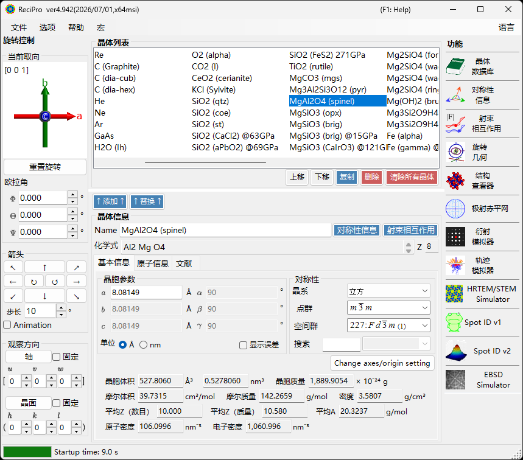
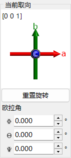
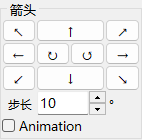
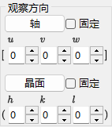
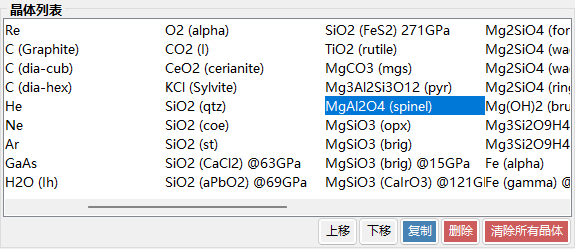
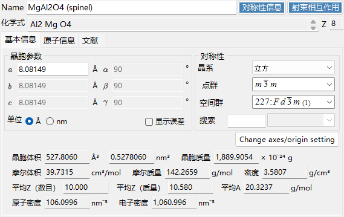
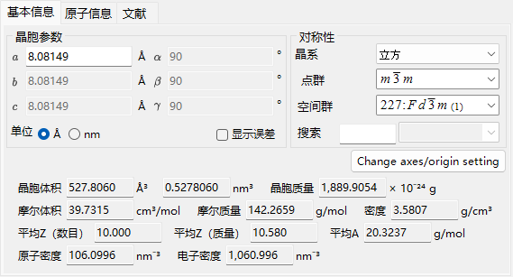
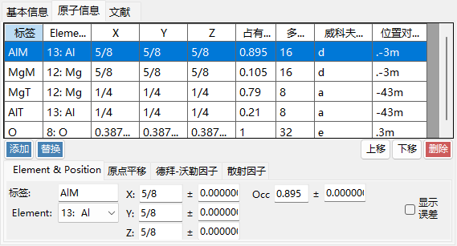
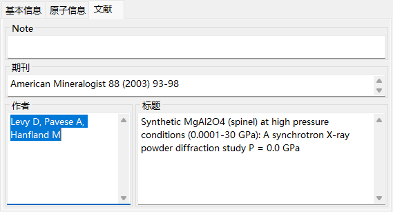
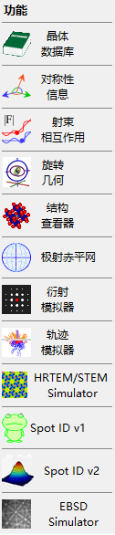

# 主窗口

ReciPro 启动时会显示主窗口。在这个窗口中，您可以选择晶体、控制其旋转，并调用各种功能。

| 区域 | 位置 | 说明 |
|------|----------|-------------|
| **文件菜单** | 顶部 | 文件操作、选项、帮助 |
| **旋转控制** | 左侧 | 查看/设置晶体取向 |
| **晶体列表** | 中部上方 | 选择和管理晶体 |
| **晶体信息** | 中部下方 | 编辑晶格参数、对称性、原子 |
| **功能** | 右侧 | 启动模拟/分析窗口 |

---

## 键盘与鼠标快捷键 {#keyboard-mouse-shortcuts}

主窗口安装了若干**应用程序级**的快捷键。当结构查看器、极射赤平投影、衍射模拟器、Spot ID 和计算器窗口获得焦点时，它们仍然有效。

| 快捷键 | 操作 |
|----------|--------|
| <kbd>F1</kbd> | 打开在线手册的本页 |
| <kbd>CTRL</kbd>+<kbd>SHIFT</kbd>+<kbd>D</kbd> | 打开 / 关闭**衍射模拟器** |
| <kbd>CTRL</kbd>+<kbd>SHIFT</kbd>+<kbd>V</kbd> | 打开 / 关闭**结构查看器** |
| <kbd>CTRL</kbd>+<kbd>SHIFT</kbd>+<kbd>S</kbd> | 打开 / 关闭**极射赤平投影** |
| <kbd>CTRL</kbd>+<kbd>SHIFT</kbd>+<kbd>T</kbd> | 打开 / 关闭 **Spot ID** |
| <kbd>CTRL</kbd>+<kbd>SHIFT</kbd> + 方向键 | 将晶体朝该方向旋转一步（同时按住两个方向键可斜向旋转） |
| 双击 <kbd>CTRL</kbd> | 打开 / 关闭**计算器** |
| <kbd>CTRL</kbd>+<kbd>SHIFT</kbd>+<kbd>R</kbd> | 切换所选晶体的 **Reserved** 标志 |
| ReciPro 启动时按住 <kbd>CTRL</kbd> | 以禁用 OpenGL 的方式启动（用于在图形问题时恢复） |
| 用左键拖动取向控件（左下方，*Current Direction* 下方） | 旋转晶体 |
| 在取向控件上右键双击 | 将控件图像复制到剪贴板 |
| 单击功能按钮 | 打开 / 关闭该窗口 |
| 双击功能按钮 | 强制窗口可见并置于最前 |
| 在列表中右键单击晶体 | 上下文菜单（重命名 / 复制 / 删除 / 导出 CIF…） |
| 双击 **Current Index** 标签 | 显示 / 隐藏 max-UVW 框 |
| 将文件拖放到窗口上 | 加载晶体列表（`.xml`、`.cdb2`）或单个晶体（`.cif`、`.amc`） |

→ 关于各窗口快捷键的一览，请参阅 **[21. 键盘与鼠标快捷键](21-shortcuts.md)**。

---

## 基本工作流程

如果您是首次使用 ReciPro，请参照以下步骤：

1. 在**晶体列表**中选择目标晶体。若要使用 CIF/AMC 文件，请将其拖放到**晶体信息**中。
2. 如果您编辑了晶格参数或原子位置，请按 **Add** 或 **Replace**，以便将更改写回晶体列表。
3. 在**旋转控制**中，通过晶带轴、晶面、欧拉角或鼠标拖动来设置晶体取向。
4. 从**功能**中打开所需的工具。衍射、HRTEM/STEM、EBSD 等计算窗口会使用当前选定的晶体及其取向。

---

## 文件菜单

### File

| 菜单项 | 说明 |
|-----------|-------------|
| Read crystal list (as new list) | 加载晶体列表文件 (*.xml)，替换当前列表 |
| Read crystal list (and add) | 追加到当前列表 |
| Read initial crystal list | 重新加载默认晶体列表 |
| Save crystal list | 保存当前晶体列表 |
| Export selected crystal to CIF | 以 CIF 格式保存 |
| Clear crystal list | 移除所有晶体 |
| Exit | 关闭应用程序 |

### Option

| 菜单项 | 说明 |
|-----------|-------------|
| Show Tooltips | 切换工具提示的显示 |
| Use Miller-Bravais (hkil) index | 在整个应用程序中对三方/六方晶系使用 4 指数标记 |
| Reset registry settings on exit (effective after restart) | 在下次重启时重置设置 |
| Disable Crystallography.Native library (requires restart) | 如果本机 (C++) 库加载失败，则回退到托管代码 |
| Disable all OpenGL rendering (requires restart) | 用于较旧的 GPU / 远程桌面 |
| Disable OpenGL text rendering (requires restart) | 针对某些 GPU 上文本渲染问题的变通方法 |
| Use MKL Library | 对数值例程使用 Intel MKL |
| Dark mode | 在浅色和深色配色主题之间切换 |
| Powder diffraction function (under development) | 启用多晶（粉末）衍射窗口 |
| Capture GUI Components… | 用于保存 GUI 截图的开发者工具 |

### Help

| 菜单项 | 说明 |
|-----------|-------------|
| Program updates | 检查是否有新版本的 ReciPro 可用并安装它 |
| Hint | 显示使用提示（已弃用） |
| Version history | 打开版本历史对话框 |
| License | 显示 MIT 许可证 |
| GitHub page | 在浏览器中打开 ReciPro 仓库 |
| Report bugs, requests, or comments | 打开 GitHub Issues 页面 |
| Help (Web) | 在 GitHub Pages 上打开与界面语言相匹配页面的在线手册。 |

语言通过单独的 **Language** 菜单切换（英语/日语，需要重启）。

### Language

在英语和日语之间切换界面语言。更改在重启 ReciPro 后生效。

### Macro

打开[宏](20-macro/index.md)窗口，使用 Python 风格的脚本自动化 ReciPro 操作。对于重复性的工作流程，请参阅[内置函数](20-macro/1-built-in-functions.md)和[宏示例](20-macro/2-examples.md)。

---

## 晶体取向控制

晶体的旋转状态由衍射模拟器、结构查看器、极射赤平投影、HRTEM/STEM 模拟器、EBSD 模拟器以及其他窗口共享。它不仅仅是一个视图设置——它定义了入射束方向以及模拟中所使用的晶体坐标关系。[使用方法](appendix/a0-how-to-use.md)页面上提供了一段简短的视频教程。

### 当前取向

显示晶体取向。拖动以旋转。坐标轴：红 = *a*，绿 = *b*，蓝 = *c*。

### 重置旋转
重置为初始状态：*c* 轴垂直于屏幕，*b* 轴向上。

### 晶带轴
显示最接近屏幕法线的晶带轴（例如 *u*+*v*+*w* < 30）。

### 欧拉角 (Z-X-Z)
使用 **Z–X–Z** 欧拉角设置晶体取向：

- \(\Phi\)：绕 Z 轴旋转
- \(\Theta\)：绕 X 轴旋转
- \(\Psi\)：绕 Z 轴旋转

旋转按 \(\Psi \to \Theta \to \Phi\) 的顺序应用。详情请参阅[旋转几何](4-rotation-geometry.md)和[附录 A1. 坐标系](appendix/a1-coordinate-system/1-orientation.md)。

### 箭头

按 Step 角度旋转。勾选 Animation 可连续旋转。

### 沿向观察

将晶带轴 [*uvw*] 或晶面 (*hkl*) 对准垂直于屏幕的方向。

- **Fix**：勾选后，在后续的旋转操作中，指定的晶带轴或晶面会被保持在空间中固定不变。
- **Axis**：将输入的晶带轴 \([uvw]\) 置于垂直于屏幕的方向。如果同时设置了 **Plane**，则该方向会在屏幕上指向上方。
- **Plane**：将输入晶面 \((hkl)\) 的法线置于垂直于屏幕的方向。如果同时设置了 **Axis**，则该方向会在屏幕上指向上方。

### 设置取向的基本方法

| 方法 | 适用情形 | 位置 |
|--------|----------|-------|
| 鼠标拖动 | 您希望在观察晶轴的同时自由旋转。 | **当前取向**面板 |
| 箭头按钮 | 您希望进行小幅、可重复的旋转。 | **箭头**面板 |
| 晶带轴 | 您已知观察方向，例如 \([001]\) 或 \([110]\)。 | **沿向观察** / 晶带轴输入 |
| 晶面法线 | 您希望某个晶面 \((hkl)\) 垂直于屏幕。 | **沿向观察** / 晶面输入 |
| 欧拉角 | 您需要一个可复现的数值取向。 | **欧拉角 (Z-X-Z)** |

关于旋转矩阵和坐标约定，请参阅[旋转几何](4-rotation-geometry.md)和[附录 A1. 坐标系](appendix/a1-coordinate-system/1-orientation.md)。

---

## 晶体列表

默认安装包含约 80 个晶体。选择后可查看详情并将其设为用于计算的晶体。在晶体列表中**右键单击晶体**可调出上下文菜单：*Rename*、*Export as CIF*、*Duplicate*、*Delete*。

| 按钮 | 操作 |
|--------|--------|
| Up / Down | 调整顺序 |
| Duplicate | 复制所选晶体 |
| Delete / All clear | 移除晶体 |
| Add / Replace | 添加到列表或替换所选条目 |

---

## 晶体信息

编辑晶格参数、对称性和原子；将 CIF/AMC 文件拖放进来以加载结构。该控件由 ReciPro、PDIndexer 和 CSmanager 共享，但所显示的选项卡和功能因应用程序而异。ReciPro 显示 Basic Info、Atom 和 Reference 选项卡（EOS、Elasticity 等选项卡属于其他应用程序，在 ReciPro 中不显示）。

> **重要**：按 **Add** 或 **Replace** 以保存更改。

面板顶部始终显示 **Name**（晶体名称）、**Formula**（化学式，根据原子列表计算得出）和 **Reset**（清空所有字段）。

### Basic Info 选项卡

晶格参数、对称性以及由它们导出的量。

| 项目 | 说明 |
|------|------|
| Cell constants | 晶格参数 a、b、c（单位 Å = 10⁻¹⁰ m）以及 α、β、γ。选择某种对称性会自动对它们加以约束（例如立方晶系中 a=b=c、α=β=γ=90°）。 |
| Symmetry | 选择晶系、点群和空间群。在 **Search** 框中输入可列出匹配的候选项（区分大小写）。 |
| Cell Volume / Cell Mass | 晶胞的体积和质量。 |
| Molar Volume / Molar Mass / Z / Density | 摩尔体积、摩尔质量、每个晶胞中的化学式单位数 (Z) 以及密度。**仅在已输入原子时**显示。 |
| Color of Profile | 绘制该晶体衍射轮廓时所使用的颜色。 |

### Atom 选项卡

设置每个原子的种类、位置、温度因子和散射因子。使用 **Add**、**Replace**（替换所选行）、**Up/Down**（调整顺序）和 **Delete** 编辑原子列表。每个原子具有：

| 项目 | 说明 |
|------|------|
| Label | 原子标签（任意标识符）。 |
| Element | 元素（包含离子化合价）。 |
| X, Y, Z | 分数坐标（0–1）。可输入诸如 1/2 或 2/3 之类的分数。 |
| Occ | 占据率（0–1）。 |

右键单击原子列表中的某一行并选择 **显示等价原子位置**，会打开一个小窗口，列出由空间群对称操作生成的全部位置；其 **Copy** 按钮可将该列表复制为制表符分隔的文本（例如便于粘贴到电子表格中）。

**Origin shift**：移动所有原子坐标的原点。对于标准位移使用预设按钮（**+** / **−**），或使用 **Apply custom shift** 设置任意偏移量。

**Debye–Waller factor（温度因子）**：

| 项目 | 说明 |
|------|------|
| Notation | 使用 U 或 B 标记法。 |
| Model | 各向同性或各向异性。 |
| B##, U## | 对于各向异性情形，输入各个分量（B11、…）。 |

**Scattering factor**：为每个原子选择所使用的散射因子。

| 辐射 | 来源 / 设置 |
|-----------|------|
| X-ray | 包含离子化合价的散射因子（International Tables for Crystallography, Vol. C）。 |
| Electron | 电子散射因子（Peng 1998, Acta Cryst. A54, 481–485）。 |
| Neutron | 中子散射长度。可选择 **Natural isotope abundance** 或 **Custom isotope abundance**（任意同位素组成）。 |

### Reference 选项卡

记录结构的来源：**Note**、**Authors**、**Journal** 和 **Title**。

### 上下文菜单（右键单击）

在控件的空白区域右键单击可执行以下主要操作：

| 菜单项 | 操作 |
|-----------|------|
| Beam Interaction | 打开[射束相互作用](3-beam-interaction.md)窗口。 |
| Symmetry information | 打开[对称性信息](2-symmetry-information.md)窗口。 |
| Import from CIF, AMC | 从 CIF / AMC 文件加载晶体。 |
| Export to CIF | 将当前晶体导出为 CIF。 |
| Revert cell constants | 将晶胞常数恢复为首次加载时的值。 |
| Convert to P1 spacegroup | 将结构展开到空间群 P1。 |
| Convert to a superstructure | 转换为 a、b、c 取整数倍的超结构（尺寸对话框）。 |
| Convert to an equivalent space group | 转换为等价的空间群（一种不同的轴设定）。 |

---

## 功能面板 {#functions}

右侧的竖向按钮条用于启动分析和模拟窗口（见下方[功能](#functions)表）。

| 按钮 | 说明 | 详情 |
|--------|-------------|---------|
| Crystal Database | 从随附 / 在线数据库中搜索并导入晶体 | [1. 晶体数据库](1-crystal-database.md) |
| Symmetry Information | 空间群信息及 ITC Vol. A 对称图 | [2. 对称性信息](2-symmetry-information.md) |
| Beam Interaction | 射束–晶体相互作用：反射、衰减、散射因子、荧光 | [3. 射束相互作用](3-beam-interaction.md) |
| Rotation Geometry | 3D 旋转矩阵 / 测角仪角度 | [4. 旋转几何](4-rotation-geometry.md) |
| Structure Viewer | 3D 晶体结构 | [5. 结构查看器](5-structure-viewer.md) |
| Stereonet | 极射赤平投影 | [6. 极射赤平投影](6-stereonet.md) |
| Diffraction Simulator | 单晶 X 射线 / 电子衍射 | [7. 衍射模拟器](7-diffraction-simulator/index.md) |
| Trajectory Simulator | 蒙特卡洛电子轨迹模拟 | [8. 电子轨迹](8-electron-trajectory.md) |
| HRTEM/STEM Simulator | HRTEM / STEM 图像模拟 | [9. HRTEM/STEM 模拟器](9-hrtem-stem-simulator/index.md) |
| Spot ID v1 | SAED 花样标定（原称 "TEM ID"） | [10. Spot ID v1](10-spot-id.md) |
| Spot ID v2 | 衍射斑检测与标定 | [11. Spot ID v2](11-spot-id-v2.md) |
| EBSD Simulator | EBSD 花样模拟 | [12. EBSD 模拟](12-ebsd-simulation.md) |
| Powder Diffraction | 多晶（粉末）衍射——通过 **Option ▸ Powder diffraction function** 启用 | - |

---

## 另见

- [晶体数据库](1-crystal-database.md)
- [旋转几何](4-rotation-geometry.md)
- [结构查看器](5-structure-viewer.md)
- [衍射模拟器](7-diffraction-simulator/index.md)
- [键盘与鼠标快捷键](21-shortcuts.md)
- [基本坐标系与晶体取向](appendix/a1-coordinate-system/1-orientation.md)
