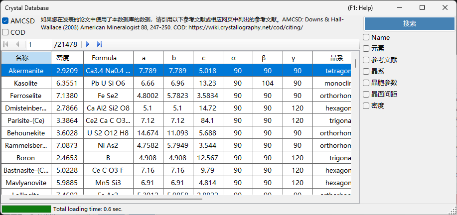
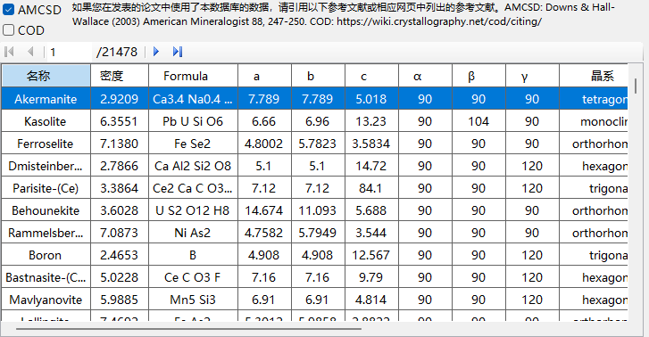
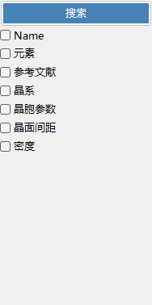

# 晶体数据库

**晶体数据库** 提供从两个来源搜索并导入晶体结构的功能，可通过 **AMCSD** 和 **COD** 复选框进行选择：

- **AMCSD** ：随软件捆绑的 [American Mineralogist Crystal Structure Database](https://www.rruff.net/)（超过 20,000 个结构）。
- **COD** ：[Crystallography Open Database](https://www.crystallography.net/cod/)。由于文件较大，它不随安装程序一起捆绑；数据库文件会在首次使用时自动下载。当该文件在服务器上更新时，会提示您重新下载。

使用这些数据库时，请引用以下文献。

使用 **AMCSD** 时：

> Downs, R.T. and Hall-Wallace, M. (2003) The American Mineralogist Crystal Structure Database. *American Mineralogist* **88**, 247-250.

使用 **COD** 时：

> Gražulis, S. et al. (2009) Crystallography Open Database – an open-access collection of crystal structures. *Journal of Applied Crystallography* **42**, 726-729.
>
> Gražulis, S. et al. (2012) Crystallography Open Database (COD): an open-access collection of crystal structures and platform for world-wide collaboration. *Nucleic Acids Research* **40**, D420-D427.

---

## 键盘和鼠标快捷键

此窗口没有修饰键组合键；它通过普通的单击操作。唯一不太直观的输入方式是：

| 快捷键 | 操作 |
|----------|--------|
| <kbd>F1</kbd> | 打开在线手册的本页 |
| 在任意搜索框中按 <kbd>ENTER</kbd> | 执行数据库搜索（与 **搜索** 按钮相同） |
| 单击结果表中的某一行 | 将该晶体加载到主窗口 |
| 单击 **周期表** 弹出窗口中的某个元素 | 循环切换其筛选状态：*ignore* → *must include* → *must exclude* |

→ 请参阅 **[21. 键盘和鼠标快捷键](21-shortcuts.md)** 一览每个窗口的快捷键。

---

## 表格

显示与搜索条件匹配的晶体。选择某个晶体即可将其传输到主窗口的晶体信息。按 **添加** 或 **替换** 将其添加到晶体列表。

---

## 搜索选项

在下面输入搜索条件，然后按 **搜索** 按钮或 **Enter** 键。

| 条件 | 说明 |
|-----------|-------------|
| **Name** | 晶体名称 |
| **元素** | 周期表选择器（可包含/必须包含/必须不包含） |
| **参考文献** | 标题、期刊、作者 |
| **晶系** | 选择晶系 |
| **晶胞参数** | 点阵常数及误差 |
| **晶面间距** | 最强反射的 d 值及误差 |
| **密度** | 密度及误差 |

### Name

针对晶体名称的自由文本匹配。允许部分匹配。

### 元素

按 **周期表** 按钮以打开元素选择器。每个元素按钮在三种状态之间循环切换：

- **May or may not include**（默认 — 灰色）
- **Must include**（绿色）
- **Must exclude**（红色）

窗口顶部的三个按钮可一键将每个元素重置为这三种状态之一。

### 参考文献

针对出版物元数据的自由文本匹配：论文标题、期刊名称和作者列表。

### 晶系

将搜索限制为特定晶系（Cubic、Tetragonal、Orthorhombic、Hexagonal、Trigonal、Monoclinic、Triclinic）。

### 晶胞参数搜索

输入目标点阵常数 *a*、*b*、*c*、*α*、*β*、*γ* 以及可接受的误差。空白字段被视为通配符。

### 晶面间距

输入最强反射（或几个强反射）的 *d* 值（d-spacing）及可接受的误差。当实验中仅已知衍射峰位置时很有用。

### 密度

按质量密度（g/cm³）在可接受的误差范围内进行筛选。

---

## 另请参阅

- [主窗口](0-main-window.md)
- [对称性信息](2-symmetry-information.md)
- [射束相互作用](3-beam-interaction.md)
- [结构查看器](5-structure-viewer.md)
