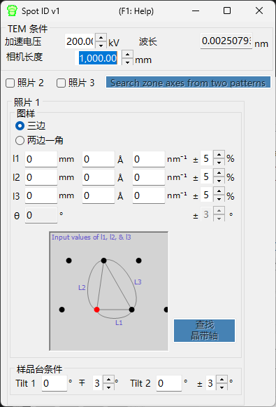

# Spot ID v1

**Spot ID v1** 用于从实验电子衍射图像中检测、拟合并标定衍射斑点。它还支持根据手动输入的数值斑点几何进行晶带轴搜索（即原先的 **TEM ID**）。

---

## 键盘与鼠标快捷键

Spot ID v1 以**数值输入**方式接收斑点几何（即原先的 *TEM ID* 工作流程），斑点的检测/拟合通过按钮操作完成；衍射图像仅供参考显示，不支持点击交互（鼠标缩放和手动选取斑点属于 [Spot ID v2](11-spot-id-v2.md) 的功能）。唯一的快捷键位于结果窗口中：

| 快捷键 | 操作 |
|----------|--------|
| <kbd>F1</kbd> | 打开本页的在线手册 |
| 双击结果列表中的某一行 | 选择该晶体并将其旋转到对应的晶带轴 |

→ 各窗口快捷键一览请参见 **[21. 键盘与鼠标快捷键](21-shortcuts.md)**。

---

## 主区域

以参考方式显示衍射图像。可通过拖放或 **File** 菜单加载图像。

### 图像调整

| 设置 | 说明 |
|---------|-------------|
| Min / Max | 亮度范围（也可通过滑块调整） |
| Gradient | Positive 或 Negative |
| Scale | Linear 或 Log |
| Colour | Gray 或 Cold-Warm |
| Dust & Scratch | 去除异常明亮/黑暗的像素（设置范围和阈值） |
| Gaussian blur | 应用模糊（范围以像素为单位） |

---

## Optics

输入入射源、能量/波长、相机长度以及探测器像素尺寸。

> 如果加载了 dm3/dm4 文件（Gatan Digital Micrograph），这些值会被自动设置。

---

## 斑点检测与拟合

按下 **Detect & fit spots** 可自动检测衍射斑点，并用二维 Pseudo-Voigt 函数对其进行拟合。结果显示在表格中。

### 检测选项

| 参数 | 说明 |
|-----------|-------------|
| Number | 要检测的斑点最大数量 |
| Nearest neighbour | 检测到的斑点之间的最小距离 |
| Fitting range | 每个斑点周围用于拟合的半径（像素） |

### 表格控件

| 按钮 | 操作 |
|--------|--------|
| Reset range | 重置所有斑点的拟合范围 |
| Show label/symbol | 在图像上叠加标签/符号 |
| Clear all spots | 移除所有斑点 |
| Save / Copy | 以制表符分隔（Excel）格式导出表格 |
| Re-fit all | 重新拟合所有斑点 |

### 斑点细节窗口

勾选复选框可打开一个细节窗口，显示所选斑点（左侧）以及四个方向上的剖面（右侧）。蓝色 = 观测数据，红色 = 拟合。

---

## Index

按下 **Identify spots** 可将检测到的斑点对照主窗口中所选的晶体进行标定。

| 设置 | 说明 |
|---------|-------------|
| Acceptable error | 标定的容差 |
| Single grain / Multi grains | 作为单晶或多个晶粒进行标定（设置最大晶粒数） |
| Show label/symbol | 在图像上叠加标定后的标签 |
| Refine thickness and direction | 应用动力学理论（Bethe 法）来精修最符合检测到强度的样品厚度和晶体取向 |

---

## 根据斑点几何进行晶带轴搜索（原先的 TEM ID）

当你没有可加载的图像时，仍然可以通过手动输入选区电子衍射（SAED）图样的几何来搜索候选晶带轴。输入 TEM 观测条件和斑点几何，然后按下 **Search zone axes** 以找出候选的晶体取向。

### TEM condition

输入 TEM 观测条件（加速电压、相机长度等）。

### Photo 1, 2, 3

输入衍射斑点的几何。

- 要输入探测器上斑点之间的距离，请使用 **mm** 输入框。
- 如果你已知 *d* 值，请以 **Å** 或 **nm⁻¹** 为单位输入。

**三边** : 输入以 direct spot 为一个顶点的三角形三条边的长度。

**两边一角** : 输入两条边的长度（含 direct spot）以及它们之间的夹角。

---

## 另请参阅

- [Spot ID v2](11-spot-id-v2.md)
- [衍射模拟器](7-diffraction-simulator/index.md)
- [主窗口](0-main-window.md)
- [晶体数据库](1-crystal-database.md)
- [EBSD 模拟](12-ebsd-simulation.md)
