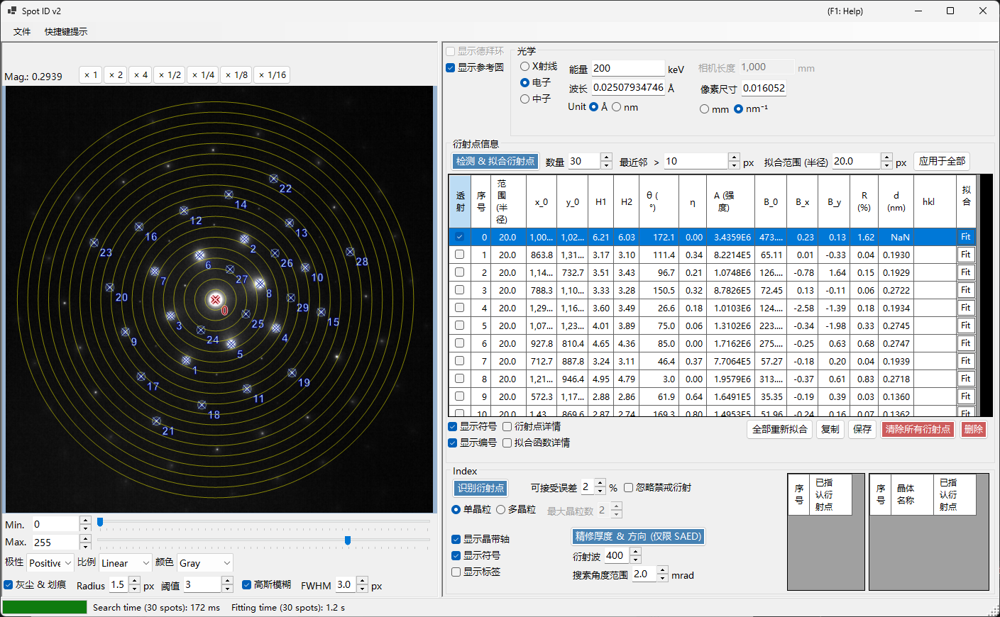
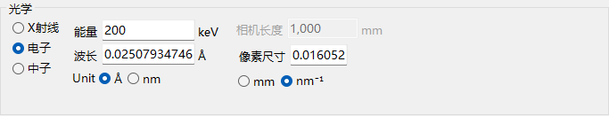
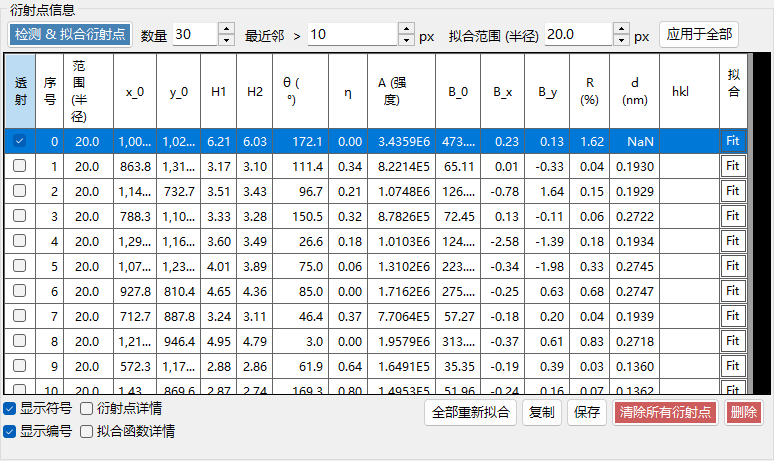
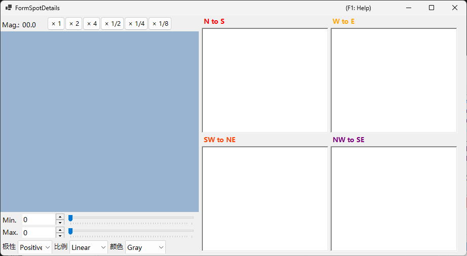
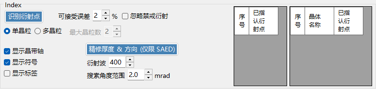

# Spot ID v2

**Spot ID v2** 是 [Spot ID](10-spot-id.md) 的增强版本，具有更优的衍射斑点检测、拟合算法以及更强大的指标化引擎。

---

## 键盘和鼠标快捷键

衍射斑点列表直接在加载的图像上建立。图像窗格使用 ReciPro 标准的[图像视图导航](21-shortcuts.md)进行平移/缩放；衍射斑点编辑则增加了下列组合键。

| 快捷键 | 操作 |
|----------|--------|
| <kbd>F1</kbd> | 打开本页的在线手册 |
| 左键双击图像 | 在该点添加一个衍射斑点（经峰拟合） |
| <kbd>CTRL</kbd> + 左键双击 | 添加一个衍射斑点并将其标记为直射（000）束 |
| 左键单击某衍射斑点 | 选择最近的衍射斑点 |
| <kbd>CTRL</kbd> + 右键单击某衍射斑点 | 删除最近的衍射斑点 |
| <kbd>CTRL</kbd> + 方向键 | 将选中的衍射斑点移动一个像素 |
| 左键拖动 / 中键拖动（空白区域） | 平移图像 |
| 鼠标滚轮 | 以光标为中心放大 / 缩小 |
| 右键拖出一个矩形框 | 放大到选定区域 |
| 右键双击 | 缩小 |
| 双击某衍射斑点的行表头（表格） | 缩放到该衍射斑点（×2） |

在主窗口中按 <kbd>CTRL</kbd>+<kbd>SHIFT</kbd>+<kbd>T</kbd> 可打开/关闭此窗口。

→ 全部窗口一览请参阅 **[21. 键盘和鼠标快捷键](21-shortcuts.md)**。

---

## 文件菜单

打开/保存衍射图像。支持与 [Spot ID v1](10-spot-id.md) 相同的拖放加载方式，并会自动采用 Gatan DM3/DM4 元数据（相机长度、波长、像素尺寸）。

---

## 光学系统

### 入射源

选择辐射类型（X 射线 / 电子 / 中子）并设置能量或波长。

### 相机长度 / 像素尺寸

相机长度（mm）和探测器像素尺寸（mm 或 nm⁻¹）。加载 Gatan DM 文件时，这些值会从文件头中填入。

---

## 衍射斑点信息

- **Detect & Fit Spots**：使用局部极大值和背景扣除进行自动衍射斑点检测。
- **Number**：要检测的衍射斑点的最大数量。
- **Nearest neighbour**：检测到的衍射斑点之间允许的最小间隔（px）。比此值更接近的峰会被合并，从而防止同一衍射斑点被重复检测。
- **Fitting range (radius)**：用于拟合每个衍射斑点峰的圆形区域的半径（px）。该圆内的像素使用伪 Voigt 函数进行拟合。
- **Apply to All**：将每个衍射斑点的拟合半径设置为当前 **Fitting range (radius)** 的值。
- **Delete spot / Clear spots**：删除单个或全部已检测的衍射斑点。
- **Copy to clipboard**：将衍射斑点的位置和强度复制到剪贴板。
- **Details of the spot**：勾选后，将打开一个窗口，显示当前选中衍射斑点的详细信息。

---

## Index

- **Identify Spots**：运行指标化算法以找到最匹配的晶体和晶带轴。
- **Acceptable error**：设置匹配时面间距和角度的可接受偏差。
- **Ignore prohibited reflections**：勾选后，在搜索晶带轴时，由螺旋轴和滑移面所禁止的反射将被视为不一定满足。
- **Single Grain / Multiple Grains**：搜索单一取向（单晶），或搜索多个取向（多晶 / 多晶粒区域）。对于多晶粒，**Max. num. of grains** 设置要搜索的晶粒数量上限。
- **Results**：最佳匹配结果会与晶体名称、晶带轴 [uvw] 以及各衍射斑点的指数（hkl）一并显示。

---

## 相对 v1 的改进

- 衍射斑点检测中更好的噪声处理。
- 支持多种轮廓形状、更稳健的拟合算法。
- 采用优化搜索算法、更快速的指标化。
- 支持重叠衍射斑点和卫星反射。

---

## 另请参阅

- [Spot ID v1](10-spot-id.md)
- [衍射模拟器](7-diffraction-simulator/index.md)
- [主窗口](0-main-window.md)
- [键盘和鼠标快捷键](21-shortcuts.md)
