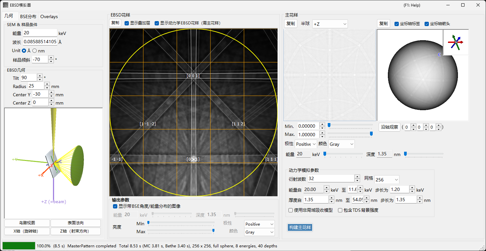
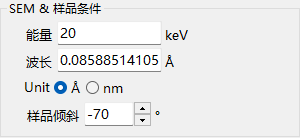
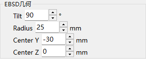
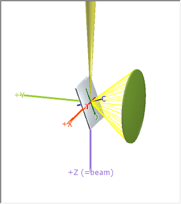
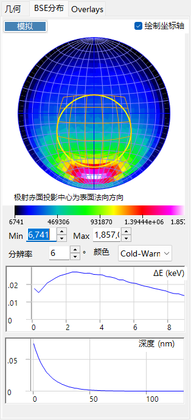
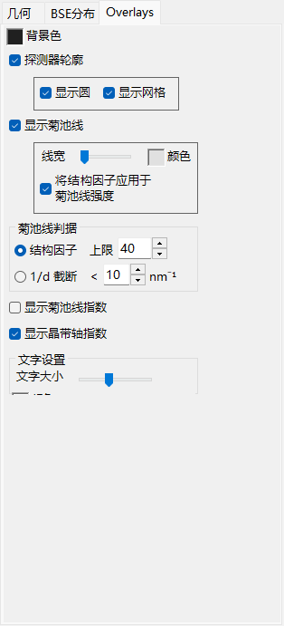
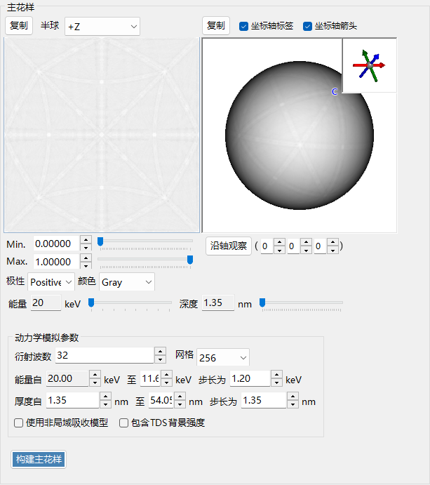
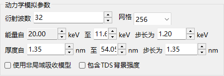
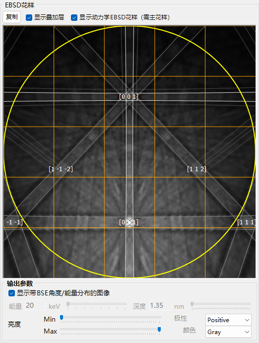

# EBSD 模拟

**EBSD 模拟器** 使用动力学理论计算，模拟在扫描电子显微镜 (SEM) 中获得的电子背散射衍射 (EBSD) 花样——菊池花样。它通过蒙特卡罗模拟计算背散射电子 (BSE) 的角度/能量/深度分布，构建晶体的动力学 (布洛赫波) **master pattern**，并将其投影到当前晶体取向对应的探测器上。

该窗口分为三列。

- **左侧** : 模拟条件。各选项卡用于选择 **Geometry**（样品/探测器几何及 3D 视图）、**BSE Distribution**（背散射电子分布）以及 **Overlays**（菊池线及其他标注）。
- **中间** : 当前晶体取向对应的 EBSD（菊池）花样。
- **右侧** : 与取向无关的 master pattern（2D 投影和 3D 球面）。

---

## 键盘与鼠标快捷键

中间的 EBSD（菊池）花样视图和右侧的 master pattern 视图响应不同的鼠标操作。

| 快捷键 | 操作 |
|----------|--------|
| <kbd>F1</kbd> | 打开本页在线手册 |
| 在花样中心附近左键拖动 | 倾斜晶体 |
| 在花样外侧区域左键拖动 | 旋转晶体 |
| 双击花样 | 选取光标下的探测器子单元并显示其统计信息 |
| 在 3D 视图（几何 / master 球面）中左键拖动 | 旋转视图 |
| 在 3D 视图中右键拖动或滚动鼠标滚轮 | 缩放 |
| <kbd>CTRL</kbd> + 在 3D 视图中右键双击 | 切换正交 / 透视投影 |
| 在 2D master pattern 上拖动 / 滚轮 | 平移 / 缩放图像 |

3D 视图使用 ReciPro 的标准[视图导航](21-shortcuts.md)（已禁用平移）。

→ 参见 **[21. 键盘与鼠标快捷键](21-shortcuts.md)**，可一览所有窗口。

---

## 工作流程

按下 **Build Master Pattern** 会依次执行以下步骤。

1. **蒙特卡罗 BSE 模拟** : 使用当前的晶体组成、密度、加速电压和样品倾斜，在样品内部追踪约 250 万个电子（弹性散射：Mott/NIST 截面；非弹性散射：介电响应模型）。由此得到背散射电子的*穿透深度 × 出射方向 × 出射能量*的联合分布。
2. **自动范围选择** : 根据该分布，自动设定动力学计算中所用的能量范围（从入射能量到能量损失约第 80 百分位）和深度范围（到穿透深度约第 99 百分位）。
3. **master pattern 构建** : 对每个能量和深度，求解动力学衍射 (布洛赫波) 问题，并按蒙特卡罗分布加权，在方向球面上积分，从而给出每个方向上的背散射衍射强度。结果存储在等面积 (Rosca–Lambert) 网格上。
4. **带加权的探测器投影** : 对当前晶体取向，从 master pattern 中查找每个探测器像素所张方向对应的强度，并绘制为菊池花样，可选地用 BSE 的角度/能量分布加权。

能量范围和深度范围在第 1–2 步中自动设定，但可在构建前手动调整。

---

## SEM-EBSD 设置

### SEM 与样品条件

- **Energy** : 入射束的加速电压 (keV)。
- **Wavelength** : 电子波长 (Å)，与 Energy 关联。
- **Sample tilt** : 样品倾斜角（通常为 70°）。EBSD 中较大的倾斜可提高背散射电子产额。

### EBSD 几何

- **Detector tilt** : 探测器（荧光屏）的倾斜。
- **Detector radius** : 探测器半径 (mm)；决定所绘花样的角度视场。
- **Detector center** : 探测器中心相对于束流入射点的位置 (Y, Z) (mm)。

可在 **Geometry** 选项卡的 3D 视图中查看几何。

灰色板为样品，绿色圆柱/圆锥为探测器，紫色的 **+Z (=beam)** 为入射束。同时显示晶体 **a / b / c** 轴（固定于样品）。按钮 **Bird's-Eye View**、**Surface Normal**、**X Axis (Rotation Axis)** 和 **Z Axis (Beam Direction)** 可将视图对齐到标准方向。坐标系定义参见[附录 A1. 坐标系](appendix/a1-coordinate-system/2-diffraction.md)。

---

## BSE 分布

**BSE Distribution** 选项卡显示蒙特卡罗背散射电子分布。使用 **Simulate** 重新计算它们。

- **Stereonet** : 背散射电子的角度分布（出射方向的直方图）。中心为表面法线方向，黄/橙色轮廓标出探测器所张的区域。**Draw axes** 叠加晶轴，色阶（Min/Max、分辨率、颜色）可调。
- **ΔE (keV)** : 背散射电子的能量损失分布。
- **Depth (nm)** : 背散射电子最终出射深度的分布。

这些分布由与[电子轨迹](8-electron-trajectory.md)相同的蒙特卡罗引擎计算，用于对 master pattern 加权。

---

## Overlays

**Overlays** 选项卡用于配置绘制在 EBSD 花样上的标注。

- **Background color** : 背景颜色。
- **Detector outline** : 探测器轮廓。**Show circle**（周界）/ **Show mesh**（网格）。
- **Show Kikuchi lines** : 绘制菊池线。**Line Width** / **Color**，以及 **Apply structure factors to Kikuchi line intensity**。
- **Show Kikuchi line indices** : 显示菊池线（带）的指数。
- **Show zone axis indices** : 显示晶带轴指数。
- **Kikuchi line criteria** : 选择绘制哪些菊池线：**Structure factor**（按结构因子排名前 *N* 的）或 **1/d Cutoff**（1/d 低于阈值的）。
- **Text settings** : 指数标签的 **Text Size** / **Color**。

---

## Master pattern

master pattern 是所有方向上的背散射衍射强度，由动力学理论通过 **Build Master Pattern** 预先计算。

- **2D 视图**（左）: 半球的等面积投影。**Hemisphere** 选择投影的半球 (+Z / −Z)。
- **3D 视图**（右）: 将强度映射到其上的球面。可用鼠标旋转，右上角的插图显示同步的晶轴 (a/b/c)。**Axis Labels** / **Axis Arrows** 切换标签/箭头，**View Along** 沿选定的晶带轴 [u v w] 俯视。
- **Min / Max、Polarity、Color** : 显示的强度范围、极性和色阶。
- **Energy / Depth** 滑块 : 选择要显示的能量/深度切片。
- 任一视图都可用 **Copy** 发送到剪贴板。

### 动力学模拟参数

- **Number of diffracted waves** : 布洛赫波计算中纳入的衍射束（波）数量。波数越多越精确，但越慢。
- **Grid** : master pattern 网格的分辨率（默认 256）。
- **Energy from … to … with step of …** : 积分的能量范围和步长 (keV)；由蒙特卡罗结果自动设定。
- **Thickness from … to … with step of …** : 积分的深度范围和步长 (nm)；同样自动设定。
- **Use non-local absorption model** : 使用非局域吸收形式。
- **Include TDS background intensities** : 纳入热漫散射 (TDS) 背景。

---

## EBSD 花样

中间面板显示当前晶体取向对应的 EBSD（菊池带）花样。

- **Show Dynamical EBSD Pattern (Master Pattern Required)** : 将构建好的 master pattern 投影到探测器上。
- **Show overlays** : 绘制覆盖标注（如下），例如菊池线和指数。
- **Output parameters**
  - **Show image with BSE angular/energy distributions** : 勾选时，花样通过用 BSE 分布（能量、深度、方向）加权合成，而非使用单一切片。
  - **Energy / Depth** : 关闭上述选项时，选择要显示的能量/深度切片。
  - **Brightness (Min/Max)、Polarity、Color** : 亮度范围、极性和色阶。
- **Copy** : 将花样复制到剪贴板。

---

## 另请参见

- [电子轨迹](8-electron-trajectory.md) — 用于角度/能量/深度加权的蒙特卡罗电子轨迹 / BSE 模拟。
- [衍射模拟器](7-diffraction-simulator/index.md) — 动力学 (布洛赫波) 电子衍射。
- [附录 A1. 坐标系](appendix/a1-coordinate-system/2-diffraction.md) — 样品/探测器坐标系的定义。
