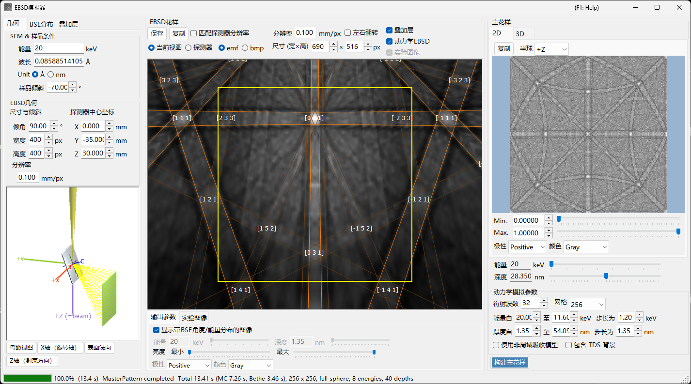
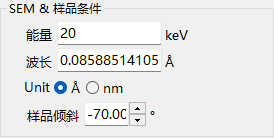
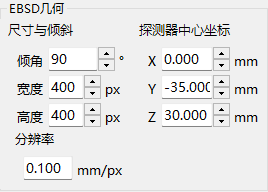
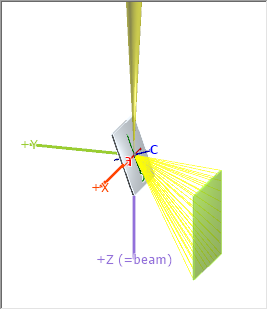
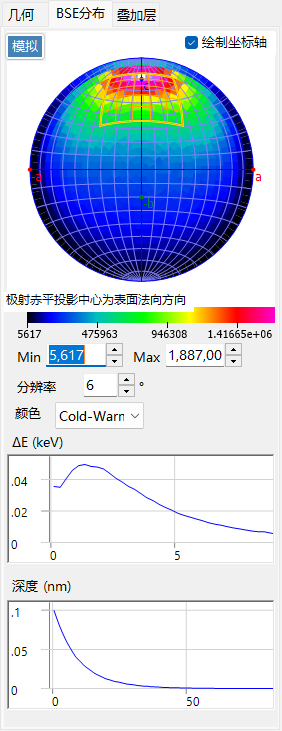
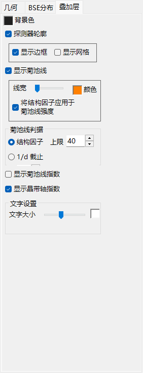
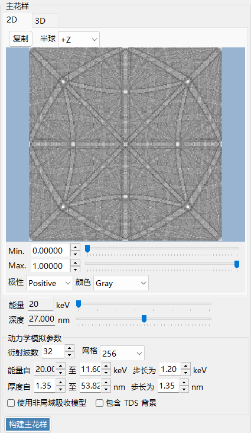
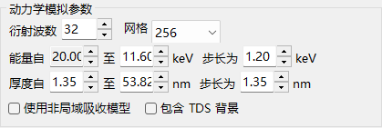
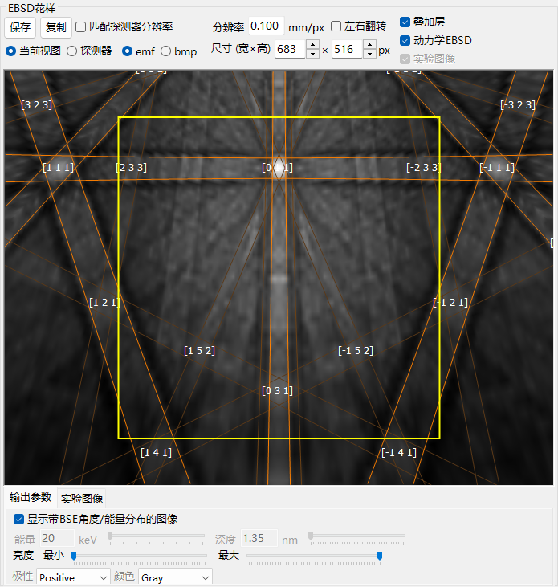
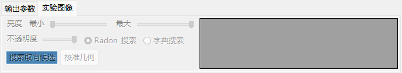

# EBSD 模拟

**EBSD 模拟器** 使用动力学理论计算，模拟在扫描电子显微镜 (SEM) 中获得的电子背散射衍射 (EBSD) 花样——菊池花样。它通过蒙特卡罗模拟计算背散射电子 (BSE) 的角度/能量/深度分布，构建晶体的动力学 (布洛赫波) **master pattern**，并将其投影到当前晶体取向对应的探测器上。也可以载入实验 EBSD 图像并进行**指数标定**：自动搜索最能解释该图像的取向（[实验图像](#实验图像)）。

该窗口分为三列。

- **左侧** : 模拟条件。各选项卡用于选择 **几何**（样品/探测器几何及 3D 视图）、**BSE分布**（背散射电子分布）以及 **叠加层**（菊池线及其他标注）。
- **中间** : 当前晶体取向对应的 EBSD（菊池）花样。其下方的选项卡用于选择 **输出参数** 和 **实验图像**。
- **右侧** : 与取向无关的 master pattern，位于 **2D** 和 **3D** 选项卡中。

底部的状态栏显示当前计算的进度及其结果摘要。

---

## 键盘与鼠标快捷键

中间的 EBSD（菊池）花样视图和右侧的 master pattern 视图响应不同的鼠标操作。

| 快捷键 | 操作 |
|----------|--------|
| <kbd>F1</kbd> | 打开本页在线手册 |
| 在花样中心附近左键拖动 | 倾斜晶体 |
| 在花样外侧区域左键拖动 | 旋转晶体 |
| 双击花样 | 选取光标下的探测器子单元并显示其统计信息 |
| 将图像文件拖放到窗口上 | 作为实验 EBSD 图像载入 |
| 在 3D 视图（几何 / master 球面）中左键拖动 | 旋转视图 |
| 在 3D 视图中右键拖动或滚动鼠标滚轮 | 缩放 |
| <kbd>CTRL</kbd> + 在 3D 视图中右键双击 | 切换正交 / 透视投影 |
| 在 2D master pattern 上拖动 / 滚轮 | 平移 / 缩放图像 |

3D 视图使用 ReciPro 的标准[视图导航](21-shortcuts.md)（已禁用平移）。

→ 参见 **[21. 键盘与鼠标快捷键](21-shortcuts.md)**，可一览所有窗口。

---

## 工作流程

按下 **构建主花样** 会依次执行以下步骤。

1. **蒙特卡罗 BSE 模拟** : 使用当前的晶体组成、密度、加速电压和样品倾斜，在样品内部追踪约 250 万个电子（弹性散射：Mott/NIST 截面；非弹性散射：介电响应模型）。由此得到背散射电子的*穿透深度 × 出射方向 × 出射能量*的联合分布。
2. **自动范围选择** : 根据该分布，自动设定动力学计算中所用的能量范围（从入射能量到能量损失约第 80 百分位）和深度范围（到穿透深度约第 99 百分位）。
3. **master pattern 构建** : 对每个能量和深度，求解动力学衍射 (布洛赫波) 问题，并按蒙特卡罗分布加权，在方向球面上积分，从而给出每个方向上的背散射衍射强度。结果存储在等面积 (Rosca–Lambert) 网格上。
4. **带加权的探测器投影** : 对当前晶体取向，从 master pattern 中查找每个探测器像素所张方向对应的强度，并绘制为菊池花样，可选地用 BSE 的角度/能量分布加权。

能量范围和深度范围在第 1–2 步中自动设定，但可在构建前手动调整。

---

## 几何

### SEM & 样品条件

- **Energy** : 入射束的加速电压 (keV)。
- **Wavelength** : 电子波长，与 Energy 关联。**Unit** 用于选择 Å 或 nm。
- **Sample tilt** : 样品倾斜角（通常为 −70°）。EBSD 中较大的倾斜可提高背散射电子产额。

### EBSD几何

探测器（荧光屏）是由像素数和像素尺寸定义的矩形。

- **尺寸与倾斜** : **Tilt** 为探测器平面的倾斜角 (°)，**Width** 和 **Height** 为探测器的像素数。
- **分辨率** : 探测器单个像素的物理尺寸 (mm/px)。因此探测器的物理尺寸为 Width × 分辨率 乘以 Height × 分辨率。
- **探测器中心坐标** : 探测器中心相对于束流入射点的位置 **X**、**Y**、**Z** (mm)。Y 和 Z 与倾斜一起决定相机长度；X 为左右方向的偏移。

载入实验图像时，**Width** 和 **Height** 会设为图像尺寸，使探测器的一个像素对应图像的一个像素（**分辨率** 保持不变）。

可在 **几何** 选项卡的 3D 视图中查看几何。

灰色板为样品，绿色矩形板为探测器，紫色的 **+Z (=beam)** 为入射束。同时显示晶体 **a / b / c** 轴（固定于样品）。按钮 **鸟瞰视图**、**表面法向**、**X轴（旋转轴）** 和 **Z轴（射束方向）** 可将视图对齐到标准方向。坐标系定义参见[附录 A1. 坐标系](appendix/a1-coordinate-system/2-diffraction.md)。

---

## BSE 分布

**BSE分布** 选项卡显示蒙特卡罗背散射电子分布。使用 **模拟** 重新计算它们。

- **Stereonet** : 背散射电子的角度分布（出射方向的直方图）。中心为表面法线方向，黄色轮廓标出探测器所张的矩形区域。**绘制坐标轴** 叠加晶轴，色阶（**Min** / **Max**、**Resolution**、**颜色**）可调。
- **ΔE (keV)** : 背散射电子的能量损失分布。
- **深度 (nm)** : 被探测到的背散射电子最后一次发生非弹性散射的深度分布——与对 master pattern 加权时所用的深度定义相同。

这些分布由与[电子轨迹](8-electron-trajectory.md)相同的蒙特卡罗引擎计算，用于对 master pattern 加权。

---

## 叠加层

**叠加层** 选项卡用于配置绘制在 EBSD 花样上的标注。

- **Background color** : 背景颜色。
- **探测器轮廓** : 探测器轮廓。**显示边框**（探测器边缘的黄色矩形）/ **显示网格**（分割网格）。
- **显示菊池线** : 绘制菊池线。**线宽** / **颜色**，以及 **将结构因子应用于菊池线强度**（各条线按其结构因子比例向背景色淡出）。
- **菊池线判据** : 选择绘制哪些菊池线：**结构因子**（按结构因子排名 **Top** *N* 的）或 **1/d 截止**（1/d 低于阈值的，nm⁻¹）。
- **显示菊池线指数** : 显示菊池线（带）的指数。
- **显示晶带轴指数** : 显示晶带轴指数。
- **文字设置** : 指数标签的 **文字大小** / **颜色**。

---

## Master pattern

master pattern 是所有方向上的背散射衍射强度，由动力学理论通过 **构建主花样** 预先计算（**停止** 可中断正在进行的计算）。

- **2D** 选项卡 : 半球的等面积 (Lambert) 投影。**半球** 选择投影的半球 (+Z / −Z)。
- **3D** 选项卡 : 将强度映射到其上的球面。可用鼠标旋转，右上角的插图显示同步的晶轴 (a/b/c)。**坐标轴标签** / **坐标轴箭头** 切换标签/箭头，**沿轴观察** 沿旁边输入的晶带轴 [u v w] 俯视。
- **Energy / Depth** 滑块 : 选择要预览的能量/深度切片。
- 任一视图都可用 **复制** 发送到剪贴板。

### 动力学模拟参数

- **Number of diffracted waves** : 布洛赫波计算中纳入的衍射束（波）数量。波数越多越精确，但越慢。
- **网格** : master pattern 网格的分辨率（默认 256）。
- **Energy from … to … with step of …** : 积分的能量范围和步长 (keV)；由蒙特卡罗结果自动设定。
- **Thickness from … to … with step of …** : 积分的深度范围和步长 (nm)；同样自动设定。
- **使用非局域吸收模型** : 使用非局域吸收形式。
- **包含 TDS 背景** : 纳入热漫散射 (TDS) 背景。

---

## EBSD 花样

中间面板显示当前晶体取向对应的 EBSD（菊池带）花样。花样上方的工具栏控制绘制内容和复制方式。

- **动力学EBSD** : 将构建好的 master pattern 投影到探测器上；取消勾选时仅保留背景。
- **叠加层** : 绘制在 **叠加层** 选项卡中设置的菊池线、指数和探测器轮廓。
- **实验图像** : 叠加已载入的实验图像（见下文）。
- **左右翻转** : 将花样及其全部叠加层左右镜像。取消勾选（默认）时为从探测器看向样品的方向，即 EBSD 相机记录到的图像；仅当您的实验图像左右相反时才勾选。
- **Resolution**（mm/px）和 **Size (W×H)**（px）: 显示视图的分辨率与尺寸。
- **复制** : 按旁边选择的范围与格式，将花样复制到剪贴板。
  - **当前视图** 复制当前显示的范围（保持平移与缩放）；**探测器** 仅复制探测器区域，此时不含黄色边框，图像正好在探测器边缘处结束。
  - **emf** 复制为增强型图元文件，菊池线和指数标签保持矢量；**bmp** 则将全部内容栅格化。
  - **匹配探测器分辨率** 以图像 1 像素 = 探测器 1 像素复制（长边限制为 4096 px）。取消勾选时使用屏幕分辨率。

### 输出参数

- **显示带BSE角度/能量分布的图像** : 勾选时，花样通过用 BSE 分布（能量、深度、方向）加权合成，而非使用单一切片。
- **Energy / Depth** : 关闭上述选项时，选择要显示的能量/深度切片。
- **亮度**（**最小** / **最大**）、**极性**、**颜色** : 亮度范围、极性和色阶。

### 实验图像

将 EBSD 图像文件（TIFF、PNG、BMP 或 JPEG；16 位 TIFF 以完整位深读取）拖放到窗口的任意位置，即可作为实验花样载入。图像绘制在探测器区域上——位于模拟花样之上、菊池线叠加层之下——因此可以直接比较模拟与实测。载入时还会把探测器的 **Width** 和 **Height** 设为图像尺寸。

- **亮度**（**最小** / **最大**）: 叠加的实验图像的黑点与白点，以其自身强度范围的比例给出（滑块为对数）。仅作用于实验图像，不影响模拟花样。
- **不透明度** : 叠加的实验图像的不透明度，从 0（不可见）到 100 %（不透明）。调低即可看到下方的模拟花样。

随后可用两种引擎之一搜索解释该图像的取向。

- **Radon 搜索** : 将运动学菊池带模板与实验图像的 Radon（直线检测）图进行匹配。无需 master pattern 即可工作；若已有 master pattern，则用与模拟花样之间的 robust ZNCC（零均值归一化互相关）对候选重新排序。
- **字典搜索** : 由动力学 master pattern 生成所有取向的字典花样，并全部用 robust ZNCC 比较。需要 master pattern 且耗时数秒，但比 Radon 搜索更可靠。

**搜索取向候选** 运行所选引擎，按优劣顺序列出最多 10 个候选；若已有 master pattern，最佳候选会精修到 ±0.25°。各列含义如下：

| 列 | 含义 |
|----|------|
| **#** | 排名（0 为最佳） |
| **Score** | Radon 带证据的 *z* 值 |
| **Bands** | 匹配的带数 / 视场内预测的带数 |
| **ZNCC** | 与模拟花样的相关性 |
| **Strong bands (hkl)** | 匹配带的指数（仅 Radon 搜索） |

**单击某一行即可将该取向应用到整个程序**，模拟花样会重新绘制在实验图像之上，其他窗口的晶体取向也随之改变。

**校准几何** 将探测器几何（花样中心 PC 与探测器距离 DD）与取向交替优化，使模拟花样与实验花样的 ZNCC 最大化。该功能需要 master pattern，探测器倾斜保持固定，结果会写回 **探测器中心坐标** 的 X/Y/Z 输入框。由于 SEM 的束流扫描只会使花样中心移动不到 1 mm，通常在实验开始时校准一次即可用于整个图像序列。

---

## 另请参见

- [电子轨迹](8-electron-trajectory.md) — 用于角度/能量/深度加权的蒙特卡罗电子轨迹 / BSE 模拟。
- [衍射模拟器](7-diffraction-simulator/index.md) — 动力学 (布洛赫波) 电子衍射。
- [附录 A1. 坐标系](appendix/a1-coordinate-system/2-diffraction.md) — 样品/探测器坐标系的定义。
