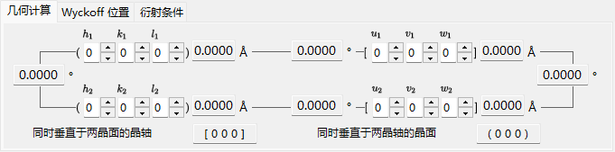
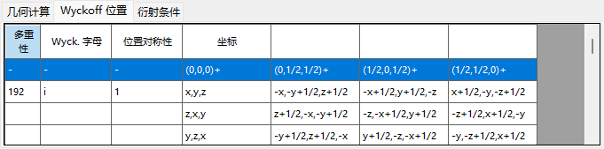
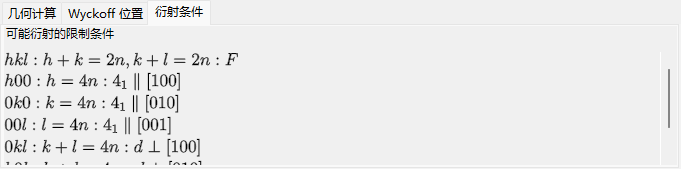
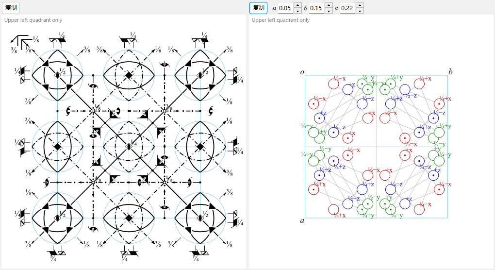

# 对称性信息

**对称性信息** 显示所选晶体空间群对称性的详细信息，并按照 *International Tables for Crystallography* Vol. A 的样式，额外绘制对称元素与一般位置的示意图。

该窗口分为空间群标识区（左上）、带选项卡的计算/表格区（右上）以及两幅示意图（底部）。

---

## 键盘与鼠标快捷键

此窗口没有特殊的按键或鼠标组合。<kbd>F1</kbd> 会打开本手册页面，两个 **Copy** 按钮会将对称元素示意图和一般位置示意图放入剪贴板（作为位图，或在勾选 **EMF** 时作为矢量 EMF）。

→ 参见 **[21. 键盘与鼠标快捷键](21-shortcuts.md)**，一览各窗口的快捷键。

---

## 空间群标识

左上面板会列出当前空间群的以下信息：

- **Number**（1–230）以及设置（setting）索引
- **Crystal System**
- **Point Group** : Hermann–Mauguin（HM）和 Schoenflies（SF）符号
- **Space Group** : HM 短符号、HM 全符号、SF 符号以及 **Hall symbol**

---

## 几何计算

输入两个晶面 \((h_1, k_1, l_1)\)、\((h_2, k_2, l_2)\) 或两个方向指数 \([u_1, v_1, w_1]\)、\([u_2, v_2, w_2]\)，即可得到：

- 每个晶面的面间距 / 每个轴的长度，
- 两个晶面之间（或两个轴之间）的夹角，
- **垂直于两个晶面的方向指数** 以及 **垂直于两个轴的晶面指数**。

这些计算会考虑当前晶胞的度量。

---

## 威科夫位置

列出每一个威科夫位置及其多重性、威科夫字母、位置对称性，以及它是一般位置还是特殊位置。对于带心点阵，点阵平移矢量会显示在表头行中。

---

## 消光条件

由点阵带心以及滑移/螺旋对称操作所产生的反射条件。

---

## 对称元素与一般位置示意图

底部的两个面板按照 *International Tables for Crystallography* Vol. A 的记号，重现该空间群的对称示意图。

- **对称元素（左）**：旋转/螺旋轴、镜面/滑移面以及对称中心/旋转反演点均以惯用的图形符号绘制。
  - 对于立方晶系的 \(F\) 点阵，仅显示晶胞的八分之一（仅左上象限）。
  - 这些对称元素也可以直接绘制到[结构查看器](5-structure-viewer.md)的三维模型上。
- **一般位置（右）**：一般等效位置以圆圈绘制（逗号表示镜像），并标注其分数坐标。
  - 仅对立方晶系，辅助线会连接由三重旋转轴相互关联的三个圆圈。

示意图下方的控件：

- **Direction**（`a` / `b` / `c`） : 选择用于投影的晶轴。
- **Copy** 将每幅示意图作为矢量图像（**EMF**）或栅格图像（**BMP**）复制到剪贴板；EMF 可在 PowerPoint 中取消组合并编辑。

---

## 另请参阅

- [晶体数据库](1-crystal-database.md)
- [结构查看器](5-structure-viewer.md)
- [极射赤平投影](6-stereonet.md)
- [旋转几何](4-rotation-geometry.md)
- [主窗口](0-main-window.md)
